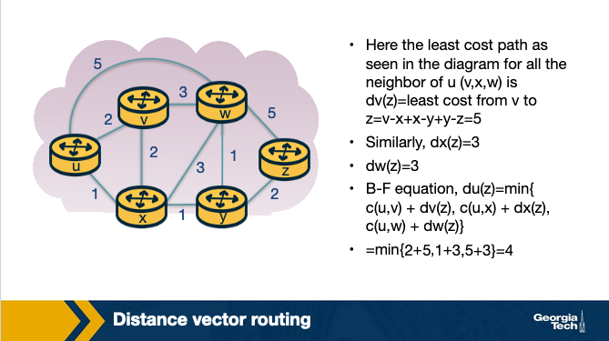

### **Slide 1: Intradomain Routing**

- **Focus**: 
  - The network layer, specifically **routing within a single administrative domain** (e.g., a company's internal network or an ISP).
  - Main goal: Understand how data travels along a "good" path from a source to a destination within this domain.

- **Connection Setup**: 
  - The overarching theme is enabling two hosts to exchange data.
  - **Routing** is the process of determining the path data packets will take from the source host to the destination host.

- **Intradomain Routing Algorithms**:
  - **Link-State Algorithm**:
    - Each router has a full view of the network's topology.
    - Routers use this knowledge to calculate the **shortest path** to each destination.
    - This is often implemented with **Dijkstra’s algorithm**.
  
  - **Distance-Vector Algorithm**:
    - Routers only exchange information with their **neighboring routers**.
    - Each router maintains a table of the shortest distances to other routers, updating the table based on neighbors' information.
    - Typically implemented using the **Bellman-Ford algorithm**.
  
- **Example Protocols**:
  - **OSPF (Open Shortest Path First)**:
    - A link-state protocol used in larger networks.
  - **RIP (Routing Information Protocol)**:
    - A distance-vector protocol used in simpler networks, often with fewer hops.
  
- **Challenges**:
  - **Convergence Delay**: 
    - When the network topology changes, routers must update their routing tables.
    - The time it takes for all routers to reflect the changes and agree on the best routes is called the convergence delay. Link-state algorithms typically converge faster than distance-vector algorithms.

- **Advanced Uses of Routing**:
  - **Traffic Engineering**:
    - Routing protocols can optimize how traffic flows through the network, avoiding congested links.
    - This involves choosing paths based on factors beyond just the shortest distance, such as bandwidth and delay.

### **Slide 2: Routing Algorithms**

- **Context**: 
  - Two hosts have established a connection using **TCP or UDP** (from a previous lecture).
  - Each host knows its **default router** (or first-hop router).
  - The focus is on what happens after the packet is sent to the default router of the **sending host**.

- **Packet Forwarding Process**:
  - After leaving the sending host's default router, the packet needs to travel to the default router of the destination host.
  - **Intermediate routers** along the path forward the packet to the next router.
  - Each router consults its **forwarding table** to determine the appropriate **outgoing link** for the packet.
  - **Forwarding** refers to moving a packet from an incoming link to an outgoing link within the same router (details will be covered in a future lesson).

- **Routing**:
  - **Routing** refers to how routers collaborate using **routing protocols** to find optimal paths for packets to travel from source to destination.
  - The aim is to establish **good paths**, optimized for metrics like distance or cost.

- **Intradomain vs. Interdomain Routing**:
  - **Intradomain Routing**: Routers in the same **administrative domain** (e.g., within an enterprise network).
  - **Interdomain Routing**: Routers in **different administrative domains** (e.g., across different ISPs).

- **Focus of This Lecture**:
  - This lecture covers **Intradomain Routing Algorithms**, also known as **Interior Gateway Protocols (IGPs)**.

- **Major Classes of Routing Algorithms**:
  1. **Link-State Algorithms**: Each router knows the network's entire topology and calculates the best path.
  2. **Distance-Vector Algorithms**: Routers exchange information with neighbors to determine the best path.

- **Graph Representation**:
  - The network is represented as a **graph**:
    - **Nodes** represent routers.
    - **Edges** represent links between routers.
    - Each edge has an associated **cost** (e.g., distance, bandwidth).

---

### **Slide 3: Link-State Routing Algorithm (Dijkstra’s Algorithm)**

- **Context**:
  - Focuses on **link-state routing protocols**, specifically **Dijkstra’s Algorithm**.
  - In link-state algorithms, the **link costs** and **network topology** are known to all nodes (often broadcasted).

- **Terminology**:
  - **u**: The source node.
  - **v**: Any other node in the network.
  - **D(v)**: The cost of the current least-cost path from **u** to **v**.
  - **p(v)**: The previous node along the current least-cost path from **u** to **v**.
  - **c(u,v)**: The cost from **u** to its directly connected neighbor **v**.
  - **N'**: The subset of nodes that are along the current least-cost path from **u**.

- **Initialization Step**:
  - Initialize the least-cost paths from **u** to its directly attached neighbors using the known costs of immediate links.
  - For nodes not directly attached to **u**, the initial cost is set to **infinity**.
  - The set **N'** is initialized to contain only the source node **u**.

- **Iterations**:
  - After initialization, the algorithm proceeds with a loop, executed for each destination node **v**.
  - In each iteration:
    - Identify the node **w** not in **N'** that has the minimum least-cost path.
    - Add **w** to **N'**.
    - For each neighbor **v** of **w**, update **D(v)** to the new cost:
      - The new cost is either:
        - The old cost from **u** to **v**, or
        - The known least-cost path from **u** to **w**, plus the cost from **w** to **v** (whichever is smaller).
  
- **Termination**:
  - The algorithm ends by returning the **shortest paths** and their associated costs from the source node **u** to every other node **v** in the network.

---

### **Slide 4: Link-State Routing Algorithm - Example**

- **Objective**:
  - Compute the **least-cost paths** from the source node **u** to all other nodes **v** in the network using the **link-state routing algorithm**.

- **Graph Overview**:
  - Nodes in the graph represent routers, and edges represent the link costs between them.
  - We start by setting the costs from **u** to its directly connected neighbors **v**, **x**, and **w**.
  - For all other nodes, the cost is initially set to **infinity** because they are not direct neighbors of **u**.

- **Initialization**:
  - In the **first row** of the table, the initial values are displayed:
    - The least-cost paths to directly connected neighbors are initialized.
    - Costs for all other nodes are set to infinity.

- **First Iteration**:
  - We look for the node not yet in **N'** with the least cost. In this case, it is node **x**.
  - **D(w)** is updated as the minimum between:
    - The previous cost (5), and
    - The sum of the cost from **u** to **x** (1) and the cost from **x** to **w** (3).
    - The minimum of the two values is **4**, so **D(w)** is updated to **4**.

- **Subsequent Iterations**:
  - In each iteration, the next node with the least cost is added to **N'**.
  - For each newly added node, update the least-cost paths for its neighboring nodes, selecting the minimum path between the previously calculated path and any newly calculated path.
  - The algorithm proceeds iteratively, updating the table until all nodes are included in **N'**.

- **Final Iteration**:
  - The algorithm finishes in the **fifth iteration**, with the final least-cost paths from the source node **u** to all other nodes in the network computed and reflected in the last row of the table.
  

---

### **Slide 5: Link-State Routing Algorithm - Computational Complexity**

- **Question**:
  - What is the **computational complexity** of the link-state routing algorithm in the worst-case scenario?

- **Explanation**:
  - In the **first iteration**, the algorithm must search through **all nodes** to find the one with the minimum path cost.
  - With each subsequent iteration, the number of nodes decreases by one. For example:
    - In the **second iteration**, we search through **(n-1)** nodes.
    - This pattern continues in each iteration until the final iteration.
  
- **Total Computation**:
  - The total number of searches across all iterations adds up to approximately **n(n+1)/2**.
  
- **Worst-Case Complexity**:
  - The worst-case computational complexity of the algorithm is proportional to **n²**, which gives us **O(n²)**.

---

### **Slide 6: Distance Vector Routing Algorithm**

- **Overview**:
  - The **Distance Vector (DV) Routing Algorithm** is:
    - **Iterative**: It repeats until no new updates are available to exchange between neighbors.
    - **Asynchronous**: Nodes do not need to be synchronized; they update whenever they receive new information.
    - **Distributed**: Each node only communicates with its direct neighbors, and the calculations are done locally at each node, not in a centralized manner.

- **Foundation**:
  - The DV algorithm is based on the **Bellman-Ford Algorithm**.

- **Distance Vector Concept**:
  - Each node maintains a **distance vector** that contains the cost to reach every other node in the network.
  - From time to time, each node sends its distance vector to its **neighboring nodes**.
  - Neighboring nodes receive these distance vectors and update their own vectors accordingly.
  - This exchange of information allows each node to update its view of the network based on its neighbors' views.

- **Bellman-Ford Update Rule**:
  - A node **x** updates its distance vector using the **Bellman-Ford equation**:
    \[
    D_x(y) = \min_v \{ c(x,v) + D_v(y) \}
    \]
    - **D_x(y)**: The minimum cost from node **x** to destination node **y**.
    - **c(x,v)**: The cost from **x** to its neighbor **v**.
    - **D_v(y)**: The distance vector value from neighbor **v** to destination **y**.
  
  - Node **x** computes the least-cost path to reach destination **y** by considering each neighbor **v** as an intermediate hop. It calculates the total cost for each path through its neighbors and selects the minimum.

- **Process**:
  - Each node continues to update its distance vector iteratively, based on the distance vectors received from its neighbors, until no more updates are available.
 
  
  

  ---

### **Slide 7: Distance Vector Routing Example**

- **Network Setup**:
  - We have a simple three-node network with nodes **x**, **y**, and **z**.
  - The link costs between the nodes are as follows:
    - **x** to **y** = 2
    - **y** to **z** = 1
    - **x** to **z** = 7

#### **First Iteration**:
- Each node has its own **distance vector table** representing its own view of the network.
- Initially, each node knows the direct cost to its neighbors, but it doesn’t know the costs beyond its neighbors (marked as **infinity** in the table).
- **Node x**, for example, knows the cost to reach **y** (2) and **z** (7) directly.

#### **Second Iteration**:
- The nodes exchange their distance vectors with their neighbors and update their tables based on the Bellman-Ford equation.
- **Node x** updates its table for each destination:
  - For destination **y**:
    \[
    D_x(y) = \min\{ c(x,y) + D_y(y), c(x,z) + D_z(y) \} = \min\{ 2+0, 7+1 \} = 2
    \]
  - For destination **z**:
    \[
    D_x(z) = \min\{ c(x,y) + D_y(z), c(x,z) + D_z(z) \} = \min\{ 2+1, 7+0 \} = 3
    \]
- Nodes **y** and **z** similarly update their tables based on the new distance vectors they received from their neighbors.

#### **Third Iteration**:
- The nodes process the updated distance vectors from the second iteration and repeat the same calculations.
- By this iteration, each node has a complete and updated **distance vector table**, showing the shortest path to every other node.
- **Node z**, for example, updates its table as follows:
  - For destination **x**:
    \[
    D_z(x) = \min\{ c(z,x) + D_x(x), c(z,y) + D_y(x) \} = \min\{ 7+0, 1+2 \} = 3
    \]
  - For destination **y**:
    \[
    D_z(y) = \min\{ c(z,x) + D_x(y), c(z,y) + D_y(y) \} = \min\{ 7+2, 1+0 \} = 1
    \]

#### **Final State**:
- At this point, there are no more updates being exchanged between nodes, and the nodes are in a **waiting mode**.
- They will remain in this state until there is a change in the link costs, which would trigger further updates.

---

### **Slide 8: Link Cost Changes and Failures in DV - Count to Infinity Problem**

- **Link Cost Decrease**:
  - When a link cost **decreases**, the distance vector updates propagate quickly across the network. 
  - **Example**: The link cost between **x** and **y** changes to **1**.
    - At **time t0**, node **y** detects the cost change and updates its distance vector, then sends it to its neighbors.
    - At **time t1**, node **z** receives the update and believes it can reach **x** through **y** with a cost of **2**. It updates its distance vector and informs its neighbors.
    - At **time t2**, **y** receives the update from **z** but does not change its distance vector, so no further updates are sent.
  - In this case, the change propagates efficiently and updates stabilize after a few iterations.
   

- **Link Cost Increase**:
  - When a link cost **increases significantly**, updates take much longer to propagate and may lead to a **routing loop**.
  
  - **Example**: The link cost between **y** and **x** increases to **60**.
    - At **time t0**, **y** detects the change and thinks it can still reach **x** through **z** with a total cost of **6** (i.e., **5 + 1**).
    - At **time t1**, a **routing loop** forms: **z** believes it can reach **x** through **y**, and **y** believes it can reach **x** through **z**. 
      - This causes packets to bounce back and forth between **y** and **z**.
    - Nodes **y** and **z** continue updating each other’s costs: 
      - **y** updates its cost to **6** and informs **z**.
      - **z** updates its cost to **7** and informs **y**.
    - This back-and-forth continues for a total of **44 iterations** until **z** calculates that its cost to reach **x** exceeds **50** and prefers a direct route to **x**.
  
   

- **Count-to-Infinity Problem**:
  - This phenomenon, where nodes keep sending each other increasing cost updates, is called the **count-to-infinity problem**.
  - The root of the problem lies in each node's limited view of the network:
    - **Node y** advertises a path to **x** with a cost of **6**, based on **z**'s distance vector.
    - **Node z**, unaware of the full picture, updates its cost to **7**, and the process repeats.
  - The count-to-infinity problem highlights the **slow convergence** of distance vector algorithms in cases of significant link cost increases or failures.

---

### **Slide 9: Poison Reverse**

- **Problem Recap**: 
  - The **Count-to-Infinity Problem** arises when nodes continue sending each other increasing distance vectors due to a routing loop.
  - A potential solution to this problem is the **Poison Reverse** technique.

- **Poison Reverse Technique**:
  - When **node z** reaches **node x** via **node y**, **z** will advertise to **y** that the distance to **x** is **infinity** (`D_z(x) = ∞`), even though **z** knows that its actual cost to reach **x** is **5**.
  - This "lie" prevents **y** from trying to route packets to **x** through **z**.
  - As long as **z** reaches **x** via **y**, **z** will continue to advertise that **x** is unreachable (cost of infinity) to **y**, ensuring **y** does not send packets to **x** via **z**.

- **Example Scenario**:
  - If the link cost between **x** and **y** increases to **60**, **y** updates its table and starts sending packets directly to **x** with a cost of **60** (`D_y(x) = 60`).
  - **y** informs **z** about this update, and upon receiving it, **z** will switch to using the direct link to **x** at a cost of **50**.
  - **z** then informs **y** that its new distance to **x** is **50** (`D_z(x) = 50`).
  - When **y** receives this update, it updates its cost to **x** to be **51** (`D_y(x) = c(y,z) + D_z(x) = 1 + 50 = 51`).

- **Poisoning the Reverse Path**:
  - Since **z** is now on **y**'s least-cost path to **x**, **y** will apply poison reverse and tell **z** that its distance to **x** is infinity (`D_y(x) = ∞`), even though **y** knows that its actual cost to reach **x** is **51**.
  - This prevents **z** from sending packets to **x** via **y**, ensuring no routing loops form between **y** and **z**.

- **Limitations**:
  - While **Poison Reverse** can prevent count-to-infinity issues in two-node routing loops, it **does not solve** the count-to-infinity problem when **three or more nodes** are involved, especially if they are not directly connected.

---

### **Slide 10: Distance Vector Routing Protocol Example - RIP**

- **Overview of RIP (Routing Information Protocol)**:
  - **RIP** is a routing protocol based on the **Distance Vector (DV) algorithm**.
  - It uses **hop count** as a metric for path selection, where each hop counts as **1**.
  - **Routing updates** (called **RIP advertisements**) are exchanged periodically between neighboring routers.
  - RIP advertisements contain the distances (hop counts) from the sender to various destination subnets.

- **RIP in Practice**:
  - Each router maintains a **routing table**, which contains:
    - **Destination subnet**.
    - **Next-hop router** to reach the destination.
    - **Hop count** to reach the destination subnet.
  
  - Routers use RIP to share information about their distances to destination subnets with neighboring routers.

#### **Example Scenario**:
- **Routers A, B, C, D** and subnets **w, x, y, z** are shown in the figure.
 
- **Router D's Routing Table**:
  - Router **D**’s table indicates that to reach subnet **w**, the datagram should be forwarded to router **A**, and the shortest path to subnet **w** is **2 hops**.

- **Routing Table Update**:
  - Router **D** receives an advertisement from **A** that provides new routing information.
  
  - **Router D** learns that it can reach subnet **z** through **A** with fewer hops than the path through **B**.
  - **Router D** updates its table, choosing the new shortest path through **A**.

- **Convergence**:
  - As the **Distance Vector algorithm** converges or as new routers or links are added, the **shortest paths** between subnets can change, prompting updates to routing tables.
  
#### **RIP Table**:
- **RIP Version 2** supports **route aggregation**, allowing multiple subnets to be aggregated into a single routing table entry.
- Each router in the Autonomous System (AS) maintains a **RIP table** with a row for each subnet.

#### **Timers and Failures**:
- If a router does not hear from its neighbor within **180 seconds**, the neighbor is considered unreachable (broken link), and the routing table is updated to reflect this.
- Changes in routing tables are then propagated to other routers.
  
#### **Communication in RIP**:
- **RIP** uses **UDP** on port **520** for communication, layered over the IP protocol.
- RIP is implemented as an **application-level process**.

#### **Challenges with RIP**:
- **Route updating** and reducing **convergence time** are common issues.
- **Avoiding routing loops** and addressing the **count-to-infinity problem** are significant challenges.

---

### **Slide 11: Link-State Routing Protocol Example - OSPF (Open Shortest Path First)**

- **Overview of OSPF**:
  - OSPF is a **link-state routing protocol** that determines the best path between source and destination routers using the **Dijkstra least-cost path algorithm**.
  - It is an improvement over the **RIP protocol**, commonly used by ISPs and larger networks.
  - Key advancements include:
    - **Authentication of messages** exchanged between routers.
    - The ability to use **multiple equal-cost paths**.
    - Support for **hierarchical routing** within a single routing domain.

#### **OSPF Operation**:
- Each router builds a **network topology map** by exchanging link-state information with all other routers in the network.
- The topology can be visualized as a **directed graph** where:
  - **Nodes** are routers.
  - **Edges** (links between routers) have weights assigned by network administrators.

#### **Hierarchy in OSPF**:
- An **OSPF Autonomous System (AS)** can be divided into **areas**:
  - Each area runs its own **link-state routing algorithm**.
  - **Area Border Routers** (ABRs) are responsible for routing traffic between areas.
- The **Backbone Area** (Area 0) is responsible for routing traffic between other areas within the AS.
  - All **ABRs** must connect to the backbone area, which may also include other routers.
  
- **Inter-Area Routing**:
  - For routing between areas, packets are routed through the **backbone** via ABRs.

#### **OSPF Routing Process**:
1. A **graph** (topological map) of the entire AS is constructed.
2. Each router computes the **shortest path tree** to all subnets using **Dijkstra's algorithm**, with itself as the root node.
3. **Link costs** are assigned by the administrator based on various factors such as link capacity or assigning all costs equally.
4. OSPF then determines the **least-cost paths** based on the set of link weights.

#### **Link State Advertisements (LSAs)**:
- OSPF routers exchange **LSAs**, which contain information about a router’s local network topology.
- LSAs are flooded to every router in the OSPF area to create a **consistent network topology**.
- Changes in network topology, such as a new link or a link failure, trigger updates in the LSAs.
- Routers periodically refresh their LSAs, typically every **30 minutes**.
  
#### **Flooding Process**:
- When a link’s state changes, the router immediately **floods the updated LSA** to all routers in the area.
- If multiple copies of an LSA are received, routers store only the **first received LSA** and mark others as duplicates.

#### **Advantages of OSPF**:
- **Fast convergence**: OSPF quickly propagates link-state changes to all routers in the network.
- **Scalability**: OSPF supports hierarchical networks, making it suitable for large-scale deployments.

---

### **Slide 12: Processing OSPF Messages in the Router**

- **Overview of Router Components**:
  - A router consists of a **route processor (CPU)** and **interface cards** connected via a **switching fabric**.
  - The **route processor** handles OSPF message processing, while the **interface cards** are responsible for forwarding data packets.

#### **OSPF Message Processing Steps**:

1. **Receiving an LS Update Packet (T1)**:
   - The router receives **Link State (LS) update packets** containing **Link State Advertisements (LSAs)** from neighboring routers.
   - The **OSPF protocol** within the router begins processing these updates.

2. **LSA Validation - New or Duplicate (T1)**:
   - The router checks if the received LSA is **new** or a **duplicate** by referencing the sequence number of the LSA in its **link-state database**.
   - If the LSA is **new**, the database is updated, and further steps are triggered.
   - If the LSA is a **duplicate**, the router sends an **LS Ack** (acknowledgment) back to the sender.

3. **SPF Calculation and Flooding LSAs (T2, T4)**:
   - For new LSAs, the router:
     - **Updates the link-state database**.
     - **Schedules a Shortest Path First (SPF) calculation** if needed.
     - Determines which interfaces the LSAs need to be **flooded out**.
   - When all LSAs from the update packet have been processed, they are **bundled** into an LS update packet and **flooded** to neighboring routers (T3-T4).

4. **SPF Calculation (T5, T6)**:
   - The SPF algorithm is a **CPU-intensive task** and is scheduled to be carried out after LSA changes are processed.
   - The router computes the **shortest path tree** using **Dijkstra’s algorithm** based on the updated link-state information.
   - This results in updates to the **Forwarding Information Base (FIB)**.

5. **Updating FIB (T7)**:
   - Once the SPF calculation is complete, the **FIB** is updated with the new routing information.
   - The FIB is used to determine the **next hop** for data packets when they arrive at the router.

---

#### **Flow Chart Breakdown**:
- **T1**: Receive an LS update packet.
- **T2**: Update link-state database and schedule SPF calculation if necessary.
- **T3**: Process the LS update packet and determine which LSAs need to be flooded.
- **T4**: Bundle LSAs and flood them to the next router.
- **T5-T6**: Execute SPF calculation.
- **T7**: Update the FIB with the new routes.

---

### **Slide 13: Hot Potato Routing**

- **Overview**:
  - In large networks, traffic is routed using both **intradomain** and **interdomain** routing protocols.
  - When traffic needs to leave the network, it must be forwarded to an **egress point** (exit router).
  - Sometimes, there are **multiple egress points** available, each offering similarly good external paths to the destination.

- **Hot Potato Routing**:
  - **Hot potato routing** is the practice of selecting the **closest egress point** based on the **intradomain path cost** (IGP cost), rather than external path costs.
  - The goal is to **offload the traffic from the network as quickly as possible**, minimizing resource consumption within the network.

#### **Example Scenario**:
- The figure shows a router in **Dallas** needing to forward traffic to a destination.
  - There are two egress points: **New York** and **San Francisco**.
  - The IGP path cost to **San Francisco** is **9**, and to **New York** it is **10**.
  - Since both egress points offer equal BGP path costs, the router in Dallas chooses **San Francisco** due to the lower IGP path cost.
  
- **Benefits of Hot Potato Routing**:
  - **Simplifies computations**: The router already knows the IGP path costs and chooses the closest egress point.
  - **Consistency**: The next router in the path will also forward traffic to the same egress point.
  - **Efficiency**: By choosing the closest egress point, the network uses fewer resources and traffic is routed out of the network faster.

