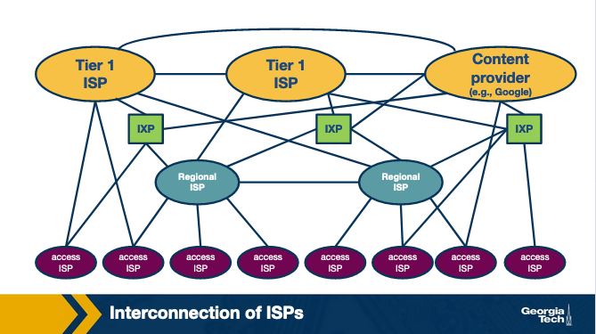
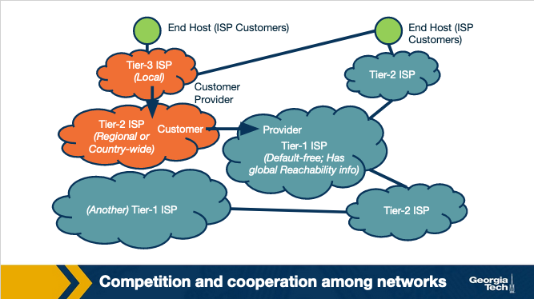

### **Slide 1**: **Introduction to BGP and Network Interconnections**

1. **Internet as an Ecosystem**:
   - The Internet is made up of thousands of **Autonomous Systems (ASes)**, which are independently operated networks (e.g., ISPs, universities, corporations).
   - Each of these networks operates with its own goals, such as reducing costs, improving performance, or managing traffic flow.
   - However, despite the independence of these networks, **global connectivity** is achieved by interconnecting them.

2. **Interconnection Necessity**:
   - For data to travel between different networks, the networks need to establish **interconnections**.
   - Interconnecting networks enables traffic from one network to reach any destination on the Internet.
   - Without these interconnections, the Internet would be fragmented into isolated sections.

3. **Border Gateway Protocol (BGP)**:
   - **BGP** is a protocol used to exchange routing information between different ASes.
   - BGP allows networks to advertise which IP prefixes they can reach and select the best route for traffic to follow based on network policies, cost, or performance objectives.
   - BGP's decentralized nature means that there is no single central authority controlling traffic between ASes.

4. **Business Relationships**:
   - Networks interconnect based on various **business relationships**:
     - **Transit Agreements**: A smaller network pays a larger network (transit provider) for access to the rest of the Internet.
     - **Peering Agreements**: Two networks agree to exchange traffic directly without any payment, often when the traffic exchange is mutually beneficial.
   - These agreements impact routing policies and the paths data takes across the Internet.

5. **Internet Exchange Points (IXPs)**:
   - **IXPs** are physical locations where multiple networks meet and exchange traffic, often without using third-party transit providers.
   - IXPs reduce the cost and latency of traffic exchange, since traffic is exchanged locally rather than routed through distant networks.
   - By directly interconnecting, networks can **optimize performance**, **reduce costs**, and **improve redundancy**.

Got it! Here’s the combined, detailed summary for **Slide 2**, with all the information and images you provided:

---

### **Slide 2: The Internet as an Ecosystem and Autonomous Systems**

1. **The Internet Ecosystem**:
   - The Internet is built as a **network of networks**, which includes **Internet Service Providers (ISPs)**, **Internet Exchange Points (IXPs)**, and **Content Delivery Networks (CDNs)**.
   - Each network operates independently but is interconnected with others to create a globally connected Internet.

2. **Types of ISPs**:
   - **Tier-1 ISPs**: Large, global-scale ISPs (e.g., AT&T, NTT, Level-3, Sprint). These ISPs form the "backbone" of the Internet and do not need to pay for transit as they can reach all parts of the Internet through peering with other Tier-1 ISPs.
   - **Tier-2 ISPs (Regional ISPs)**: These ISPs connect to Tier-1 ISPs and provide services to smaller access ISPs or customers in a specific region.
   - **Tier-3 ISPs (Access ISPs)**: Smaller, local ISPs that provide direct Internet access to end-users and connect to Tier-2 ISPs.
   
3. **Internet Exchange Points (IXPs)**:
   - IXPs are physical infrastructures that allow multiple networks (ISPs, CDNs) to interconnect and **exchange traffic locally**, without relying on transit services from Tier-1 ISPs.
   - There are approximately **500 IXPs** worldwide (as of 2019), and they help reduce costs and improve performance by facilitating direct traffic exchange.

4. **Content Delivery Networks (CDNs)**:
   - CDNs like **Google** and **Netflix** create their own networks to **optimize content delivery** to end-users, improve performance, and reduce connectivity costs.
   - CDNs are globally distributed, with multiple data centers housing servers across the world.

---

### **Competition and Cooperation Among Networks**:

1. **Hierarchical Structure**:
   - The Internet ecosystem forms a hierarchical structure where **smaller networks (ISPs)** connect to **larger networks**.
   - For example, **access ISPs (Tier-3)** act as customers to **regional ISPs (Tier-2)**, and regional ISPs connect to **Tier-1 ISPs** for global connectivity.

2. **Customer-Provider Relationships**:
   - Smaller ISPs **pay larger ISPs** for global Internet access in a **customer-provider relationship**. For example, a Tier-3 ISP (access ISP) pays a Tier-2 ISP for regional connectivity, and the Tier-2 ISP may pay a Tier-1 ISP for global access.

3. **Competition**:
   - **Tier-1 ISPs** compete with each other at the global level, while **regional ISPs** (Tier-2) and **local ISPs** (Tier-3) compete within their respective regions or customer markets.

4. **Cooperation**:
   - Despite competition, ISPs must **cooperate** to provide seamless, **global connectivity**. This requires different ISPs to exchange traffic and routing information.

---

### **Interconnection Options**:

1. **Points of Presence (PoPs)**:
   - These are physical locations where an ISP can connect to a larger provider network to gain access to the Internet.

2. **Multi-homing**:
   - ISPs may connect to more than one upstream provider to improve **reliability** and **performance**. This practice is known as **multi-homing**.

3. **Peering Agreements**:
   - ISPs may enter into **settlement-free peering agreements**, where they exchange traffic directly without paying each other, usually when the traffic exchanged benefits both parties equally.

---

### **Internet Topology**:

1. **Hierarchical vs. Flat**:
   - Traditionally, the Internet followed a hierarchical structure with **Tier-1 ISPs at the top**, followed by regional and access ISPs.
   - However, with the growing dominance of **IXPs** and **CDNs**, the Internet is becoming more **flat**, with more direct traffic exchange between networks.

2. **Autonomous Systems (ASes)**:
   - An **Autonomous System (AS)** is a group of routers under the same administrative control. Each AS can make independent decisions about routing, traffic engineering, and interconnection.
   - **ISPs** and **CDNs** often operate as ASes and use the **Border Gateway Protocol (BGP)** to exchange routing information with other ASes.

---

### **Routing Protocols**:

1. **Border Gateway Protocol (BGP)**:
   - **BGP** is the protocol used to route traffic **between ASes**. It ensures global connectivity by allowing ASes to exchange routing information.
   
2. **Interior Gateway Protocols (IGPs)**:
   - Inside each AS, different routing protocols are used, including:
     - **OSPF (Open Shortest Path First)**
     - **IS-IS (Intermediate System to Intermediate System)**
     - **RIP (Routing Information Protocol)**
     - **E-IGRP (Enhanced Interior Gateway Routing Protocol)**
   - These protocols optimize traffic flow within an AS, often by calculating the shortest or most efficient paths.
