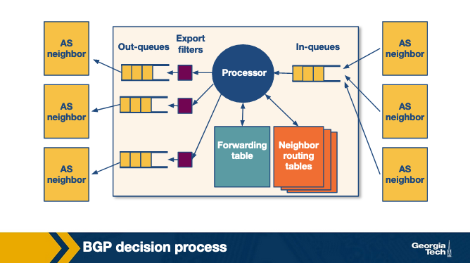
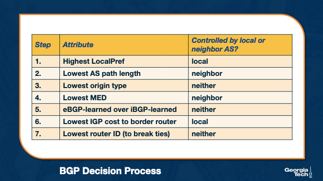
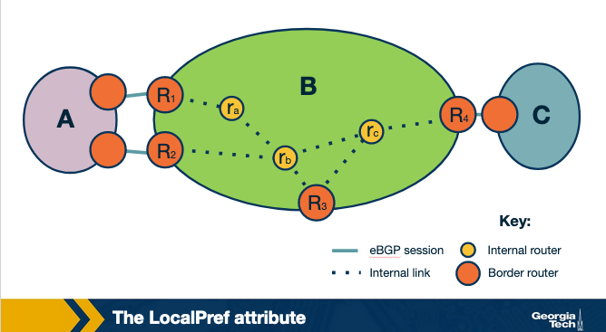
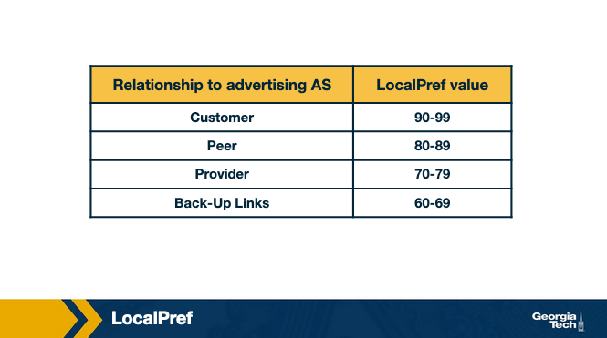
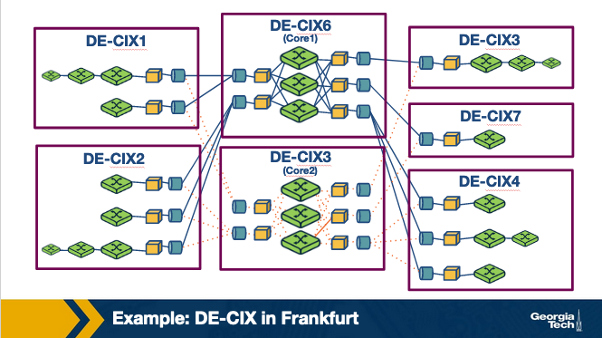
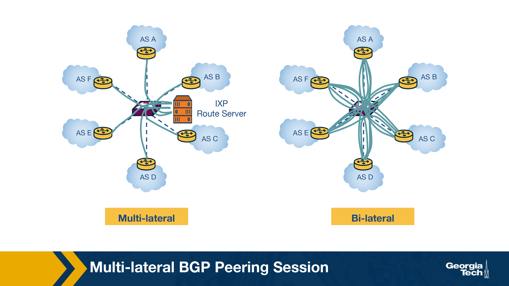
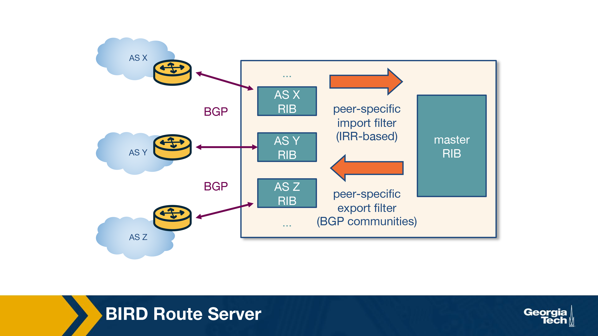

### **Slide 1**: **Introduction to BGP and Network Interconnections**

1. **Internet as an Ecosystem**:
   - The Internet is made up of thousands of **Autonomous Systems (ASes)**, which are independently operated networks (e.g., ISPs, universities, corporations).
   - Each of these networks operates with its own goals, such as reducing costs, improving performance, or managing traffic flow.
   - However, despite the independence of these networks, **global connectivity** is achieved by interconnecting them.

2. **Interconnection Necessity**:
   - For data to travel between different networks, the networks need to establish **interconnections**.
   - Interconnecting networks enables traffic from one network to reach any destination on the Internet.
   - Without these interconnections, the Internet would be fragmented into isolated sections.

3. **Border Gateway Protocol (BGP)**:
   - **BGP** is a protocol used to exchange routing information between different ASes.
   - BGP allows networks to advertise which IP prefixes they can reach and select the best route for traffic to follow based on network policies, cost, or performance objectives.
   - BGP's decentralized nature means that there is no single central authority controlling traffic between ASes.

4. **Business Relationships**:
   - Networks interconnect based on various **business relationships**:
     - **Transit Agreements**: A smaller network pays a larger network (transit provider) for access to the rest of the Internet.
     - **Peering Agreements**: Two networks agree to exchange traffic directly without any payment, often when the traffic exchange is mutually beneficial.
   - These agreements impact routing policies and the paths data takes across the Internet.

5. **Internet Exchange Points (IXPs)**:
   - **IXPs** are physical locations where multiple networks meet and exchange traffic, often without using third-party transit providers.
   - IXPs reduce the cost and latency of traffic exchange, since traffic is exchanged locally rather than routed through distant networks.
   - By directly interconnecting, networks can **optimize performance**, **reduce costs**, and **improve redundancy**.

Got it! Here’s the combined, detailed summary for **Slide 2**, with all the information and images you provided:

---

### **Slide 2: The Internet as an Ecosystem and Autonomous Systems**

1. **The Internet Ecosystem**:
   - The Internet is built as a **network of networks**, which includes **Internet Service Providers (ISPs)**, **Internet Exchange Points (IXPs)**, and **Content Delivery Networks (CDNs)**.
   - Each network operates independently but is interconnected with others to create a globally connected Internet.

2. **Types of ISPs**:
   - **Tier-1 ISPs**: Large, global-scale ISPs (e.g., AT&T, NTT, Level-3, Sprint). These ISPs form the "backbone" of the Internet and do not need to pay for transit as they can reach all parts of the Internet through peering with other Tier-1 ISPs.
   - **Tier-2 ISPs (Regional ISPs)**: These ISPs connect to Tier-1 ISPs and provide services to smaller access ISPs or customers in a specific region.
   - **Tier-3 ISPs (Access ISPs)**: Smaller, local ISPs that provide direct Internet access to end-users and connect to Tier-2 ISPs.
   
3. **Internet Exchange Points (IXPs)**:
   - IXPs are physical infrastructures that allow multiple networks (ISPs, CDNs) to interconnect and **exchange traffic locally**, without relying on transit services from Tier-1 ISPs.
   - There are approximately **500 IXPs** worldwide (as of 2019), and they help reduce costs and improve performance by facilitating direct traffic exchange.

4. **Content Delivery Networks (CDNs)**:
   - CDNs like **Google** and **Netflix** create their own networks to **optimize content delivery** to end-users, improve performance, and reduce connectivity costs.
   - CDNs are globally distributed, with multiple data centers housing servers across the world.

---

### **Competition and Cooperation Among Networks**:

1. **Hierarchical Structure**:
   - The Internet ecosystem forms a hierarchical structure where **smaller networks (ISPs)** connect to **larger networks**.
   - For example, **access ISPs (Tier-3)** act as customers to **regional ISPs (Tier-2)**, and regional ISPs connect to **Tier-1 ISPs** for global connectivity.

2. **Customer-Provider Relationships**:
   - Smaller ISPs **pay larger ISPs** for global Internet access in a **customer-provider relationship**. For example, a Tier-3 ISP (access ISP) pays a Tier-2 ISP for regional connectivity, and the Tier-2 ISP may pay a Tier-1 ISP for global access.

3. **Competition**:
   - **Tier-1 ISPs** compete with each other at the global level, while **regional ISPs** (Tier-2) and **local ISPs** (Tier-3) compete within their respective regions or customer markets.

4. **Cooperation**:
   - Despite competition, ISPs must **cooperate** to provide seamless, **global connectivity**. This requires different ISPs to exchange traffic and routing information.

---

### **Interconnection Options**:

1. **Points of Presence (PoPs)**:
   - These are physical locations where an ISP can connect to a larger provider network to gain access to the Internet.

2. **Multi-homing**:
   - ISPs may connect to more than one upstream provider to improve **reliability** and **performance**. This practice is known as **multi-homing**.

3. **Peering Agreements**:
   - ISPs may enter into **settlement-free peering agreements**, where they exchange traffic directly without paying each other, usually when the traffic exchanged benefits both parties equally.

---

### **Internet Topology**:

1. **Hierarchical vs. Flat**:
   - Traditionally, the Internet followed a hierarchical structure with **Tier-1 ISPs at the top**, followed by regional and access ISPs.
   - However, with the growing dominance of **IXPs** and **CDNs**, the Internet is becoming more **flat**, with more direct traffic exchange between networks.

2. **Autonomous Systems (ASes)**:
   - An **Autonomous System (AS)** is a group of routers under the same administrative control. Each AS can make independent decisions about routing, traffic engineering, and interconnection.
   - **ISPs** and **CDNs** often operate as ASes and use the **Border Gateway Protocol (BGP)** to exchange routing information with other ASes.

---

### **Routing Protocols**:

1. **Border Gateway Protocol (BGP)**:
   - **BGP** is the protocol used to route traffic **between ASes**. It ensures global connectivity by allowing ASes to exchange routing information.
   
2. **Interior Gateway Protocols (IGPs)**:
   - Inside each AS, different routing protocols are used, including:
     - **OSPF (Open Shortest Path First)**
     - **IS-IS (Intermediate System to Intermediate System)**
     - **RIP (Routing Information Protocol)**
     - **E-IGRP (Enhanced Interior Gateway Routing Protocol)**
   - These protocols optimize traffic flow within an AS, often by calculating the shortest or most efficient paths.

---

### **Slide 3: Autonomous Systems (AS) Business Relationships**

1. **Provider-Customer Relationship (Transit)**:
   - In a **Provider-Customer** relationship, the **provider AS** forwards the customer's traffic to other destinations within its own routing table (and vice versa).
   - The relationship is based on a **financial settlement** where the customer pays the provider.
   - This allows the customer to reach a wider portion of the Internet, utilizing the provider’s network for global or regional connectivity.

2. **Peering Relationship**:
   - In a **peering relationship**, two ASes share access to **subsets of each other's routing tables**. The routes shared are typically limited to **each AS’s customer networks**.
   - Peering is **settlement-free**, meaning no money is exchanged between the ASes for traffic forwarding.
   - **Tier-1 ISPs** often form peering relationships with other Tier-1 ISPs, but they typically do so only if the two ISPs are of **similar size** and handle **similar traffic volumes**.
   - Smaller ISPs also engage in peering relationships, especially if they exchange a substantial amount of traffic between each other. By doing so, they **avoid transit costs** they would otherwise pay to larger ISPs.
   - Peering agreements hold as long as the **traffic exchanged** is **not highly asymmetric**, meaning one network does not significantly send more traffic than it receives.

### **Diagram Summary: Autonomous Systems Business Relationships**:

- The diagram illustrates various **transit** and **peering relationships** between multiple ASes.
   - **Transit (Provider-Customer)** relationships:
     - ISP **P** acts as a transit provider for other networks (e.g., Content Provider **Cp** and smaller ISPs).
     - ISP **X** is both a customer and a provider, as it connects to ISP **P** (for transit) and offers transit services to smaller ISPs (e.g., **Cx 1**, **Cx 2**, **Cx 3**).
     - ISP **Y** and ISP **Z** have transit relationships with other networks (e.g., **Cy**, **Cz**).
   - **Peering relationships**:
     - ISPs **X**, **Y**, and **Z** have peering agreements between them, allowing them to exchange traffic directly.

3. **Provider Revenue Models**:
   - **Providers** have financial incentives to forward as much customer traffic as possible because they generate revenue from their customers.
   - Providers charge customers based on two main pricing models:
     - **Fixed Pricing**: Customers pay a fixed rate, assuming their bandwidth usage stays within a predefined range.
     - **Usage-Based Pricing**: Providers charge based on **bandwidth usage**. Bandwidth usage is typically calculated using periodic measurements (e.g., every five minutes), and the **95th percentile** of these measurements is used to determine the final cost.
   - Routing policies may be adjusted to **increase customer traffic** to the provider, allowing the provider to **maximize revenue**.

---

### **Slide 4: BGP Routing Policies – Importing and Exporting Routes**

1. **The Importance of Route Importing/Exporting**:
   - **Routing policies** of an Autonomous System (AS) are influenced by its **business relationships** (e.g., transit or peering).
   - The decision to import or export routes determines how traffic flows between networks, with important **business** and **financial implications**.

### **Diagram Summary: Common Inter-AS Relationships – Transit and Peering**:

- The diagram illustrates various **transit** and **peering relationships**:
   - **Transit ($$)** relationships:
     - ISP **P** provides transit for various networks, including content provider **Cᵖ** and other ISPs.
     - ISP **X** provides transit for smaller networks (e.g., **C₁**, **C₂**, **C₃**), while it also pays other ISPs (e.g., ISP **P**) for transit.
     - **Z’s customers** and **Y’s customers** also purchase transit from their respective ISPs.
   - **Peering (settlement-free)** relationships:
     - ISPs **X**, **Y**, and **Z** engage in peering relationships, exchanging traffic without payment under mutually beneficial conditions.
---

### **Exporting Routes**:

1. **Route Export Decisions**:
   - Exporting a route means that a neighboring AS may select that route, causing traffic to flow through the advertising AS.
   - **Route filters** are used to decide which routes to advertise to neighboring ASes.

2. **Types of Routes to Export**:
   - **Routes from Customers**:
     - These are the routes learned from an AS’s customers.
     - Since the provider AS is paid to deliver connectivity to its customers, it wants to advertise customer routes widely to **increase traffic** toward the customer, which in turn increases revenue.
   - **Routes from Providers**:
     - Routes learned from providers are **not advertised to peers** or other providers since the AS has **no financial incentive** to carry traffic for its provider.
     - However, these routes can be advertised to the AS's customers, as it benefits the customer.
   - **Routes from Peers**:
     - Routes learned from peers should **not be advertised to providers or other peers**, as it could cause traffic to flow through the AS without any financial benefit.
     - Advertising peer routes to customers is common, as this does not incur extra costs.

---

### **Importing Routes**:

1. **Route Import Decisions**:
   - Similar to exporting, ASes are selective about which routes to import based on **who advertises** them and the type of **business relationship** involved.
   - When an AS receives **multiple advertisements** for the same destination from different ASes, it needs to decide **which route to select**.

2. **Ranking Imported Routes** (in order of preference):
   - **Customer Routes**: Always prioritized because the AS wants to ensure that routes to its customers do not pass through other ASes, avoiding unnecessary costs.
   - **Peer Routes**: Preferred over provider routes because they are usually **free** under a peering agreement.
   - **Provider Routes**: Only imported when necessary, as using them incurs **additional costs**.

---

### **BGP and Design Goals**

1. **Scalability**:
   - As the Internet continues to grow, so does the number of **Autonomous Systems (ASes)**, the number of prefixes in routing tables, the network churn, and the volume of BGP traffic exchanged between routers.
   - One of BGP’s core design goals is to **handle this growth efficiently** by ensuring that:
     - **Convergence** (the process of routers agreeing on network paths) happens within a reasonable time frame.
     - **Loop-free paths** are maintained to prevent data packets from endlessly circulating in the network.

2. **Express Routing Policies**:
   - BGP provides a way for ASes to define **route attributes** that enable the implementation of routing policies (i.e., deciding which routes to import and export).
   - **Route filtering** and **route ranking** allow ASes to select the best routes for their traffic while keeping routing decisions confidential and independent.
   - ASes can **customize** their policies based on business goals or technical requirements.

3. **Cooperation Among ASes**:
   - BGP allows each AS to make **local routing decisions** (which routes to import and export) while maintaining **confidentiality** from other ASes.
   - This autonomy allows ASes to cooperate with others for global connectivity while making decisions that benefit their own network.

4. **Security**:
   - **Security was not a primary design goal** for the original BGP protocol. However, with the growing size and complexity of the Internet, security has become a significant concern.
   - There are several **vulnerabilities** in BGP that can lead to **routing disruptions** and **connectivity issues** due to:
     - Malicious attacks (e.g., route hijacking).
     - Misconfigurations.
     - Network faults.
   - Various **security enhancements** have been proposed, including:
     - **S-BGP (Secure BGP)**: A protocol designed to add security to BGP.
     - **Registries**: Infrastructure to maintain up-to-date information about which ASes own which IP prefixes.
     - **Public key infrastructures**: Providing ASes with public keys to validate routing information.
     - **Machine learning approaches**: Research efforts to detect and mitigate routing anomalies.
   - Despite these efforts, **widespread adoption** of BGP security measures has been slow due to:
     - Transitioning difficulties to new protocols.
     - Lack of sufficient incentives for ASes to adopt these security enhancements.

### **BGP Protocol Basics**

1. **BGP Peers and Sessions**:
   - **BGP peers** are routers that exchange routing information over a **BGP session**. This session uses a **semi-permanent TCP connection**.
   - To initiate a BGP session, a router sends an **OPEN message** to another router. The routers then exchange routing table announcements, a process that can take **seconds to minutes**, depending on the number of routes exchanged.
   - Two types of BGP sessions:
     - **External BGP (eBGP)**: Between routers in different **Autonomous Systems (ASes)**. For example, between routers 3a and 1c in the diagram.
     - **Internal BGP (iBGP)**: Between routers within the same AS. For example, between routers 3a and 3c in AS53.

---

### **Diagram Explanation: eBGP and iBGP Sessions**:

- The diagram shows three different ASes (AS51, AS52, AS53) and their connections:
   - **iBGP sessions** (dotted lines) connect routers **within the same AS** (e.g., between routers 1a and 1b in AS51).
   - **eBGP sessions** (dashed lines) connect routers **across different ASes** (e.g., between routers 1c in AS51 and 3a in AS53).
   - 
### **BGP Messages**:

1. **UPDATE Messages**:
   - These contain information about changes in the routing table.
   - Two types of updates:
     - **Announcements**: Inform neighboring routers about new routes or updates to existing ones. They include **standardized attributes** such as the **AS-PATH** and **NEXT-HOP**.
     - **Withdrawals**: Notify routers that a previously advertised route is no longer available. This may occur due to a network failure or changes in routing policy.

2. **KEEPALIVE Messages**:
   - These are exchanged regularly between BGP peers to maintain an **active session**.

---

### **BGP Prefix Reachability**:

- In BGP, **destinations** are represented by **IP prefixes**, which correspond to subnets or groups of subnets.
- **Gateway routers** running eBGP advertise the IP prefixes they can reach according to their **export policies**. These advertisements are sent to neighboring ASes.
- **Internal routers** use iBGP sessions to propagate the **external routes** learned by gateway routers across the internal network. This helps maintain network-wide reachability based on the AS's **import policies**.

---

### **Path Attributes and BGP Routes**:

1. **AS-PATH Attribute**:
   - Each AS is identified by an **Autonomous System Number (ASN)**.
   - As a route is passed from one AS to another, the AS numbers are added to the **AS-PATH** attribute.
   - The **AS-PATH** prevents routing loops and is used to select the **shortest path** to a destination when multiple routes are available.

2. **NEXT-HOP Attribute**:
   - Refers to the IP address of the **next-hop router** along the path to the destination.
   - **Internal routers** use the NEXT-HOP attribute to forward traffic to **external destinations** via the border router.
   - If there are multiple routers advertising the same external destination, the NEXT-HOP attribute helps internal routers select the **best path** based on the AS's routing policy.

---

### **iBGP and eBGP**

1. **Types of BGP Sessions**:
   - **eBGP (External BGP)**:
     - eBGP sessions are established between **border routers of neighboring Autonomous Systems (ASes)**.
     - These routers are responsible for learning routes to **external destinations** (external prefixes) and exchanging routing information between ASes.
     - eBGP allows external routes to be disseminated across ASes.

   - **iBGP (Internal BGP)**:
     - iBGP sessions are established between routers within the **same AS**.
     - The main role of iBGP is to **propagate external routes** learned from eBGP-speaking border routers to other internal routers within the AS.
     - iBGP sessions ensure that all routers within the AS are aware of external destinations.

---

### **Diagram Explanation**:
   - The diagrams illustrate the **flow of routes** between Autonomous Systems using eBGP and iBGP:
     - **eBGP sessions** (solid lines) are established between the **border routers** of neighboring ASes (e.g., between **AS1** and **AS2**, or between **AS2** and **AS3**).
     - **iBGP sessions** (dashed lines) are established within **AS2** to propagate external routes learned from eBGP routers.
     - For example, once border router **R1** in AS2 learns about destination **D** through eBGP, this route is shared with other internal routers (like **R2**) via iBGP.
### **Dissemination of Routes in BGP**:
   - **eBGP-speaking routers** (on the border of an AS) learn external routes through their eBGP sessions with neighboring ASes (as shown between **AS1, AS2, and AS3** in the diagrams).
   - Once external routes are learned through eBGP, these routes are propagated internally within the AS via **iBGP sessions**.
   - Within an AS, a **full mesh of iBGP sessions** is created, meaning that every iBGP router has a session with every other iBGP router in the AS. This mesh ensures that all routers are aware of routes learned from external ASes.

---

### **Differences Between iBGP and IGP**:
   - It’s important to note that **iBGP** is not the same as **IGP (Interior Gateway Protocols)**, such as **RIP** or **OSPF**:
     - **IGP-like protocols** are responsible for finding the best paths between routers **within the AS**, typically based on cost or other metrics.
     - **iBGP**, on the other hand, does not calculate paths within the AS; it is solely used to **disseminate external routes** learned from eBGP.
  
  
  This diagram further illustrates the interaction between **iBGP** and **eBGP** sessions within an AS.

### **Explanation of the Diagram: iBGP and eBGP**

1. **eBGP Session (External BGP)**:
   - **eBGP** is used to exchange routing information between routers in **different Autonomous Systems (ASes)**.
   - In the diagram, the routers on the borders of different ASes establish **eBGP sessions** with each other to share external route information. This is indicated by the label “eBGP” and the connection between the AS and the external networks.

2. **iBGP Session (Internal BGP)**:
   - Once the external routes are learned from eBGP peers, they are distributed internally within the same AS using **iBGP**.
   - **iBGP** sessions connect all the internal routers (shown inside the yellow cloud) to share routing information about external destinations. 
   - For example, router **R1** learns about the route to destination **D** through its eBGP session, and this information is then propagated to internal routers like **R2** through iBGP sessions.
   - A **full mesh of iBGP sessions** exists between all routers inside the AS, ensuring that all internal routers know about the external routes.

3. **Propagation of External Routes**:
   - Once a router (such as **R1**) learns about an external route (e.g., destination **D**), it uses **iBGP** to communicate that route to all other internal routers (like **R2**) within the AS.
   - This ensures that all routers inside the AS are aware of routes to external destinations, which enables the AS to route traffic efficiently to external networks.

Here’s your content with the added summaries for each diagram, integrated into the relevant sections:

---

### **BGP Decision Process: Overview**

1. **AS Independence**:
   - Each **Autonomous System (AS)** is managed by its own administrative authority and can have **unique business goals** and **network conditions** (e.g., traffic volume).
   - Despite these differences, **routers follow a standardized process** for selecting routes when exchanging BGP messages.

2. **BGP Route Processing**:
   - When a router receives BGP advertisements, it first applies **import policies** to filter out routes it doesn't want to consider.
   - Then, it applies the **BGP decision process** to select the **best routes** based on routing attributes.
   - The selected routes are installed into the **forwarding table**, and finally, the router applies **export policies** to decide which routes to advertise to its neighbors.

**Diagram Summary (BGP Processing Model - Diagram 1)**:
- The router receives BGP messages from multiple **AS neighbors** through **in-queues**. The **processor** applies **import policies** to filter routes and selects the best routes to store in the **forwarding table**.
- After processing, **export filters** determine which routes to send to other AS neighbors via **out-queues**.

---

### **Router’s Decision Process**:

1. **How Routes Are Selected**:
   - When a router receives **multiple route advertisements** to the same destination, it needs to choose the best one.
   - The router **compares the attributes** of the routes in a specific order, following the BGP decision process.
   - In the simplest case (without a specific policy), the router selects the route with the **shortest AS-PATH**, meaning the route with the fewest hops. However, in practice, the selection process rarely depends solely on the path length.

2. **Attribute Comparison**:
   - The router goes through a **list of attributes** for each route. If two routes have the same value for an attribute, the router moves on to the next attribute until it finds a distinguishing value.

**Diagram Summary (BGP Decision Attribute List - Diagram 2)**:
- The BGP decision process ranks routes based on the following attributes:
   1. **Highest LocalPref** (local AS controlled).
   2. **Lowest AS path length** (neighbor AS controlled).
   3. **Lowest origin type** (neither controlled).
   4. **Lowest MED** (neighbor AS controlled).
   5. **eBGP learned over iBGP learned**.
   6. **Lowest IGP cost to border router** (local AS controlled).
   7. **Lowest Router ID** (used to break ties).

---

### **Key BGP Attributes that Influence Route Decisions**:

1. **LocalPref (Local Preference)**:
   - **LocalPref** is used to **influence outbound traffic** by preferring routes learned from specific ASes.
   - For example, if AS **B** learns about a route to destination **x** through two different ASes, **A** and **C**, and prefers to route traffic through **A**, it can assign a **higher LocalPref value** to routes learned from **A**.
   - This preference will ensure that traffic leaving AS **B** is routed through **A**, reflecting AS **B’s** business relationships or traffic policies.

**Diagram Summary (LocalPref Example - Diagram 3)**:
- **LocalPref** allows AS **B** to prioritize routes learned from **AS A** (via **R1** and **R2**) by assigning a higher LocalPref value to those routes compared to the routes learned from **AS C**.

2. **Route Ranking Based on Relationships**:
   - ASes often prioritize routes based on **business relationships**:
     1. **Routes from customers** are ranked highest.
     2. **Routes from peers** are preferred next.
     3. **Routes from providers** are ranked last.
   - By assigning **non-overlapping LocalPref values** for each relationship type, an AS can control which routes are imported.

**Diagram Summary (LocalPref Value Ranges - Diagram 4)**:
- **LocalPref values** are assigned as follows:
   - **Customers**: 90-99 (highest preference).
   - **Peers**: 80-89.
   - **Providers**: 70-79.
   - **Back-Up Links**: 60-69 (lowest preference).

---

### **Multi-Exit Discriminator (MED)**:

1. **MED and Inbound Traffic**:
   - **MED** is used to influence the selection of **inbound traffic paths** for an AS that is connected to another AS by **multiple links**.
   - For example, if AS **B** has two entry routers (**R1** and **R2**), it can assign different **MED values** to the routes it advertises to AS **A** through **R1** and **R2**.
   - If **R1** has a **lower MED value**, AS **A** will prefer to send traffic to **R1**, assuming all other attributes are equal.

2. **Influencing Route Exports**:
   - An AS may use the MED attribute to "staple" the type of **business relationship** to the route.
   - For example, an AS might tag routes learned from **providers** or **peers** with specific MED values and **filter those routes** to prevent them from being exported to other providers or peers.
   - Controlling the routes exported using MED also influences **how traffic enters** the AS, i.e., which routers will serve as **entry points** for inbound traffic.

---

### **Where Are BGP Attributes Controlled?**:

- The BGP attributes are controlled at different levels:
   - **Locally by the AS**: For example, the **LocalPref** attribute is set by the AS based on its routing preferences.
   - **By neighboring ASes**: For example, the **MED attribute** is assigned by the neighboring AS.
   - **By the protocol**: For example, whether a route is learned via **eBGP** or **iBGP** can also influence the attribute settings.

---

### **Key Takeaways**:

- **LocalPref** is primarily used to control the **outbound routing** preferences of an AS, ensuring that traffic leaves the AS through preferred routes.
- **MED** influences **inbound traffic routing**, guiding other ASes on which entry points (routers) to use when sending traffic into the AS.
- These attributes play a crucial role in ensuring that **BGP routing decisions** align with the AS’s **business relationships** and **traffic policies**.

---

### **Challenges with BGP: Scalability and Misconfigurations**

1. **BGP Limitations: Misconfigurations and Faults**:
   - **Misconfigurations** and errors in the BGP protocol can lead to several problems, including:
     - An **excessive number of route updates**, which can destabilize routing.
     - **Processor and memory overload** on routers due to high processing demands.
     - Network **outages** and even **router failures**.
   - These issues arise from **instability in routing** and incorrect configurations, making BGP networks vulnerable to failures.

2. **Limiting Routing Table Size**:
   - **Filtering techniques** can be used to reduce the size of routing tables:
     - **Long, specific prefixes** can be filtered out to encourage **route aggregation**.
     - Routers can limit the number of prefixes advertised from a single source on a **per-session basis** to control table size.
   - **Small ASes** can configure **default routes** into their forwarding tables instead of relying on detailed routing information.
   - ASes can also help protect other networks by **aggregating routes** and exporting **less specific prefixes**, thus reducing the overall number of routes.

3. **Limiting the Number of Route Changes**:
   - An AS can reduce the **propagation of unstable routes** using a technique called **flap damping**:
     - **Flap damping** monitors how often routes change (flap) over a period of time.
     - If a route becomes unstable (changing too often), the AS can suppress that route temporarily, preventing further updates.
     - This technique can prevent frequent route updates but must be applied strategically, as it can affect **reachability**:
       - **More specific prefixes** can be aggressively suppressed with **lower thresholds**.
       - **Highly available routes** may have **higher thresholds** to prevent suppression and ensure availability.

---

### **Key Techniques to Address BGP Challenges**:

- **Route Aggregation**: Encourages fewer and more general route advertisements to reduce routing table size.
- **Filtering**: Helps control the number of routes and limit updates by avoiding over-specific routes.
- **Flap Damping**: Reduces instability by suppressing frequently changing routes to prevent excessive updates.

By applying these techniques, ASes can reduce BGP misconfigurations, manage routing table size, and control the number of route changes to maintain stability.

---

### **Peering at IXPs**

**What are IXPs?**  
Internet Exchange Points (IXPs) are **physical infrastructures** that enable Autonomous Systems (ASes) to interconnect and exchange traffic directly with each other. These **participant ASes** use the IXP's infrastructure, which typically includes a network of **switches** located either at a single facility or distributed across multiple locations. IXPs provide fault-tolerant, redundant, and secure interconnection facilities, often housed in **data centers** to ensure reliability and security.

**Example: DE-CIX in Frankfurt (Diagram Summary)**:
- DE-CIX in Frankfurt (as shown in the diagram) is an IXP with multiple colocation facilities and core infrastructure (Core 1: DE-CIX6, Core 2: DE-CIX3).
- Participant ASes connect at different DE-CIX locations (DE-CIX1 to DE-CIX7), which are interconnected to provide seamless traffic exchange across the region.

---

### **Why IXPs Are Important**

1. **Interconnection Hubs**:
   - IXPs serve as hubs where large amounts of traffic are exchanged. Some IXPs handle traffic volumes comparable to Tier 1 ISPs, making them critical to Internet infrastructure.
   - A 2012 study found over **50,000 peering links** at a large European IXP.

2. **Mitigating DDoS Attacks**:
   - IXPs can act as shields, mitigating **DDoS attacks** by intercepting malicious traffic before it reaches participant ASes. For example, in 2013, IXPs helped mitigate a large-scale attack involving Spamhaus.

3. **Research and Innovation**:
   - IXPs provide opportunities for research on **Internet infrastructure**, **traffic flows**, and security solutions like **BGP blackholing**. They are also innovation hubs, offering services like **Software Defined Networking (SDN)**.

4. **Active Marketplaces**:
   - In North America and Europe, IXPs have become **marketplaces** that offer services beyond interconnection, such as **DDoS mitigation** and SDN-based services.

---

### **Steps to Peer at an IXP**

- An AS must have a **public Autonomous System Number (ASN)**.
- Each participant connects a router to the IXP’s infrastructure, usually via a **BGP session**.
- Participants agree to the IXP’s **General Terms and Conditions (GTC)**.
- After setup, there is a **one-time cost** to establish the connection and a **monthly fee** for using the IXP port. Some IXPs charge an annual **membership fee**.

---

### **Why Networks Peer at IXPs**

1. **Keep Local Traffic Local**:
   - Networks can exchange local traffic without routing it through third parties, reducing unnecessary transit.

2. **Lower Costs**:
   - Peering at an IXP is typically cheaper than using third-party transit services, which charge based on traffic volume.

3. **Improved Performance**:
   - Peering at IXPs reduces **latency** and improves **network performance**.

4. **Incentives from Major Players**:
   - Some content providers (e.g., Google) incentivize networks to peer at specific IXPs by making it a requirement for peering.

---

### **Services Offered at IXPs**

1. **Public Peering**:
   - The primary service offered by IXPs, allowing participants to exchange traffic over the IXP infrastructure with setup costs and recurring fees. Traffic exchanged is usually **settlement-free**, meaning no direct payment between peering parties.

2. **Private Peering**:
   - Direct connections between two parties, bypassing the public IXP infrastructure. Useful for **high-volume traffic** that requires a **dedicated link**.

3. **Route Servers and SLAs**:
   - Many IXPs offer **route servers** that simplify peering by allowing multiple participants to peer through a single agreement or BGP session. IXPs may also offer **service level agreements (SLAs)** to ensure performance.

4. **Remote Peering**:
   - Reseller programs allow third parties to offer **remote peering** services, enabling participants to connect to IXPs without being physically present at the IXP facility.

5. **Mobile Peering**:
   - Scalable solutions for mobile networks to interconnect.

6. **DDoS Blackholing**:
   - Some IXPs offer **customer-triggered blackholing** to mitigate DDoS attacks.

7. **Free Value-Added Services**:
   - Some IXPs provide additional services such as **DNS root name servers**, **time synchronization (NTP)**, and **Internet Routing Registries (IRR)**.

### **Peering at IXPs: Bilateral vs. Multilateral BGP Peering**

1. **Bilateral Peering**:
   - In a **bilateral BGP session**, two ASes exchange traffic directly over the IXP’s switching fabric using a two-way BGP session. This is suitable for small-scale operations but doesn’t scale well with increasing numbers of AS participants.

2. **Multilateral Peering**:
   - To handle many participants, IXPs often use a **route server (RS)** to facilitate peering between multiple ASes at the same time.
   - In a **multilateral BGP peering session**, the RS collects and shares routing information from its peers, executes its own **BGP decision process**, and re-advertises the best routes to all peer routers connected to the RS.

**Diagram Summary (Multilateral and Bilateral Peering - Diagram 1)**:
- **Multilateral Peering**: The IXP Route Server collects routing information from all participant ASes and shares it with other participants, simplifying the peering process.
- **Bilateral Peering**: Each AS establishes individual BGP sessions with every other AS, which can become complex as the number of peers grows.

---

### **How Does a Route Server Work?**

1. **Route Server Architecture**:
   - The **route server** maintains a **Routing Information Base (RIB)**, which contains all BGP paths received from its peers. There is a **Master RIB** as well as **AS-specific RIBs** to track individual BGP sessions with each participant AS.

2. **Route Filtering**:
   - **Import filters**: Applied to ensure that each member AS advertises only routes it is allowed to advertise.
   - **Export filters**: Used by IXP members to restrict which other ASes at the IXP receive their routes.

**Diagram Summary (Route Server and Filtering - Diagram 2)**:
- **AS-specific RIBs** store routing information from individual ASes.
- The **import filter** checks whether the route is valid before adding it to the **Master RIB**.
- The **export filter** checks whether the route can be advertised to another AS before it is sent.

---

### **Steps in Route Advertisement (Example with AS X and AS Z)**:

1. **Step 1**: AS **X** advertises a prefix (e.g., **p1**) to the RS.
2. **Step 2**: The RS applies a **peer-specific import filter** to check if AS **X** can advertise prefix **p1**. If valid, it adds **p1** to the **Master RIB**.
3. **Step 3**: The RS applies a **peer-specific export filter** to check if AS **X** allows AS **Z** to receive prefix **p1**. If true, the route is added to AS **Z's RIB**.
4. **Step 4**: The RS advertises prefix **p1** to AS **Z** with AS **X** as the next hop.
