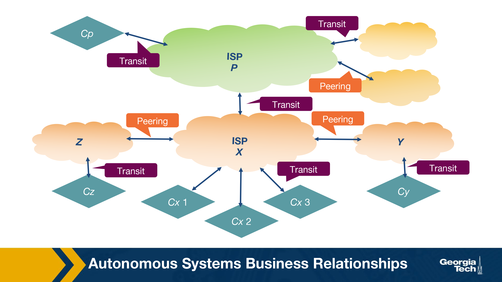
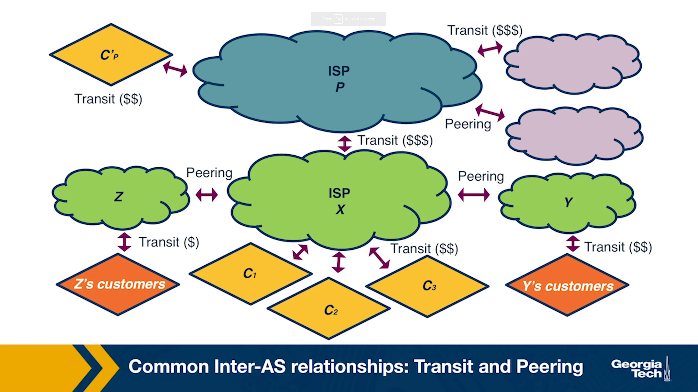
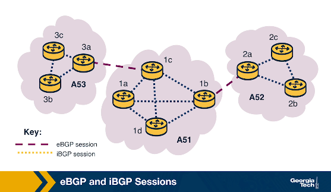
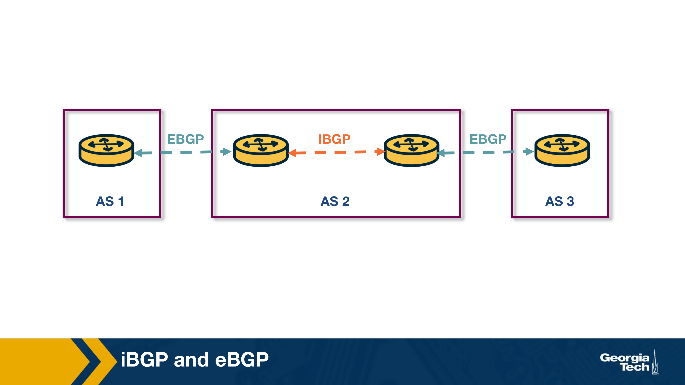
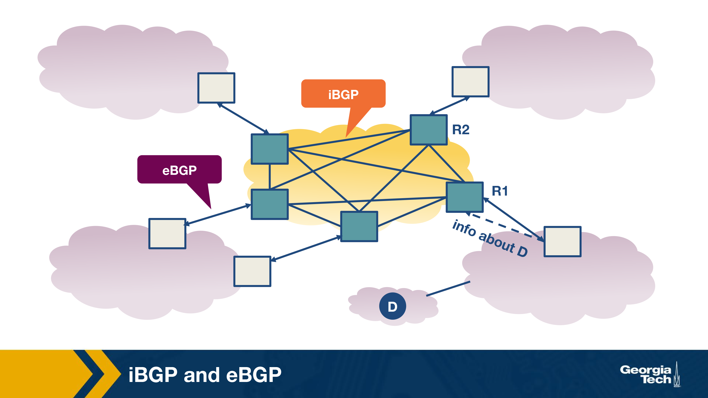

### **Slide 1**: **Introduction to BGP and Network Interconnections**

1. **Internet as an Ecosystem**:
   - The Internet is made up of thousands of **Autonomous Systems (ASes)**, which are independently operated networks (e.g., ISPs, universities, corporations).
   - Each of these networks operates with its own goals, such as reducing costs, improving performance, or managing traffic flow.
   - However, despite the independence of these networks, **global connectivity** is achieved by interconnecting them.

2. **Interconnection Necessity**:
   - For data to travel between different networks, the networks need to establish **interconnections**.
   - Interconnecting networks enables traffic from one network to reach any destination on the Internet.
   - Without these interconnections, the Internet would be fragmented into isolated sections.

3. **Border Gateway Protocol (BGP)**:
   - **BGP** is a protocol used to exchange routing information between different ASes.
   - BGP allows networks to advertise which IP prefixes they can reach and select the best route for traffic to follow based on network policies, cost, or performance objectives.
   - BGP's decentralized nature means that there is no single central authority controlling traffic between ASes.

4. **Business Relationships**:
   - Networks interconnect based on various **business relationships**:
     - **Transit Agreements**: A smaller network pays a larger network (transit provider) for access to the rest of the Internet.
     - **Peering Agreements**: Two networks agree to exchange traffic directly without any payment, often when the traffic exchange is mutually beneficial.
   - These agreements impact routing policies and the paths data takes across the Internet.

5. **Internet Exchange Points (IXPs)**:
   - **IXPs** are physical locations where multiple networks meet and exchange traffic, often without using third-party transit providers.
   - IXPs reduce the cost and latency of traffic exchange, since traffic is exchanged locally rather than routed through distant networks.
   - By directly interconnecting, networks can **optimize performance**, **reduce costs**, and **improve redundancy**.

Got it! Here’s the combined, detailed summary for **Slide 2**, with all the information and images you provided:

---

### **Slide 2: The Internet as an Ecosystem and Autonomous Systems**

1. **The Internet Ecosystem**:
   - The Internet is built as a **network of networks**, which includes **Internet Service Providers (ISPs)**, **Internet Exchange Points (IXPs)**, and **Content Delivery Networks (CDNs)**.
   - Each network operates independently but is interconnected with others to create a globally connected Internet.

2. **Types of ISPs**:
   - **Tier-1 ISPs**: Large, global-scale ISPs (e.g., AT&T, NTT, Level-3, Sprint). These ISPs form the "backbone" of the Internet and do not need to pay for transit as they can reach all parts of the Internet through peering with other Tier-1 ISPs.
   - **Tier-2 ISPs (Regional ISPs)**: These ISPs connect to Tier-1 ISPs and provide services to smaller access ISPs or customers in a specific region.
   - **Tier-3 ISPs (Access ISPs)**: Smaller, local ISPs that provide direct Internet access to end-users and connect to Tier-2 ISPs.
   
3. **Internet Exchange Points (IXPs)**:
   - IXPs are physical infrastructures that allow multiple networks (ISPs, CDNs) to interconnect and **exchange traffic locally**, without relying on transit services from Tier-1 ISPs.
   - There are approximately **500 IXPs** worldwide (as of 2019), and they help reduce costs and improve performance by facilitating direct traffic exchange.

4. **Content Delivery Networks (CDNs)**:
   - CDNs like **Google** and **Netflix** create their own networks to **optimize content delivery** to end-users, improve performance, and reduce connectivity costs.
   - CDNs are globally distributed, with multiple data centers housing servers across the world.

---

### **Competition and Cooperation Among Networks**:

1. **Hierarchical Structure**:
   - The Internet ecosystem forms a hierarchical structure where **smaller networks (ISPs)** connect to **larger networks**.
   - For example, **access ISPs (Tier-3)** act as customers to **regional ISPs (Tier-2)**, and regional ISPs connect to **Tier-1 ISPs** for global connectivity.

2. **Customer-Provider Relationships**:
   - Smaller ISPs **pay larger ISPs** for global Internet access in a **customer-provider relationship**. For example, a Tier-3 ISP (access ISP) pays a Tier-2 ISP for regional connectivity, and the Tier-2 ISP may pay a Tier-1 ISP for global access.

3. **Competition**:
   - **Tier-1 ISPs** compete with each other at the global level, while **regional ISPs** (Tier-2) and **local ISPs** (Tier-3) compete within their respective regions or customer markets.

4. **Cooperation**:
   - Despite competition, ISPs must **cooperate** to provide seamless, **global connectivity**. This requires different ISPs to exchange traffic and routing information.

---

### **Interconnection Options**:

1. **Points of Presence (PoPs)**:
   - These are physical locations where an ISP can connect to a larger provider network to gain access to the Internet.

2. **Multi-homing**:
   - ISPs may connect to more than one upstream provider to improve **reliability** and **performance**. This practice is known as **multi-homing**.

3. **Peering Agreements**:
   - ISPs may enter into **settlement-free peering agreements**, where they exchange traffic directly without paying each other, usually when the traffic exchanged benefits both parties equally.

---

### **Internet Topology**:

1. **Hierarchical vs. Flat**:
   - Traditionally, the Internet followed a hierarchical structure with **Tier-1 ISPs at the top**, followed by regional and access ISPs.
   - However, with the growing dominance of **IXPs** and **CDNs**, the Internet is becoming more **flat**, with more direct traffic exchange between networks.

2. **Autonomous Systems (ASes)**:
   - An **Autonomous System (AS)** is a group of routers under the same administrative control. Each AS can make independent decisions about routing, traffic engineering, and interconnection.
   - **ISPs** and **CDNs** often operate as ASes and use the **Border Gateway Protocol (BGP)** to exchange routing information with other ASes.

---

### **Routing Protocols**:

1. **Border Gateway Protocol (BGP)**:
   - **BGP** is the protocol used to route traffic **between ASes**. It ensures global connectivity by allowing ASes to exchange routing information.
   
2. **Interior Gateway Protocols (IGPs)**:
   - Inside each AS, different routing protocols are used, including:
     - **OSPF (Open Shortest Path First)**
     - **IS-IS (Intermediate System to Intermediate System)**
     - **RIP (Routing Information Protocol)**
     - **E-IGRP (Enhanced Interior Gateway Routing Protocol)**
   - These protocols optimize traffic flow within an AS, often by calculating the shortest or most efficient paths.

---

### **Slide 3: Autonomous Systems (AS) Business Relationships**

1. **Provider-Customer Relationship (Transit)**:
   - In a **Provider-Customer** relationship, the **provider AS** forwards the customer's traffic to other destinations within its own routing table (and vice versa).
   - The relationship is based on a **financial settlement** where the customer pays the provider.
   - This allows the customer to reach a wider portion of the Internet, utilizing the provider’s network for global or regional connectivity.

2. **Peering Relationship**:
   - In a **peering relationship**, two ASes share access to **subsets of each other's routing tables**. The routes shared are typically limited to **each AS’s customer networks**.
   - Peering is **settlement-free**, meaning no money is exchanged between the ASes for traffic forwarding.
   - **Tier-1 ISPs** often form peering relationships with other Tier-1 ISPs, but they typically do so only if the two ISPs are of **similar size** and handle **similar traffic volumes**.
   - Smaller ISPs also engage in peering relationships, especially if they exchange a substantial amount of traffic between each other. By doing so, they **avoid transit costs** they would otherwise pay to larger ISPs.
   - Peering agreements hold as long as the **traffic exchanged** is **not highly asymmetric**, meaning one network does not significantly send more traffic than it receives.

### **Diagram Summary: Autonomous Systems Business Relationships**:

- The diagram illustrates various **transit** and **peering relationships** between multiple ASes.
   - **Transit (Provider-Customer)** relationships:
     - ISP **P** acts as a transit provider for other networks (e.g., Content Provider **Cp** and smaller ISPs).
     - ISP **X** is both a customer and a provider, as it connects to ISP **P** (for transit) and offers transit services to smaller ISPs (e.g., **Cx 1**, **Cx 2**, **Cx 3**).
     - ISP **Y** and ISP **Z** have transit relationships with other networks (e.g., **Cy**, **Cz**).
   - **Peering relationships**:
     - ISPs **X**, **Y**, and **Z** have peering agreements between them, allowing them to exchange traffic directly.

3. **Provider Revenue Models**:
   - **Providers** have financial incentives to forward as much customer traffic as possible because they generate revenue from their customers.
   - Providers charge customers based on two main pricing models:
     - **Fixed Pricing**: Customers pay a fixed rate, assuming their bandwidth usage stays within a predefined range.
     - **Usage-Based Pricing**: Providers charge based on **bandwidth usage**. Bandwidth usage is typically calculated using periodic measurements (e.g., every five minutes), and the **95th percentile** of these measurements is used to determine the final cost.
   - Routing policies may be adjusted to **increase customer traffic** to the provider, allowing the provider to **maximize revenue**.

---

### **Slide 4: BGP Routing Policies – Importing and Exporting Routes**

1. **The Importance of Route Importing/Exporting**:
   - **Routing policies** of an Autonomous System (AS) are influenced by its **business relationships** (e.g., transit or peering).
   - The decision to import or export routes determines how traffic flows between networks, with important **business** and **financial implications**.

### **Diagram Summary: Common Inter-AS Relationships – Transit and Peering**:

- The diagram illustrates various **transit** and **peering relationships**:
   - **Transit ($$)** relationships:
     - ISP **P** provides transit for various networks, including content provider **Cᵖ** and other ISPs.
     - ISP **X** provides transit for smaller networks (e.g., **C₁**, **C₂**, **C₃**), while it also pays other ISPs (e.g., ISP **P**) for transit.
     - **Z’s customers** and **Y’s customers** also purchase transit from their respective ISPs.
   - **Peering (settlement-free)** relationships:
     - ISPs **X**, **Y**, and **Z** engage in peering relationships, exchanging traffic without payment under mutually beneficial conditions.
---

### **Exporting Routes**:

1. **Route Export Decisions**:
   - Exporting a route means that a neighboring AS may select that route, causing traffic to flow through the advertising AS.
   - **Route filters** are used to decide which routes to advertise to neighboring ASes.

2. **Types of Routes to Export**:
   - **Routes from Customers**:
     - These are the routes learned from an AS’s customers.
     - Since the provider AS is paid to deliver connectivity to its customers, it wants to advertise customer routes widely to **increase traffic** toward the customer, which in turn increases revenue.
   - **Routes from Providers**:
     - Routes learned from providers are **not advertised to peers** or other providers since the AS has **no financial incentive** to carry traffic for its provider.
     - However, these routes can be advertised to the AS's customers, as it benefits the customer.
   - **Routes from Peers**:
     - Routes learned from peers should **not be advertised to providers or other peers**, as it could cause traffic to flow through the AS without any financial benefit.
     - Advertising peer routes to customers is common, as this does not incur extra costs.

---

### **Importing Routes**:

1. **Route Import Decisions**:
   - Similar to exporting, ASes are selective about which routes to import based on **who advertises** them and the type of **business relationship** involved.
   - When an AS receives **multiple advertisements** for the same destination from different ASes, it needs to decide **which route to select**.

2. **Ranking Imported Routes** (in order of preference):
   - **Customer Routes**: Always prioritized because the AS wants to ensure that routes to its customers do not pass through other ASes, avoiding unnecessary costs.
   - **Peer Routes**: Preferred over provider routes because they are usually **free** under a peering agreement.
   - **Provider Routes**: Only imported when necessary, as using them incurs **additional costs**.

---

### **BGP and Design Goals**

1. **Scalability**:
   - As the Internet continues to grow, so does the number of **Autonomous Systems (ASes)**, the number of prefixes in routing tables, the network churn, and the volume of BGP traffic exchanged between routers.
   - One of BGP’s core design goals is to **handle this growth efficiently** by ensuring that:
     - **Convergence** (the process of routers agreeing on network paths) happens within a reasonable time frame.
     - **Loop-free paths** are maintained to prevent data packets from endlessly circulating in the network.

2. **Express Routing Policies**:
   - BGP provides a way for ASes to define **route attributes** that enable the implementation of routing policies (i.e., deciding which routes to import and export).
   - **Route filtering** and **route ranking** allow ASes to select the best routes for their traffic while keeping routing decisions confidential and independent.
   - ASes can **customize** their policies based on business goals or technical requirements.

3. **Cooperation Among ASes**:
   - BGP allows each AS to make **local routing decisions** (which routes to import and export) while maintaining **confidentiality** from other ASes.
   - This autonomy allows ASes to cooperate with others for global connectivity while making decisions that benefit their own network.

4. **Security**:
   - **Security was not a primary design goal** for the original BGP protocol. However, with the growing size and complexity of the Internet, security has become a significant concern.
   - There are several **vulnerabilities** in BGP that can lead to **routing disruptions** and **connectivity issues** due to:
     - Malicious attacks (e.g., route hijacking).
     - Misconfigurations.
     - Network faults.
   - Various **security enhancements** have been proposed, including:
     - **S-BGP (Secure BGP)**: A protocol designed to add security to BGP.
     - **Registries**: Infrastructure to maintain up-to-date information about which ASes own which IP prefixes.
     - **Public key infrastructures**: Providing ASes with public keys to validate routing information.
     - **Machine learning approaches**: Research efforts to detect and mitigate routing anomalies.
   - Despite these efforts, **widespread adoption** of BGP security measures has been slow due to:
     - Transitioning difficulties to new protocols.
     - Lack of sufficient incentives for ASes to adopt these security enhancements.

### **BGP Protocol Basics**

1. **BGP Peers and Sessions**:
   - **BGP peers** are routers that exchange routing information over a **BGP session**. This session uses a **semi-permanent TCP connection**.
   - To initiate a BGP session, a router sends an **OPEN message** to another router. The routers then exchange routing table announcements, a process that can take **seconds to minutes**, depending on the number of routes exchanged.
   - Two types of BGP sessions:
     - **External BGP (eBGP)**: Between routers in different **Autonomous Systems (ASes)**. For example, between routers 3a and 1c in the diagram.
     - **Internal BGP (iBGP)**: Between routers within the same AS. For example, between routers 3a and 3c in AS53.

---

### **Diagram Explanation: eBGP and iBGP Sessions**:

- The diagram shows three different ASes (AS51, AS52, AS53) and their connections:
   - **iBGP sessions** (dotted lines) connect routers **within the same AS** (e.g., between routers 1a and 1b in AS51).
   - **eBGP sessions** (dashed lines) connect routers **across different ASes** (e.g., between routers 1c in AS51 and 3a in AS53).
   - 
### **BGP Messages**:

1. **UPDATE Messages**:
   - These contain information about changes in the routing table.
   - Two types of updates:
     - **Announcements**: Inform neighboring routers about new routes or updates to existing ones. They include **standardized attributes** such as the **AS-PATH** and **NEXT-HOP**.
     - **Withdrawals**: Notify routers that a previously advertised route is no longer available. This may occur due to a network failure or changes in routing policy.

2. **KEEPALIVE Messages**:
   - These are exchanged regularly between BGP peers to maintain an **active session**.

---

### **BGP Prefix Reachability**:

- In BGP, **destinations** are represented by **IP prefixes**, which correspond to subnets or groups of subnets.
- **Gateway routers** running eBGP advertise the IP prefixes they can reach according to their **export policies**. These advertisements are sent to neighboring ASes.
- **Internal routers** use iBGP sessions to propagate the **external routes** learned by gateway routers across the internal network. This helps maintain network-wide reachability based on the AS's **import policies**.

---

### **Path Attributes and BGP Routes**:

1. **AS-PATH Attribute**:
   - Each AS is identified by an **Autonomous System Number (ASN)**.
   - As a route is passed from one AS to another, the AS numbers are added to the **AS-PATH** attribute.
   - The **AS-PATH** prevents routing loops and is used to select the **shortest path** to a destination when multiple routes are available.

2. **NEXT-HOP Attribute**:
   - Refers to the IP address of the **next-hop router** along the path to the destination.
   - **Internal routers** use the NEXT-HOP attribute to forward traffic to **external destinations** via the border router.
   - If there are multiple routers advertising the same external destination, the NEXT-HOP attribute helps internal routers select the **best path** based on the AS's routing policy.

---

### **iBGP and eBGP**

1. **Types of BGP Sessions**:
   - **eBGP (External BGP)**:
     - eBGP sessions are established between **border routers of neighboring Autonomous Systems (ASes)**.
     - These routers are responsible for learning routes to **external destinations** (external prefixes) and exchanging routing information between ASes.
     - eBGP allows external routes to be disseminated across ASes.

   - **iBGP (Internal BGP)**:
     - iBGP sessions are established between routers within the **same AS**.
     - The main role of iBGP is to **propagate external routes** learned from eBGP-speaking border routers to other internal routers within the AS.
     - iBGP sessions ensure that all routers within the AS are aware of external destinations.

---

### **Diagram Explanation**:
   - The diagrams illustrate the **flow of routes** between Autonomous Systems using eBGP and iBGP:
     - **eBGP sessions** (solid lines) are established between the **border routers** of neighboring ASes (e.g., between **AS1** and **AS2**, or between **AS2** and **AS3**).
     - **iBGP sessions** (dashed lines) are established within **AS2** to propagate external routes learned from eBGP routers.
     - For example, once border router **R1** in AS2 learns about destination **D** through eBGP, this route is shared with other internal routers (like **R2**) via iBGP.
### **Dissemination of Routes in BGP**:
   - **eBGP-speaking routers** (on the border of an AS) learn external routes through their eBGP sessions with neighboring ASes (as shown between **AS1, AS2, and AS3** in the diagrams).
   - Once external routes are learned through eBGP, these routes are propagated internally within the AS via **iBGP sessions**.
   - Within an AS, a **full mesh of iBGP sessions** is created, meaning that every iBGP router has a session with every other iBGP router in the AS. This mesh ensures that all routers are aware of routes learned from external ASes.

---

### **Differences Between iBGP and IGP**:
   - It’s important to note that **iBGP** is not the same as **IGP (Interior Gateway Protocols)**, such as **RIP** or **OSPF**:
     - **IGP-like protocols** are responsible for finding the best paths between routers **within the AS**, typically based on cost or other metrics.
     - **iBGP**, on the other hand, does not calculate paths within the AS; it is solely used to **disseminate external routes** learned from eBGP.
  
  
  This diagram further illustrates the interaction between **iBGP** and **eBGP** sessions within an AS.

### **Explanation of the Diagram: iBGP and eBGP**

1. **eBGP Session (External BGP)**:
   - **eBGP** is used to exchange routing information between routers in **different Autonomous Systems (ASes)**.
   - In the diagram, the routers on the borders of different ASes establish **eBGP sessions** with each other to share external route information. This is indicated by the label “eBGP” and the connection between the AS and the external networks.

2. **iBGP Session (Internal BGP)**:
   - Once the external routes are learned from eBGP peers, they are distributed internally within the same AS using **iBGP**.
   - **iBGP** sessions connect all the internal routers (shown inside the yellow cloud) to share routing information about external destinations. 
   - For example, router **R1** learns about the route to destination **D** through its eBGP session, and this information is then propagated to internal routers like **R2** through iBGP sessions.
   - A **full mesh of iBGP sessions** exists between all routers inside the AS, ensuring that all internal routers know about the external routes.

3. **Propagation of External Routes**:
   - Once a router (such as **R1**) learns about an external route (e.g., destination **D**), it uses **iBGP** to communicate that route to all other internal routers (like **R2**) within the AS.
   - This ensures that all routers inside the AS are aware of routes to external destinations, which enables the AS to route traffic efficiently to external networks.

