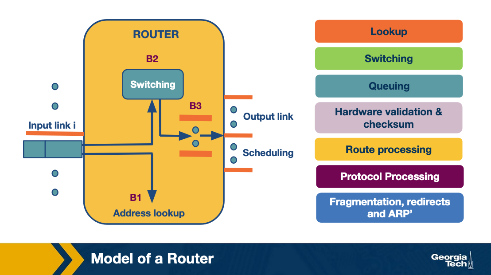
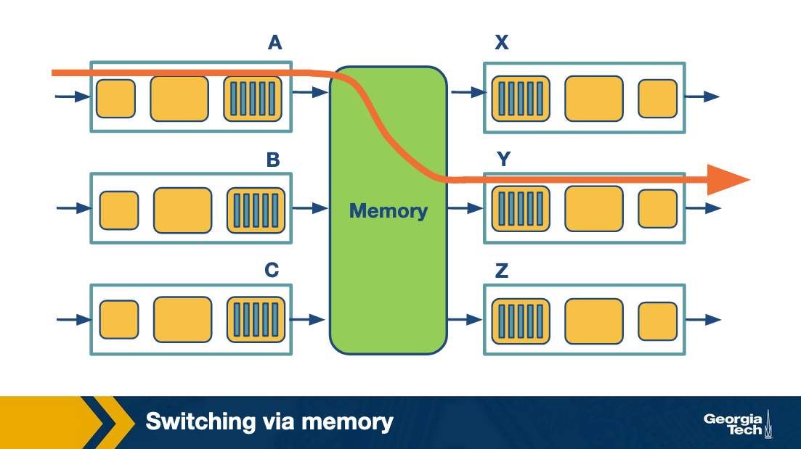
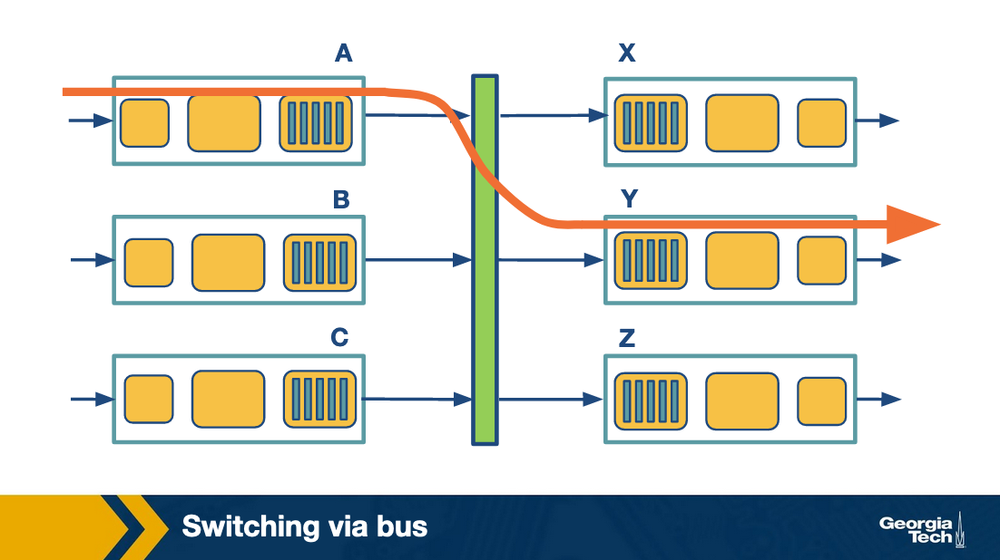
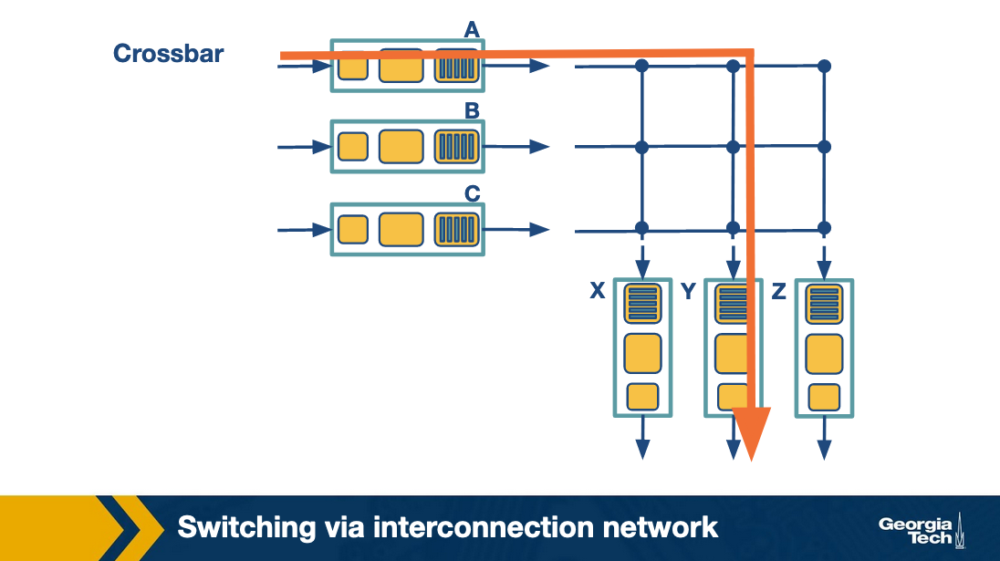

### Notes for Slide 1: Overview of Router Operations

- **Key Topic**: Routers are a critical part of the Internet's physical infrastructure.
- **Purpose of Routers**: Forward data from the source to the destination by determining the correct path.
- **Main Router Task**: Transfer the received packet from an **input link interface** to the appropriate **output link interface**.
  - This is done by examining the packet's **destination IP address** and consulting the **forwarding table** to choose the output link.
  
- **Challenges in Router Operations**:
  - **Scalability**: Handling large volumes of traffic efficiently, especially in high-speed networks.
  - **Advanced Traffic Handling**: 
    - Some traffic may need special handling for **quality of service (QoS)** or **security guarantees**.
    - Routers must process packets based on multiple criteria, such as QoS flags and packet classification.

- **Algorithms Used by Routers**:
  - **Longest Prefix Matching**: Determines the best output link by finding the longest matching prefix in the forwarding table.
  - **Packet Classification**: Differentiates packets based on multiple header fields to ensure appropriate handling (e.g., QoS or security).
  - **Scheduling**: Manages packet forwarding based on priority or other rules to meet specific traffic requirements.

- **Structure of This Lesson**:
  1. **First lesson**: Focus on **longest prefix matching algorithms**.
  2. **Second lesson**: Focus on **packet classification and scheduling**.

### Notes for Slide 2: What’s Inside a Router

The slides explain the internal architecture of a router, focusing on two main functions: the **forwarding plane** (hardware-based) and the **control plane** (software-based). The forwarding plane is responsible for the fast transmission of data packets through the router, while the control plane manages routing logic and protocols to ensure data is directed correctly.

#### 1. **Forwarding Data Plane:**
This is the part of the router that directly handles data packets and forwards them to their correct destinations. The forwarding plane typically works at high speeds and is implemented in hardware for optimal performance.

- **Input Ports:** 
  - **Line Termination:** This is where incoming data packets from external links are physically connected to the router.
  - **Data Link Processing:** Here, the data link layer protocol is used to process the incoming packet. Encapsulation and decapsulation of packet headers happen in this section.
  - **Lookup, Forwarding, and Queuing:** This is a key step where the input port checks the forwarding table, decides the correct output port, and queues the packet for further processing.
  
  _Diagram 2 Explanation:_
  - The data packet enters the router at the input port where it undergoes line termination, followed by data link processing (protocol handling and decapsulation). Then, it moves to the lookup and forwarding phase before being passed to the switch fabric.

- **Switch Fabric:**
  The switching fabric is the component that connects input and output ports within the router. Its role is to move packets between the input and output ports efficiently. The three main types of switching fabrics are:
  - **Memory-Based:** The oldest type, where packets are first written to and then read from memory.
  - **Bus-Based:** A shared bus where packets are transferred.
  - **Crossbar-Based:** A matrix system allowing multiple packets to be forwarded simultaneously between input and output ports.

  _Diagram 1 Explanation:_
  - The switching fabric connects the input and output ports. It transfers packets from one to the other and is the heart of the forwarding data plane. This diagram shows a high-level view of how input and output ports interact with the switch fabric.

- **Output Ports:** 
  - The output port is responsible for queuing and buffering packets before they are sent out to the next destination. After leaving the switch fabric, packets are queued, checked, and sent over the outgoing link.

  _Diagram 3 Explanation:_
  - After packets pass through the switch fabric, they are managed by the output ports, where queuing and buffer management are important to avoid packet loss or delays. The final step before transmission is data link processing and line termination.

#### 2. **Control Plane:**
This part of the router is responsible for the decision-making processes such as managing routing tables and implementing routing protocols. The control plane operates in software and generally works on a slower timescale compared to the forwarding plane.

- **Routing Processor:** 
  The control plane runs on the router’s processor, which manages routing logic, such as implementing routing protocols (e.g., OSPF, BGP) and calculating the best routes. The routing processor also maintains the routing table, which the forwarding plane uses to forward packets.
  
  In some cases, such as with **Software-Defined Networking (SDN)**, control plane functions can be handled remotely by a centralized controller, rather than being integrated into the router itself.

  _Diagram 4 Explanation:_
  - This diagram highlights the separation between the control plane and the data plane in an SDN environment. The control plane can be centralized and remote (as shown by the remote controller), which communicates routing decisions to the local forwarding table on the routers (data plane). The data plane deals with the actual packet forwarding based on instructions received from the control plane.

### Key Takeaways:
- **Forwarding Plane:** Handles fast, hardware-based packet forwarding, which includes line termination, decapsulation, lookup, and queuing at input/output ports.
- **Control Plane:** Manages routing decisions, protocols, and table computations in software, either locally within the router or remotely (SDN).
- **Switching Fabric:** The core hardware component connecting input ports to output ports, responsible for moving packets efficiently through the router.

Each of the diagrams illustrates these functions in different sections of the router, providing a clear understanding of how the forwarding and control planes work together to ensure data is correctly routed through the network.

### Notes for Slide 3: Router Architecture

This slide explains the architecture of a router, focusing on the various stages a packet passes through as it is processed by the router. The router is responsible for moving packets from an input link to the appropriate output link, performing various tasks like lookup, switching, and scheduling along the way.

#### Key Components and Processes:

1. **Lookup (B1):**
   - **Address Lookup:** When a packet arrives at the input link, the router must determine where to send it next. This is done by looking at the destination IP address and consulting the Forwarding Information Base (FIB), a table that maps destination IP prefixes to output links.
   - **Longest Prefix Matching:** Routers use this algorithm to find the best match for the destination address, ensuring packets are sent on the correct path.
   - **Packet Classification:** Some routers also use more complex criteria such as source IP, port numbers, and other header fields for lookup.

2. **Switching (B2):**
   - **Packet Switching:** Once the correct output link is identified, the packet is forwarded through the switch fabric. Modern routers often use a **crossbar switch** to handle this, which efficiently connects inputs to outputs. 
   - **Switch Scheduling:** Scheduling is necessary because multiple input links may want to send data to the same output. It involves managing which packets are switched first.

3. **Queuing (B3):**
   - **Buffering and Queueing:** After the switching process, packets may need to wait if the output link is congested. Routers use queues to temporarily store these packets. 
   - **FIFO and Weighted Fair Queuing:** Simple routers use First-In-First-Out (FIFO) queuing, but more advanced systems use **weighted fair queuing** to ensure fair bandwidth distribution and manage delays.

4. **Other Time-Insensitive Tasks:**
   - **Header Validation & Checksum:** The router verifies the packet header's integrity by checking the version number, decrementing the Time-to-Live (TTL), and recalculating the checksum.
   - **Route Processing:** The router's forwarding table is built using routing protocols like **RIP, OSPF,** or **BGP**, which are implemented in the routing processor.
   - **Protocol Processing:** Routers must handle several protocols:
     - **SNMP** (Simple Network Management Protocol) for remote management.
     - **TCP/UDP** for communication with remote systems.
     - **ICMP** (Internet Control Message Protocol) for error messages like TTL expiration.

#### Diagram Explanation:
- The diagram depicts the router's internal architecture, where packets go through stages of lookup (B1), switching (B2), and queuing (B3). Each of these processes helps guide the packet from the input link to the output link, while ensuring correct delivery and handling of any network congestion or delays.

### Key Takeaways:
- **Lookup, Switching, and Queuing:** These are the most time-sensitive tasks in a router, directly affecting packet delivery speed and efficiency.
- **Additional Functions:** The router also performs header validation, builds routing tables, and processes network protocols to manage packet flow and communication.

### Notes for Slide 4: Different Types of Switching

This slide explains the different methods of packet switching within a router. The switching fabric is the critical component responsible for moving packets from an input port to an output port. Three primary methods of switching are discussed:

#### 1. **Switching via Memory:**
   - **Process:** 
     - The input and output ports operate as I/O devices controlled by the routing processor.
     - When a packet arrives at an input port, an interrupt is sent to the processor, which copies the packet into memory.
     - The processor extracts the destination address and looks up the forwarding table to determine the correct output port. The packet is then copied to the output port’s buffer.
   - **Limitations:** 
     - This method is slower because every packet has to be processed and copied through the router’s CPU, leading to potential bottlenecks.
     - Memory access speed limits the overall switching speed.

   _Diagram 1 Explanation:_
   - The input ports (A, B, C) send packets to memory, where they are processed and forwarded to the appropriate output ports (X, Y, Z).

#### 2. **Switching via Bus:**
   - **Process:** 
     - In this method, the routing processor is bypassed.
     - When a packet arrives at an input port, an internal header is added, which specifies the desired output port.
     - The packet is then sent over a shared bus to all output ports, but only the designated output port will accept the packet.
     - Once received, the internal header is removed.
   - **Limitations:** 
     - Only one packet can cross the bus at any given time, meaning the bus speed limits the overall switching speed.
     - This method is faster than memory-based switching but still limited by the bus bandwidth.

   _Diagram 2 Explanation:_
   - Packets from input ports (A, B, C) are sent to the shared bus, which routes them to the correct output ports (X, Y, Z) based on the packet’s internal header.

#### 3. **Switching via Interconnection Network (Crossbar):**
   - **Process:** 
     - A crossbar switch connects N input ports to N output ports using 2N buses. 
     - At each intersection of a horizontal and vertical bus, a crosspoint can be opened or closed by the switching fabric to allow packets to flow.
     - Multiple packets can be switched simultaneously as long as they are using different input and output ports.
     - For example, a packet can be forwarded from port A to output Y while another packet is forwarded from port B to output X.
   - **Advantages:** 
     - This method is the fastest and most efficient because multiple packets can be switched simultaneously.
     - Crossbar switches are common in high-performance routers due to their ability to handle multiple data flows at once.

   _Diagram 3 Explanation:_
   - The crossbar network allows multiple packets from input ports (A, B, C) to be sent to output ports (X, Y, Z) simultaneously as long as the input-output paths do not overlap.

### Key Takeaways:
- **Switching via Memory:** Involves the routing processor and is the slowest method, limited by memory speed.
- **Switching via Bus:** Bypasses the processor, but is still limited by the bus speed.
- **Switching via Interconnection Network (Crossbar):** The fastest method, capable of simultaneous multiple packet transmissions, ideal for high-performance routers.

These switching methods highlight the trade-offs between speed and complexity in router design, with crossbar networks being the most efficient for large-scale and high-speed data handling.

