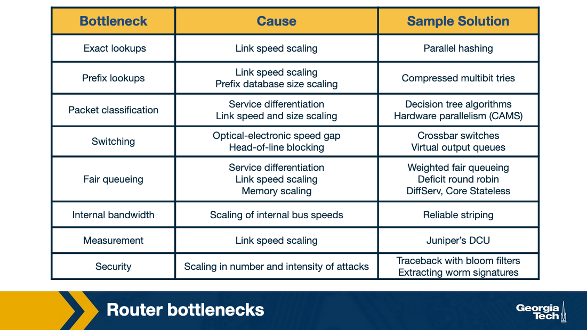
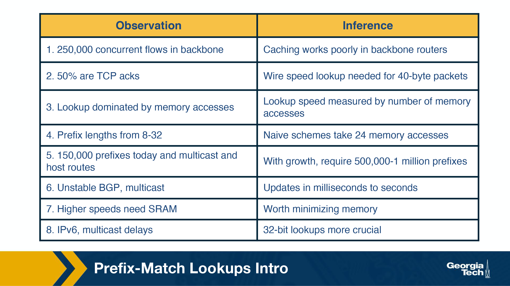
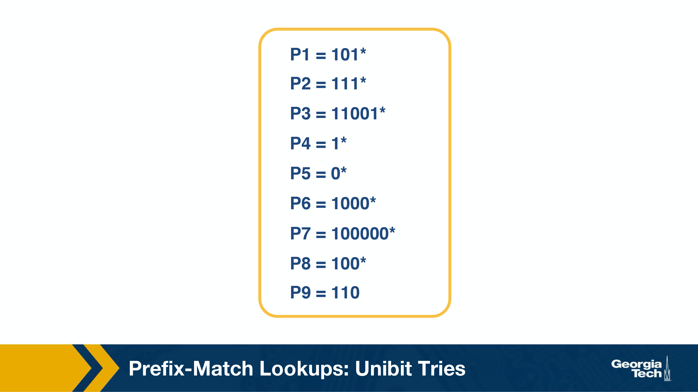
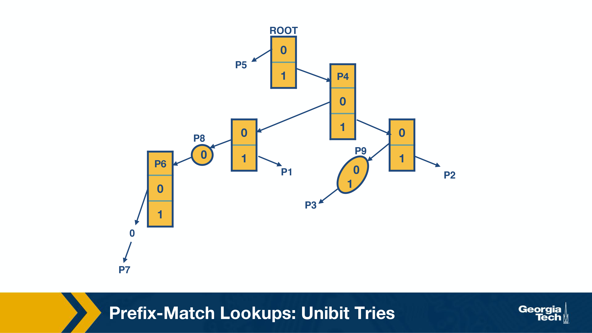
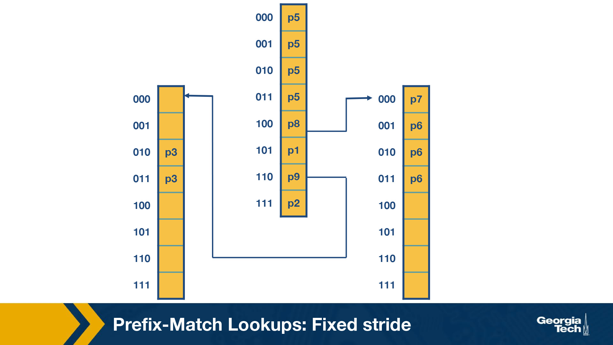
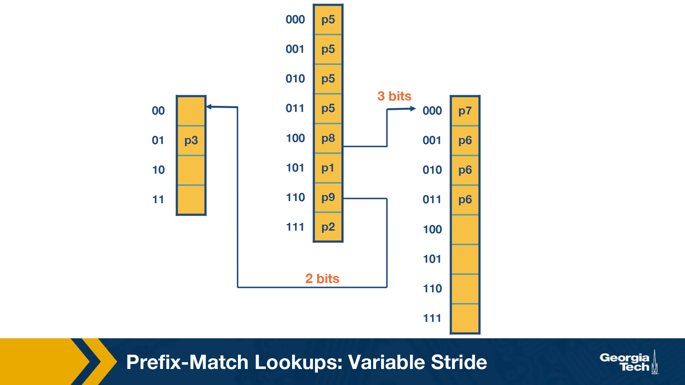

### Notes for Slide 1: Overview of Router Operations

- **Key Topic**: Routers are a critical part of the Internet's physical infrastructure.
- **Purpose of Routers**: Forward data from the source to the destination by determining the correct path.
- **Main Router Task**: Transfer the received packet from an **input link interface** to the appropriate **output link interface**.
  - This is done by examining the packet's **destination IP address** and consulting the **forwarding table** to choose the output link.
  
- **Challenges in Router Operations**:
  - **Scalability**: Handling large volumes of traffic efficiently, especially in high-speed networks.
  - **Advanced Traffic Handling**: 
    - Some traffic may need special handling for **quality of service (QoS)** or **security guarantees**.
    - Routers must process packets based on multiple criteria, such as QoS flags and packet classification.

- **Algorithms Used by Routers**:
  - **Longest Prefix Matching**: Determines the best output link by finding the longest matching prefix in the forwarding table.
  - **Packet Classification**: Differentiates packets based on multiple header fields to ensure appropriate handling (e.g., QoS or security).
  - **Scheduling**: Manages packet forwarding based on priority or other rules to meet specific traffic requirements.

- **Structure of This Lesson**:
  1. **First lesson**: Focus on **longest prefix matching algorithms**.
  2. **Second lesson**: Focus on **packet classification and scheduling**.

### Notes for Slide 2: What’s Inside a Router

The slides explain the internal architecture of a router, focusing on two main functions: the **forwarding plane** (hardware-based) and the **control plane** (software-based). The forwarding plane is responsible for the fast transmission of data packets through the router, while the control plane manages routing logic and protocols to ensure data is directed correctly.

#### 1. **Forwarding Data Plane:**
This is the part of the router that directly handles data packets and forwards them to their correct destinations. The forwarding plane typically works at high speeds and is implemented in hardware for optimal performance.

- **Input Ports:** 
  - **Line Termination:** This is where incoming data packets from external links are physically connected to the router.
  - **Data Link Processing:** Here, the data link layer protocol is used to process the incoming packet. Encapsulation and decapsulation of packet headers happen in this section.
  - **Lookup, Forwarding, and Queuing:** This is a key step where the input port checks the forwarding table, decides the correct output port, and queues the packet for further processing.
  
  _Diagram 2 Explanation:_
  - The data packet enters the router at the input port where it undergoes line termination, followed by data link processing (protocol handling and decapsulation). Then, it moves to the lookup and forwarding phase before being passed to the switch fabric.

- **Switch Fabric:**
  The switching fabric is the component that connects input and output ports within the router. Its role is to move packets between the input and output ports efficiently. The three main types of switching fabrics are:
  - **Memory-Based:** The oldest type, where packets are first written to and then read from memory.
  - **Bus-Based:** A shared bus where packets are transferred.
  - **Crossbar-Based:** A matrix system allowing multiple packets to be forwarded simultaneously between input and output ports.

  _Diagram 1 Explanation:_
  - The switching fabric connects the input and output ports. It transfers packets from one to the other and is the heart of the forwarding data plane. This diagram shows a high-level view of how input and output ports interact with the switch fabric.

- **Output Ports:** 
  - The output port is responsible for queuing and buffering packets before they are sent out to the next destination. After leaving the switch fabric, packets are queued, checked, and sent over the outgoing link.

  _Diagram 3 Explanation:_
  - After packets pass through the switch fabric, they are managed by the output ports, where queuing and buffer management are important to avoid packet loss or delays. The final step before transmission is data link processing and line termination.

#### 2. **Control Plane:**
This part of the router is responsible for the decision-making processes such as managing routing tables and implementing routing protocols. The control plane operates in software and generally works on a slower timescale compared to the forwarding plane.

- **Routing Processor:** 
  The control plane runs on the router’s processor, which manages routing logic, such as implementing routing protocols (e.g., OSPF, BGP) and calculating the best routes. The routing processor also maintains the routing table, which the forwarding plane uses to forward packets.
  
  In some cases, such as with **Software-Defined Networking (SDN)**, control plane functions can be handled remotely by a centralized controller, rather than being integrated into the router itself.

  _Diagram 4 Explanation:_
  - This diagram highlights the separation between the control plane and the data plane in an SDN environment. The control plane can be centralized and remote (as shown by the remote controller), which communicates routing decisions to the local forwarding table on the routers (data plane). The data plane deals with the actual packet forwarding based on instructions received from the control plane.

### Key Takeaways:
- **Forwarding Plane:** Handles fast, hardware-based packet forwarding, which includes line termination, decapsulation, lookup, and queuing at input/output ports.
- **Control Plane:** Manages routing decisions, protocols, and table computations in software, either locally within the router or remotely (SDN).
- **Switching Fabric:** The core hardware component connecting input ports to output ports, responsible for moving packets efficiently through the router.

Each of the diagrams illustrates these functions in different sections of the router, providing a clear understanding of how the forwarding and control planes work together to ensure data is correctly routed through the network.

### Notes for Slide 3: Router Architecture

This slide explains the architecture of a router, focusing on the various stages a packet passes through as it is processed by the router. The router is responsible for moving packets from an input link to the appropriate output link, performing various tasks like lookup, switching, and scheduling along the way.

#### Key Components and Processes:

1. **Lookup (B1):**
   - **Address Lookup:** When a packet arrives at the input link, the router must determine where to send it next. This is done by looking at the destination IP address and consulting the Forwarding Information Base (FIB), a table that maps destination IP prefixes to output links.
   - **Longest Prefix Matching:** Routers use this algorithm to find the best match for the destination address, ensuring packets are sent on the correct path.
   - **Packet Classification:** Some routers also use more complex criteria such as source IP, port numbers, and other header fields for lookup.

2. **Switching (B2):**
   - **Packet Switching:** Once the correct output link is identified, the packet is forwarded through the switch fabric. Modern routers often use a **crossbar switch** to handle this, which efficiently connects inputs to outputs. 
   - **Switch Scheduling:** Scheduling is necessary because multiple input links may want to send data to the same output. It involves managing which packets are switched first.

3. **Queuing (B3):**
   - **Buffering and Queueing:** After the switching process, packets may need to wait if the output link is congested. Routers use queues to temporarily store these packets. 
   - **FIFO and Weighted Fair Queuing:** Simple routers use First-In-First-Out (FIFO) queuing, but more advanced systems use **weighted fair queuing** to ensure fair bandwidth distribution and manage delays.

4. **Other Time-Insensitive Tasks:**
   - **Header Validation & Checksum:** The router verifies the packet header's integrity by checking the version number, decrementing the Time-to-Live (TTL), and recalculating the checksum.
   - **Route Processing:** The router's forwarding table is built using routing protocols like **RIP, OSPF,** or **BGP**, which are implemented in the routing processor.
   - **Protocol Processing:** Routers must handle several protocols:
     - **SNMP** (Simple Network Management Protocol) for remote management.
     - **TCP/UDP** for communication with remote systems.
     - **ICMP** (Internet Control Message Protocol) for error messages like TTL expiration.

#### Diagram Explanation:
- The diagram depicts the router's internal architecture, where packets go through stages of lookup (B1), switching (B2), and queuing (B3). Each of these processes helps guide the packet from the input link to the output link, while ensuring correct delivery and handling of any network congestion or delays.

### Key Takeaways:
- **Lookup, Switching, and Queuing:** These are the most time-sensitive tasks in a router, directly affecting packet delivery speed and efficiency.
- **Additional Functions:** The router also performs header validation, builds routing tables, and processes network protocols to manage packet flow and communication.

### Notes for Slide 4: Different Types of Switching

This slide explains the different methods of packet switching within a router. The switching fabric is the critical component responsible for moving packets from an input port to an output port. Three primary methods of switching are discussed:

#### 1. **Switching via Memory:**
   - **Process:** 
     - The input and output ports operate as I/O devices controlled by the routing processor.
     - When a packet arrives at an input port, an interrupt is sent to the processor, which copies the packet into memory.
     - The processor extracts the destination address and looks up the forwarding table to determine the correct output port. The packet is then copied to the output port’s buffer.
   - **Limitations:** 
     - This method is slower because every packet has to be processed and copied through the router’s CPU, leading to potential bottlenecks.
     - Memory access speed limits the overall switching speed.

   _Diagram 1 Explanation:_
   - The input ports (A, B, C) send packets to memory, where they are processed and forwarded to the appropriate output ports (X, Y, Z).

#### 2. **Switching via Bus:**
   - **Process:** 
     - In this method, the routing processor is bypassed.
     - When a packet arrives at an input port, an internal header is added, which specifies the desired output port.
     - The packet is then sent over a shared bus to all output ports, but only the designated output port will accept the packet.
     - Once received, the internal header is removed.
   - **Limitations:** 
     - Only one packet can cross the bus at any given time, meaning the bus speed limits the overall switching speed.
     - This method is faster than memory-based switching but still limited by the bus bandwidth.

   _Diagram 2 Explanation:_
   - Packets from input ports (A, B, C) are sent to the shared bus, which routes them to the correct output ports (X, Y, Z) based on the packet’s internal header.

#### 3. **Switching via Interconnection Network (Crossbar):**
   - **Process:** 
     - A crossbar switch connects N input ports to N output ports using 2N buses. 
     - At each intersection of a horizontal and vertical bus, a crosspoint can be opened or closed by the switching fabric to allow packets to flow.
     - Multiple packets can be switched simultaneously as long as they are using different input and output ports.
     - For example, a packet can be forwarded from port A to output Y while another packet is forwarded from port B to output X.
   - **Advantages:** 
     - This method is the fastest and most efficient because multiple packets can be switched simultaneously.
     - Crossbar switches are common in high-performance routers due to their ability to handle multiple data flows at once.

   _Diagram 3 Explanation:_
   - The crossbar network allows multiple packets from input ports (A, B, C) to be sent to output ports (X, Y, Z) simultaneously as long as the input-output paths do not overlap.

### Key Takeaways:
- **Switching via Memory:** Involves the routing processor and is the slowest method, limited by memory speed.
- **Switching via Bus:** Bypasses the processor, but is still limited by the bus speed.
- **Switching via Interconnection Network (Crossbar):** The fastest method, capable of simultaneous multiple packet transmissions, ideal for high-performance routers.

These switching methods highlight the trade-offs between speed and complexity in router design, with crossbar networks being the most efficient for large-scale and high-speed data handling.

### Notes for Slide 5: Router Bottlenecks

This slide outlines the common bottlenecks that routers face as they scale up to handle increasing traffic and the growing demands of modern internet services. Routers need to manage large amounts of data efficiently while providing services like security, quality of service (QoS), and fair queuing. The slide identifies specific bottlenecks, their causes, and potential solutions to these challenges.

#### 1. **Exact Lookups:**
   - **Cause:** 
     - The scaling of link speeds.
   - **Solution:**
     - **Parallel Hashing:** A method used to quickly locate data in memory, making exact lookups faster and more efficient.

#### 2. **Prefix Lookups:**
   - **Cause:** 
     - Scaling of link speeds and the size of the prefix database (which holds destination address prefixes).
   - **Solution:**
     - **Compressed Multibit Tries:** A data structure used for efficient longest prefix matching, which reduces memory usage and improves lookup times.

#### 3. **Packet Classification:**
   - **Cause:** 
     - Service differentiation and the scaling of link speeds.
   - **Solution:**
     - **Decision Tree Algorithms** and **Hardware Parallelism (CAMS):** These approaches help classify packets based on complex criteria, such as service type, source, and destination addresses, by improving computational efficiency.

#### 4. **Switching:**
   - **Cause:**
     - Optical-electronic speed gaps and head-of-line blocking, which occur when faster input ports overwhelm slower output ports.
   - **Solution:**
     - **Crossbar Switches** and **Virtual Output Queues:** These technologies help manage multiple high-speed inputs and avoid blocking, allowing packets to be switched quickly between input and output ports.

#### 5. **Fair Queuing:**
   - **Cause:**
     - Service differentiation, scaling of link speeds, and memory constraints.
   - **Solution:**
     - **Weighted Fair Queuing, Deficit Round Robin (DRR),** and **DiffServ (Core Stateless):** These algorithms ensure that packets are fairly scheduled and handled in a way that guarantees performance, reducing congestion and delays.

#### 6. **Internal Bandwidth:**
   - **Cause:**
     - Scaling of internal bus speeds, which can limit the overall throughput of a router.
   - **Solution:**
     - **Reliable Striping:** A method that splits data into smaller pieces to distribute traffic over multiple internal channels, balancing the load and improving bandwidth.

#### 7. **Measurement:**
   - **Cause:**
     - Link speed scaling makes it harder to measure network performance and traffic.
   - **Solution:**
     - **Juniper’s DCU (Data Collection Unit):** A hardware-based solution designed to monitor and measure network traffic at high speeds.

#### 8. **Security:**
   - **Cause:**
     - Increasing number and intensity of cyberattacks, such as worms and DDoS attacks.
   - **Solution:**
     - **Traceback with Bloom Filters** and **Extracting Worm Signatures:** These techniques help routers trace the origins of attacks and identify malicious traffic, improving the router’s ability to detect and prevent security threats.

### Key Takeaways:
- Routers face bottlenecks as they attempt to scale up to meet the demands of increasing traffic and the complexity of modern networks.
- Solutions involve using advanced data structures (compressed tries, decision trees), hardware-based improvements (crossbar switches, virtual output queues), and algorithms (weighted fair queuing, deficit round robin) to overcome challenges related to link speeds, packet classification, switching, and security.
  
This slide highlights how scaling issues in routers are addressed using parallelism, efficient algorithms, and hardware innovations to maintain high-speed performance and security in large networks.

### Notes for Slide 6: Prefix-Match Lookups Intro

This slide presents observations and inferences that explain the challenges routers face when performing **prefix-match lookups**, a critical task for routing IP packets. As the number of networks and IP addresses continues to grow, routers must use scalable algorithms to group multiple IP addresses by the same prefix. This scalability challenge is compounded by the rise of traffic, diverse applications, and IPv6, making efficient prefix-matching algorithms necessary.

### Prefix Notation:

There are several ways to denote prefixes, which are used in routers to group IP addresses:

1. **Dot Decimal Notation:**
   - Example: A 16-bit prefix could be written as **132.234**. 
   - In binary form, the first octet (132) is represented as `10000100`, and the second octet (234) as `11101010`. Together, they form the prefix: `1000010011101010*`, where the `*` acts as a wildcard to indicate that the remaining bits don't matter.

2. **Slash Notation:**
   - Format: **A/L**, where A is the address, and L is the length of the prefix.
   - Example: **132.238.0.0/16** means the first 16 bits are important for routing decisions.

3. **Masking Notation:**
   - Example: **123.234.0.0/16** can also be written as **123.234.0.0** with a mask **255.255.0.0**, which means the first 16 bits are critical for prefix matching.

### Why Variable-Length Prefixes Are Needed:

- In the early days of the Internet, fixed-length prefixes were used (class-based addressing). However, as IP addresses became exhausted, **Classless Inter-Domain Routing (CIDR)** was introduced in 1993.
- CIDR allows for **variable-length prefixes**, which helped reduce the size of routing tables. However, it introduced the new problem of **longest-prefix matching**, where routers must find the longest matching prefix for an incoming packet’s destination.

### Why Better Lookup Algorithms Are Needed:

To forward a packet, a router checks its forwarding table to find the correct output port. This lookup process presents several challenges:
1. **Speed:** How fast can the lookup be performed?
2. **Memory:** How much memory is required to store prefixes and perform lookups?
3. **Update Time:** How quickly can the routing table be updated when network changes occur (e.g., a prefix is added or deleted)?

---

### Key Observations and Inferences:

1. **250,000 Concurrent Flows in Backbone:**
   - **Inference:** Caching works poorly in backbone routers because of the high number of concurrent flows. Routers must rely on faster algorithms rather than cache-based solutions, which cannot handle such high volumes efficiently.

2. **50% of Flows Are TCP Acknowledgements (ACKs):**
   - **Inference:** Routers need to support **wire-speed lookups** for small packets, such as 40-byte TCP ACKs, because these packets make up a large percentage of traffic.

3. **Lookup Dominated by Memory Accesses:**
   - **Inference:** The **speed of lookup** is directly affected by how many memory accesses are needed. Memory access times become a bottleneck, meaning routers need efficient data structures that minimize memory lookups.

4. **Prefix Lengths Range from 8 to 32 Bits:**
   - **Inference:** Naive lookup schemes might require **24 memory accesses**, which is inefficient for longer prefixes. More advanced techniques are needed to reduce the number of memory accesses required.

5. **150,000 Prefixes Today, Growing to 500,000-1 Million:**
   - **Inference:** As the number of prefixes grows, routers will need to support larger routing tables. Current tables hold around 150,000 prefixes, but with growth, routers may need to handle up to a million prefixes.

6. **Unstable BGP and Multicast Traffic:**
   - **Inference:** **Updates in milliseconds to seconds** are common for routing protocols like BGP, which can cause delays when the router has to add, delete, or modify prefixes.

7. **Higher Speeds Need SRAM:**
   - **Inference:** Fast routers benefit from **minimizing memory access** by using **SRAM**, a faster but more expensive type of memory, to handle high-speed traffic.

8. **IPv6 and Multicast Delays:**
   - **Inference:** As more IPv6 addresses are used, **32-bit lookups** will become more important. Efficient lookup algorithms are critical for handling IPv6 and multicast traffic at scale.

---

### Key Takeaways:

- **Prefix-Matching Challenges:** Routers need to handle an increasing number of concurrent flows, growing prefix databases, and complex routing scenarios (e.g., multicast, BGP instability).
- **Memory Access Bottlenecks:** The speed of routing lookups is heavily dependent on how quickly memory can be accessed, leading to the need for more efficient memory management solutions, especially with fast SRAM.
- **Scalability and Growth:** As the number of prefixes grows, routers will need to handle millions of prefixes, making efficient lookup algorithms critical to maintaining performance.

This slide introduces the critical importance of efficient prefix lookup algorithms, especially as network traffic grows and routing tables become more complex. Efficient lookup algorithms must balance lookup speed, memory usage, and scalability to handle the increasing demands of modern internet traffic.

### Notes for Slide 7: Prefix-Match Lookups – Unibit Tries

This slide introduces **unibit tries**, a simple method for **prefix matching** in IP routing. The example shows how prefixes are structured in a trie and how routers use this structure to perform lookups for IP addresses efficiently. We will walk through the process of constructing a unibit trie and performing prefix lookups.

---

### Example Prefix Database:

The database contains nine prefixes:
- **P1 = 101***
- **P2 = 111***
- **P3 = 11001***
- **P4 = 1***
- **P5 = 0***
- **P6 = 1000***
- **P7 = 100000***
- **P8 = 100***
- **P9 = 110**

These prefixes represent a variety of bit lengths, and the asterisk (`*`) denotes that any combination of bits can follow.

---

### Unibit Tries Overview:

A **unibit trie** is one of the simplest techniques for prefix lookup:
- **Trie Construction:**
  - Every node in the trie has two possible pointers: one for `0` and one for `1`.
  - Starting at the **root** node, a `0-pointer` directs the search to a subtrie for all prefixes that begin with `0`, and a `1-pointer` leads to prefixes that start with `1`.
  - As the search progresses through each bit of the prefix, more subtries are constructed, which allocate the remaining bits of the prefix.

---

### Example of Prefix Matching:

For **P1 = 101***:
1. Start at the **root** node.
2. Follow the **1-pointer** for the first bit (`1`).
3. Next, follow the **0-pointer** for the second bit (`0`).
4. Finally, follow the **1-pointer** for the third bit (`1`).

This completes the matching of prefix **P1**.

For **P7 = 100000***:
1. Start at the **root** node and follow the **1-pointer**.
2. Follow five **0-pointers** after the initial `1` to reach the matching prefix for **P7**.

---

### Steps for Performing Prefix Matching:

1. **Start at the Root:** To match a prefix, begin at the root node.
2. **Follow Pointers:** Traverse the trie by following the corresponding `0` or `1` pointer for each bit of the prefix.
3. **Stop When Matching Fails:** Continue traversing until the search fails (i.e., there is no match for the next bit). The last successfully matched prefix is the longest prefix match.

---

### Key Characteristics of Unibit Tries:

1. **Substring of Prefixes:**
   - If one prefix is a **substring** of another, the smaller prefix is stored on the path to the longer one. For instance:
     - **P4 = 1*** is a substring of **P2 = 111***, and hence **P4** is stored inside the path to **P2**.

2. **One-Way Branches:**
   - Some nodes in the trie may only contain a single pointer (either `0` or `1`), which results in **one-way branches**. These one-way branches are often compressed for efficiency. For instance:
     - For **P3 = 11001***, after matching the first three bits (`110`), there are no other prefixes that share more than three bits with **P3**. The rest of the nodes are **one-way branches**, which are compressed into a single node (shown as **P9** in the diagram).

---

### Trie Compression:

To improve efficiency, **one-way branches** are compressed into a single node containing multiple bits. For example:
- **P9** compresses a series of one-way branches into one node that represents the remainder of the prefix.

---

### Key Takeaways:
- **Efficient Matching:** Unibit tries allow routers to efficiently match prefixes by using a binary search through the trie based on the bits of the IP address.
- **Longest Prefix Match:** By following the path through the trie, the router can find the **longest prefix match** for each packet.
- **Trie Compression:** Compressing one-way branches into a single node enhances the trie’s performance and reduces memory usage.

This slide explains how unibit tries simplify prefix matching and provide an efficient mechanism for routing decisions based on the longest prefix match. Unibit tries, while simple, are foundational to understanding more advanced prefix matching techniques.

### Multibit Tries

#### Why Do We Need Multibit Tries?

While **unibit tries** provide a straightforward and efficient mechanism for IP prefix lookups, they suffer from a key limitation: the number of **memory accesses** required for a lookup can be significant. Specifically, for a **32-bit IP address**, a unibit trie may require up to **32 memory accesses** in the worst case (one access per bit of the prefix). 

In high-speed networks, this can result in inefficient lookups:
- **Memory Access Example:** Assuming a memory access latency of **60 nanoseconds**, a 32-bit lookup could take up to **1.92 microseconds**. 
- **Impact on High-Speed Links:** This time is excessive for routers handling data at high speeds, leading to potential performance bottlenecks.

To improve lookup efficiency, we can use **multibit tries**.

---

### What Are Multibit Tries?

A **multibit trie** is a type of trie where each node represents multiple bits (instead of just one bit as in unibit tries). By increasing the number of bits checked at each level of the trie, multibit tries reduce the overall number of memory accesses needed for a lookup.

- **Stride:** The number of bits examined at each level is called the **stride**. 
  - For example, if we use a stride of 2 bits, we examine 2 bits of the address in each step, and each node in the trie will have **2² = 4** children.
  - If the stride is 3 bits, each node will have **2³ = 8** children.

---

### Two Types of Multibit Tries:

1. **Fixed-Length Stride Tries:**
   - In a **fixed-length stride trie**, the same number of bits (stride) is examined at every level of the trie.
   - For example, if the stride is **4 bits** (i.e., k = 4), each node will have **16 children** (2⁴).
   - This uniform stride simplifies the implementation but may not be the most memory-efficient.

2. **Variable-Length Stride Tries:**
   - In a **variable-length stride trie**, different levels of the trie may have different stride lengths.
   - This provides flexibility and can lead to a more memory-efficient structure. For instance, shorter strides may be used for certain parts of the trie with more prefixes, while longer strides may be used for sparsely populated sections.
   - This technique optimizes memory usage and reduces the number of memory accesses while providing better performance than fixed-length strides in many cases.

---

### Advantages of Multibit Tries:

1. **Fewer Memory Accesses:**
   - With a higher stride, multibit tries drastically reduce the number of memory accesses needed for a lookup. For example, a **stride of 4 bits** would reduce the worst-case memory accesses for a 32-bit address to **8 memory accesses** (32/4), instead of 32 accesses in a unibit trie.
   
2. **Better Scalability for High-Speed Networks:**
   - Multibit tries are more suitable for **high-speed networks** where performance needs to be optimized to handle large amounts of data quickly. By minimizing memory lookups, they help routers process data more efficiently.

3. **Flexibility with Variable-Length Strides:**
   - Variable-length stride tries offer more flexibility by allowing different sections of the trie to have different stride lengths, leading to optimized memory usage and better performance in complex routing environments.

---

### Key Takeaways:
- **Multibit Tries:** A solution to the inefficiency of unibit tries, reducing the number of memory accesses during lookups by processing multiple bits at once (stride-based approach).
- **Fixed-Length vs. Variable-Length Strides:** Fixed-length strides provide simplicity, while variable-length strides offer more flexibility and memory efficiency.
- **Better Performance:** Multibit tries are more suited for high-speed networks where performance is critical, as they significantly reduce lookup times compared to unibit tries.

By using multibit tries, routers can perform lookups faster and more efficiently, which is essential for handling the increasing volume of data traffic on the internet.

### Notes for Slide 11: Prefix-Match Lookups – Fixed Stride

In this slide, we explore **multibit tries** with a **fixed stride** length of 3 bits. This method improves lookup efficiency by examining multiple bits at each step. A **fixed-stride trie** processes a fixed number of bits (3 bits in this case) at each node, reducing the number of memory accesses needed compared to a unibit trie, where only 1 bit is processed per step.

---

### What Is a Fixed-Stride Trie?

- A **fixed-stride trie** is a multibit trie where each node processes a fixed number of bits at every step. Here, the stride length is **3 bits**.
- **Each node** in the trie has 8 possible children (because 2³ = 8), one for each combination of three bits (`000`, `001`, `010`, etc.).
- Prefixes (P1, P2, P3, P5, P6, P7, P8, and P9) are expanded to fit within the structure of the trie.

---

### Key Concepts of Fixed-Stride Trie:

1. **Node Information:**
   - Every element in the trie represents two pieces of information:
     - **A pointer**: to the next node in the trie, indicating the next step in the search process.
     - **A prefix value**: stored in the current node for matching.

2. **Prefix Search Process:**
   - The search starts by examining the first **n-bits** of the address (3 bits in this example).
   - As the search progresses, the algorithm keeps track of the **last matched prefix**.
   - The search ends when an **empty pointer** (no further match) is found. At this point, the **last matched prefix** is returned as the longest prefix match.

---

### Example Search Process:

1. **Search for Address A = 001:**
   - The search begins at the root node and traces the path for **001**.
   - Since no outgoing pointer is available after **001**, the search terminates here, returning **P5** as the matching prefix.

2. **Search for Address A = 100000:**
   - The search starts at the root node, following the path for **100**.
   - It continues along this path and returns **P7** as the matching prefix after traversing the trie for the first three bits.

---

### Key Points to Note:

1. **Every Step Examines 3 Bits:** 
   - In each step, the trie processes 3 bits at a time, reducing the overall number of memory accesses compared to a unibit trie, where each step examines only 1 bit.
   
2. **Return Last Matched Prefix:**
   - The search remembers the last matched prefix during traversal. When the search reaches an empty pointer (no further path), it returns the **last known prefix** as the longest prefix match.
   
3. **No Match Ends the Search:**
   - If the path ends without finding a match (i.e., an empty pointer), the search stops, and the last matched prefix is returned as the final result.

---

### Breakdown of Examples:

- **Address A = 001:**
   - The search starts at the root and follows the path for **001**.
   - Since no outgoing pointer exists, the search terminates early and returns **P5**.
   
- **Address A = 100000:**
   - The search begins with **100** at the root node.
   - The search continues along the path for **100** until it reaches **P7**, the longest matching prefix for this address.

---

### Key Advantages of Fixed-Stride Tries:

1. **Fewer Memory Accesses:**
   - By processing multiple bits (3 bits) at each step, the number of memory accesses required for a lookup is reduced, which improves efficiency compared to a unibit trie.
   
2. **Consistent Stride Length:**
   - The fixed stride length (3 bits) simplifies the search process, ensuring that each step is consistent in terms of the number of bits processed.

3. **Efficient Memory Usage:**
   - By using pointers and prefix values efficiently, the trie ensures that memory is not wasted, and only the necessary information is stored.

---

### How the Search Works in a Fixed-Stride Trie:

1. **Move Forward by 3 Bits (Stride):**
   - The search proceeds by looking at the first 3 bits of the input address at each level in the trie.
   
2. **Return the Longest Matched Prefix:**
   - If the search reaches an empty pointer, it returns the longest matched prefix found during the traversal.

---

### Key Takeaways:

- **Fixed-Stride Tries**: These allow routers to perform prefix lookups more efficiently by examining multiple bits at once (3 bits in this example).
- **Faster Lookups**: The number of memory accesses required is reduced, improving the speed of lookups compared to unibit tries.
- **Consistent and Efficient**: The fixed stride ensures that the lookup process is consistent, making the implementation simpler and more predictable.

This slide shows how fixed-stride tries enhance prefix lookups by processing multiple bits at a time, improving lookup efficiency while maintaining consistent memory usage and search behavior.

### Notes for Slide 12: Prefix-Match Lookups – Variable Stride

In this slide, we discuss **variable-stride tries**, a more flexible version of multibit tries that allow different numbers of bits (strides) to be examined at each step. Unlike the **fixed-stride** method, where every node processes the same number of bits, **variable strides** optimize the number of bits processed at each node based on the specific prefix lengths being examined. This leads to more memory-efficient lookups.

---

### Why Do We Need Variable Strides?

In some cases, the fixed stride method may not be the most memory-efficient solution. **Variable strides** are introduced to:
- **Reduce memory usage** by adjusting the number of bits processed at each node.
- **Optimize trie traversal**, reducing the number of memory accesses by tailoring the stride to the specific needs of the prefix database.

---

### Key Points about Variable Stride:

1. **Variable Bit Lengths at Each Node:**
   - In a variable-stride trie, each node can process a different number of bits. This flexibility allows the trie to adjust based on the prefix lengths in the database.
   - For example, in the diagram:
     - The **rightmost node** examines **3 bits** because of **P7** (which has 6 bits).
     - The **leftmost node** examines **2 bits** because **P3** has a total length of 5 bits.

2. **Reduction in Entries:**
   - In this example, variable strides reduce the number of entries in the trie compared to the fixed-stride version. By adjusting the stride at each node, the prefix database becomes smaller, leading to less memory usage.
   - In this case, there are **four fewer entries** compared to the fixed-stride scheme.

3. **Pointer Encoded Strides:**
   - The **pointer to the node** encodes the number of bits to be examined at each step. This pointer tells the trie how many bits to process at each level, allowing for flexibility in stride length.

---

### Example Breakdown:

- **Rightmost Node:**
  - The node needs to examine **3 bits** because of the prefix **P7 = 100000***, which has 6 bits total.
  - This ensures the trie covers the entire prefix length for longer prefixes like **P7**.
  
- **Leftmost Node:**
  - The node examines **2 bits** because **P3 = 11001*** has 5 bits total.
  - This reduces memory usage since fewer bits need to be processed for shorter prefixes like **P3**.

---

### Key Advantages of Variable Stride:

1. **Memory Optimization:**
   - By adjusting the stride length at each node, the trie reduces memory usage. This is especially important when dealing with large prefix databases.
   
2. **Fewer Memory Accesses:**
   - With optimal stride lengths, variable-stride tries require fewer memory accesses, leading to faster lookups.

3. **Dynamic Programming for Optimization:**
   - The optimal stride for each node is selected using **dynamic programming**, which ensures the best balance between memory efficiency and lookup speed.

---

### Key Takeaways:

- **Variable-Strides:** By varying the number of bits processed at each node, the trie achieves better memory efficiency and requires fewer memory accesses.
- **Flexibility:** Unlike fixed-stride tries, variable strides allow different nodes to process different numbers of bits, leading to a more optimized prefix lookup process.
- **Memory Optimization:** The use of variable strides reduces the number of trie entries, leading to significant memory savings compared to a fixed-stride approach.

This slide illustrates how variable-stride tries improve upon the fixed-stride method by allowing more flexibility in the number of bits processed at each node, resulting in a more memory-efficient trie that still supports fast prefix lookups.