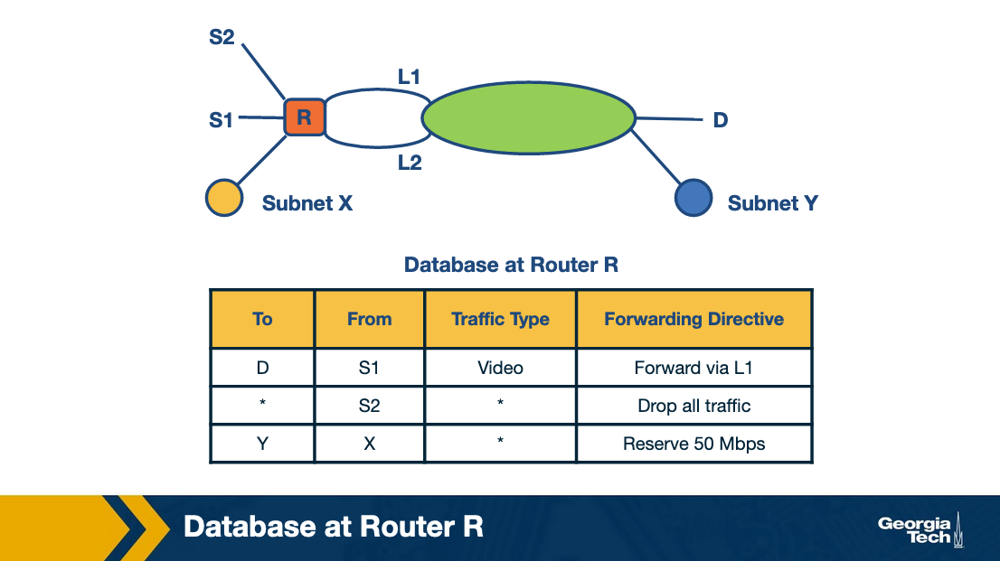
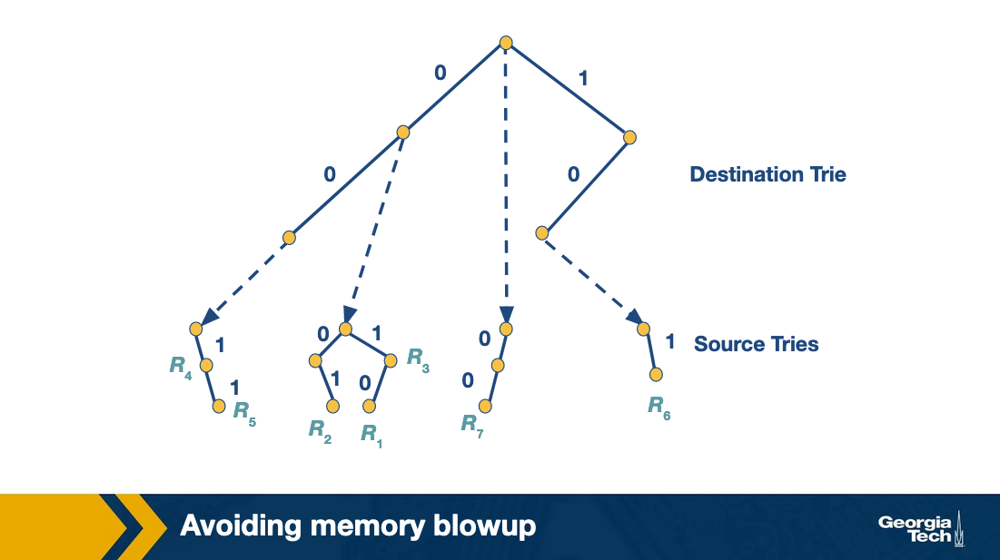
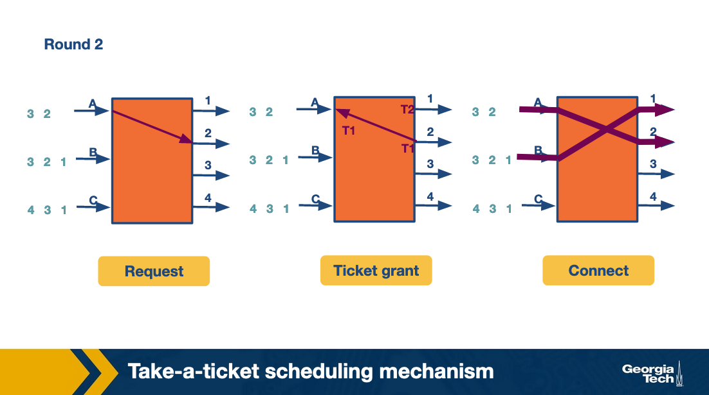

### Slide 1: Database at Router R (Why We Need Packet Classification?)

#### Explanation:
- **Overview of Packet Classification:** 
  Packet classification is critical in modern networks where traffic management is necessary beyond simple destination-based routing. As network demands grow, packet classification becomes essential for quality-of-service (QoS) and security. Standard packet forwarding using longest prefix matching is inadequate for more complex network management needs.

- **Definition of Packet Classification:** 
  Packet classification involves determining how to handle each packet based on various criteria like:
  - Source IP addresses
  - TCP flags
  - Traffic types (e.g., video, voice, etc.)

- **Examples:**
  - **Firewalls:** Routers use packet classification to block unwanted traffic or enforce security policies.
  - **Resource Reservation Protocols:** Protocols like DiffServ reserve bandwidth to guarantee QoS for certain traffic types.
  - **Traffic-Type Routing:** Time-sensitive applications, such as video streaming, benefit from routing tailored for specific traffic types.

#### Diagram:

The diagram shows a **router (R)** connecting two subnets (**Subnet X and Subnet Y**) through links (**L1 and L2**). Several sources/destinations (S1, S2, D, X, Y) are linked through the router.

- **Database at Router R:**
  The table at the bottom illustrates how router R uses packet classification rules:
  1. **From S1 to D (Video traffic):** Traffic from source S1 destined for D is video and is forwarded via link L1.
  2. **From S2 to any destination:** All traffic from S2 is dropped, perhaps indicating S2 is an experimental site.
  3. **From X to Y:** Traffic from subnet X to subnet Y reserves 50 Mbps, ensuring enough bandwidth is available.

#### Notes:
- The use of **forwarding directives** shows how different traffic types or sources/destinations are treated with distinct rules.
- **Bandwidth reservation** ensures that critical traffic from specific prefixes (e.g., X → Y) gets the necessary resources.

### Slide 2: Packet Classification: Simple Solutions

#### Explanation:
Before exploring complex algorithmic solutions to the packet classification problem, we can examine some basic approaches:

1. **Linear Search:**
   - **How it Works:** In a linear search, the firewall or router examines each rule in the database one by one to find the best match for the incoming packet.
   - **Advantages:** This approach is simple and works well when the number of rules is small.
   - **Disadvantages:** As the number of rules grows (e.g., thousands or tens of thousands of rules), this approach becomes very slow and inefficient. Searching through a large database can take a significant amount of time, especially for real-time traffic.

2. **Caching:**
   - **How it Works:** This method stores the results of previous classifications, so future queries for the same packets can be quickly retrieved from the cache.
   - **Problems:**
     - Even with a high cache-hit rate (80-90%), there will still be cache misses where the system needs to perform a linear search.
     - **Example Calculation:** 
       - Assume a cache lookup takes 100 nanoseconds.
       - A linear search of 10,000 rules takes 1 millisecond (1,000,000 nanoseconds).
       - With a 90% hit rate, the average time will be \( (0.9 \times 100 \, nsec) + (0.1 \times 1,000,000 \, nsec) = 0.1 \, msec \).
       - This average search time is still relatively slow for high-speed networks.

3. **Passing Labels (MPLS and DiffServ):**
   - **Multiprotocol Label Switching (MPLS):** 
     - MPLS is a technique used for traffic engineering. A label-switched path is established between two sites (A and B). Once the path is set up, packet classification is done at the start (site A), and an MPLS label is attached to the packets. Routers along the path use the label to forward packets without having to classify them again.
   - **DiffServ (Differentiated Services):** 
     - DiffServ applies packet classification at the network's edges. It then marks packets according to their required quality-of-service (QoS). Interior routers use these marks to prioritize traffic without needing to reclassify packets.

#### Notes:
- **Linear search** is the simplest but slowest method when handling large rule sets.
- **Caching** can improve performance but still involves searching when there are cache misses.
- **Label passing** (like in MPLS and DiffServ) is a more efficient approach that reduces the need for repeated classification in the network core.

These simple solutions provide baseline approaches but have limitations in high-performance or large-scale environments, making more advanced algorithms necessary.

### Slide 3: Fast Searching Using Set-Pruning Tries

#### Explanation:
This slide introduces **set-pruning tries** as a more efficient way to perform packet classification based on both **destination** and **source IP addresses**. Set-pruning tries help in optimizing search by pruning the rule set at each step, minimizing the number of rules that need to be checked.

1. **Two-Dimensional Rule Table:**
   - The rule table contains seven rules (**R₁ to R₇**), where each rule defines a destination and source prefix.
   - **Destination and Source Prefixes:** The prefixes in the table are represented in binary, with a `*` indicating a wildcard. This means any bit can match for the wildcard position.
     - Example: **R₁** matches any destination starting with `0*` and any source starting with `10*`.

#### Approach:

2. **Trie Structure for Destination and Source:**
   - **Destination Trie:** 
     - The classification process starts by constructing a **destination trie**, which organizes the destination prefixes (like `0*`, `00*`, etc.).
     - The trie branches based on the bits of the destination IP, pruning the rule set at each level.
   - **Source Tries:**
     - At the leaf node of the destination trie, corresponding **source tries** are constructed based on the source prefixes of rules associated with that destination.
     - Example: For destination prefix `00*`, rules R₄ and R₅ are relevant, so their source prefixes `1*` and `11*` form the source trie.

3. **Set-Pruning Process:**
   - The idea behind set-pruning tries is to narrow down the set of possible matching rules at each step:
     - First, the **destination prefix** of the incoming packet is matched in the **destination trie**.
     - Then, the relevant **source trie** is searched to find the best matching source prefix.
     - The system tracks the **longest prefix match** and selects the **lowest-cost rule** as the final match.

#### Challenge:
4. **Memory Explosion:**
   - A key issue with this approach is **memory overhead**. Since a source prefix can appear in multiple destination tries, it can be duplicated in multiple source tries, leading to **memory duplication**.
   - Example: For destination prefix `00*`, rules R₄ and R₅ have source prefixes `1*` and `11*`. However, since the destination prefix `0*` also matches rules R₁, R₂, R₃, and R₇, their source prefixes must also be included in the trie for `00*`. This duplication increases memory consumption.

---

### Images:

#### Image 1: **Example with 7 Destination-Source Rules**
- **Table of Rules (R₁ to R₇):**
  - This table shows seven rules that match packets based on both destination and source prefixes.
  - **Destination Prefixes:** Binary representations of destination IPs (e.g., `0*`, `00*`, `10*`).
  - **Source Prefixes:** Binary representations of source IPs (e.g., `10*`, `1*`, `11*`).
  - **Wildcard (`*`):** A `*` in the prefix means any bit can match at that position. This allows the rule to match a broader range of IP addresses.
  - **Example:** Rule **R₁** matches any destination starting with `0*` and any source starting with `10*`.

#### Image 2: **Packet Classification Trie**
- This diagram represents the **trie structure** used in set-pruning tries:
  - **Destination Trie:** 
    - The first step is matching the destination IP address in the **destination trie** (left side). The trie branches based on the bits in the destination IP, where each path represents either a `0` or `1` bit.
  - **Source Tries:**
    - Once the destination prefix is matched, the system moves to the **source trie** corresponding to that destination prefix (right side). Each source trie contains the relevant source prefixes from the rules table.
    - **Example:** If the destination prefix `00*` is matched, the source trie contains rules **R₄** and **R₅**, which have source prefixes `1*` and `11*`.

- **Pruning Process:**
  - The trie prunes the set of rules to those compatible with the destination and source prefixes. At each step, the system reduces the number of rules it needs to consider, improving search efficiency.
  
  - The algorithm finds the **longest matching prefix** for both the destination and source, and then selects the **lowest-cost rule**.

#### Key Takeaway:
- **Set-pruning tries** improve search performance by narrowing the search space, but they come with a significant memory overhead due to potential duplication of source prefixes across multiple destination tries.

### Slide 4: Reducing Memory Using Backtracking

#### Explanation:
In this slide, the **backtracking approach** is introduced as an alternative to **set-pruning tries**. This method reduces the memory overhead at the cost of increased lookup time.

1. **Set-Pruning Tries (Recap):**
   - The **set-pruning tries** approach improves search speed by duplicating certain source prefixes across multiple tries, which leads to significant **memory overhead**.

2. **Backtracking Approach:**
   - **Trade-Off:** Instead of increasing memory usage to improve search speed, the **backtracking approach** reduces memory requirements by increasing the time it takes to perform the lookup.
   
3. **How Backtracking Works:**
   - For a given **destination prefix (D)**, the backtracking approach points to a **single source trie** that stores only the rules with that exact destination prefix.
   - When an incoming packet is processed:
     1. The algorithm first searches the **destination trie** and finds the longest matching destination prefix (D).
     2. It then **backtracks** up the destination trie, checking the **source trie** associated with each **ancestor prefix** of D (i.e., shorter prefixes that lead to D).
     3. At each ancestor node, the system checks if it has a non-empty source trie.
   - This means that the algorithm performs a **backtracking search** to ensure that all possible matching rules are found.

4. **Memory Efficiency:**
   - **Key Benefit:** Each rule is stored **exactly once**, which significantly reduces the memory requirements compared to set-pruning tries, where duplication of rules was a major issue.
   - **Example:** If a rule applies to a specific destination prefix (e.g., `D = 00*`), it is only stored in the source trie corresponding to that prefix and not duplicated across multiple tries.

5. **Lookup Cost:**
   - **Disadvantage:** The lookup process for backtracking is slower because the algorithm needs to search not only the longest matching destination prefix but also **all ancestor prefixes** in the destination trie.
   - This **extra search time** makes backtracking slower than set-pruning tries, but the memory savings can be substantial, making it a better approach for systems with constrained memory resources.

#### Key Takeaway:
- **Backtracking** provides a memory-efficient alternative to set-pruning tries by eliminating the need to duplicate source prefixes. However, this comes at the cost of increased lookup time since the algorithm has to check multiple source tries for each ancestor destination prefix.

### Slide 5: Avoiding Memory Blowup with Grid of Tries

#### Explanation:
This slide discusses the **Grid of Tries** approach, which aims to strike a balance between the high memory usage of the set-pruning tries and the high lookup time of backtracking.

1. **Challenges of Set-Pruning and Backtracking:**
   - **Set-Pruning:** This method optimizes search time by duplicating source tries across multiple destination tries, but it incurs a significant **memory overhead**.
   - **Backtracking:** While backtracking minimizes memory by not duplicating tries, it suffers from high **search time** due to the need to backtrack through ancestor nodes.

2. **Grid of Tries Approach:**
   - The **Grid of Tries** aims to reduce the time wasted in backtracking by using **precomputed switch pointers**.
   - **Switch Pointers:** These pointers help the algorithm skip over unnecessary tries when a match fails, thereby avoiding the need to backtrack up the destination trie.
   
3. **How It Works:**
   - The search starts by traversing the **destination trie** to find the longest matching destination prefix (e.g., `D = 00`).
   - The search then moves to the **source trie** associated with the destination prefix.
   - If the search fails in the source trie, instead of backtracking, the algorithm uses a **precomputed switch pointer** to jump directly to the next potential match in a different source trie.
   
4. **Example Scenario:**
   - Suppose we are searching for a packet with a **destination address of 001** and a **source address of 001**.
   - We start by matching the destination address in the destination trie, where `D = 00` is the best match.
   - If the search fails in the source trie for `D = 00`, the **switch pointer** directs us to the next possible source trie (labeled `x` in the diagram).
   - If the match fails again, another switch pointer directs the search to node `y`, where the search terminates.

5. **Advantages:**
   - **Precomputed Shortcuts:** The switch pointers allow the algorithm to avoid redundant source trie searches by skipping over irrelevant nodes. This significantly reduces search time.
   - **Efficient Traversal:** The algorithm efficiently keeps track of the current best source match, while skipping over source tries that have shorter or less relevant source fields.

#### Image 1: **Avoiding Memory Blowup (Grid of Tries)**
- The image shows the **destination trie** on the right and the associated **source tries** on the left.
- The destination trie branches based on the destination prefix (e.g., `0` or `1`), and each leaf points to a set of source tries.
- The **source tries** are pruned versions of the source prefixes, associated with the respective destination trie nodes.

#### Image 2: **Switch Pointers Improve Search Cost**
- The second image highlights the use of **switch pointers** (shown as dashed purple lines).
- These pointers provide shortcuts when the search fails in a source trie, allowing the algorithm to quickly jump to the next possible source trie.
- This avoids the need for the algorithm to backtrack to the destination trie and re-traverse source tries unnecessarily.

#### Key Takeaway:
- The **Grid of Tries** offers a middle ground between **set-pruning** and **backtracking** by precomputing **switch pointers** to speed up the search process without incurring excessive memory costs.

### Slide 6: Take-a-Ticket Scheduling Mechanism

#### Explanation:

This slide introduces a **Take-a-Ticket Scheduling Mechanism**, which is used to schedule input lines (or requests) to output lines (or resources). The algorithm works in multiple rounds and allows inputs to connect with outputs based on a ticket-granting system. The goal is to ensure that all inputs get served fairly and efficiently while trying to avoid blocking issues like **Head-of-Line (HOL) blocking**.

1. **Basic Structure:**
   - **N x N crossbar switch:** 
     - The switch connects multiple input lines (like A, B, C) to output lines (1, 2, 3, 4). Each input line wants to send packets to different output lines.
     - The crossbar allows only one input to connect with one output at a time, and the goal is to schedule these connections efficiently.

#### Round 1:

2. **Request Phase:**
   - Each input line (A, B, C) sends a **request** to the output lines they want to connect to.
     - Example: In this case, input A requests tickets for outputs 3, 2, and 1 (in that order), input B also requests for 3, 2, and 1, while input C requests tickets for 4, 3, and 1.
  
3. **Ticket Grant Phase:**
   - Output lines receive the requests and issue tickets back to the inputs based on availability.
     - Example: Output 1 issues tickets **T1** to input A, **T2** to input B, and **T3** to input C.

4. **Connect Phase:**
   - Input A uses its ticket **T1** to connect to output line 1, and the connection is made for data transmission.

#### Round 2:

5. **Request Phase:**
   - After completing the first connection, input A makes a request for its next output line (output 2 in this case). Input B continues its requests as well.
  
6. **Ticket Grant Phase:**
   - The ticket-granting process continues, and tickets **T1** and **T2** are issued to input A and B for their next connection requests.
  
7. **Connect Phase:**
   - Input B now uses its previous ticket **T2** to connect to output line 1, while input A connects to output line 2.

#### Round 3:

8. **Request Phase:**
   - Inputs A, B, and C continue their requests for output lines.
  
9. **Ticket Grant Phase:**
   - Tickets are granted for the next set of connections.

10. **Connect Phase:**
    - Inputs A and B connect to output lines 3 and 2 respectively, while input C connects to output line 1.

#### Image 1, 2, 3: **Take-a-Ticket Scheduling Mechanism - Rounds 1 to 3**
   - These images show the three rounds of the take-a-ticket scheduling process.
   - Each image follows the flow from **Request**, to **Ticket Grant**, to **Connect** phases as inputs (A, B, C) make connections with outputs (1, 2, 3, 4).

#### Head-of-Line Blocking:

11. **Head-of-Line (HOL) Blocking:**
    - The final image demonstrates **Head-of-Line blocking**, a problem where the entire queue of an input line is blocked by the input at the front of the queue.
    - In this case, inputs B and C are delayed because input A takes priority to connect with output line 1.
    - This results in inefficient use of the crossbar switch, as the entire queue waits for the first connection to be completed.

#### Image 4: **Head-of-Line Blocking**
   - The grid demonstrates how input A takes priority, causing input B and C to wait. Over time, this leads to gaps (empty spots) in the schedule where no packets are sent, reducing overall efficiency.

#### Key Takeaways:
- The **Take-a-Ticket** mechanism allows for fair scheduling of connections but can suffer from **HOL blocking**, where input queues are delayed due to the blocking of the first input.
- The goal is to maximize parallel connections while avoiding delays that reduce efficiency.
