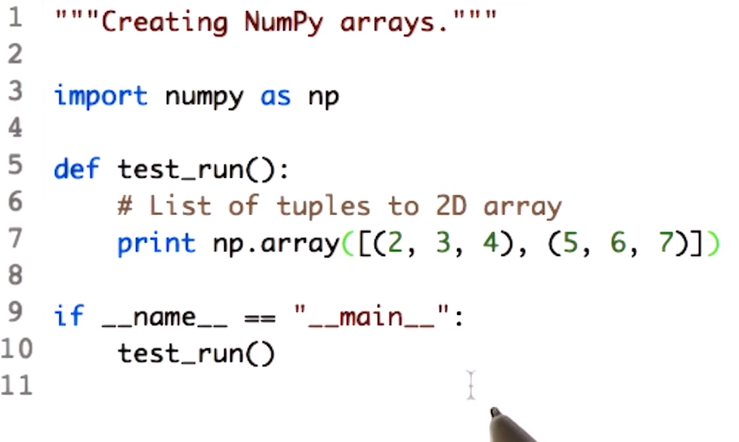

#01-03 The power of NumPy

## 1. What is NumPy?

1. **Introduction to NumPy**: NumPy is introduced as a numerical library for Python.
2. **Speed**: It's highlighted that NumPy is fast because it wraps around C and Fortran code.

3. **Focus on Matrices**: NumPy focuses on matrices, which are called arrays in NumPy.

4. **Similarity to MATLAB**: The syntax of NumPy is mentioned to be similar to MATLAB, making it familiar to those who have used MATLAB before.

5. **Usage in Financial Research**: NumPy is noted as one of the important reasons people use Python for financial research.

## 2.Relationship to Pandas

1. **Introduction to NumPy and Pandas Relationship**: The instructor begins by addressing the relationship between NumPy and Pandas.

2. **NumPy as a Wrapper**: NumPy is described as a wrapper for numerical libraries.

3. **Pandas as a Wrapper for NumPy**: It's explained that Pandas, in turn, acts as a wrapper for NumPy.

4. **Data Frame Structure**: The structure of a traditional data frame with columns (symbols) and rows (dates) is discussed.

5. **Data Frame as a Wrapper Around ndarray**: The data frame is explained as essentially being a wrapper around a NumPy ndarray.

6. **Direct Access to ndarray**: It's mentioned that you can access the underlying ndarray directly if needed.

7. **Treating Data Frame Like ndarray**: While you can treat a data frame like a NumPy ndarray, it's noted that data frames offer additional functionality.

8. **Assumption for the Lesson**: The lesson will assume working with ndarrays.

9. **Functionality of Data Frames**: Data frames offer many additional routines and statistical functions beyond ndarrays.

## 3. Notes on Notation

1. **Introduction to ndarray Access**: The instructor introduces the concept of accessing elements within ndarrays.

2. **Syntax Familiarity**: The syntax for accessing elements is described, with the reminder that NumPy starts indexing at 0.

3. **Basic Cell Access**: Examples of accessing specific cells within the ndarray are provided.

4. **Introduction to Slicing**: The tutorial introduces slicing using the colon ( : ) symbol to indicate ranges.

5. **Slicing Rows and Columns**: Examples of slicing both rows and columns are shown using the colon syntax.

6. **End Index in Slicing**: It's noted that the end index in slicing is one past the desired index.

7. **Using Colon Alone**: The instructor explains that using a colon alone indicates selecting all elements along that axis.

8. **Advanced Slicing**: Examples of more complex slicing are provided, including selecting the last row or column using negative indices.

9. **Quiz Announcement**: The tutorial concludes by announcing a quiz to test the viewer's understanding of the new syntax introduced.

## 4. Replace a slice Solution

1. **Correct Answer Explanation**: The instructor explains why a particular option is the correct answer out of four options provided.
2. **Identification of Correct Rows and Columns**: The instructor points out the correct rows and columns based on the provided syntax.

3. **Introduction of New Syntax (-2)**: A new syntax is introduced where `-2` is used to indicate the second from last row.

4. **Explanation of Colon Syntax**: The instructor explains that a colon `:` with nothing after it means to go all the way to the end of the range.

5. **Clarification of Correct Answer**: The instructor reiterates why the chosen option is the correct answer based on the given explanations.

6. **Transition to Another Speaker**: The instructor announces the transition to another speaker, Dev, who will demonstrate how to perform the described tasks directly using Python syntax.

## 5. Creating NumPy arrays

1. **Introduction to Accessing NumPy Arrays in Pandas**: The tutorial begins by explaining how to access the underlying NumPy array within a Pandas DataFrame using the `values` property.

2. **Creating NumPy Arrays from Scratch**: The tutorial then moves on to explain how to create NumPy arrays from scratch.

3. **Ways to Create an Array**: It's mentioned that there are multiple ways to create an array.

4. **Creating a 1D Array from Known Values**: The tutorial starts by showing how to create a one-dimensional array from known values using the `np.array` function.

5. **Explanation of n-dimensional Arrays**: The concept of n-dimensional arrays (ndarrays) is introduced.

6. **Creation of Arrays from Python Lists**: Demonstrates creating an array from a Python list using the `np.array` function.

7. **Input Types for `np.array` Function**: It's noted that the `np.array` function can take various types of inputs, such as lists, templates, or other sequences.

8. **Importing NumPy and Renaming**: The tutorial shows importing NumPy and renaming it as `np` for convenience.

9. **Creating a 2D Array**: Explains how to create a two-dimensional array by passing a sequence of sequences to the `np.array` function.

10. **Printing the 2D Array**: Shows the result of creating the 2D array, demonstrating that it has two rows and three columns.

11. **Usefulness of the Function**: Explains that the function is useful for converting lists of sequences into NumPy arrays.

