# 01-04 Statistical analysis of time series

## Are you ready

1. **Professor:** "Are you ready, Dave?"
2. **Dave:** "Ready for what, Professor?"
3. **Professor:** "We're going to start some serious number crunching now."
4. **Dave:** "What do you mean?"
5. **Professor:** "In this lesson, we're going to unleash the power of Python."
6. **Professor:** "We're going to show folks some tools that enable them to calculate all kinds of important statistics on time series data."
7. **Dave:** "What are we waiting for?"
8. **Professor:** "Let's go."

## Global statistics

1. **Introduction to Global Statistics:**

   - The lesson introduces the concept of computing various kinds of statistics on time series data, starting with global statistics.

2. **Example Data Frame:**

   - Reference is made to a data frame named DF1 with columns for SPY, XOM, Google, and Gold. This data frame seems to contain financial data.

3. **Computation of Mean:**

   - It's explained that the mean of each column can be computed easily using a statement provided.

4. **Data Frame Functionality:**

   - The data frame is described as augmenting NumPy and providing additional functionality beyond a basic array.

5. **Available Functions:**

   - Various statistical functions available for use with data frames are mentioned, including mean, median, standard deviation, sum, prod (product), and mode.

6. **Abundance of Statistics:**

   - It's stated that there are at least 33 global statistics that can be computed in this way, with new ones being added over time.

7. **Transition to Demonstrating Code:**
   - The presentation concludes by mentioning that Dave will demonstrate how to perform these computations in code.
     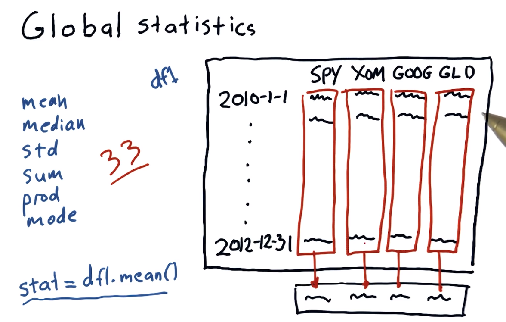

## Compute global statistics

1. **Introduction to Coding Example:**

   - The segment starts with the presenter mentioning they will now demonstrate the concepts explained by the professor through coding.

2. **Defining Symbols List and Building DataFrame:**

   - A list of symbols (presumably representing stocks) is defined, including symbols like SPY, XOM, GOOG, and GLD.
   - A DataFrame named `df` is created using these symbols, similar to previous lessons.

3. **Computing Mean:**

   - The mean of stock prices for each symbol is computed using `dataframe.mean()`.
   - It's emphasized that this single line of code computes the mean for all stocks.

4. **Output Verification:**

   - The output of the mean computation is checked, noting how Pandas properly labels the mean for each symbol.

5. **Graphical Representation:**

   - A graph showing symbols and their corresponding data is mentioned.

6. **Computing Median and Standard Deviation:**

   - Similar to computing the mean, median and standard deviation are computed using `dataframe.median()` and `dataframe.std()` respectively.

7. **Explanation of Mean, Median, and Standard Deviation:**

   - The difference between mean and median is explained.
   - Standard deviation is described mathematically as the square root of variance and intuitively as a measure of deviation from the central value, which is the mean.

8. **Conclusion:**
   - The segment concludes by emphasizing the importance of understanding statistics such as mean, median, and standard deviation in analyzing time series data, especially in assessing the variability of stock prices over time.
     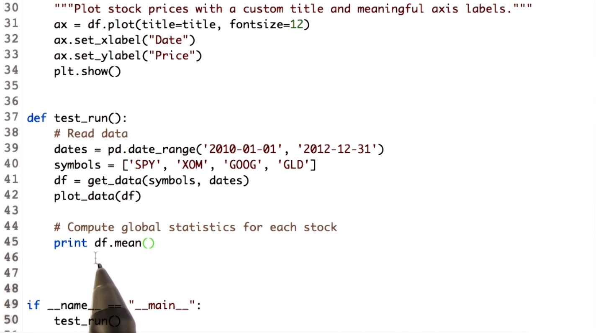
     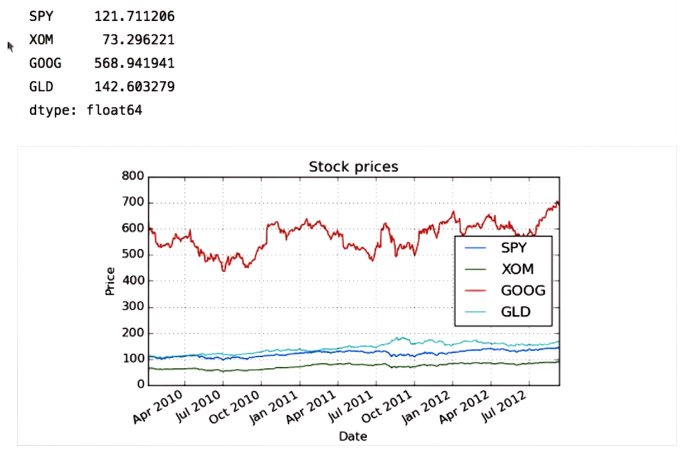

## Rolling statistics

1. **Introduction to Rolling Statistics:**

   - Rolling statistics are described as a new type of statistic involving snapshots over windows rather than across the entire period.
   - They offer a different perspective compared to global statistics.

2. **Explanation of Rolling Mean:**

   - Rolling mean, using a 20-day rolling mean as an example, calculates the mean within a moving window of data.
   - A window moves forward each day, computing the mean of the data within that window.

3. **Characteristics of Rolling Mean:**

   - Rolling mean is depicted as a smoothed and lagged line, reflecting an average of data over the specified window.
   - It contrasts with day-to-day values but provides insights into overall trends.

4. **Application in Technical Analysis:**

   - Rolling mean serves as a technical indicator, known as a simple moving average, in financial analysis.
   - Analysts monitor instances where the price crosses the rolling average, which may signal potential trading opportunities.
   - A hypothesis suggests that significant deviations from the rolling mean could lead to a return to the mean, influencing trading decisions.

5. **Challenges and Considerations:**

   - Determining the significance of deviations from the rolling mean poses a challenge for analysts.
   - It's crucial to assess when deviations warrant attention in trading strategies.

     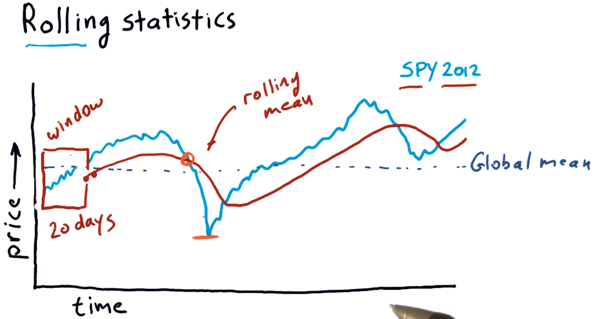

## Which statistic to use

Which statistic could be used to determine when the price has diverged significantly from the mean.
The answer is rolling standard deviation
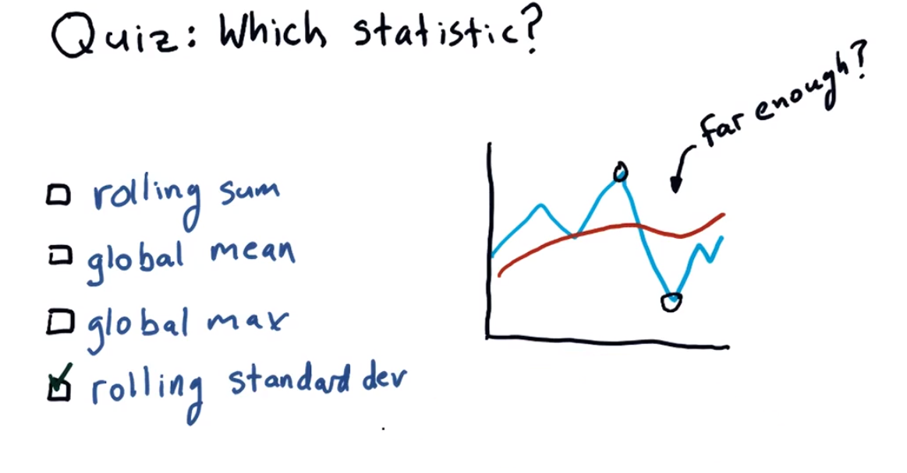

## Bollinger Bands

1. **Introduction to Bollinger Bands:**

   - Bollinger Bands are introduced as a method for determining significant deviations from a rolling mean in stock prices.
   - John Bollinger developed this method to measure recent volatility in stock prices.

2. **Construction of Bollinger Bands:**

   - Bollinger Bands consist of two bands: one placed 2 standard deviations above the rolling mean and the other 2 standard deviations below it.
   - The bands are designed to encapsulate most of the price action within them, indicating potential trading opportunities when the price deviates beyond them.

3. **Interpreting Bollinger Bands:**

   - When the price crosses above the upper band or below the lower band, it may signal a potential trading opportunity.
   - Specifically, a drop below the lower band followed by a move back above it could signal a buying opportunity, while a rise above the upper band followed by a move back below it could signal a selling opportunity.

4. **Application and Caution:**

   - The transcript acknowledges the potential effectiveness of Bollinger Bands but advises caution, as trading based solely on this indicator may not always yield positive results.
   - It's emphasized that Bollinger Bands are just one example of a technical indicator and should be used in conjunction with other analysis techniques.

5. **Next Steps:**
   - The tutorial will show how to implement Bollinger Bands, compute a rolling mean, and chart the data.
   - It reiterates that while technical analysis can be powerful, it's important to approach it with caution and to consider additional concepts and approaches in later discussions.
     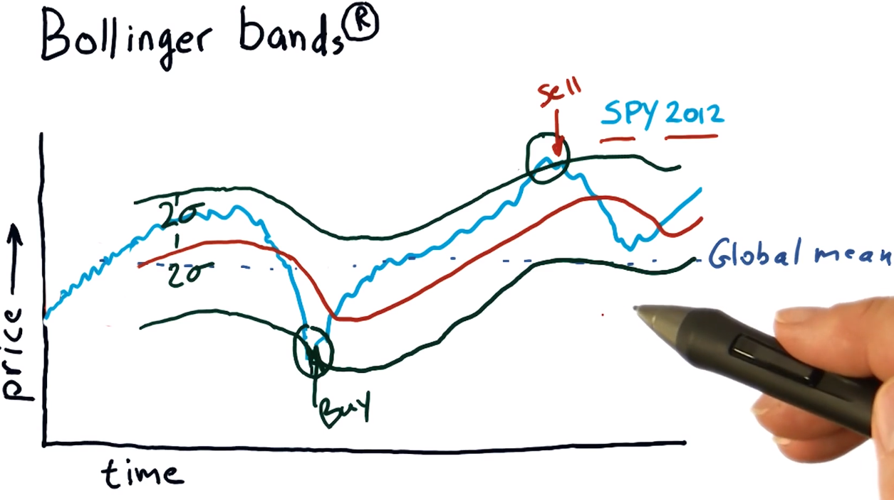

## Computing rolling statistics

1. **Introduction to Rolling Mean:**

   - Rolling mean is explained as a statistical method for smoothing out fluctuations in time series data by calculating the mean of a sliding window of observations.

2. **Using pandas for Rolling Mean:**

   - The pandas library offers a `rolling` function to compute rolling statistics like the rolling mean.
   - It's clarified that `rolling_mean` is not a DataFrame method but a function within the pandas library itself.

3. **Computing Rolling Mean:**

   - The SPY data for the year 2012 is obtained and plotted using matplotlib.
   - The `rolling` function from pandas is then used to compute the rolling mean.
   - Parameters passed to the `rolling` function include the window size (here, 20 days) and the DataFrame containing SPY values.

4. **Visualizing Rolling Mean:**

   - The resulting rolling mean series is plotted on the same graph as the original SPY data.
   - Matplotlib's `plot` function is used to plot the rolling mean, and the existing axis object is passed to add it to the existing plot.
   - A label is specified for the rolling mean to create a plot legend.

5. **Finalizing the Plot:**

   - Additional elements are added to the plot, including a legend and axis labels for clarity.

6. **Observations:**
   - It's noted that the rolling mean has missing initial values due to the window period (20 days) for computation.
   - The behavior of the rolling mean is observed to follow the movement of the SPY prices but with less volatility.

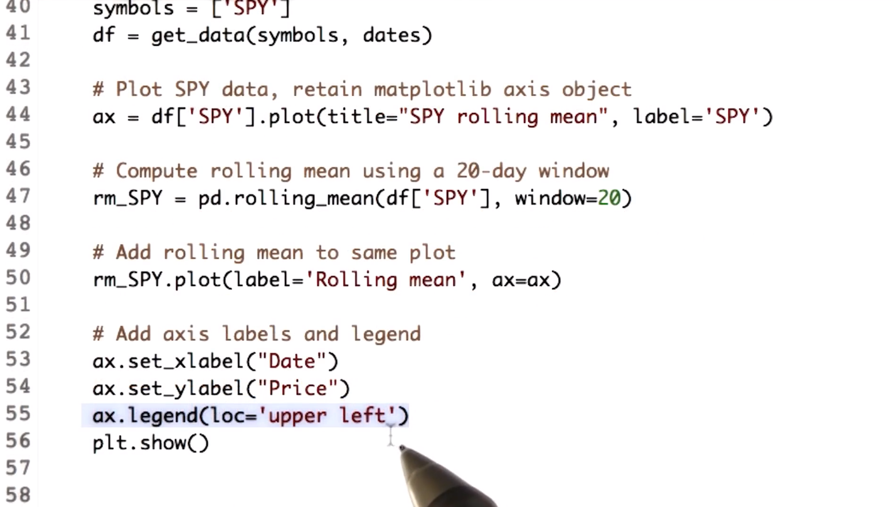
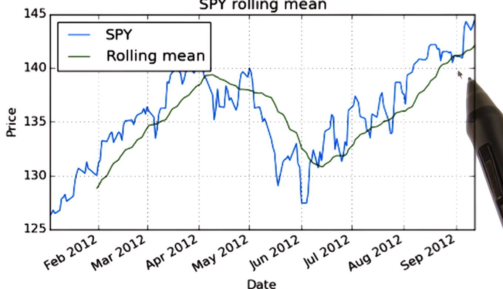

## Calculate Bollinger Bands

1. **Calculating Rolling Standard Deviation:**

   - Similar to computing the rolling mean, the rolling standard deviation is computed using the `rolling_std` function provided by pandas.
   - The values and the window size are passed as parameters to the function.

2. **Deriving Upper and Lower Bands:**

   - The upper band of the Bollinger Bands is calculated by adding two times the rolling standard deviation to the rolling mean.
   - Similarly, the lower band is calculated by subtracting two times the rolling standard deviation from the rolling mean.

3. **Mathematical Operations:**

   - Despite the rolling mean and standard deviation being in the form of series, arithmetic operations can still be performed as the operations are done element-wise, similar to numpy arrays.

4. **Visualizing Bollinger Bands:**
   - After computing the Bollinger Bands, the results can be visualized to observe selling and buying points.
   - It's suggested to experiment with different window sizes and deviation levels to observe changes in the bands.

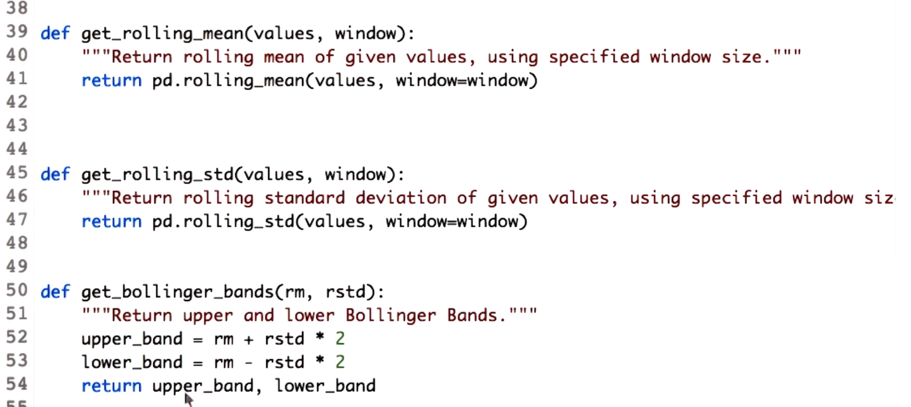
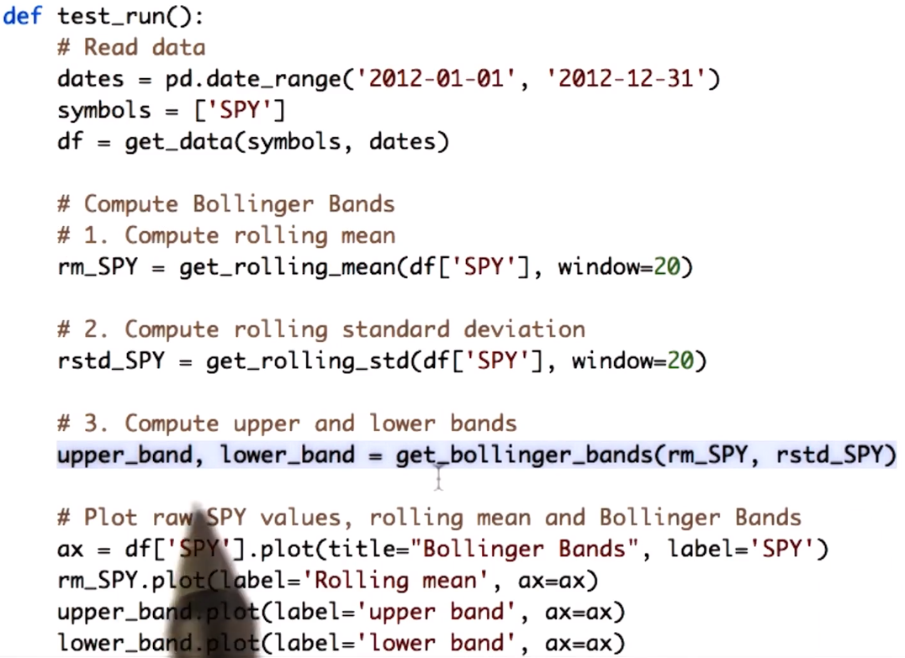
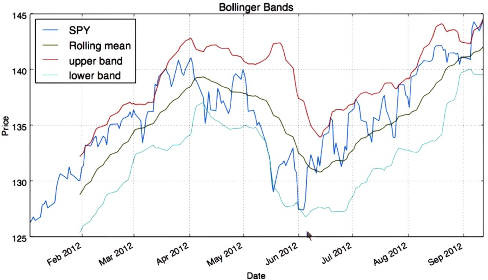

## Daily returns

1. **Definition and Importance:**

   - Daily returns represent the percentage change in price of a financial asset from one day to the next.
   - They are crucial statistics used in financial analysis to gauge the performance and volatility of assets.

2. **Calculation:**

   - Daily returns are computed using a simple formula: Today's stock price divided by yesterday's stock price, minus one.
   - For example, if the price increased from $100 yesterday to $110 today, the daily return would be (110/100) - 1 = 0.1 or 10%.

3. **Avoiding Loops:**

   - It's emphasized not to use loops to calculate daily returns for each day individually.
   - Instead, NumPy syntax is recommended, allowing for computation in a single statement without the need for loops.

4. **Visualization:**

   - Daily returns can be visualized on a chart, typically ranging from -10% to +10%.
   - Positive returns are represented above the zero line, while negative returns are below it.
   - The line representing daily returns generally fluctuates around zero, reflecting the volatility of prices.

5. **Comparative Analysis:**

   - Comparing daily returns between different assets, such as comparing Exxon Mobil (XOM) to the S&P 500 index, can provide insights into their relative performance.
   - Differences in daily returns between assets can reveal correlations or divergences in their movements.

6. **Future Lessons:**

   - Future lessons will delve into how daily returns and other statistics can reveal valuable information about asset performance and correlations.

7. **Python Implementation:**

   - The explanation concludes by mentioning that Python code will be demonstrated to calculate daily return values, likely by using libraries such as NumPy and pandas.

   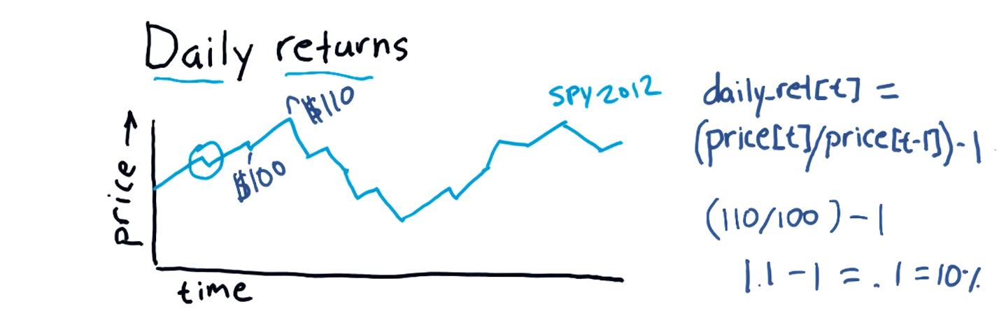
   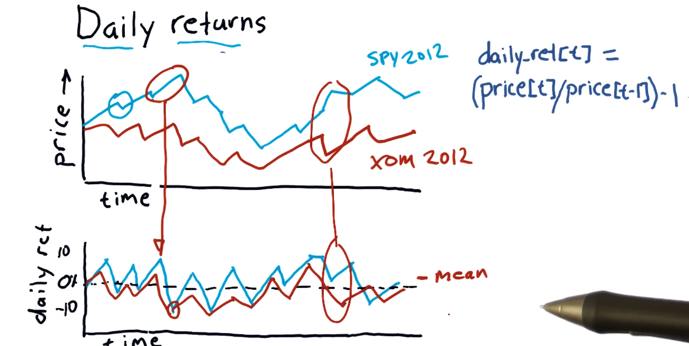

## Compute daily returns

1. **Copying Dataframe:**

   - A copy of the original dataframe is made to store the computed values of daily returns.
   - This is done using the `Dataframe.copy` function.

2. **Computing Daily Returns:**

   - Daily returns are calculated by dividing the stock price at each day (`T`) by the price at the previous day (`T-1`), and then subtracting 1.
   - This calculation is performed for all dates except the first one, as there is no previous day's price for the first date.
   - To achieve this, rows of the dataframe are shifted by one using `df[1:]` and `df[:-1]`.
   - The first row is set to zeros since there is no previous day's price for the first date.

3. **Accessing Numpy Array:**

   - The `.values` attribute of one of the intermediate dataframes is used to access the underlying numpy array.
   - This is necessary because Pandas matches rows based on index when performing element-wise arithmetic operations, and using the numpy array ensures correct alignment.

4. **Visualization:**

   - The computed daily returns are compared to the original stock prices.
   - While the original prices of different stocks may vary significantly, the daily returns are normalized and show up at a comparable scale.
   - Each daily return value indicates a positive or negative fraction related to the previous day's value.
   - It's observed that the movement of one stock closely matches the ups and downs of another stock.

5. **Alternative Method using Pandas Shift Function:**
   - Another way to compute daily returns is demonstrated using the Pandas `shift` function directly on the dataframe.
   - Similar to the previous method, the values at the first row are replaced with zeros to handle the absence of previous day's prices.
     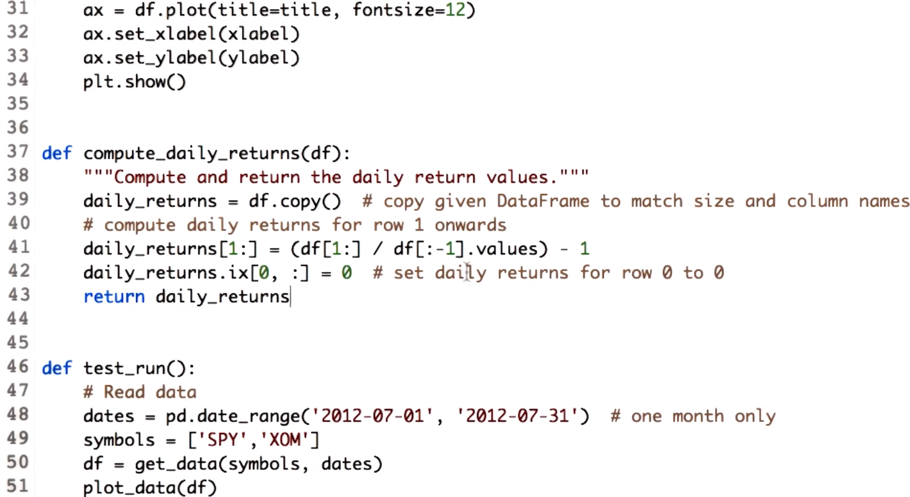
     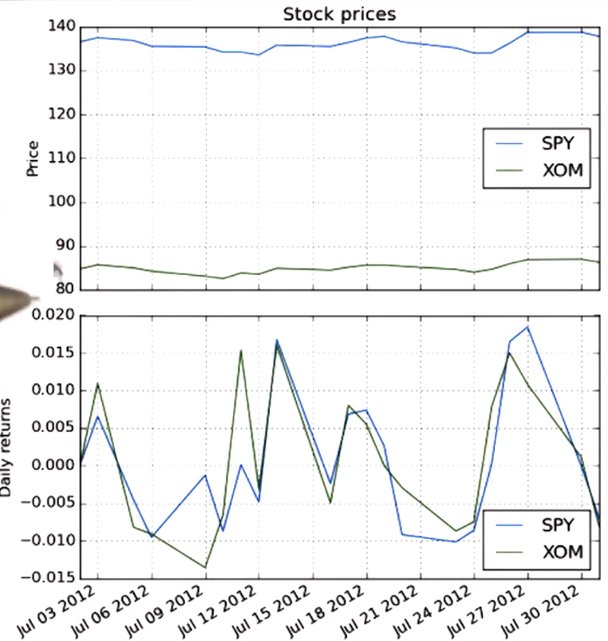
     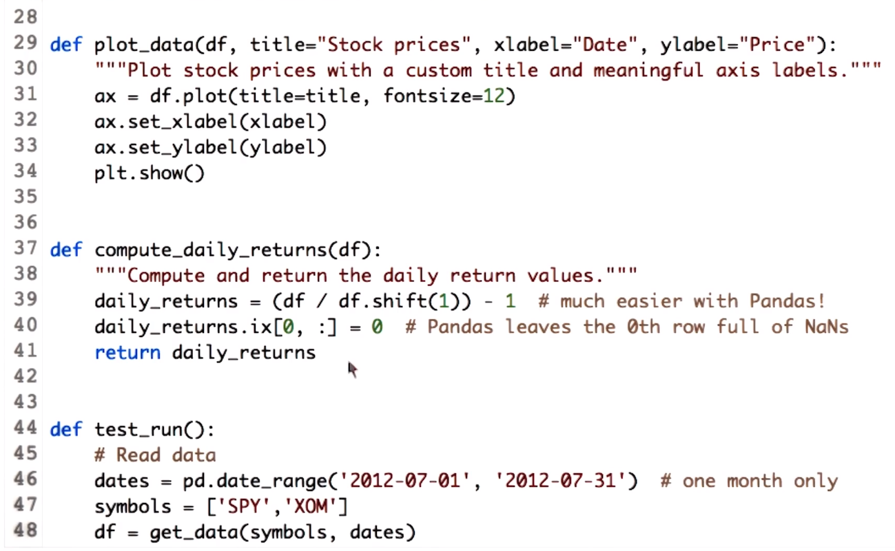

## Cumulative returns

1. **Definition of Cumulative Returns:**

   - Cumulative returns represent the total percentage change in the value of an investment over a certain period.
   - It is the measure of the entire gain or loss experienced by an investment over time, expressed as a percentage of the initial investment.

2. **Calculation of Cumulative Returns:**

   - The cumulative return for a particular day `t` is computed by dividing the price at day `t` by the price at the beginning and subtracting 1.
   - The cumulative return for the whole period is calculated by dividing the final price by the initial price and subtracting 1.
   - For example, if the initial price is `$125` and the final price is $142, then the cumulative return is calculated as (142/125) - 1 = 0.136, or 13.6%.

3. **Plotting Cumulative Returns:**

   - Cumulative returns can be calculated and plotted similar to daily returns.
   - The plot displays the cumulative return over time, instead of the daily return.
   - The shape of the cumulative return plot is similar to the price chart, but it is normalized.
   - The normalization equation used for cumulative returns is exactly the same as the equation used for normalization in other contexts.

4. **Demonstration:**

   - The process of calculating and plotting cumulative returns is not explicitly demonstrated in this lesson.
   - Learners are encouraged to apply the knowledge gained from calculating daily returns to compute and plot cumulative returns.

     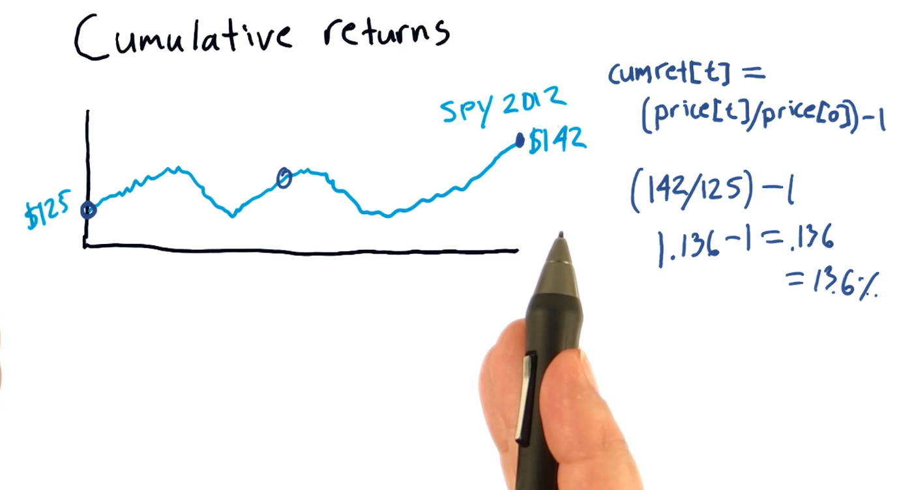
     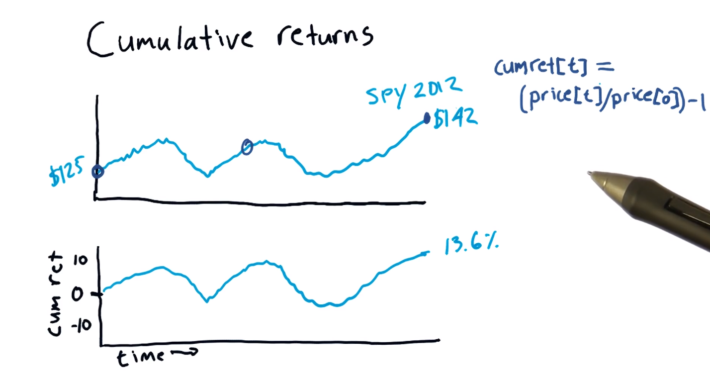
