# 01-06 Histograms and scatter plots

## Histograms and scatterplots

1. **Emphasis on Daily Returns**: Daily returns are highlighted as being crucial for consideration when analyzing market statistics, indicating their significance in understanding market dynamics.

2. **Limitation of Single Stock Analysis**: The text suggests that analyzing daily returns for a single stock alone may not offer substantial insights. This implies that focusing solely on one stock's performance might not provide a comprehensive view of the market.

3. **Comparative Analysis Importance**: It suggests that one of the most informative approaches to understanding daily returns is through comparison, particularly comparing the returns of one stock with another. This implies that comparative analysis can offer valuable insights into relative performance, market trends, and broader market behavior.

## A closer look at daily returns

1. **Importance of Daily Returns**:
   - Daily returns are highlighted as a fundamental aspect of financial analysis.
   - They serve as the basis for analyzing market statistics.

2. **Construction of Daily Returns**:
   - Daily returns are constructed from price time series data.
   - Each data point in the daily return chart represents the percentage change in price from one day to the next.

3. **Challenges with Visual Analysis**:
   - Simply visually inspecting daily return data day by day may not yield meaningful insights.
   - More sophisticated analysis techniques are needed to extract valuable information.

4. **Introduction to Histograms**:
   - Histograms are introduced as a tool for analyzing and visualizing daily return data.
   - They are described as a type of bar chart where occurrences of each value or range of values are plotted against the value itself.

5. **How Histograms Work**:
   - The process of creating histograms involves dividing the data range into bins and counting occurrences within each bin.
   - Each bin corresponds to a range of values, and the height of the bars represents the frequency of occurrences within that range.

6. **Interpreting Histograms**:
   - The shape of the histogram provides insights into the distribution of data.
   - By observing the overall shape, analysts can discern patterns and characteristics of the data distribution, such as its central tendency, spread, and skewness.
  
    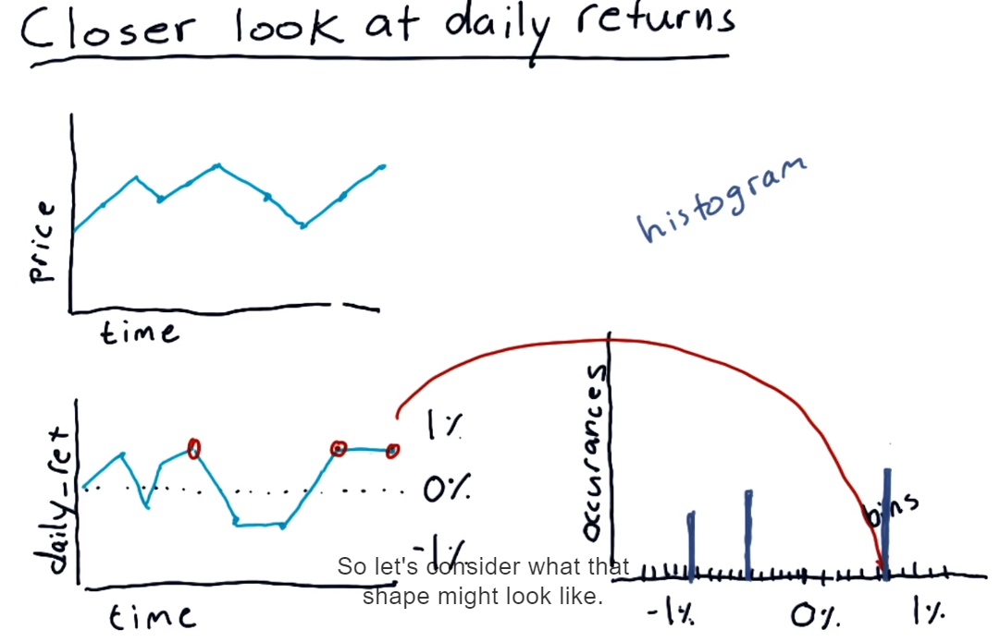

## What would it look like
Related to histograms and the shape of the distribution of daily returns for the S&P 500 index.
The distribution of daily returns in the stock market often follows a bell curve pattern, aligning with natural distributions observed in various phenomena.
 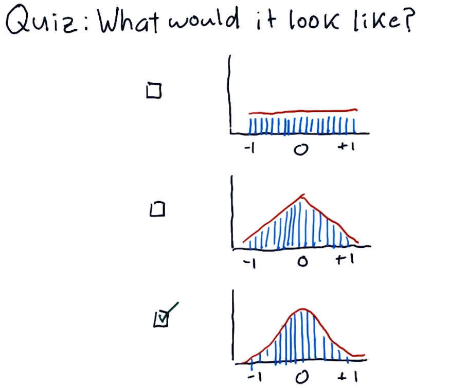

## Histogram of daily returns

1. **Characterizing Histograms**:
   - After constructing a histogram, there are several statistics that can be used to characterize it.

2. **Interest in Mean and Standard Deviation**:
   - Mean and standard deviation are mentioned as commonly used statistics. Standard deviation is described as a measure of how much individual measurements deviate from the mean.

3. **Introduction to Kurtosis**:
   - Kurtosis is introduced as another important measure derived from a histogram.
   - It's explained that kurtosis tells us about the tails of the distribution, with a reference to its etymology from the Greek word meaning curved or arching.

4. **Interpreting Kurtosis**:
   - The concept of kurtosis is further explained by comparing the distribution to a Gaussian (normal) distribution.
   - Positive kurtosis indicates "fat tails," meaning there are more occurrences in the tails than expected in a normal distribution.
   - Negative kurtosis indicates "skinny tails," meaning there are fewer occurrences in the tails than expected in a normal distribution.

5. **Summary and Application**:
   - The text emphasizes the importance of plotting histograms and deriving statistics such as mean, standard deviation, and kurtosis.
   - It also mentions using Python for making plots and calculating these statistics.
  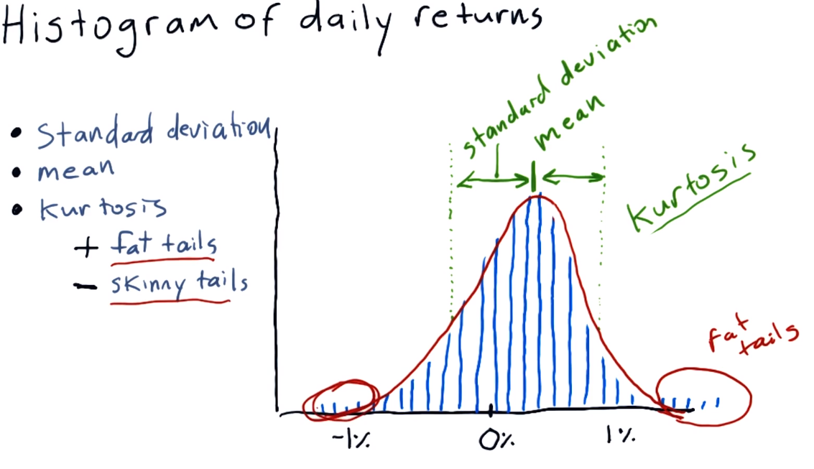

## How to plot a histogram

1. **Introduction to Programming and Magic**:
   - The text starts with a reference to a post on Humans of New York, where someone described programming as magic, enabling creation with words.
   - It encourages to create their own "magic" by making histograms.

2. **Ingredients for Histogram**:
   - Stock prices for the S&P 500 (SPY) for a period of three years are obtained.
   - Daily returns are calculated based on the stock prices.

3. **Plotting the Data**:
   - The daily returns are plotted using a plot function.
   - Graphs showing the prices of the SPY stock and the corresponding daily returns are displayed.

4. **Histogram Creation**:
   - The text mentions creating a histogram with just one line of code, indicating simplicity and efficiency in Python programming.
   - It explains the concept of bins in histograms and mentions that the default number of bins is 10.
   - Flexibility in Python allows changing the number of bins using the `bins` parameter.

5. **Observations from the Histogram**:
   - The histogram is adjusted to have 20 bins instead of the default 10.
   - Changes in the histogram, such as reduced width of bars and increased number of bars, are noted.
   - Specific observations from the histogram, such as the number of values near 0, are mentioned.

6. **Next Steps**:
   - The text hints at further computations and analysis to be performed on the daily returns.
    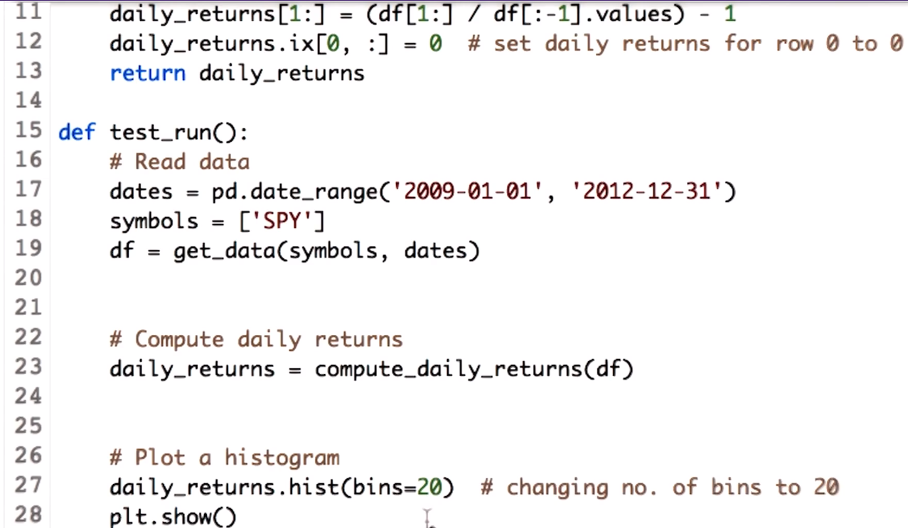
    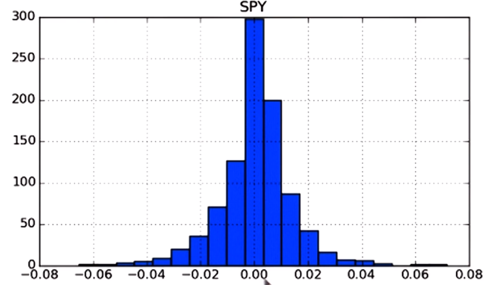

## Computing histogram statistics

1. **Mean and Standard Deviation Calculation**:
   - The text starts by calling the `mean` and `std` functions on a DataFrame to calculate the mean and standard deviation of daily returns for the SPY stock.

2. **Adding Mean Line to the Plot**:
   - It introduces the `axvline` function from Matplotlib to add a vertical line representing the mean to the histogram plot.
   - Parameters like color, linestyle, and linewidth are adjusted for aesthetic purposes.

3. **Adding Standard Deviation Lines to the Plot**:
   - Similar to the mean line, standard deviation lines are added using `axvline`.
   - The standard deviation lines are plotted on both sides of the mean by plotting them twice, once with a positive value and once with a negative value.
   - Again, parameters like color are adjusted for appearance.

4. **Confirmation of Plotting**:
   - The text confirms that mean and standard deviation lines have been successfully added to the histogram plot.

5. **Introduction to Kurtosis**:
   - It mentions that the DataFrame likely has a function to calculate kurtosis.
   - Positive kurtosis for the SPY stock is noted, indicating fat tails in the distribution.

6. **Additional Information**:
   - A brief mention is made about obtaining bin counts using `numpy.histogram`.
   - Reference to instructor's notes is provided for more details.

7. **Handover to Professor**:
   - The text concludes by handing over to the professor, possibly indicating a transition in the tutorial or presentation.
  
     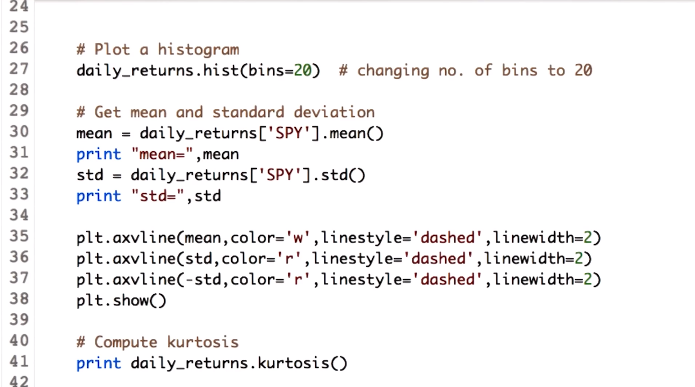
    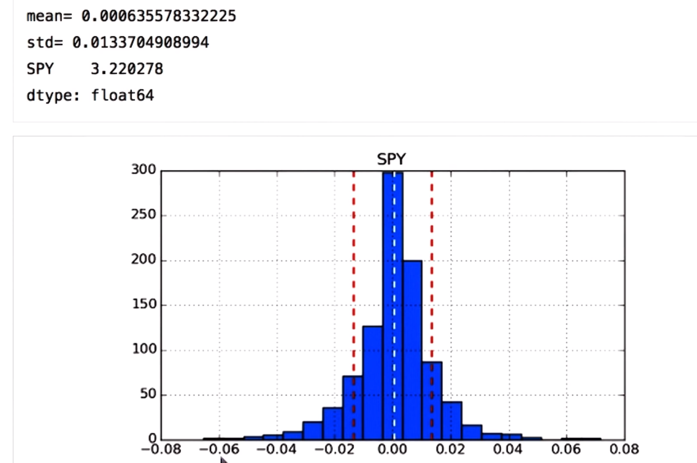

## Compare two histograms
Analyze histograms of daily returns for two different stocks, XYZ and SPY (S&P 500), and assess how they relate to each other in terms of volatility and return. Plotting histograms of daily returns together is a common practice in finance for comparative analysis. By visually comparing the histograms, differences in volatility and return between the two stocks can be observed. Providing assistance by drawing the underlying shape of the distributions to aid in the analysis. Select the most correct answer based on their observations.

The correct answer suggests that XYZ has a lower return and higher volatility compared to SPY (S&P 500). It explains that XYZ's mean is lower than SPY's mean and notes that XYZ has broader shoulders in its histogram, indicating a larger standard deviation and thus higher volatility. Additionally, it mentions that Dave will demonstrate how to plot histograms side by side in Python.
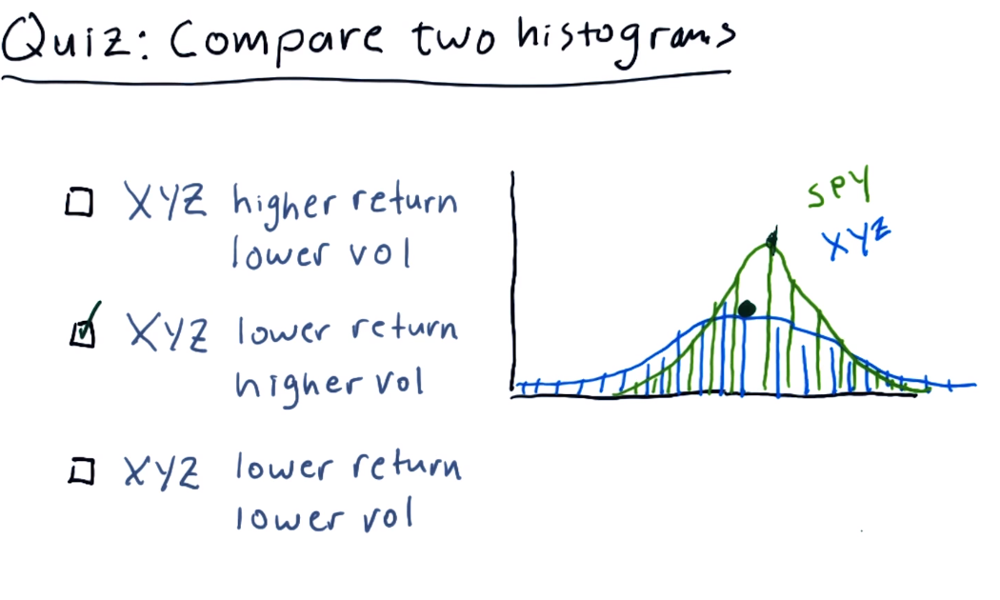

## Plot two histograms together
1. **Two histograms for SPY and XOM**: The segment involves plotting histograms for two different stocks, SPY and XOM, in order to compare their daily returns. This suggests an analysis of how the returns of these stocks vary over time.

2. **Data acquisition and computation of daily returns**: Data for both SPY and XOM stocks is obtained, likely from a financial dataset or source. Then, the daily returns for each stock are computed, which involves calculating the percentage change in stock prices from one day to the next.

3. **Separate calls to histogram function**: The histogram function is invoked separately for the daily return values of each stock. This suggests that two distinct histograms will be generated, each representing the distribution of daily returns for one of the stocks.

4. **Addition of labels for distinction**: Labels are added to the histograms to differentiate between SPY and XOM. This is important for clarity and enables viewers to understand which histogram corresponds to which stock.

5. **Plotting on the same axis for comparison**: Both histograms are plotted on the same x and y axis. This arrangement facilitates direct visual comparison between the distributions of daily returns for SPY and XOM. 

6. **Comparison of histogram thickness**: The comparison reveals that the histogram of XOM appears thinner compared to that of SPY. This difference may suggest lower volatility for XOM relative to SPY, as thinner histograms often indicate less variability in the data.

7. **Segment conclusion and hint at future return**: The segment concludes by indicating that this is the end of the coding segment, with a promise of a future return. This implies that there may be further analysis or demonstrations in subsequent segments.
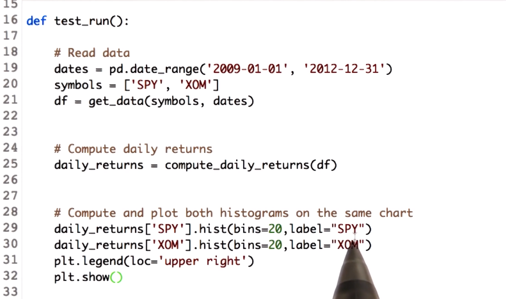
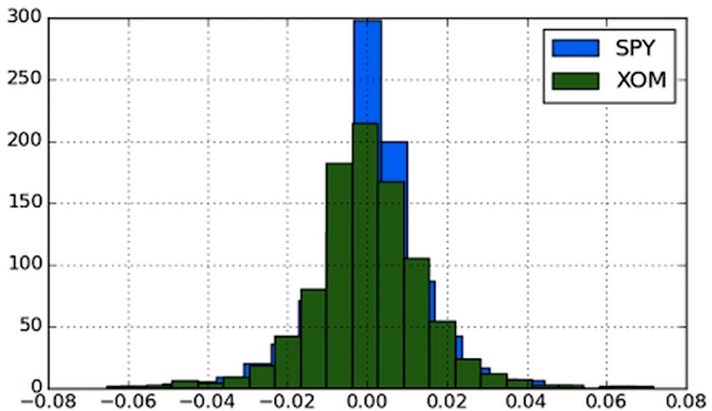
## Scatterplots
- **Introduction to visualizing differences in daily returns**: The segment begins by introducing another method for visualizing the differences between the daily returns of individual stocks. It suggests the use of a scatterplot for this purpose. This indicates a shift from previous visualizations and implies that a scatterplot might provide insights that other methods, such as line charts or histograms, might not capture as effectively.

- **Comparison of S&P 500 and stock XYZ**: The presenter refers to a previously plotted daily return chart that includes the S&P 500 and another stock labeled as XYZ. It mentions that while XYZ often moves in the same direction as the S&P 500, it sometimes moves further. This highlights the importance of comparing the behavior of different stocks to understand their relative performance and relationship to broader market movements.

- **Explanation of scatterplot visualization**: A scatterplot is described as containing individual points or dots, with each representing something that occurred on a specific day. This explanation helps to establish the basic concept of a scatterplot for those who may not be familiar with it. By mentioning that each point corresponds to a specific day, the presenter emphasizes the temporal aspect of the data being visualized.

- **Example day and corresponding point**: An example day is highlighted where both S&P 500 and XYZ had positive returns, with XYZ having a slightly larger return. This scenario is illustrated by placing a point on the scatterplot. This specific example helps to concretize the abstract concept of plotting daily returns on a scatterplot, making it easier for the audience to understand how the visualization works in practice.

- **Scattering of dots and potential trends**: The presenter explains that if this process is repeated for many days over a long period, a trend may appear, possibly indicating a linear relationship between the returns of S&P 500 and XYZ. However, it's noted that the dots are somewhat scattered and don't form a perfect line, suggesting variability in the relationship. This acknowledgment of variability underscores the complexity of financial data and the importance of considering multiple factors when analyzing stock performance.
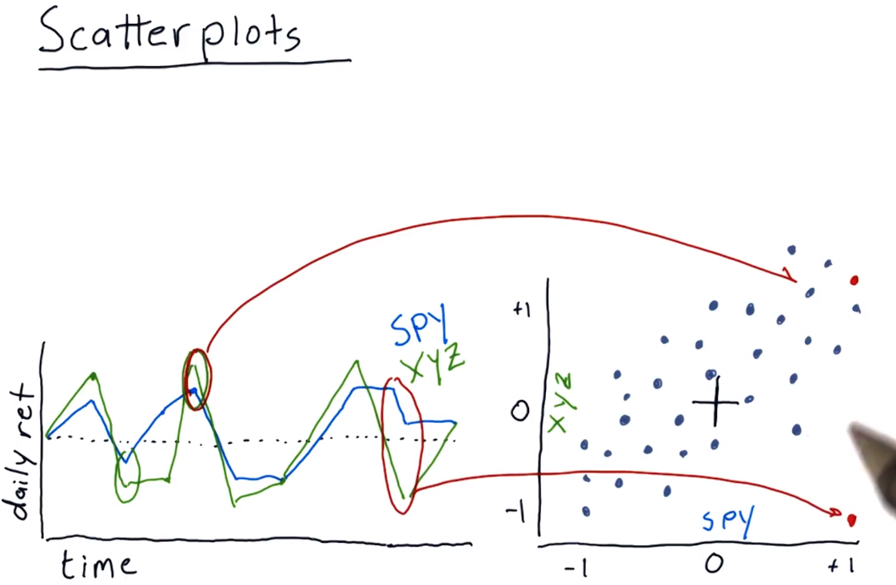
## Fitting a line to data points
- **Linear regression for data analysis**: 
  - The segment discusses the common practice of fitting a line, typically via linear regression, to a set of data.
  - Linear regression involves determining the best-fit line for a given dataset, aiming to model the relationship between variables.
  - By fitting a line, analysts can derive insights into the underlying patterns and correlations within the data.

- **Calculation and interpretation of slope (beta)**: 
  - It introduces the concept of slope, often referred to as beta in financial terminology.
  - Beta indicates the degree of responsiveness of a stock's returns to changes in the broader market, typically represented by the S&P 500.
  - A beta of 1 suggests that the stock moves in tandem with the market, with a 1% increase in the market corresponding to a 1% increase in the stock's returns.

- **Discussion on the significance of slope values**: 
  - It provides further context by explaining the implications of different beta values.
  - A higher beta (e.g., 2) indicates greater volatility and sensitivity to market movements compared to a beta of 1.

- **Introduction of intercept (alpha)**: 
  - The segment introduces the intercept of the line, termed alpha in investing circles.
  - Alpha represents the excess return of a stock compared to the market return when beta is taken into account.
  - A positive alpha suggests that the stock outperforms the market on average, while a negative alpha indicates underperformance.

- **Application of slope and intercept in performance analysis**: 
  - The segment concludes by emphasizing how plotting data, fitting a line, and analyzing slope and intercept enable the assessment of a stock's performance relative to the market or other stocks.
  - These metrics provide valuable insights into the stock's behavior and its relationship with broader market trends.
  
  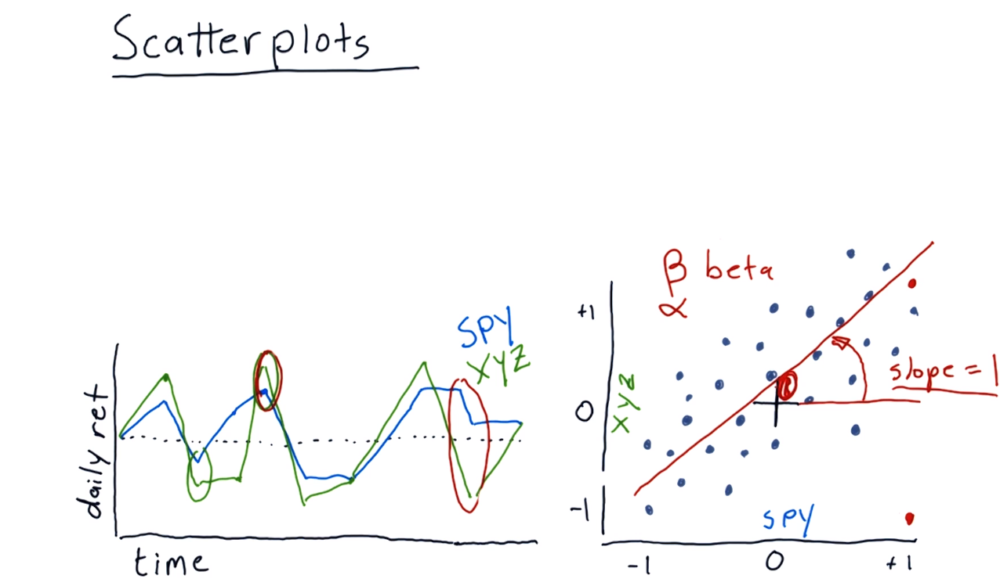

## Slope does not equal correlation
1. **Common error made**: 
   - It's common for many individuals to mistake slope and correlation.

2. **Confusion between slope and correlation**: 
   - People often confuse slope with correlation when analyzing data.

3. **Clarification of misunderstanding**: 
   - If someone finds that the slope of the line fitting the data is 1, they may mistakenly assume that the data points are correlated, but this is not accurate.

4. **Definition of slope and correlation**: 
   - Slope refers specifically to the steepness of the line, while correlation measures how closely individual data points align with the line.

5. **Explanation of correlation as a measure**: 
   - Correlation quantifies how tightly the data points adhere to the fitted line.

6. **Example of correlation in context**: 
   - A shallow slope can still result in a high correlation if the data points closely follow the line.

7. **Illustration of correlation with different slopes**: 
   - Conversely, even a steeper line can have a high correlation if the data points align closely with it.

8. **Range of correlation values**: 
   - Correlation values range from 0 to 1, with 0 indicating no correlation and 1 indicating a strong correlation.

9. **Introduction of new scatter plot for stock ABC**: 
   - A scatter plot for another stock, ABC, is introduced to further illustrate correlation.
   
10. **Description of scatter plot**: 
    - Each dot on the scatter plot represents the daily return of SPY versus ABC.

11. **Fitting a line to the scatter plot**: 
    - A line is fitted to the scatter plot data, revealing a slope of two.

  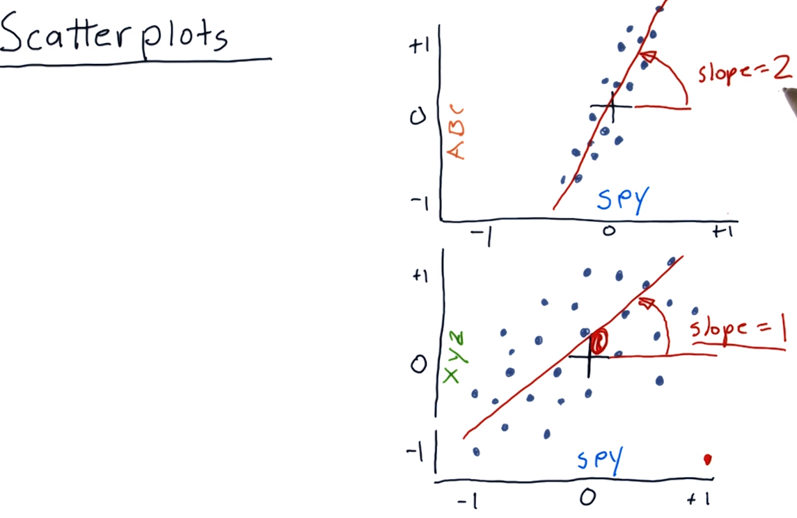

## Correlation vs slope
Which of these statements is the most true about the relationship between ABC and XYZ in terms of beta and correlation?

This is the correct answer. It's got higher beta because the slope is higher and higher correlation because the dots are closer to the line that fits it.

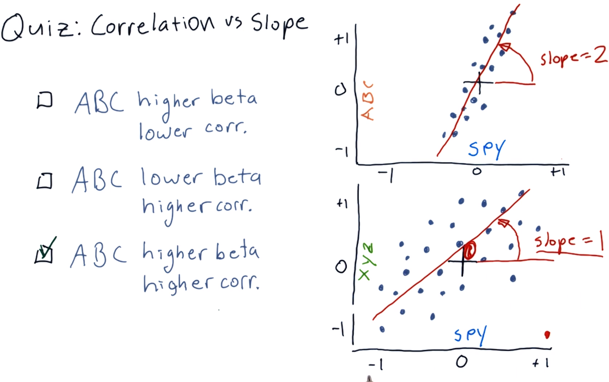

## Scatterplots in python

1. **Data Preparation:**
   - This time, let's scatter some data.
   - As usual, We call get_data function with this symbols and also compute daily returns.

2. **Initial Scatter Plot Creation:**
   - Next we first plot scatter plot for SPY versus XOM.
   - Kind parameter of the plot function of the data frame will help us achieve this.
   - So we mention we need a scatter plot, but since the data frame daily return has values for three stocks, we have to mention which should be our X axis and which should be our Y axis.

3. **Presentation of SPY versus XOM Scatter Plot:**
   - Ready to see the output?
   - This is our SPY versus XOM.

4. **Subsequent Plot Creation:**
   - Now let's similarly plot SPY versus GLD.
   - So here are two scatter plots, SPY versus XOM and SPY versus GLD.

5. **Enhancing Graph with Fitted Lines:**
   - So let's import it.
   - After importing the numpy library, we are all set to fit a line to our scatter plot.

6. **Fitting Lines to Scatter Plots:**
   - We will first do it for SPY and XOM.
   - The polyfit function needs x-coordinates and y-coordinates to fit a line.
   - Calling this function will return two things, the first is the polynomial coefficient and the second is the intercept.

7. **Comparison of Fitted Lines:**
   - Let's do it for GLD so that we can compare them both.
   - We also print the beta and alpha values for each.

8. **Analysis of Beta Values:**
   - Now, let's compare the beta values.
   - You can see that the beta values for the XOM is greater as compared to that of GLD.

9.  **Analysis of Alpha Values:**
    - Numbers over here say that GLD performed better.

10. **Correlation Assessment:**
    - The value of the correlation for GLD and SPY is very small.
    - For more information on data frame scatter plot and polyfit, check the link in the instructor's notes.
  
  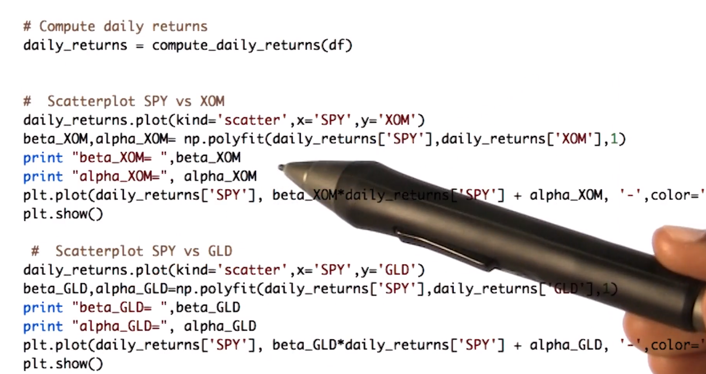
  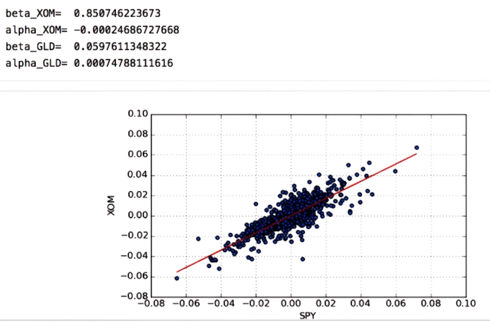
  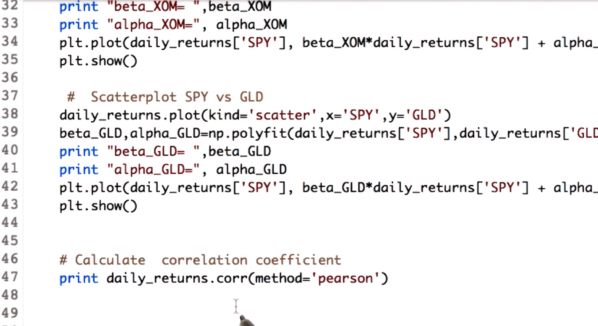
  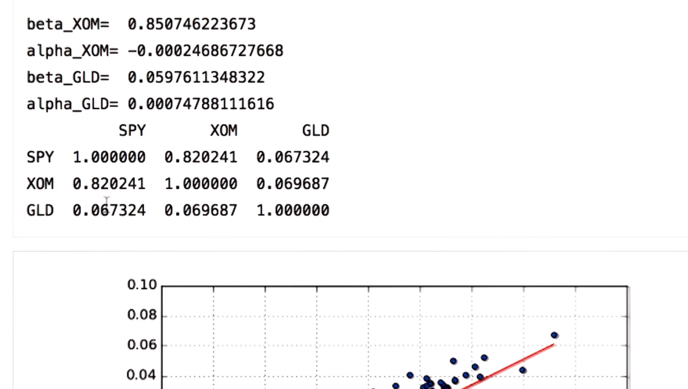
  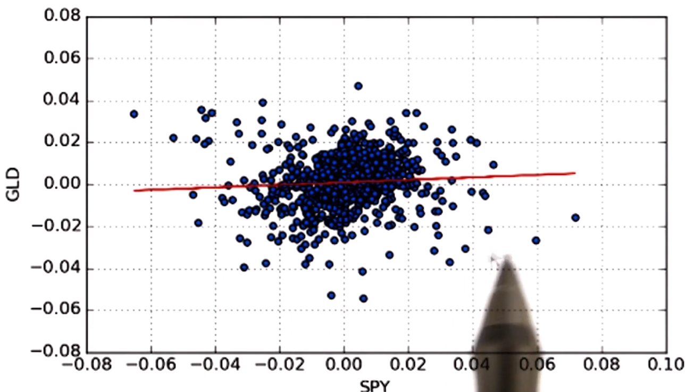

## Real world use of kurtosis

1. **Observation of Return Distribution:**
   - As you have seen in this lesson, the distribution of daily returns for stocks and the market look very similar to a Gaussian.
   - This property persists when we look at weekly, monthly, and annual returns as well.

2. **Normal Distribution Assumption:**
   - If they were really Gaussian we'd say the returns were normally distributed.
   - In many cases in financial research, we assume the returns are normally distributed.

3. **Risk of Ignoring Kurtosis:**
   - But this can be dangerous because it ignores kurtosis or the probability in the tails.
   - Explanation: Ignoring kurtosis can lead to underestimating the likelihood of extreme events.

4. **Example of Mortgage Bonds:**
   - In the early 2000s investment banks built bonds based on mortgages.
   - They assumed that the distribution of returns for these mortgages was normally distributed.

5. **Flaws in Assumptions:**
   - On that basis, they were able to show that these bonds had a very low probability of default.
   - But they made two mistakes:
     1. They assumed that the return of each of these mortgages was independent.
     2. They assumed this return would be normally distributed.

6. **Consequences of Flawed Assumptions:**
   - Both of these assumptions proved to be wrong, as massive numbers of homeowners defaulted on their mortgages.
   - It was these defaults that precipitated the great recession of 2008.