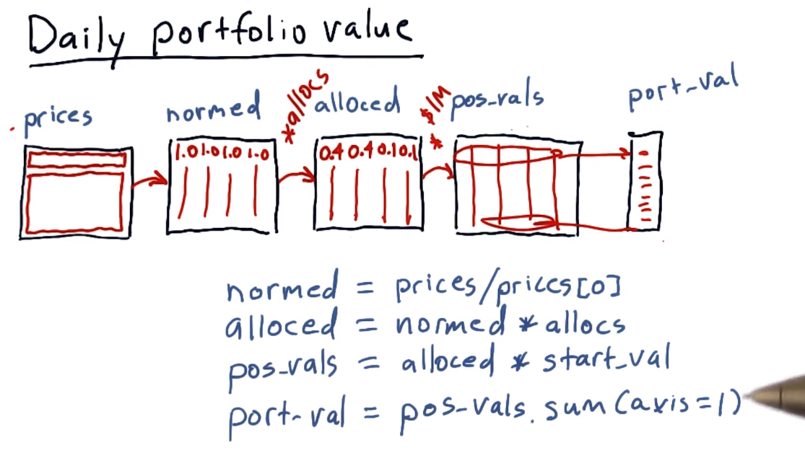
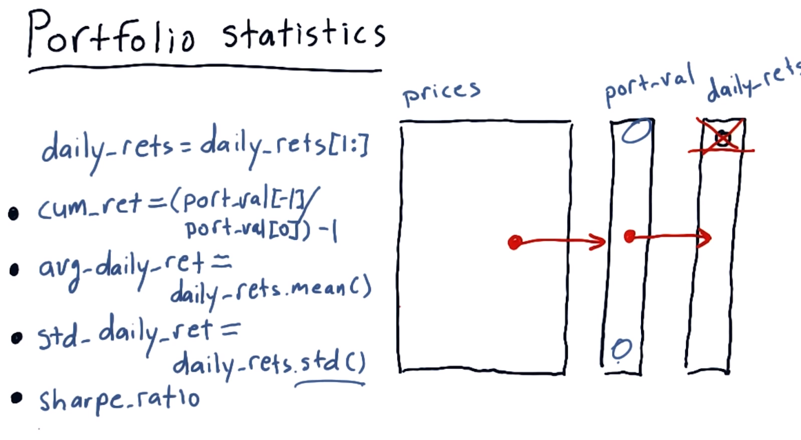
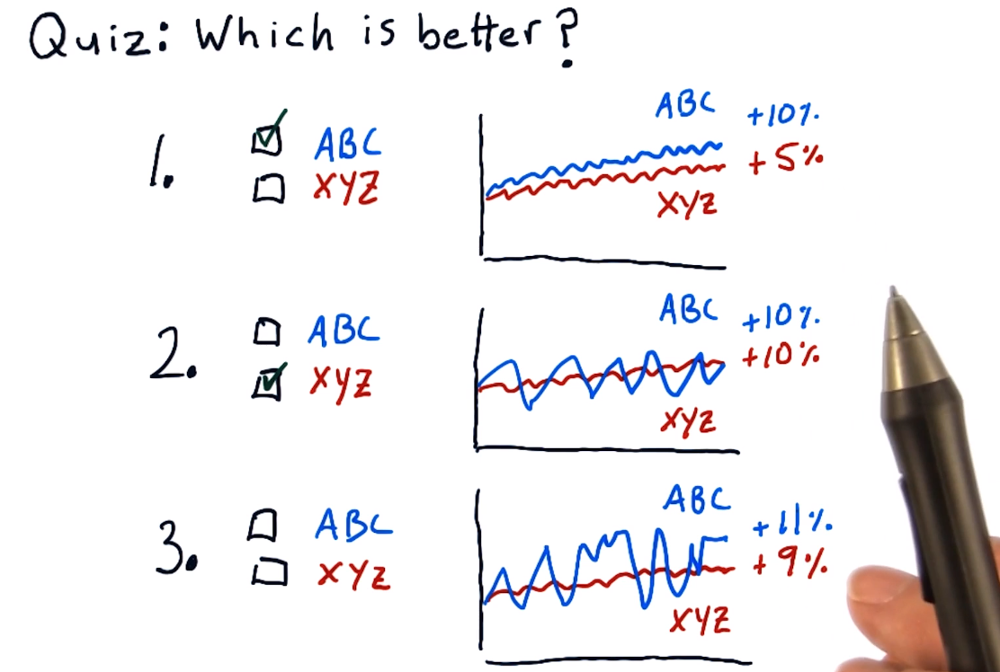
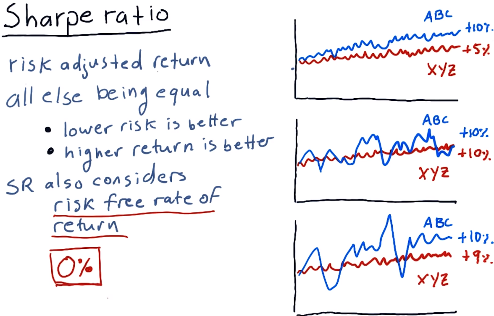
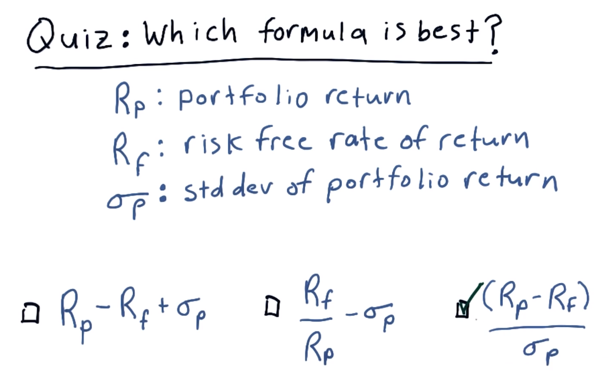
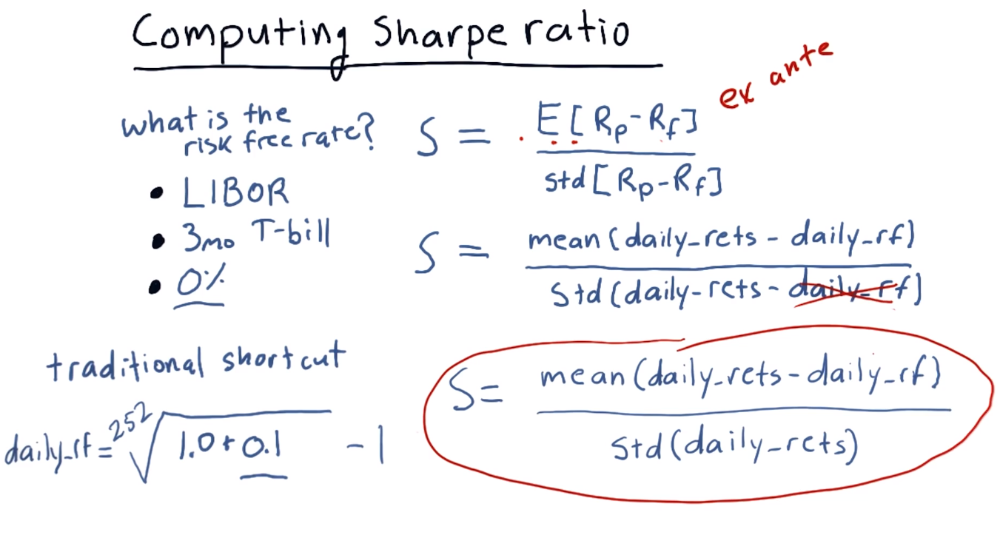
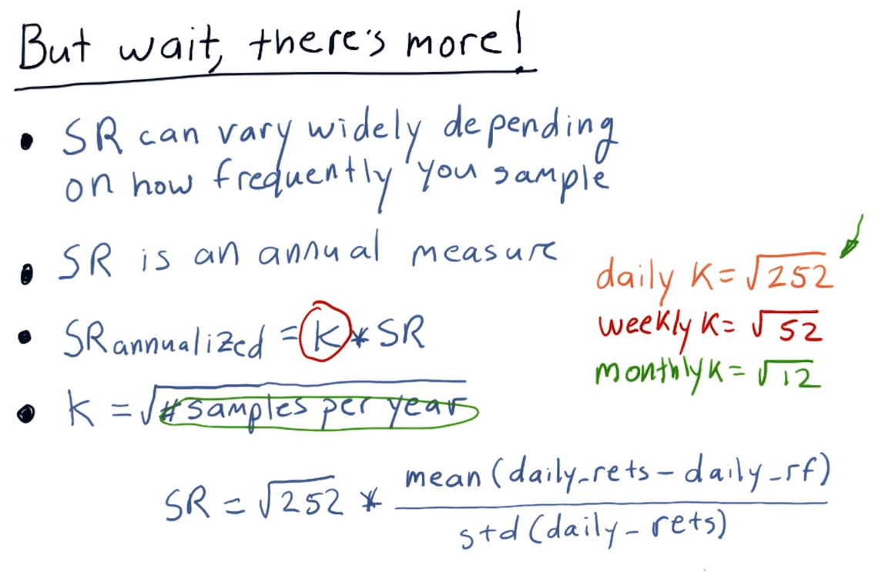
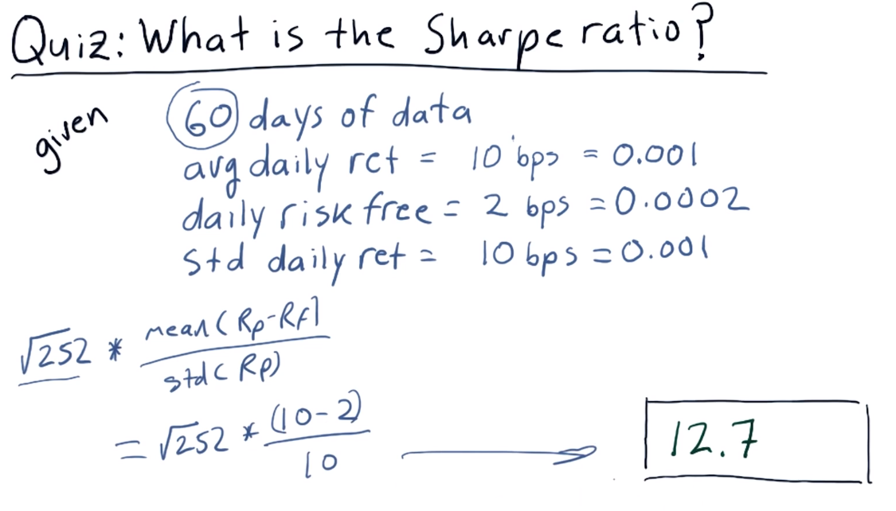

# 01-07 Sharpe ratio and other portfolio statistics
## Overview

1. **Transition from Individual Stocks to Portfolios**:
   - Up until this point we've been computing statistics about individual stocks.
   - We're going to shift now to computing statistics on portfolios.

2. **Importance of Portfolio Statistics**:
   - We're going to focus on some of the most important statistics that are used to evaluate the performance of portfolios.
   - Accordingly portfolio managers.

3. **Definition of a Portfolio**:
   - We'll define a portfolio as an allocation of funds to a set of stocks.

4. **Buy-and-Hold Strategy**:
   - For the moment, we're going to follow a buy-and-hold strategy where we invest in a set of stocks with a certain allocation.
   - Then observe how things go moving forward.

5. **Allocation Assumption**:
   - We'll assume the allocations sum to 1.0.

## Daily portfolio values

1. **Objective: Calculating Portfolio Value**:
   - The goal is to calculate the total value of a portfolio day by day.

2. **Data and Timeframe**:
   - Example: Portfolio value from the beginning of 2009 to the end of 2011.
   - Portfolio consists of S&P 500, XOM, Google, and Gold.

3. **Initial Allocation**:
   - Portfolio starts with a value of one million dollars.
   - Allocation percentages: 40% to SPY, 40% to XOM, 10% to Google, and 10% to Gold.

4. **Methodology**:
   - Normalize price data by dividing price values by the first row.
   - Multiply normalized values by allocation percentages to get the relative value of each asset over time.
   - Multiply by initial investment to get the real value of each investment each day.
   - Sum across each row to get the total portfolio value on each corresponding day.

5. **Recap**:
   - Normalize prices, multiply by allocations, then by initial investment to get daily portfolio value.

## Portfolio statistics

1. **Transition to Portfolio Statistics**:
   - We showed a moment ago how to go from prices to port-val, which is the daily total value of the portfolio.
   - Now that we have port-val, we can compute a number of important statistics on the portfolio.
   
2. **Calculation of Daily Returns**:
   - An important first calculation is to compute daily returns.
   - We've talked about how to do that before, so I won't go over it here.
   - But an important observation is whenever you compute daily returns, the first value is always going to be zero.

3. **Exclusion of First Value in Daily Returns**:
   - So we want to exclude that value from any calculations we do across all daily returns.
   - It's easy to accomplish this with a simple python statement, which is just to replace daily returns with daily returns where we just include the second row forward.
   - And boom, we're rid of that first zero.

4. **Key Portfolio Statistics**:
   - Now that we have this information, we can compute four key statistics that everybody wants to know about regarding the performance of a portfolio.
   - They are cumulative return, average daily return, standard deviation of daily return, and Sharpe ratio.

5. **Explanation of Cumulative Return**:
   - Cumulative return is just a measure of how much the value of the portfolio has gone up from the beginning to the end.
   - To calculate that, we take the last val, which is port-val of -1, which is this one divided by the beginning and subtract 1.

6. **Explanation of Average Daily Return**:
   - Average daily return is just the average of these numbers, so we just take the mean.
   - Very simple.

7. **Explanation of Standard Deviation of Daily Return**:
   - Standard deviation of daily return, again simple.
   - Just use the standard deviation function right there.

8. **Explanation of Sharpe Ratio**:
   - Now Sharpe ratio is a little bit more complex than these other ones.
   - So we're going to spend a little bit more time diving into Sharpe ratio.
  

## Which portfolio is better

1. **Introduction to Sharpe Ratio**:
   - The idea for Sharpe ratio is to consider our return, or our rewards in the context of risk.
   - Most finance folks consider risk to be standard deviation or volatility.
   - We're looking for a measure that essentially adjusts our return for that risk.

2. **Examples for Consideration**:
   - We have three example charts comparing two stocks against one another.
   - In the first example, both ABC and XYZ have about the same volatility, but one returns a little bit more than the other.
   - In the second example, both stocks return exactly the same amount, but one of them is more volatile than the other.
   - In the third example, ABC returns 11%, XYZ returns 9%, but ABC is much more volatile than XYZ.

3. **Quiz**:
   - Listeners are prompted to think about and mark which portfolio or stock they think is better in each of these examples.
Here's the breakdown of the provided text:

1. **Explanation for Example 1 (ABC)**:
   - ABC is the correct answer because its volatility is the same but its total return is higher.
   - All else being equal, a higher return is better.

2. **Explanation for Example 2 (XYZ)**:
   - XYZ is the correct answer because it had the same return as ABC, but it was less volatile.
   - All else being equal, less volatility is better.

3. **Explanation for Example 3 (ABC vs. XYZ)**:
   - Number three was a trick question.
   - ABC has a higher return, but it's offset by a higher volatility.
   - XYZ has a lower return, but that's offset by lower volatility.
   - You don't really have enough information to make the choice here without a qualitative way to measure it.
   - That's what the Sharpe ratio is all about.

## Sharpe ratio
Here's the breakdown of the provided text:

1. **Introduction to Sharpe Ratio**:
   - Sharpe ratio is a metric that adjusts return for risk.
   - It enables us in a quantitative way to assess each of these example compared portfolios.

2. **Explanation of Sharpe Ratio's Application**:
   - Sharpe ratio will show us, for instance, that in this case, ABC is better because it has about the same volatility as XYZ, but a higher return.
   - It assesses these portfolios based on both return and risk, helping us make informed decisions.

3. **Consideration of Risk-Free Rate of Return**:
   - Sharpe ratio also considers something called the risk-free rate of return, which is the interest rate you would get on your money if you put it in a risk-free asset like a bank account or a short-term treasury.
   - Including this rate helps us compare the performance of assets relative to a risk-free investment option.
   - As of mid-2015, the risk-free rate of return is about zero, leading investors to put more money into the stock market.

4. **Origin and Equation of Sharpe Ratio**:
   - The Sharpe ratio is named for William Sharpe, who developed it to account for all these factors.
   - The form of the equation for the Sharpe ratio is pondered upon, inviting the audience to think about its structure.

## Form of the Sharpe ratio Question

1. **Explanation of the Sharpe Ratio Equation**:
   
   - The ratio divides return by volatility.
   - As volatility increases, the ratio decreases, and as return increases, the ratio increases.
   - Subtracting the risk-free return from the equation.
   - If the return on the portfolio is lower than the risk-free rate, the resulting metric will be negative.

2. **Form of the Sharpe Ratio**:
   - This is indeed the form of the Sharpe ratio, as devised by William Sharpe.
   - It suggests that while there may be more details, this breakdown essentially captures the essence of the ratio.

## Computing Sharpe ratio

1. **Explanation of the Sharpe Ratio Equation**:
   - Here's the equation for computing the Sharpe ratio as proposed by William Sharpe himself.
   - It's the expected value of the return on a portfolio, minus the risk-free rate of return, divided by the standard deviation of that same difference.
   - This is the ex ante formulation, meaning, because we're using expected, it's a forward-looking measure of what the Sharpe ratio should be.
   
2. **Calculation Using Historical Data**:
   - To calculate this in reality, we need to look back at those values.
   - So, for instance, the expected value of this difference is just simply the mean of what that difference was over time.
   
3. **Risk-Free Rate**:
   - Traditional sources for the risk-free rate are mentioned, including LIBOR and the interest rate on the 3-month Treasury bill.
   - In recent years, a risk-free rate of 0 has been commonly used.
   - The text explains a shortcut for simplifying the equation by treating the risk-free rate as a constant.
   - It describes how to convert an annual risk-free rate into a daily rate using a simple mathematical trick.
   - The daily risk-free rate is approximated as 0 in many cases, but it's noted that this may change in the future.
   
4. **Equation Simplification**:
   - The text explains that when the risk-free rate is treated as a constant, it can be removed from the standard deviation calculation.
   - This simplification is justified by the fact that subtracting a constant from a set of values does not affect the standard deviation calculation significantly.
   
5. **Final Equation**:
   - The text summarizes the equation typically used for calculating the Sharpe ratio using daily returns.
   - It emphasizes the exclusion of the daily risk-free rate from the standard deviation calculation, treating it as a constant.
 

## But wait -  theres more

1. **Introduction to Sampling Frequency Impact on Sharpe Ratio**:
   - The Sharpe ratio for the same asset can vary widely depending on how frequently you sample it.
   - Sampling annually, monthly, or daily will yield different Sharpe ratios.

2. **Original Vision of the Sharpe Ratio**:
   - The original vision for the Sharpe ratio is that it's an annual measure.
   - Adjustments are needed when sampling at frequencies other than annually.

3. **Adjustment Factor (K) Explanation**:
   - An adjustment factor called K is introduced to annualize the Sharpe ratio.
   - K is the square root of the number of samples per year.

4. **Calculation of K**:
   - For daily data, K is the square root of 252 because there are 252 trading days per year.
   - If sampling weekly, K is the square root of 52.

5. **Example**:
   - If trading for 85 days but sampling daily, K is still based on the square root of 252.
   - The frequency of sampling affects the value of K.

6. **Recap of K Calculation**:
   - For monthly sampling, K is the square root of 12.
   - For weekly sampling, K is the square root of 52.
   - For daily sampling, K is the square root of 252.

7. **Final Equation Incorporating K**:
   - When using daily data, the Sharpe ratio formula includes multiplying by the square root of 252 (K).
   - The formula includes subtracting the daily risk-free rate and dividing by the standard deviation of daily returns.
  
## What is the Sharpe ratio
The question asks for the calculation of the Sharpe ratio for a trading strategy that has been operational for 60 days. It provides the average daily return of the strategy (10 basis points), the assumed risk-free rate (2 basis points per day), and the standard deviation of the daily return (10 basis points).

The correct answer is 12.7. That's a really, eye-watering Sharpe ratio. Anyway, these numbers are just made up for example, so it's not surprising we might get an absurd number here. But, here's how we calculate that. Remember our Sharpe ratio is the square root of 252 because that's how frequently we are sampling the data, daily. 252 days in a year, square root of 252. A lot of people probably saw this 60 days of data and thought that it should be square root of 60. It's not correct. It's the frequency that you're sampling. Anyways, getting back to it, it's square root of 252 times the mean of portfolio return minus risk free return divided by standard deviation of our daily return. So that becomes square root of 252 times 10 bips minus 2 bips divided by 10 bips. This just becomes 0.8, and multiply it all out, and you get 12.7.

## Putting it all together
Now you know how to compute daily portfolio values and, from there, important portfolio statistics. The main ones we're going to focus on are cumulative return, average daily return, standard deviation of daily return, or risk, and Sharpe ratio. These are the key factors most people focus on when evaluating the performance of a portfolio. The assignment associated with this lesson is for you to build a function that can calculate these values automatically. You've got what you need to build this, so have at it.