# 01-08 Optimizers Building a parameterized model

## What is an optimizer

1. **Introduction to Optimizers**
   - In this lesson, we're going to look at optimizers.
   - Optimizers sound scary, but they're really cool and really fun.
   - I'm going to show you all kinds of neat things you can do with optimizers.

2. **What is an Optimizer?**
  An optimizer is an algorithm that can do the following things:
   - Optimizers can be used to find minimum values for functions.
     - So say you have a function like \( f(x) = x^2 + x^3 + 5 \) or something like that, an optimizer can find for what value of \( x \) is this overall function minimized?
   - Another thing that optimizers can do is find the parameters for parameterized models from data.
     - So we might have some data from some experiment, and we can use optimizers to find a polynomial fit to that data.
     - And that is actually one thing we are going to learn in this lesson.
   - Finally, we can use an optimizer to refine allocations to stocks in portfolios.
    What does that mean?
     - Well, that means, for instance, you can decide what percentage of funds should be allocated to each stock using an optimizer.

1. **Using an Optimizer: Key Steps**
   - It's really just as simple as three key steps.
   - First thing you need to do is define a function that you want to minimize.
     - As an example you might use something like \( f(x) = x^2 + 0.5 \).
     - You define that in Python and then the minimizer will call this function many, many times as it tries to find the minimum values for \( x \) that cause this function overall to be smallest.
   - You also need to start with an initial guess for \( x \) that you think might be close to the solution to the problem.
     - If you don't really know, then you can choose a random value or just some standard value.
   - But then the optimizer starts with that guess and it repeatedly calls a function, tests different values, and narrows in on the solution.
   - Finally, you call the optimizer with these parameters and stand back while it searches for the minimum.
  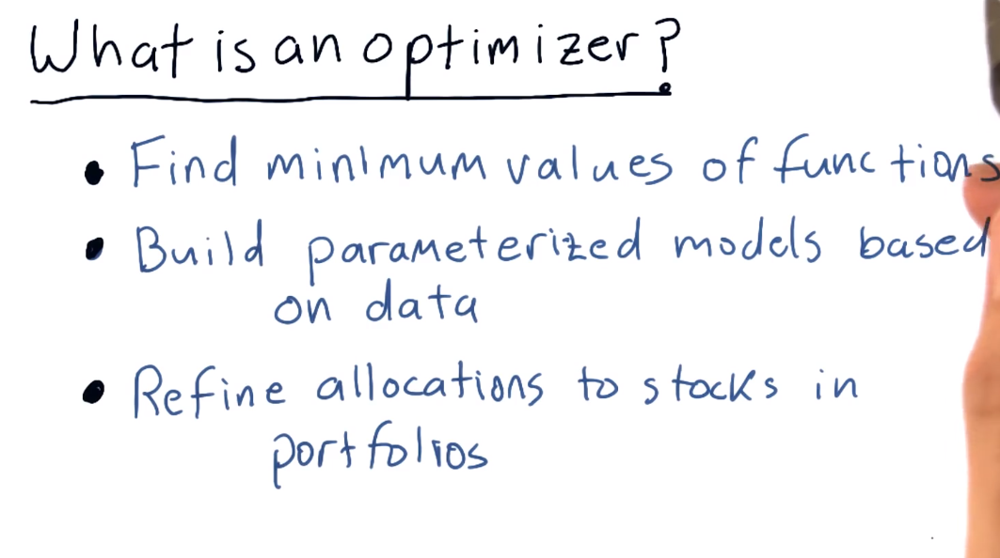
  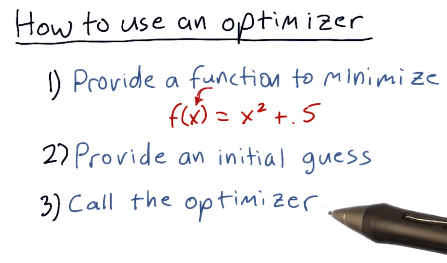
## Minimization example

1. **Introduction to the Function**
   - Let's take a look at this function: \( f(x) = (x - 1.5)^2 + 0.5 \).
   - That function is a parabola centered horizontally at 1.5, with its minimum at 0.5.

2. **Minimizer's Task**
   - The minimizer doesn't know the function's characteristics.
   - We have to figure it out on its own.

3. **Starting the Optimization**
   - Suppose we tell the minimizer to start with a guess of 2.0 and figure out from there.
   - The minimizer accepts the challenge.

4. **Gradient Descent**
   - First, it checks the value at 2.0, approximately 0.75.
   - Then, it tests nearby values to find the slope of the equation at that point.
   - Using gradient descent, it marches downhill to minimize the function.
   - It keeps trying new values along the slope until it narrows down to the minimum.

5. **Variations in Optimization Methods**
   - The example provided illustrates one method of gradient descent.
   - There are many variations used by different minimizers.
   - Libraries like Scipy offer multiple options for optimization methods.
   - While we'll stick to one approach in our examples, experimenting with others is encouraged.
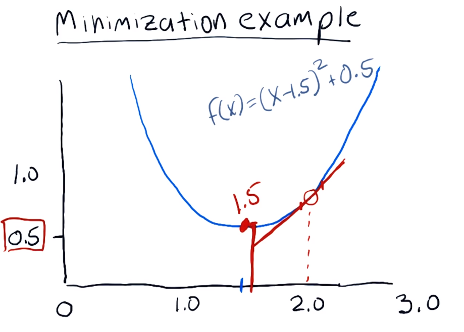
## Minimizer in Python

1. **Introduction to Python Implementation**
   - Let's try that same example function now in Python code.
   - So up here we have our normal imports, here is where we define the function.
   - And again we're simply using \( x - 1.5 \) squared + 0.5.

2. **Defining the Function**
   - Now within this function, we're going to go ahead and print what the value is when we get called.
   - It just is a little bit handier so that we can see what exactly is going on.
   - But you don't have to have that of course.
   - And then we return \( y \).

3. **Calling the Minimizer**
   - Now this is going to be the function that we're going to Ask SciPy, or in particular the optimizer, to minimize for us.
   - By the way, we've included this optimize package as spo.
   - So scipy.optimize as spo.
   - This is our call now to the optimizer or the minimizer.

4. **Setting Initial Parameters**
   - Before we call it we first set our guess value to be 2.0.
   - And we're using the function minimize so we call spo.minimize.
   - \( f \), that's our function here, so we're saying minimizer, please minimize find the minimum for this function.
   - \( x \) guess is our guess.

5. **Specifying Minimization Method**
   - Method is, we're directing minimize to use a particular minimizing algorithm.
   - We'll talk a little bit about that a little bit later.
   - But this is one of those particular algorithms that happens to work pretty nicely.
   - We send it one more option here, disp, which is True.
   - Which means we just want it to be verbose about things that it discovers.

6. **Executing the Minimization**
   - Anyways, that's it.
   - That calls the minimizer.
   - The minimizer repeatedly calls our function and finds the minimum value, then it prints out those results.

7. **Testing and Output**
   - Let's try a test run and see what happens.
   - Remember, in our function that we wanted to minimize, we explicitly printed \( x \) and \( y \).
   - So here you can see each time it gets called it prints these values out.
   - So the minimizer is repeatedly calling that function \( f \) and it's printing these things out.
   - So it gets called initially with an \( x \) of 2 and it discovers that the value is 0.75.
   - Then a value slightly greater than 2, a value slightly less than 2.
   - And the minimizer very quickly converges on 1.5 as the answer, and here it prints out those values and finds the minima at 1.5 with a value of 0.5 there.

8. **Plotting the Results**
   - I added a few more lines of code here which I'll highlight, merely to plot the answer, so all the rest of the code is the same.
   - But let's take a look now if we plot it as well.
   - So, same result as before but nice plot with our minima identified right here.

 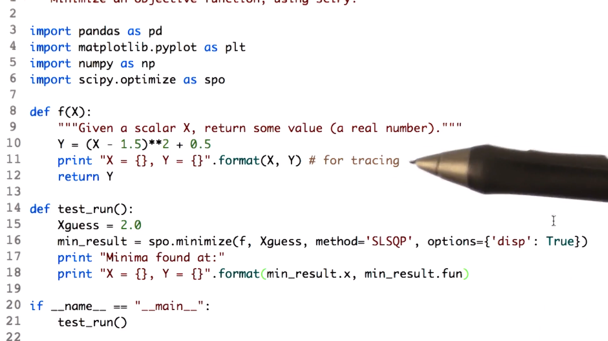
  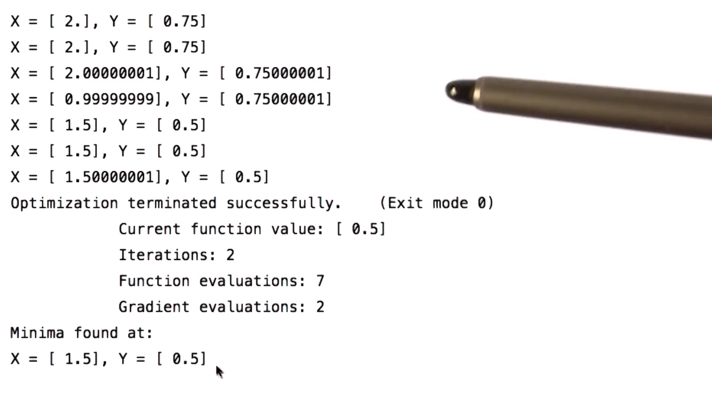
   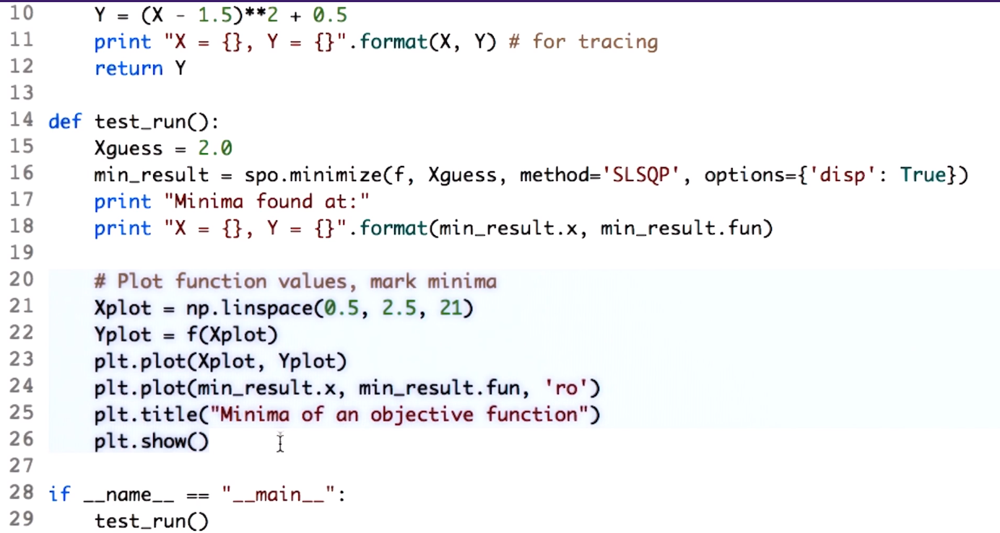
  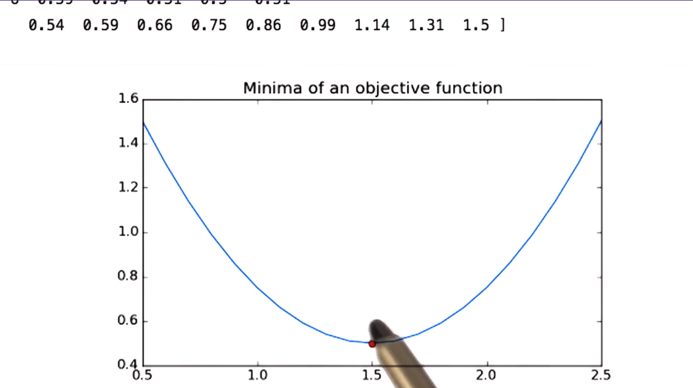

## How to defeat a minimizer
Think a little bit about what might be hard for them to solve.
**Challenges Faced by Minimizers**

1. **Introduction**
   - Most of these are hard.
   - This one's hard.
   - This one's hard, and this one, and let me explain why.

2. **Difficulty Due to Flat Areas**
   - This one is hard because of this flat area here and here.
   - Suppose the minimizer tested this point here and then tried on either side.
   - It wouldn't be able to find any gradient to follow, so, it wouldn't know which direction to go.

3. **Challenges with Multiple Minima**
   - This one is difficult for at least two reasons.
   - One is it has several local minima that aren't necessarily the global minima.
   - So, it might iterate and find, say, this as a minima.
   - But notice that actually there's this other two that are actually smaller.
   - And then if these two have exactly the same value, turns out we have two global minima.
   - So, those sorts of conditions are tough for these minimizers to solve.

4. **Complexity Due to Discontinuity**
   - This one is challenging because of this flat area, but also because of this discontinuity.
   - Four examples, three of them would be hard for our minimizer to solve.

5. **Optimizers' Capability**
   - Now, I'm not saying that these are not solvable by optimizers.
   - In fact, there are optimizers that can solve these problems with varying degrees of success.
   - And they're likely to find a minima, just not guaranteed to find the minima.
  
  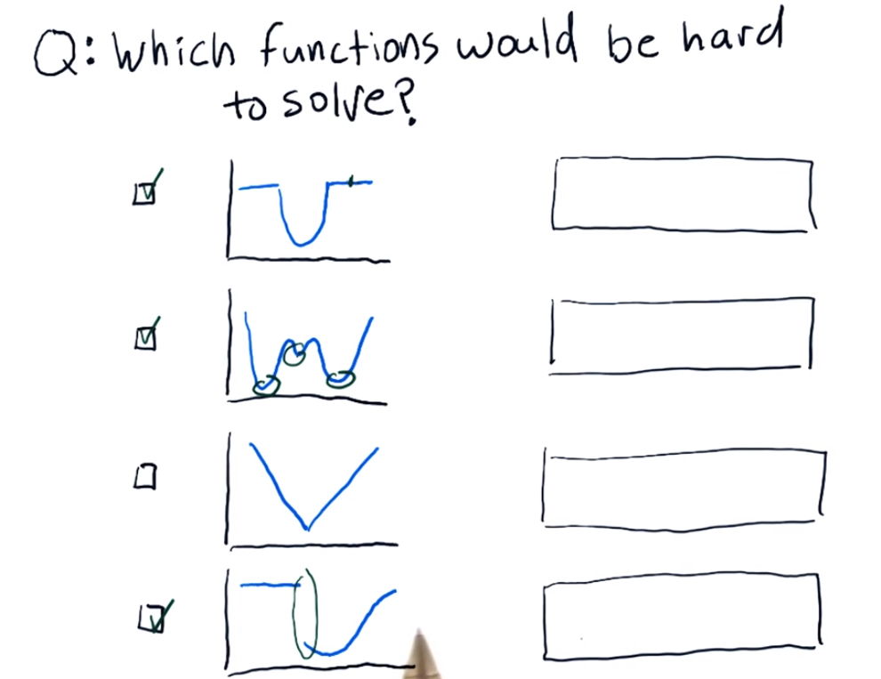
## Convex problems
**Convex Problems and Optimizers**

1. **Introduction**
   - While we're on the topic of problems that are easy or hard for optimizers to solve, let's talk for a moment about a particular class of problems that are indeed the most easy for these types of algorithms to solve.
   - And those are called convex problems.

2. **Definition of Convexity**
   - Here's the formal definition of a convex function.
   - A real valued function f of x defined on an interval is called convex if the line segment between any two points on the graph of the function lies above the graph.

3. **Explanation with Examples**
   - First step, choose two points and draw a line between them.
   - Now, for each of these lines, if the line is above the graph, everywhere between those two points, then the function is convex between those points.
   - So for this function, yes, it's convex because the line is above the graph everywhere.
   - In fact, any two points you chose on this graph, we'll have that property.
   - So this function is convex everywhere, at least where we're looking at.
   - Here, notice that this part of the graph lies above the line. So this is non-convex.
   - Similarly, this one, we've got this region here that lies above the line, so this one is also non-convex.
   - And this one is of course convex.

4. **Properties of Convex Functions**
   - One is in order for the function to be convex, it has to have only one local minima.
   - And in other words, that local minima is the global minima.
   - We also can't have any flat regions that essentially don't have any slope downward.

5. **Optimizers' Efficiency with Convex Functions**
   - If the function you're trying to find a minima for is convex, then these algorithms will find the minima quickly and easily.
   - But again, there are algorithms that can still find the minima for more complicated examples like these.
   - But they require a little bit of randomness and they aren't necessarily guaranteed to find the global minima.

6. **Working in Multiple Dimensions**
   - So far, we've been looking at functions that just have one dimension in x.
   - It’s just as easy for these optimizers to work in multiple dimensions.
   - Here’s an example of a function that has two dimensions in x.
   - It still has its y result.
   - But the minimizers can solve these problems with gradient descent just as easily.
   - So instead of just one dimension, we can have one, two, three, four, as many as we’d like.
  
  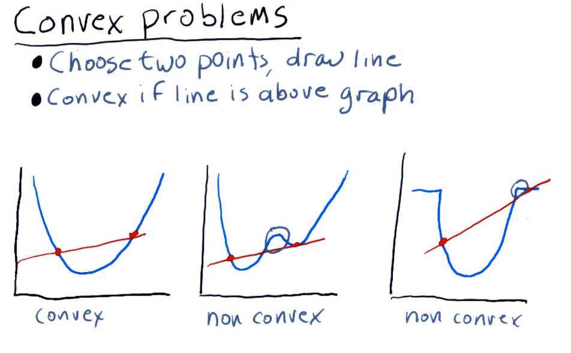
  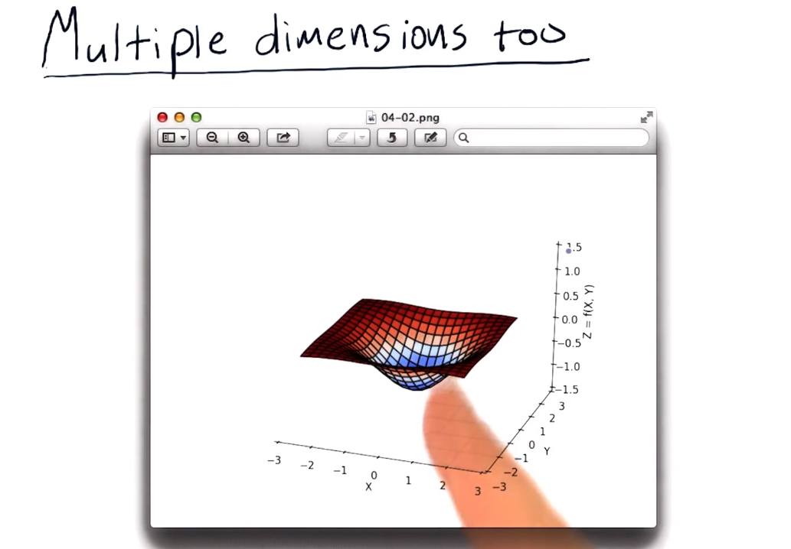

## Building a parameterized model
**Building a Parameterized Model from Data: Overview**

1. **Introduction**
   - Now we're going to do something really cool.
   - I'm going to show you how to build a parameterized model from data.

2. **Understanding Parameterized Models**
   - What do I mean by a parameterized model?
   - This is an example of a parameterized model that you're probably familiar with from algebra.
   - It's a function of x and it has these two parameters, m and b.
   - In fact, as you're probably aware, this is the equation of a line.
   - So m and b are the parameters of that line.
   - Now for convenience in our code instead of using m and b, I'm going to use C0 and C1, just to be consistent.

3. **Motivation with an Example**
   - Let's suppose we have some data from an experiment.
   - Now this can work for many sorts of experiments, but for now, let's assume we've taken some measurements of humidity, and we've observed on those particular days we measured the humidity how much it rains.
   - So each dot here represents one day and one sample of data.
   - Now we probably have lots more data, one for each day.
   - When we look at this data, we see there's a kind of relationship here.
   - And our intuition is maybe that it could be fitted by a line.
   - So our task is to find C sub 0 and C sub 1 that provide the equation for this line that best fits the data.

4. **Reframing the Problem**
   - The question here is, how do we reframe this problem so that it makes sense for our minimizer?
   - What is it we're trying to minimize?
   - Restating the problem, suppose we have our original data points here, and we're trying to discover the equation of a line that best fits those points.
   - Suppose this blue line is a candidate line and we want to evaluate it.
   - So the equation for that line is, our first coefficient times x plus the second coefficient.
   - And what the minimizer is going to do is it's going to vary this C0 and C1 to try and minimize something.
   - And so we have to come up with an equation that gets lower in value as this line better fits the data.
   - What should we use for that equation?

5. **Approaching the Solution**
   - Here's one step towards solving this problem.
   - We can take a look at each one of our original data points and observe how far away it is from this line that we're evaluating.
   - Can we come up with an equation in terms of e or error that gets us to this solution?
  
    
  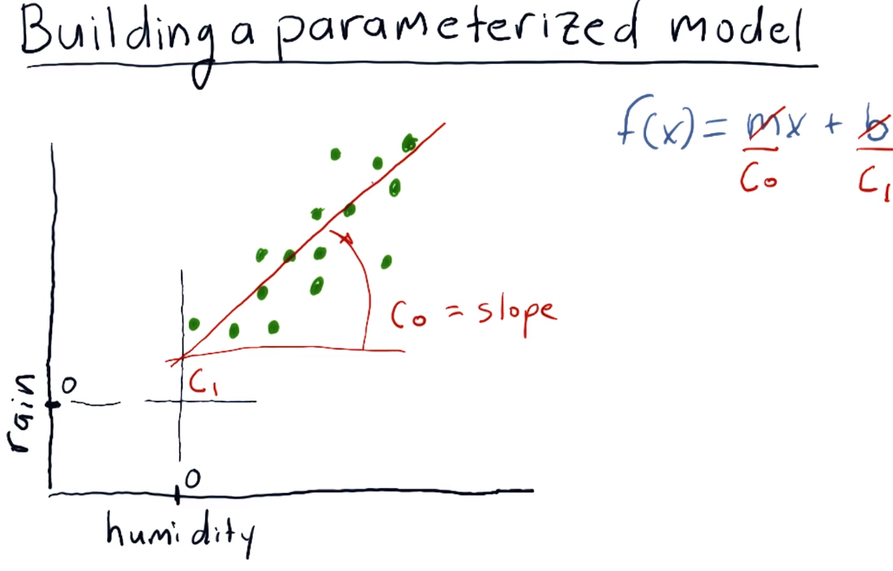
  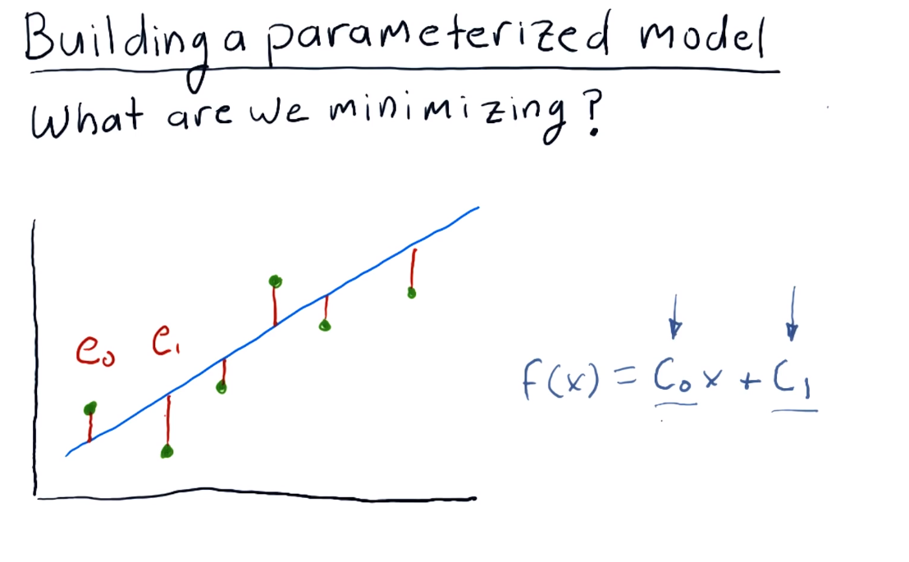

## What is a good error metric 
1. **Introduction**
   - So these two are reasonable answers.
   - The reason that this one is not a good answer is because some of these e's may be negative.
   - In other words, this one is negative, these two are positive, but you could end up with a negative error if you just added them up.
   - You can fix that by adding absolute value or by squaring it.

2. **Improving the Error Measurement**
   - You can fix that by adding absolute value or by squaring it.
   - This measure here is one of the more famous ones.
   - Of course it's squared error.
  
## Minimizer finds coefficients
**Using the Minimizer: Step-by-Step Example**

1. **Introduction**
   - Let's step through this now with an example of how a minimizer would try to find the coefficients of a line that best fits this data.
   - Keep in mind that we have to give the minimizer an equation that it has to minimize.
   - And what we're going to give it is that error metric.
   - In fact, we used squared error.

2. **Initial Guess**
   - So we might guess an initial C0 and C1, and that would be a line like this, and we would give that to the minimizer and let it go.

3. **Iterative Process**
   - So it would measure the error with this particular line,
   - It would fiddle with these values a little bit and see how much the error changed, try a new set of values, see how that works.
   - Eventually, it's going to iterate, and eventually, it's going to settle on what it thinks is the best solution.

4. **Key Points**
   - Key points here are that we express the problem for the minimizer as a minimization problem.
   - We give it the equation to minimize as the error.
   - And then, what it finds now instead of x is it finds the values for these coefficients.

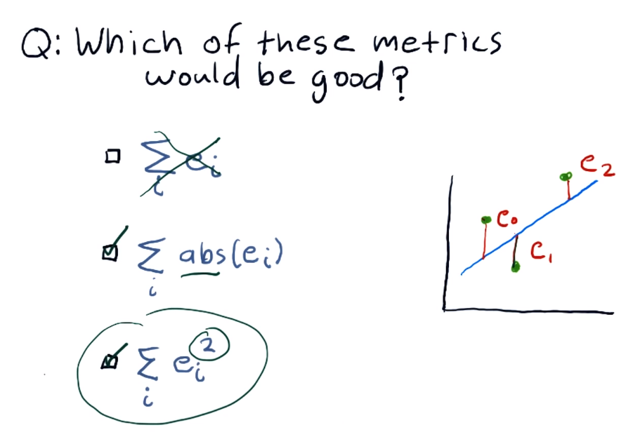
## Fit a line to given data points
Code attached to the lec
## And it works for polynomials too
Code attached to the lec
## Wrapping up optimizers