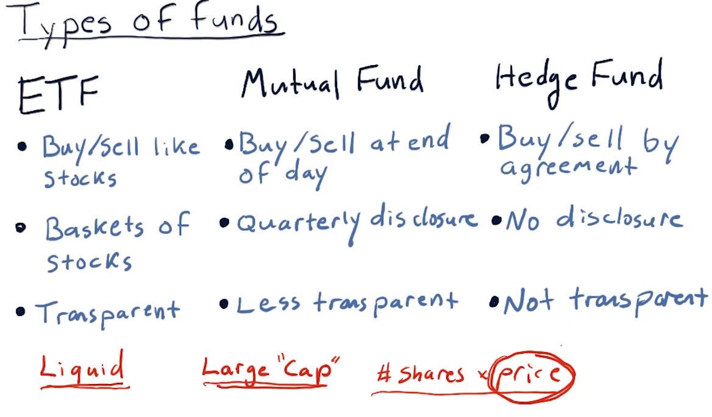
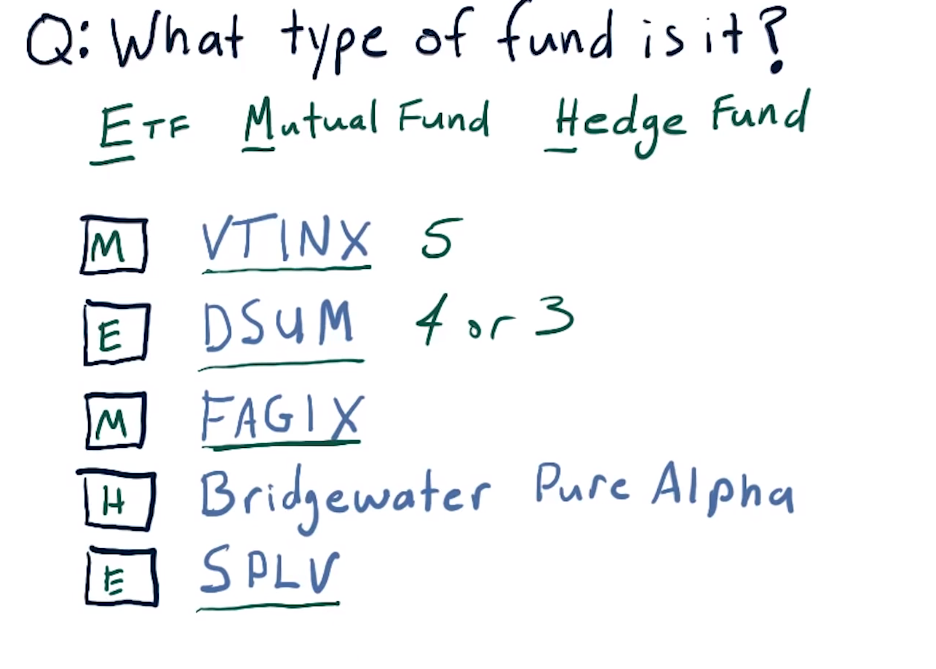
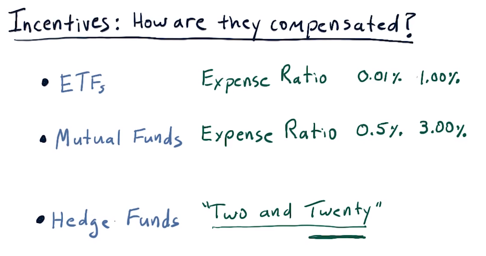
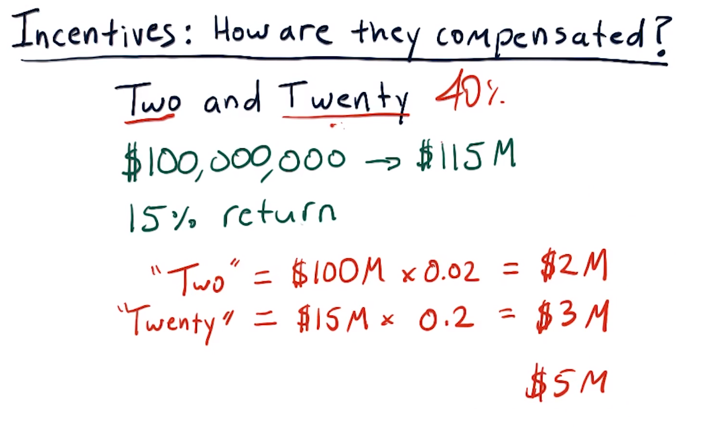
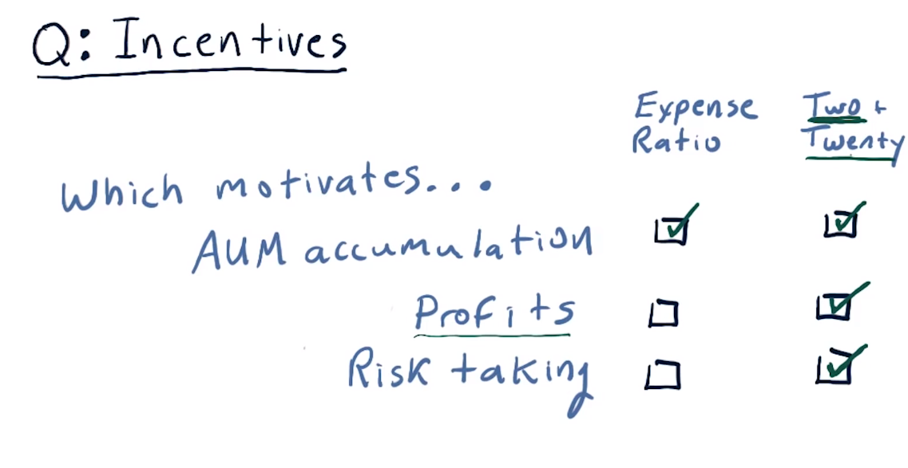
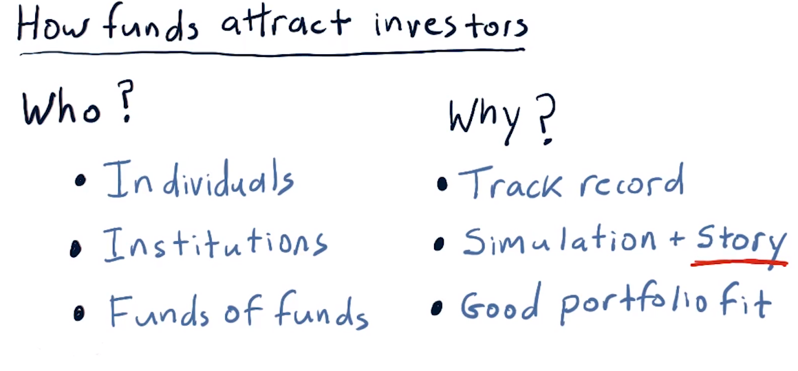
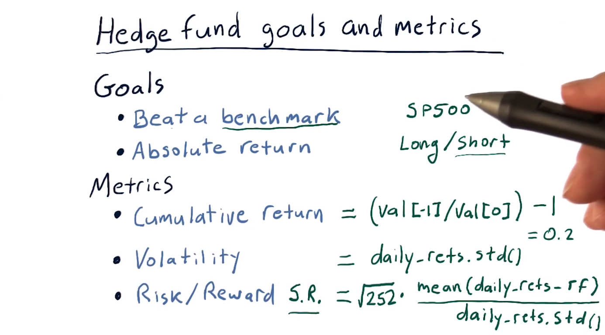
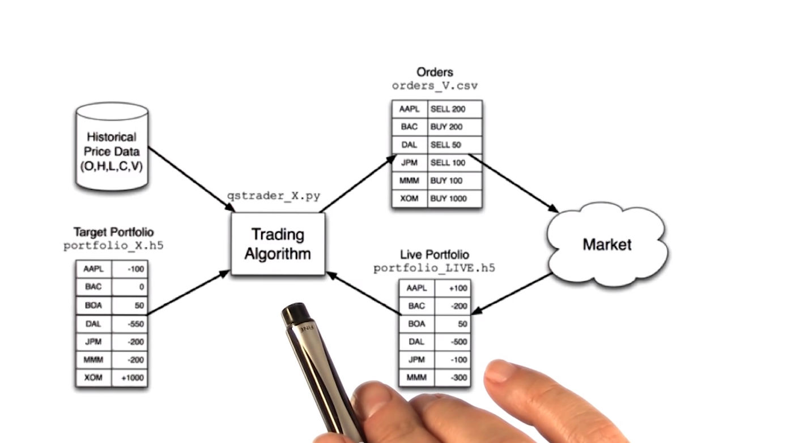
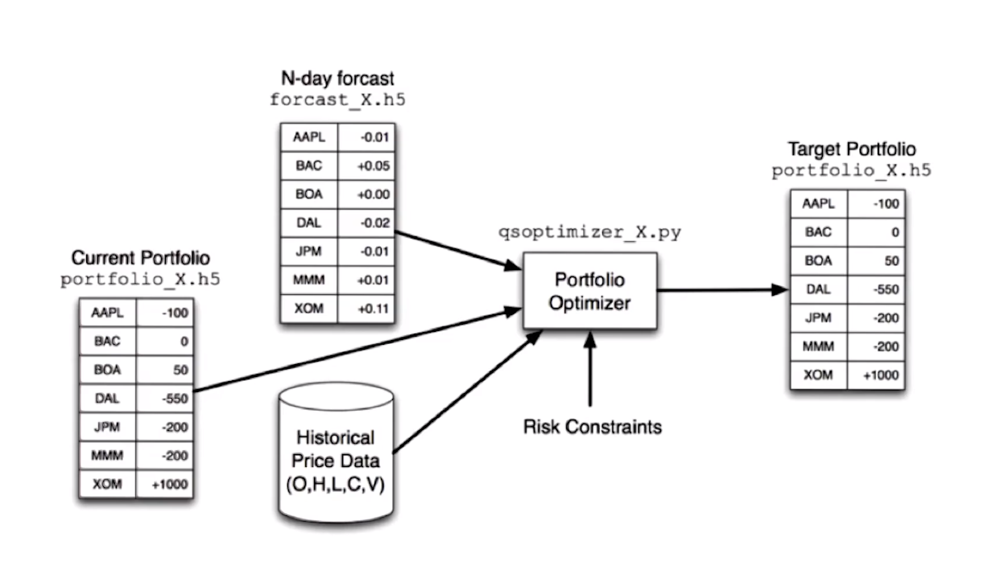
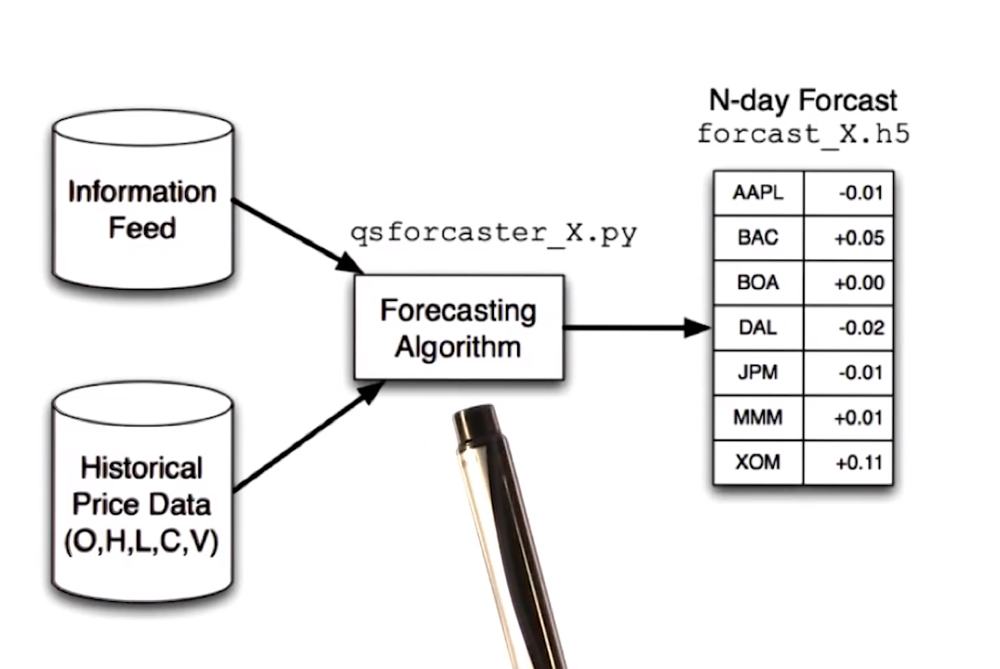

# 02-01 So you want to be a hedge fund manager
## Overview
**Welcome to the first lesson of computational investing.**

Welcome to the first lesson of computational investing.

**Learning Goals and Assumptions**

My assumption in terms of learning goals is that you want to be a portfolio manager.

**Understanding Portfolio Management**

What is it you need to know, and what motivates you?

**Factors Influencing Motivation**

It depends on what type of fund you manage and what your incentives are.

**Motivation and Compensation**

Your motivation is probably compensation.

**Impact of Fund Performance on Compensation**

And your compensation depends on the type of fund you manage and how well your fund performs.
## Types of funds
**Introduction to Portfolio Management**

As I mentioned, we're assuming that you want to be a portfolio manager of some sort and there are several different sorts of portfolios you might manage.

**Types of Portfolios**

So let's take a look at a few of those. There are many different types of funds, of course, but three broad classes that we'll take a look at are ETFs or exchange-traded funds, mutual funds, and hedge funds.

**ETFs: Exchange-Traded Funds**

ETFs, or exchange-traded funds, are very much like stocks in the sense that you can buy and sell them. You can observe their prices intraday. You can trade them just like stocks on the stock exchange. They represent baskets of stocks. Sometimes they represent other instruments like bonds and so on. But it's very well-known and they publish what it is they're holding. Accordingly, ETFs are very transparent and they're very liquid.

**Mutual Funds**

Mutual funds are somewhat similar to ETFs in the sense that they have a declared goal or mechanism. In other words, they're, for instance, trying to track the S&P 500 or some other such goal, but they're a little bit different. First of all, you can only buy or sell mutual funds at the end of the day. So at the end of the day they add up all the things they hold and compute a net asset value, and that's the value at which you can buy or sell shares of a mutual fund. They don't disclose exactly what they're holding except once every quarter, so they're accordingly less transparent. They're less transparent because since their last disclosure, you don't know exactly what they might have bought or sold. Still, they're somewhat transparent because they have stated goals and you know what they're trying to achieve, similar to, say, an ETF that might represent the S&P 500. There are also mutual funds that represent large-cap stocks like the S&P 500.

**Hedge Funds**

Hedge funds are even less transparent than mutual funds. In fact, even to buy shares in a hedge fund, you have to enter into an agreement that is usually secret in the sense that you're not supposed to reveal the contents of that agreement. It's hard to exit a hedge fund. They usually require you to put your money in and leave it there for some number of months, sometimes years, and when you take it out, you can't necessarily take it out all at once. Hedge funds don't ever have to disclose what they're holding, not even to the investors in the hedge funds. Now, that might dissuade you from wanting, say, to invest in it if you don't know what they're holding. On the other hand, if they show you good performance, you might want to invest. They will usually describe to clients what their strategy is and so on to encourage clients to invest. Accordingly, hedge funds are not transparent at all.

## Liquidity and capitalization
**Understanding Financial Terms**

I mentioned a couple of words while I was describing these different kinds of funds that I wanted to touch on real quickly.

**Liquidity in Investments**

I said liquid a couple of times. What that means is the ease with which one can buy or sell shares in a particular holding. Stocks are extremely liquid. ETFs are liquid in the same way, in other words, you can go to a stock exchange, you can buy an ETF and sell an ETF. It's priced just like a stock, but when you buy it, you're buying shares of multiple stocks instead of just a single stock. But ETFs are liquid because they're easy to trade. They're also liquid in many cases because there's so much dollar value trading in them each day. If you look up an ETF on say Google Finance or Yahoo Finance, you can see how much volume is traded each day. And ETFs with higher volumes are even more liquid.

**Understanding "Cap" in Stocks**

I mentioned large cap. What cap means here is capitalization or in other words, how much is the company worth according to the number of shares that are outstanding, times the price of the stock. So, some really huge cap stocks, say like Apple are worth many, many billions of dollars. So when I say large cap stocks, that's what I'm referring to. There's also small cap stocks that are similarly, have lower value.

**Clarification on Stock Prices**

And one thing to mention as long as we're on this topic, is the price of a stock really only relates to what one share is selling at. It doesn't relate to the overall value of the company. We'll get into all of these topics a little bit later.

**Recap of Fund Types**

Now to recap, there are at least these three types of funds. There are electronically traded funds, which you can trade like stocks on a stock market. There's mutual funds, that are a little bit harder to get in and out of, but you can trade them on a daily basis. You usually have to go through a specific broker. You can't just trade them on your own, and finally hedge funds require a specific agreement to trade into or out of. Okay, those are the three major types of funds.

## What type of fund is it
**Understanding Fund Symbols**

Now as you might have discovered, these four- or five-letter symbols represent particular funds.

**Examples of Fund Symbols**

So VTINX is a mutual fund. DSUM is an ETF. FAGIX is another mutual fund. You probably discovered the Bridgewater Pure Alpha doesn't have one of these symbols, and that's because it's a hedge fund.

**Purpose of Fund Symbols**

These guys have symbols, these short several-letter abbreviations, so that they can trade more easily on exchanges that have hundreds and thousands of different assets that are being traded. Whereas when you go to engage with a hedge fund, it's just a one-on-one relationship. Hedge funds typically have no more than 100 investors, whereas all these other types of symbols have thousands and maybe even millions of investors.

**Differentiation by Fund Type**

Finally, SPLV is an ETF. A couple of other things to mention. It's fairly common practice that mutual funds have five letters and ETFs have four or three. Again, you can see this mutual fund has five letters. And this is another ETF with four letters. Okay, on to more fun.

## Incentives for fund managers
**Understanding Fund Management Compensation**

We talked already about some of the differences between Exchange Traded Funds, Mutual Funds, and Hedge Funds. And those differences that we talked about are primarily having to do with how they're traded and how visible, what their holding is to those who invest.

**Importance of Fund Manager Compensation**

Another very, very important sort of difference is how are the managers of these funds compensated? In other words, there's some sort of rule for each one that shows how the fund managers make money. And that's very, very important because the manner in which they're paid incentivizes them to trade or act in certain ways.

**Introduction to Assets Under Management (AUM)**

Before I get started, though, I have to introduce one concept here. It's called assets under management or AUM. And this is the buzz word that simply means how much money is being managed by the fund? It's important because for all of these, part of the compensation is a percentage of the AUM.

**ETF Manager Compensation**

The managers of ETFs are compensated according to an expense ratio which is simply some percentage of AUM. Expenditure issues for ETFs are usually pretty low. They vary from as low .01% or, one bit as that might be called, to as high as 1%. But one that's up to 1% is fairly high and pretty unusual.

**Mutual Fund Manager Compensation**

Mutual fund managers are also compensated using an expense ratio. These are somewhat higher than ETFs. They range from a low of, typically, about 0.5%, to some that are very high, up to 3%.

**Explanation for Compensation Differences**

Now, what's the reason for this difference? Well, mutual fund managers will tell you that the way they manage funds requires much more skill. They have much more discretion than those who are managing ETFs. ETFs usually are tied to an index. As an example, a popular ETF, SPY, is supposed to track the S&P 500. And, all that an ETF manager has to do in that case is just make sure that they are holding all the stocks and the S&P 500. Mutual funds, on the other hand, supposedly use more skill and therefore, they can charge a higher expense ratio both for the cost of research and also for their skill.

**Hedge Fund Manager Compensation**

Finally Hedge funds are a completely different breed in terms of how their manager's are compensated. They follow the old model called two and twenty which means 2 or 2% of AUM, plus 20% of the profits. So as you can see, it's higher than both of these other methods. And most importantly, it includes this component relating to profits, that 20%.

**Clarification on Investor Returns**

Now, one or two other things to clarify here. What I've been talking about is the way that the folks who manage these funds are compensated. Separately, if you are an investor in one of these funds, in other words, you give your money to one of these types of funds to be managed, your return is based on how much the value of that fund increased and in most cases that increase is subject to what happens to the economy or what happens in the markets.

**Further Explanation with Example**

Let's look at a more detailed example of this two and twenty structure.

## Two and twenty
**Example: Calculating Compensation in a 2 and 20 Situation**

Consider this example for the 2 and 20 situation.

Assume you're a hedge fund manager and that you've been managing a fund of \$100 million, and that over the course of a year your skill has resulted in an increase in value of that fund by 15%. So over that year, the fund grew in value from \$100 million to $115 million.

**Calculation of Compensation:**

What would your compensation be?

So it's 2% of AUM plus 20% of profit.

- The two-component works out to be $2 million.
- The 20% component is 20% of the \$15 million profit we made which is $3 million.

So the total compensation for this year for the hedge fund manager would be about $5 million.

**Clarification on Calculation:**

Now one question that some people might have is, hey is this two-component 2% of \$100 million or 2% of \$115 million, and it depends on the hedge fund of course. And it depends on when they take snapshots to do accounting. The full answer is probably it's going to be a blend somewhere between \$100 million and $115 million.

**Trends in Hedge Fund Compensation:**

This structure Two and Twenty has been assailed lately and it's very rare now to find a hedge fund that offers rates that high. They're much lower now. One and Ten. Things like that.

So the Two and Twenty was in the heyday of hedge funds in the 90s and early 2000s. Nowadays they are typically a little bit lower. There are some Star hedge funds that charge more. For instance, ASC Capital, which is no longer operating to the public anyways, that charged as much as 40%, so it was 4 and 40. However, most hedge funds you find today will be somewhere between Two and Twenty or lower.

## Incentives quiz 
**Consideration of Incentives for Fund Managers**

I want you now to think a little bit about these incentives that we talked about. I want you to think about if you were a fund manager and you had one of these incentives, what would it incentivize you to do?

So for instance, think about making profits. If you believe that an expense ratio compensation structure more strongly motivates profits, then click there. If you think two and twenty is a stronger motivation, click there.

Now it's okay, if you think it's about equal or there's no difference, for you to click both. Give it a go.

**Consideration of Incentives for Fund Managers**

With regard to accumulating assets under management, the expense ratio approach really most strongly motivates that. Although I wouldn't count too much off if you also clicked two and twenty because of course the two part of two and twenty is assets under management. But, if you were strictly driven by expense ratio, you're going to be applying most of your energy towards accumulating assets so that you'll have a higher return. In other words, as a portfolio manager, you'll get more money.

Profits are different, ETF's and mutual fund managers are not compensated for making profit. Especially when you consider, say, ETFs, exchange traded funds. They're just supposed to track a particular asset or index, and they should be good at that. It's not up to them whether that index goes up or down. So two and twenty is the structure that most compensates for profit because it has this twenty component that is indeed part of that profit.

With regard to risk taking, an expense ratio based fund really is not incentivized to take risks at all. If they take risks, there's no compensation for it. Under the two and twenty model though, they are incentivized to take risks because that's how they can get to profits. Also, because they're always going to get this two percent, even if they take huge risks and don't make a profit, they're always going to get that two percent. So they're incentivized to take a risk because A, there's not too much of a penalty and B, if they take a risk and make profits, then they'll be compensated more.

## How funds attract investors
**Types of Investors in Hedge Funds**

From here on out I'm going to assume that you want to be a hedge fund manager.

**Individuals**

Individuals, in other words, a single person that wants to invest in a fund. Of course, these are typically very wealthy folks. Keep in mind that hedge funds typically can only have up to 100 investors. So they want each of those investments to be fairly large so that they can manage, of course, a significant amount of funds. So the individuals who invest in hedge funds are typically, as I said, very wealthy.

**Institutions**

These are things like very large retirement funds, like CalPERS out in California. These are university foundations like the Harvard University Foundation or the Georgia Tech Foundation. In other words, institutions, very often non-profit institutions that have a large sum of money that they need to keep somewhere. And of course, they'd like to see an accrual in value, so that's one reason they look to hedge funds.

**Funds of Funds**

What funds of funds do is they group together the funds of many individuals or institutions. So for instance, you might be an individual that could, say, invest in one hedge fund, but you'd really like to get the advantage of investing in several funds. So you might allow your money to be collected by a manager of funds of funds. And then that manager would gather together all these assets and pick carefully several hedge funds to invest that money in.

**Criteria Considered by Investors**

Besides knowing who your investors might be, it's critically important to know why they might invest in your fund. How can you present the case to them that will convince them that they should let you manage their money? Here are at least some of the criteria that folks like this would consider before investing in a hedge fund.

**Track Record**

So if your fund has a great track record, that's, of course, some of the best evidence that it's going to continue to work well. Many institutional investors will want to see a good track record for at least five years before they'll invest in a particular fund. Now if you're a young whippersnapper hedge fund manager and you don't have five years yet, what are you going to do? Well, what you can do is simulate or backtest your strategy, and investors will consider these simulations. But that simulation has to be backed by a very compelling story describing that strategy. In other words, you've got to have a reason for why this method works and it needs to make sense.

**Fit within Portfolio**

And finally, they consider how your strategy fits within their portfolio. In other words, if your strategy is for large cap S&P 500 stocks, and they've already got that covered with another fund, they might not consider you. However, if you, for instance, are looking at small cap growth stocks, and they don't yet have that part of their portfolio filled, they'll give you some more thought.

## Hedge fund goals and metrics
Sure, here's the organized transcript:

### Hedge Fund Goals

So, when an investor is considering a particular hedge fund, they want to know, what are the goals for the hedge fund? And they'll also want to know the results of certain metrics. Let's take a look at goals first. Now, you might say, of course, my goal is to make money. Well, it's a little bit finer than that, or a little bit more subtle than that. There are, of course, other potential goals, but these two are the primary types of goals that hedge funds go after.

#### Beating a Benchmark

One type is to beat a benchmark. What does that mean? Let's suppose, for instance, that you've got a strategy that looks at the stocks that are in the S&P 500, there's 500 of them of course and you're especially smart at picking out the good ones. So you might build a hedge fund whose goal is to beat the S&P 500 index as a benchmark because you're wise at selecting among all those, which stocks are going to outperform? And, of course, the overall index has the good stocks and the bad stocks, so you're going to do better because you picked the specific good ones.

An important component of the benchmark model is that many benchmarks, like the stock market as a whole, for which S&P 500 is a good representative, go down. And it is of course natural that a portfolio consisted of stocks from this index might go down as well. So, even though both the index and the fund go down, you can outperform the index by going down less. So, this kind of fund that is tagged against a benchmark can still meet performance goals if it goes down. So long as that index is going down more.

#### Absolute Return Funds

That brings us to absolute return funds. Their goal is to provide positive return no matter what. These funds are usually long/short, which means they make positive bets in stocks they think are going to go up. And they make negative bets in stocks are going to go down. We'll talk about shorting a little bit later. In any case, their objective is to make slow gradual positive return no matter what. Often, these types of funds don't make the same percentage gains as the beat a benchmark fund, but they have very low drawdowns. In other words, when the market takes a bit hit, they often don't.

### Measuring Performance

The next question is well, how do we measure how well that fund is meeting those goals? We talked about these metrics in the mini course manipulating financial data in Python, but we'll repeat it just a little bit here to remind you, and also to bring those folks up to speed who didn't complete that course.

### Hedge Fund Metrics

#### Cumulative Return

Cumulative return is a measure of, given the funds I started with, how much more did I end up with after a certain amount of time? So suppose we have an array of values of our portfolio, where zero is the first value, and minus one is the very last one. We can easily compute cumulative return by dividing that last value by the first value and subtracting one. So for instance if we made 20% over a year this would end up being 0.2.

#### Volatility

Volatility is a measure of how rapidly and aggressively the portfolio goes up and down in value and of course lower volatility is better. Volatility is simply measured as the standard deviation of daily returns.

#### Sharp Ratio

Our last factor here which is a measure of the ratio of risk to reward is typically measured using sharp ratio, and the sharp ratio is calculated like this. Sharp ratio is also sometimes called risk adjusted reward. So, you can consider that to be reward divided by risk. A reward is our average, daily return minus the risk-free rate. And our risk is simply a measure of that standard deviation of daily returns or volatility. We multiply that ratio by the square root of 252. That is how many trading days there are in a year and remember we're always working with daily returns. So that's why we use this 252 number.

### Recap

So recapping, hedge funds have goals, typically either to meet a particular benchmark or to gain absolute return. And then metrics by which we judge how well they accomplish those goals. So, cumulative return, how much do they make over a period of time? Volatility, how volatile were they over that time? And then risk adjusted reward or sharp ratio.

### Choosing Benchmarks

One thing I want to mention before I leave this topic with regard to benchmarks is the benchmark you choose should depend on the expertise you have. So let's suppose you're an expert in Eastern Europe. And you're great at picking stocks in emerging markets in Eastern Europe. You should select some benchmark that represents that similar kind of investing. And there are indexes that represent emerging markets in eastern Europe. There are also other funds whose values you might use as a benchmark or let's say your expertise is in banks. You might choose an index for the banking industry and show that you can beat that.

## The computing inside a hedge fund

### Hedge Fund Computing

Hedge funds are among the most computationally demanding environments I know of. They have infrastructure requirements like huge databases, significant network connectivity, low latency and high bandwidth connectivity, real-time processing, and so on. I want to show you as an example, the typical kinds of computing that goes on inside a hedge fund to motivate you for this class. In other words, this isn't exactly the way all hedge funds work, but this is just to give you a taste for how many hedge funds work. And you'll see, I think, that computing and computational capabilities are core here.

#### Trading Algorithm

So we're going to work backwards from the market back towards the sort of back office of the hedge fund. The way things work are we have certain portfolio that is which stocks we have and whether we're in positive or negative positions with regard to them. The trading algorithm here is central. It's interacting with the market, observing the live portfolio. And what it's trying to do is to get this live portfolio to match some target portfolio. So somewhere further back inside the hedge fund we've decided what this target portfolio ought to look like. In other words, how many shares of Apple, how many shares of Delta Airlines we should have, and so on, and this trading algorithm is trying to get us there.

So it's comparing target with live. And then to move this portfolio towards that target, it's issuing orders. So it sends order like buy 200 shares of Apple to the market. Those orders get executed or not, and that updates the live portfolio. Now one reason this kind of trading algorithm is important is you don't want to execute everything at once. In other words, suppose we wanted to take a very, very large position in Apple. If we were just to send an order, hey, buy me 10 million shares of Apple, that would affect us detrimentally in the sense that the price for Apple would probably rise. And we would not get a good execution.

So this training algorithm takes those sorts of things into consideration as it moves our live portfolio to be more close to the target portfolio. In fact, sometimes it takes days to enter a particular position. So this doesn't necessarily happen all at once. And there's many, many different types of trading algorithms that have been invented to solve these problems.

#### Target Portfolio

Here's that target portfolio, and here is some of the data and computing that could go into computing that target portfolio. So from somewhere, machine learning perhaps, we have a forecast of what stock prices are going to be at some time into the future. And that can of course drive what our target portfolio ought to be for today. In other words, if we're forecasting that BAC is going to go up, this might represent that we think it's going to go up 5%. We might want to increase our holdings in that. If we think that Apple, for instance, is going to go down, we might want to decrease our holdings.

#### Portfolio Optimizer

This forecast informs this algorithm called a Portfolio Optimizer. That works to balance the risks and rewards for a balanced portfolio that considers volatility and correlation between different stocks and so on. We're going to talk a lot about portfolio optimization later in this course. Some other considerations that go into Portfolio Optimizer are historical data, open, high, low, close, and volume. We can look at that historical data to inform how stocks are correlated or uncorrelated to one another, and also of critical importance is our current portfolio. It may be the case that if we're holding something, we don't want to exit it immediately because we'd be penalized by rapidly selling it. So this optimizer takes all this information into account to get to the target portfolio that our trading algorithm is working to drive us towards.

#### N-day Forecast

Now one more stop along our road here at the computing infrastructure of a hedge fund is to look at how do we come up with this N-day forecast. By N, N might be five days or ten days or whatever. So here's this N-day forecast, and we've got some kind of forecasting algorithm. This is very often in the form of a model, in fact, a machine learning based model. And creating these sorts of forecasting algorithms using machine learning is the focus of the last mini-course in this group of mini-courses. Anyhow, how do we get to this forecast? Well, we've usually got some sort of proprietary information, again, historical data, and our forecaster crunches all that data to build a model and create a forecast.

So, bringing it all together, that's the computing in a hedge fund. And we've also spent some time talking about what might motivate you as a hedge fund manager.
