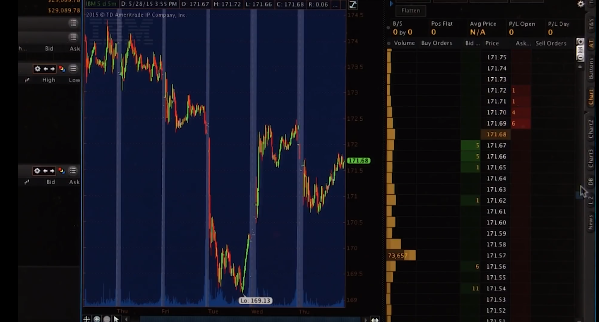

# 02-02 Market Mechanics

## Overview

### Online Stock Trading

You may have experienced trading stocks over the Internet, using a platform like E-Trade, Interactive Brokers, or another online broker.

### The Buying Process

What happens when you click buy? It's probably a lot more complicated than you think.

## What is in an order

### Building a Portfolio

The way that you build a portfolio, or buy stocks that you hold in your portfolio, is by issuing orders. Usually, you send those orders to a stock broker, and they take care of executing them for you.

### Order Creation and Execution

We're going to dive now into the details of what happens when you create an order, and how it gets to the market and back. And how things can go wrong, and how they can potentially go right.

### Components of an Order

The first stop there is to think about what is actually in an order. What are the components of an order that can go to a stock exchange? Here is all the information that must go into a well-formed order.

### Order Details

First of all, I need to know are you looking to buy or sell shares of a stock? Next is the symbol. This is an identifier for the stock or perhaps ETF that you want to buy or sell, for instance IBM or SPLV. Next, you need to tell your broker how many shares you want to buy or sell. Stocks and ETFs and other assets are sold in units of shares, not by amount of money. So you don't tell your broker I want $100,000 worth of Apple, you tell your broker I want a thousand shares of Apple.

### Types of Orders

Next, you need to tell your broker whether this is a limit order or a market order. Let's start with market first, market means you're willing to accept a good price but essentially whatever price the market is currently bearing. And I'll show you in a moment how that's determined. A limit price means you don't want to do any worse than a certain price. For instance, suppose you're selling some stock. You might specify I don't want it to be sold below a particular price. Or if you're buying stock, you might say, I don't want to pay more than a certain amount to get it.

### Limit and Market Orders

If you're issuing a limit order, then you have to say what the corresponding price is. If it's a market order, you're not able to specify that price because essentially when you issue the market order you're saying I'll take whatever price comes back.

### Example Orders

Let's take a look at a couple example orders. Here's one. Buy IBM, 100 shares, limit, 99.95. So this means I want to buy 100 shares of IBM at no more than $99.95. Another example, sell Google, 150 shares, market. Notice there's no price with this because we're going to take whatever the market price is.

### Order Execution

So let's look at what happens when these orders reach the exchange.

## The order book

A key construct at most exchanges is something called the order book. Each exchange keeps an order book for every stock that they buy or sell.

### How It Works

Let's suppose you've just issued an order to buy 100 shares of IBM with a limit price of 99.95. And let's suppose for the moment that this arrives at the New York Stock Exchange and so far today nobody's put in any orders. So your order is the first one and they'll use it as the basis to start building their order book. So yours is the first entry in the order book. And it simply shows somebody has bid 99.95 for 100 shares of stock.

### Public Knowledge

And this is public knowledge. People can view this and see, okay, there's interest in buying shares of this stock. Now, they don't know who has made this bid. The exchange knows that it's you that's made that bid. But they see that there's interest in 100 shares. Now others may send in orders like yours. And this number just keeps getting larger depending on how many orders come in. When this is displayed publicly, people just see that okay, there's interest maybe from various people. And 1,000 shares of IBM at 99.95.

### The Selling Process

So far nothing's been bought or sold yet though because we don't have anybody willing to sell. Well, let's suppose a sell order comes in. Sell IBM 1,000 shares, limit of $100. Well, there's nobody willing to buy 1000 shares at $100. So, the exchange again, is going to have to add this order to its order book. And this will be our first ask. We've got now our first ask as part of our order book.

### Fleshing Out the Order Book

Now let's say more and more orders come in. And it fleshes out our order book a bit. Here's our order book as it's fleshed out a bit, as orders have come in. We've got a number of asks, which are requests to sell stocks, and a number of bids, which are requests to buy.

### Market Order

Suppose now we get a market order to buy 100 shares of stock. Here's our new order, and here's what happens. The Exchange looks at its order book and it sees, yes, we have lots of shares for sale here. We have to give the client the lowest price so we'll give that client 100 shares of these that are priced at $100.

### After the Transaction

So, that means now we've only got 900 left here, we take that 100, give that to the client who put in the order and this is the state now of our order book after that transaction.

## Up or down 
Consider this order book now for a moment. Look at how many shares we have for sale and how many shares people want to buy. Do you think the price of this stock, in the next few minutes, assuming this order book, is the price going to go up or down? Check the box that you think is correct.

### Stock Price Movement

The correct answer is that the stock is probably going to go down in price, because there's much more selling pressure.

### Market Orders

Imagine for a moment if we put in two market orders. Suppose there was a market order to sell 500 shares. What would happen? Boom, you would sell 100 at 99.95, 50 at 99.90 and so on, the price would immediately go down.

### Impact of Buying and Selling

Consider on the other hand if someone put in a market order to buy 500 shares, well the price wouldn't budge. You'd just get 500 of these 1000 for sale but the price would still remain between $100 and 99.95.

### Further Explanation

I'll explain that a little bit more as we provide some specific examples on what happens to the order book as different orders come in.

## How orders affect the order book

Okay, so to understand better how the order book works and how exchanges work, let's look at a couple more example orders. For brevity, I'm leaving out the symbol IBM. This is all about IBM, so just keep that in mind.

### Market Order Example

A market order comes in to buy 100 shares at market. So again, we see that there's 1,000 shares that people are willing to sell. And the exchange has to give the best price to the client, and so we give the client 100 shares at this price. So what happens, the order comes in. 100 shares go away. And now the order book has changed just so that there's 900 shares available here now instead of 1,000. And the execution price is $100.

### Limit Order Example

Let's consider now a limit order. Someone wants to buy again 100 shares at a limit of 100.02. So, again looking at the order book, again, we can satisfy that order and, again, at $100. So we're saying that we want to pay no more then $100.02. So again, we can execute at 100, and now this goes down to 800 shares instead of 900 being available. And the execution price for this transaction again, is $100. And note also that that's less than that limit price of $100.02.

### Market Order to Sell

Let's look now at one last order, a market order, where someone wants to sell 175 shares. So that comes in. And we have 100 shares available at 99.95, so those get sold. And there's none left there at that price. So a 100 shares get executed at 99.95. So to get this 75 more shares, we need to go deeper into the book. So we'll take these 50, 0 left there. We still need 25 more shares to meet this order for 175. So we go even deeper into the book and take some of these.

### After Transactions

So after all these transactions, the order book has been changed quite substantially. And this client gets a 100 shares at 99.95, 50 at 99.90, and 25 at 99.05. So all together, there's some average price at which this was executed for that client. Note now that as time has gone on, the executed prices have been decreasing. Clearly we're seeing that's a consequence of there's much more sell pressure than buy pressure.

### How Exchanges Use Order Books

So that's how the order book works and how exchanges use order books to facilitate transactions between their clients. This is what an order book looks like in real life. Here in the middle, we have prices. And on either side here, we see the order sizes. We're seeing here, sell orders and how large they are, and buy orders and how large they are.

### Order Execution

The prices that they're being executed here are in the middle. As you can see, it's changing dynamically and rapidly as trades are executed.

### Price Chart

Here we see a price chart showing how the prices are going up and down as these trades are being executed.

### Live Order Book

So that's a live order book. This is using the trading platform called Think or Swim.

## How orders get to the exchange

### Order Routing

We've talked about what orders are and we've talked about what happens to them when they get to the exchange. Let's talk now about how do the orders get to the exchange from you. Well, here you are with your laptop connected to the internet and you've just entered an order to buy some stock. Your buy order goes over the internet to your broker. Your broker in turn is connected to several exchanges and the broker determines where to route your order based on information it knows about the exchanges.

### Exchanges and Order Books

Let's suppose the exchanges we're looking at are New York Stock Exchange, NASDAQ and BATS. For the stocks you want to buy, each one of these exchanges has its own order book. Your broker has a computer located at each exchange and it queries the computer to say, hey, look at the order book and tell me the prices there.

### Order Execution

Query has added all the exchanges and your broker gathers and examines that information and based on that, routes your order to the exchange that has the best price. Let's say that's New York Stock Exchange. Your order enters the exchange, gets executed and the price comes back to your broker and forwarded back to you and you get a confirmation.

### Order Books and Prices

Now it turns out that because this is happening constantly all the time, there's multiple brokers, hundreds of thousands, millions of people making orders that the order books at each of these exchanges tends to be pretty similar. In other words, the prices don't differ much between one or another and it's this sort of pressure that keeps prices the same across these different exchanges.

### Internal Exchange Scenario

Let's consider another scenario. Suppose there's another client of this same brokerage, Joe and that Joe wants to sell some stock. Well, the brokerage can observe, hey, I've got some clients who want to sell, some clients who want to buy. I can just make that exchange internally and I don't even need to go to the exchanges. This can be advantageous for the broker, because a broker doesn't have to pay now fees to the exchanges for this transaction to occur.

### Legal Requirements

However, according to the law, both the seller and the buyer have to get prices that are at least as good as they would've gotten if they had gone to an exchange. And eventually, at the end of the day, this transaction has to be registered with one of the exchanges. Usually, it's recorded at the exchange where that particular stock is homed.

### Different Brokers and Dark Pools

Let's consider one more example. In this case, Lisa also wants to sell some stock, but she uses a different broker than you do. There's one more kind of entity out there called a Dark Pool that acts as an intermediary between brokerages and exchanges.

### Role of Dark Pools

The Dark Pool is looking at the order books of the various exchanges and they're often making predictions about which direction stocks are going to go. They actually pay the brokers for the privilege to look at the orders before they go to the exchanges. And if they see an advantageous trade, they'll go ahead and take it.

### Routing Through Dark Pools

So in this case, this sell might be routed through the Dark Pool from broker two to broker one. And again, the transaction never makes it to the exchanges. In fact, these days, 80 to 90% of what they call retail traders orders never make it to the exchanges. They're either executed internally within a brokerage or filled using a Dark Pool.

### Brokerages and Dark Pools

The brokerages in the Dark Pools argue that, that's just fine, because both partners in this transaction are getting prices at least as good as they would get at the exchanges on the order books. But they're saving money, because they don't have to pay the exchange fees.

### Recap

We've talked so far about how the exchanges work and how the order book facilitates transactions at the exchanges. Now we've talked about how orders get to exchanges or not.

### Exploiting Inefficiencies

Now, let's take a look at how hedge funds can exploit inefficiencies in this system.

## How hedge funds exploit market mechanics

### Order Routing and Execution

Okay, let's suppose you live in Seattle and you want to make an order. You look at the prices on your computer. You see what you think looks like the prices are going to go up. So you enter a buy order. Now your order travels all the way across the country. And because you use ETrade it stops in Atlanta, and then it hops to New York City. Let's now zoom in and see what's happening at the Exchange in New York City.

### Co-located Computers and Hedge Funds

So, we've zoomed into the New York Stock Exchange, and the order book there is visible to you over in Seattle, but also to computers that are co-located. So, let's suppose our hedge fund has a co-located computer. And it's observing the order book as well. Now here's the advantage that this co-located hedge fund has. Its computer is located maybe a 100 meters away from the main exchange computer that holds the order book.

### Time Advantage

So that 100 meters amounts to 0.3 microseconds in terms of how long it takes information about the order book to reach that hedge fund computer. You, on the other hand, are located at least 2500 miles away. And that means when this order book changes, it takes 12 milliseconds at least for that information to get to you and 12 milliseconds at least for your order to reach the exchange.

### Order Book Exploit

So, here's how what I call the order book exploit works. The hedge fund is continually observing the order book. And remember, it takes only 0.3 microseconds for it to do that. Based on what it sees at the order book, it thinks the price is going to go up. The hedge fund buys some of that stock based on what it sees. You're thinking the same thing, so you've entered buy. And your order starts making its way across the country.

### Order Execution and Profit

While your order is coming across the country, indeed, the price is going up, because other orders are coming in from other places. Eventually, your order makes it to the New York Stock Exchange and is executed there. And, in fact, the hedge fund sells it to you. And over this few fractions of a second, the hedge fund has bought some stock, watched it go up and sold it. It might have held this 100 shares of stock for only a few milliseconds and made a profit.

### Exploiting the Order Book

The hedge fund is exploiting essentially all these people remotely located around the country observing the order book, essentially late sending in orders that it can take advantage of because it can act much earlier before those orders from around the country arrive. There's certainly many sorts of ways to exploit market mechanics.

### Geographic Arbitrage Exploit

Here's one more. I call this one the geographic arbitrage exploit. Suppose we have exchanges located some distance away and because they're located distantly prices may drift a little bit up or down.

### Hedge Fund's Strategy

Now a hedge fund might place their own servers at each of these Exchanges and connect them with an ultra high speed dedicated connection. And they're observing the order book, the prices at both these locations all the time and comparing notes.

### Price Difference Exploitation

Let's suppose a difference emerges that in New York the price is a little bit lower, in London price is a little bit higher. The fund will immediately buy in New York, and sell in London. They're not necessarily even transferring those same shares. They might buy some set of shares in New York City, and sell a different set in London. But they're getting that difference in price advantage immediately.

### Market Inefficiencies

Now, because hedge funds do this, because they're monitoring the prices that exchanges all over the world, these sorts of differences rarely arise and when they do it's just by fractions of a cent. But those differences do arise because there are inefficiencies in the markets and there are hedge funds there to pick those pennies up off the ground. Again, this is geographic arbitrage.

## Additional order types

### Types of Orders

You may have heard of other types of orders besides just buy and sell, market and limit. It turns out though that the exchanges only execute these types of orders. They don't execute those other types. You might wonder, okay, how do those other types of orders come into being? These other types of orders are implemented by your broker.

### Broker's Role

The way that works is you enter this order type and the broker holds that order and watches the market until the conditions that you specified are met and then when those conditions are met, the broker sends your order to the market accordingly.

### Examples of Orders

Here are some examples:

- **Stop loss**: This is a kind of order where you say when the stock drops to a certain price, I want you to sell it.
- **Stop gain**: Similarly, when the stock reaches a certain higher price, I want you to sell it.
- **Trailing stop**: This is a combination of stop loss but also an automatically changing value for when that criteria is met. So for instance, you might have this trailing stop remain say, $0.10 behind the price. So as the price goes up, the value at which you would want to sell the stock goes up along with the price, but when it drops down below, then that stop loss is triggered.

### Selling Short

Probably the most important and most impactful kind of order the brokers implement for you is something called selling short. What selling short allows you to do is take a negative position on a stock, in other words, you sell a stock short if you believe its price is going to go down. Keep in mind here we're selling stock we don't even own. So how is that possible? Well, again, it's possible because the broker facilitates it for you. I'll explain how in just a minute.

## Mechanics of short selling: Entry

### Mechanics of Short Selling

Okay, let's step through the mechanics of short selling. It's a bit complicated, so pay attention.

### Scenario

Let's imagine the following scenario. You want to take a short position in IBM, and IBM is currently selling at $100. That's the current market price. Joe holds 100 shares of IBM. He likes IBM, he wants to hold onto it. But he's willing to lend you those shares of IBM. In fact, Joe's broker will take care of that for him. He may not even know that he's lending you the shares.

### Transaction

Let's suppose Lisa thinks that IBM is going to go up and she wants to buy IBM. So you want to sell IBM short. You don't own any shares of it. Lisa wants to buy IBM. She thinks it's going to go up. So here's what happens. You borrow that 100 shares from Joe. Now that you have those shares, you can turn around and sell them to Lisa. And in exchange for those 100 shares that you gave Lisa, she gives you 100 times $100, or $10,000.

### Recap

So let me recap that. You want to sell IBM short. Joe has 100 shares of IBM. Lisa wants to buy IBM. So you borrow those 100 shares from Joe. You immediately turn around and sell them to Lisa, and you get $10,000. The result of this transaction, after everything settles, is you have $10,000 in your account but you owe Joe 100 shares of stock. And of course, Lisa has 100 shares of stock and so on.

### Problem

Now the problem sort of arises here that Joe may decide he wants his 100 shares back. What you'll have to do is go buy them from someone and then give them back to Joe. But let's deal with that a little bit later.

## Short selling 

You've been watching IBM, which has reached about $100. You decide to short it because you think its price will go down. You short IBM when its price is $100, meaning you borrow shares and sell them immediately. After a few days, the price goes down to $90, and you decide to exit your position. You do this by buying back the shares at $90 to return to the lender.

The question is: What is your net return from this transaction? Did you make or lose money? Specifically, what is the total return in dollars from this transaction where you short 100 shares when the price is $100 and then buy to close when the price is $90?

In this scenario, you made a profit. Here's how:
That's correct! In the scenario of short selling, if the stock price drops from $100 to $90, you would indeed make a profit. Here's how it works:

For each $1 the stock drops in price, you make $100 because you've shorted 100 shares. So, when the stock price drops $10 (from $100 to $90), you multiply the $10 drop by the 100 shares you've shorted. 

So, your net return or profit would be:

$$ \$10 \times 100 \text{ shares} = \$1000 $$

This means you made a profit of \$1000 from this short selling transaction. Well done! Remember, this is a simplified scenario and actual trading would involve transaction costs and potential interest on the borrowed shares. Also, short selling can be risky if the stock price increases instead of decreases. Always consider these factors when trading.

## Mechanics of short selling: Exit

### Recap of Short Selling

All right, let's recap what happened. You borrowed 100 shares from Joe and sold those 100 shares to Lisa. So now you have $10,000 in your account, but you still owe Joe those 100 shares.

### Price Drop and Exit Strategy

Let's suppose that since that time, IBM has dropped in price and now it's selling at $90. You can make a profit from that, and you want to go ahead and exit.

### Buying Back the Shares

So you approach Lisa and say, hey, can I buy those 100 shares back? And she says, no, I want to keep IBM. Well, that's a little bit of a problem, but fortunately, there's lots of people who have shares of IBM and would be willing to sell them to you. So Lisa's now out of the picture and not part of this transaction anymore.

### Completing the Transaction

But, there is somebody else out there, Nate, who's got a hundred shares and he's willing to sell them. So you buy a hundred shares from Nate and give them back to Joe. So your obligation to Joe is now completed.

### Net Result

IBM was selling at $90 so you had to give Joe $9000. But remember you had $10,000, so the net result after everything is said and done is you've got a $1,000. And you don't have any obligation any longer to Joe.

### How Short Selling Works

So that's how short selling works. Now I personalized this story by talking about Joe and Lisa and Nate and so on. In reality, you don't have to make these personal agreements with any of these people, your broker makes all that happen. Your broker is sitting here in between all those actors and making all this happen for you.

### Potential Risks

Well, this all sounds wonderful doesn't it, but what can go wrong? It's important to remember that short selling can be risky if the stock price increases instead of decreases. Always consider these factors when trading.

## What can go wrong

### Rolling Back Time

Let's roll back time a little bit. Let's go back to where we had $10,000 in our account and we owed Joe 100 shares of stock. What can go wrong?

### Price Increase Scenario

What if, instead of going down, IBM went up to $150 per share, and now you want to exit your position? Well, again, you go to Lisa and say, hey, Lisa, do you want to sell me your shares? She says no. Well, Nate is still out there, he's willing to sell.

### Buying Shares at Higher Price

So again, you buy those shares from Nate then you return them to Joe. But this time it costs you $15,000 because the price has gone up. And remember, you've got only $10,000 in your account.

### Net Result

So the net result after all this is said and done is that you're out $5,000. So if you bet wrong when you short a stock and the price goes up, you lose money, and it can be significant.

### Recap

So to recap, we've gone through many of the different aspects of the mechanics of the market. We've shown you how hedge funds exploit the market. We've shown you different order types. And we've shown you especially the details of short selling. I'll see you at the next lesson.