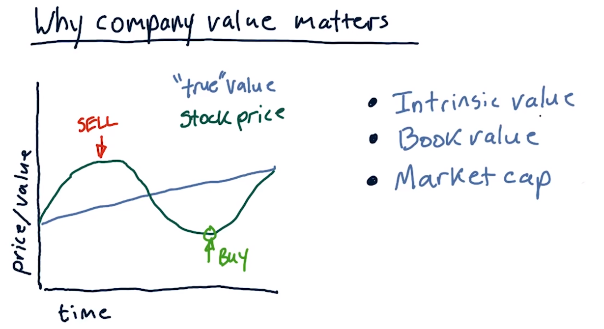

# 02-03 What is a company worth?

## Overview

#### Introduction
I'd like to show you this cool machine I have. In fact, it's one of my most prized possessions that my great uncle gave to me before he passed away.

#### The Machine as a Company
Let's pretend that this machine represents a company, and that I'm the CEO of that company. This company can take raw materials like this paper, process them, and turn them into dollars.

#### How It Works
Here's how it works. So, each year, this company can output a dollar bill reliably.

#### Question
What is this company worth?

## What is a company worth 

#### Reflection on the Previous Segment
So think about that last segment. What is a company worth if it provides one dollar every year, guaranteed every year in the future? What is that worth if you could own that company?

#### Potential Answers
So here are a couple of potential answers. One, it's worth one dollar. Another answer points towards $70, because after that, I'll be dead. Not me, I'm living beyond that. [LAUGH]

#### Infinite Worth?
Another is while I'm getting a dollar a year forever, so it must be worth an infinity number of dollars.

#### Final Thought
And, finally, this company that produces $1 a year forever is somewhere between $10 and $25 depending on interest rates.

#### Different Perspectives
So all of these answers are possibly correct depending on your point of view.

#### The Most Correct Answer
I think this one is the most correct and will be covering that in this lesson.

#### Other Reasonable Answers
But some of these other answers could be reasonable as well, so don't feel bad if we scored you wrong.

## Why company value matters

#### Estimating Company Value
So in a moment, we'll address how you estimate the value of that company that generates $1 per year. In other words, that dollar bill machine.

#### Importance of Company Value
Before we dig into that, let's spend a moment considering why does it matter how much a company is worth? This course is about buying and selling stocks, so we're going to look at why company value matters with regard to buying and selling stocks.

#### Trading Strategies
Of course, we want to buy a stock when the price is too low and we want to sell it when it's too high. In general, the value of a company goes up monotonically. In other words, it is always increasing over time. Let's assume for a moment, this is the true value of that company. We'll address in a little bit what true means, but let's assume for the moment that we have some understanding of the underlying real value of that company.

#### Market Value vs True Value
Now that true value is distinct and different from the value estimated by the market. In other words, what price the stock market says, it's worth? So on one particular day, maybe the price is higher than the true value. On some other day, maybe it's lower and on some other day, it's the same.

#### Identifying Opportunities
Very many trading strategies, which is what this course is about, focus on identifying situations where the current stock price is different from the true value. So in other words, if the stock price goes up a lot, but we know the actual company is only worth a certain amount. When it goes up high, that might be a selling opportunity. In other words, if we see the price up here and we know the true value of the company is down here, sell it. And similarly, if we see the price really low compared to what the company is worth, that could represent a buying opportunity.

#### Estimating True Value
There are many, many ways that we can estimate the true value of a company. We're going to touch on a few of them in this lesson. One is intrinsic value, this is based on the value of the company as estimated by future dividends. In other words, companies pay many companies not all, pay each year or each quarter a dividend. So it's a cash payment, if you own a share of stock, you get a certain amount of dividend. For instance, for Apple this year, it's about $2 per year. So intrinsic value is based on, if we own one share of stock, we're going to get some amount of dividends accumulated over all of the future. What's the value of the company based on that?

#### Book Value
Another is book value, which is based on the assets that the company owns. So in other words, we add up the value of all the factories that they own and so on.

#### Market Cap
Finally is market cap. This is based on the value of the stock on the market and how many shares are outstanding. So in other words, this relates to what the market thinks the company is worth.

#### Relating the Concepts
This relates to what's the value of the sum of the assets? And this one relates to, well, if I own a share of stock, how much money am I going to get over the future? And what's that worth overall in the future going forward?

## The Balch Bond

#### Intrinsic Value of the One Dollar Machine
We're going to consider now the intrinsic value of our one dollar machine. In other words, this machine generates one dollar every year. Now to understand that, we need to think about what is the future value of a dollar.

#### Future Value of a Dollar
What do I mean by that? Well, let's suppose I told you, hey look, awesome student, I promise I will give you $1 in a year. How much would you pay me today on the basis of that promise? In other words, maybe you would pay me 80 cents, and then in a year I give you $1, maybe you would pay me more. Think for a moment about how much you would pay me given my promise that I'll give you a dollar a year from now.

#### Ranking Three Assets
Okay, I want you to consider these three assets. One of them is a dollar right now, in other words, I pull a dollar bill out of my pocket and I give it to you right now. Another is, I, Tucker Balch, promise to give you a dollar in a year. Now that's a promise you can abide by, you can trust me, I'm your professor, I'm going to give you that dollar in a year. But what you need to think about is, what's the value of that promise or that bond, considering that it won't happen for a year. And finally, consider this asset where the US government promises to give you a dollar in a year.

#### Your Task
Now I want you to rank each of these assets, a one dollar bill, a United States of America bond, or a Balch promise, a Balch bond, to pay you $1 in a year. How would you rate these one through three where one is the best, where three is the worst? How would you rank these three assets? In other words, which would you rather have if you had to choose one or the other where one is the best and three is the worst?

#### Answer
So, the answer is a little bit subjective, depending on how much you trust me versus the United States government. But let's start with number one. The absolutely no question the most valuable asset among these three is number one, $1 right now, because you can take it, you can go with it, you can spend it. These other two are promises for a reward in the future.

Now among these two, I personally would value myself as number two, but it's probably more correct to say that the US government promise to give you a dollar in a year is the second most valuable. And then of course, I am number three. This exercise helps us understand the time value of money and how different entities' promises can be valued differently based on trust and credibility.

## The value of a future dollar

It should be obvious now that the value of a dollar delivered in the future, even if it comes from the US government, is worth less than a real dollar right now. A real dollar right now is worth $1. If I promise to give you a dollar in the future, it's not worth as much. So how should we estimate or think about the value of dollars delivered in the future?

#### Trust and Risk
I think we've also agreed that the United States government, promising to give you a dollar in the future, is worth a bit more, than the promise of Tucker Balch giving you a dollar in the future. But having a real dollar in your hand right now, this one, is worth the most. Why is that? You know intuitively why that is. The deeper reason is there's a chance that I won't deliver on that guarantee whereas we can be pretty sure that the U.S. government will deliver on that guarantee. So it amounts to risk.

#### Interest Rate and Present Value
And it all boils down to interest rate. We're trying to figure out the present value, or PV of a dollar that will be delivered in the future. So it's worth some fraction of this future value. Present value is worth some fraction of the future value. So here's the formula in its entirety. Present value is equal to future value divided by 1 plus interest rate raised to the i. So the i is how far into the future this payment is going to be delivered.

#### The Value of a Future Dollar
It should be obvious now that the value of a dollar delivered in the future, even if it comes from the US government, is worth less than a real dollar right now. A real dollar right now is worth $1. If I promise to give you a dollar in the future, it's not worth as much. So how should we estimate or think about the value of dollars delivered in the future?

#### Trust and Risk
I think we've also agreed that the United States government, promising to give you a dollar in the future, is worth a bit more, than the promise of Tucker Balch giving you a dollar in the future. But having a real dollar in your hand right now, this one, is worth the most. Why is that? You know intuitively why that is. The deeper reason is there's a chance that I won't deliver on that guarantee whereas we can be pretty sure that the U.S. government will deliver on that guarantee. So it amounts to risk.

#### Interest Rate and Present Value
And it all boils down to interest rate. We're trying to figure out the present value, or PV of a dollar that will be delivered in the future. So it's worth some fraction of this future value. Present value is worth some fraction of the future value. So here's the formula in its entirety. Present value is equal to future value divided by 1 plus interest rate raised to the i. So the i is how far into the future this payment is going to be delivered.

#### Example
So for instance, if it's going to be delivered right now i is equal to 0 this whole component becomes 1 and present value is equal simply to future value. In other words, if we're going to pay a $1, present value is worth $1, if in the future that future is going to be 1 year from now. It's 1 plus the interest rate, raised to the 1th power. And that is what the future value of that dollar is.

So, let's work out an example. Suppose with the United States government, because they're so trustworthy, you can negotiate a 1% interest rate. Actually, as of today, which is 2015, this 1 year interest rate is only one-quarter of a percent. In other words, interest rates are very, very low. If you work it out, the value of a $1 bill paid to you in the future, 1 year from now, at a 1% interest rate is $0.99. In other words, today, it's worthwhile for you to pay $0.99 to the US government for the promise that they'll give you a dollar in a year.

Okay, consider now the Balch Bond. So it's hard for me to sell you this asset right now for the same price as the US government because if you had to choose between me and the US government for a 1% return, why wouldn't you choose the US government? You should go with the US government because they're more trustworthy than I am. So, how can I attract you? Well, I can offer you a higher interest rate. Let's say 5%. And that works out to a value of about $0.95. In other words, in order for me to attract you to buy my promise for $1 in the future, I could only charge you $0.95.

So let's consider this in a chart form. So how much is $1 worth if I promise to give it to you today. Well, in that case, this i is equal to 0, so the present value is equal to the future value of all this divided by 1. So in all cases, if the number of years we're going to wait for the delivery of that dollar is 0, the value is $1. But what if we talk about promising you that dollar in the future. If we look at this for the US bond, in 1 year we see it's worth $0.99. If we carry that forward, it's sort of this exponentially decreasing value like that. If you look at the Balch Bond, which is, of course, not as worthwhile as the US government, you see one that decreases at an even faster rate. So in other words, at each year in the future, this $1 is worth less. 

In other words, if I promise to give you $1 in two years, it's worth less than if I promise to give you $1 in a year, and it's worth even less than if I promise to give you $1 right now. These values are different depending on what the interest rate is. For the higher interest rate assets, they decrease further into the future. In other words, a dollar delivered in the future is worth less now than the lower interest rate assets. This is due to the time value of money, which states that money available at the present time is worth more than the same amount in the future due to its potential earning capacity. This core principle of finance holds that provided money can earn interest, any amount of money is worth more the sooner it is received. This is why interest is paid or charged: money deposited in a bank account, for example, will earn interest, and money loaned to a bank or other entity will accrue interest. The bank is willing to pay for the use of the money deposited, and conversely, needs to charge interest to cover the cost of the money loaned out.

## Intrinsic value

### Understanding the Value of Future Money

#### The Original Problem
Think back now to our original problem. What is the present value of a future dollar, FV, delivered some number of years in the future, where i is how many years it is? And we use IR, or the interest rate, as a factor that affects this value.

#### Real Companies and Dividends
The analogy for this to real companies is that real companies pay dividends. In other words, if you own a share of a company, you will get some cash payment each year or each quarter. As an example, if you own one share of Apple stock, it pays you about $1 a year. Consider that you'll get that payment every year into the future. What is the value of that payment over time?

#### Risk and Interest Rate
What this interest rate relates to is how risky the company is. In other words, you're as sure that it's going to pay you that dollar every year as you are sure that the US government would pay you a dollar on a bond. Then, this IR interest rate should be the same as the US government bond rate. However, if you're less certain that this company is going to pay you at that rate, this interest rate needs to be a little bit higher. In other words, you need to expect that the company is going to pay you more in the future or that it's going to be more likely to pay you that dollar in the future.

#### Discount Rate
This is called the discount rate. The discount rate is higher if you trust the company less or you think it's more risky. The discount rate is lower if it's more certain to pay you that dividend every year.

#### Calculating Company Value
Let's suppose that after considering all the factors, you feel that it's appropriate that a company should pay you a 5% interest rate considering its risks. Now based on that, if you want to calculate what the value of the company is based on the dividends it's paying, you can take that into account in the following way.

#### Future Dividends
Essentially, what you want to do is compute what is the value of all the future dividends that it's going to pay me? So that's the sum of the dividend it'll pay you in a year. The dividend it'll pay you a year after that, and the year after that, and the year after that. In fact, you want to sum those all the way out to infinity.

#### The Equation
So what we're looking for is the sum of this equation, but over all i going into the future. We can draw on this infinite sum, in other words for i = 1, 1 year to infinity years, of the sum 1 over n to the i. So this n here is this value, and we can replace 1 here with future value.

#### The Answer
This is not a math class, I'm just going to give you the answer. The answer is that this infinite sum, in other words, some future dollar paid each year in the future over an infinite number of years, is that value divided by n minus one. Which is equal to future value divided by discount rate.

#### The Dollar Machine
So in the case of our dollar machine, we're paying one dollar each year in the future at 5% interest. So the value of our dollar machine is $20 overall.

#### The Equation
What we've just described, where future value is the dividend we're going to pay at regular intervals and DR is discount rate. In other words, what the risk of the stock equates to in terms of an interest rate we should pay. This equation tells us the intrinsic value of the company.

#### The Intrinsic Value
In other words, if we're going to pay that future value or dividend every year or every quarter going into the future, what's the value of the company on that basis, this is intrinsic value. And in the example of the company we were talking about, that creates a $1 every year. It's the value of the $1 in one year from now, next year, next year, next year, next year, continuing ad infinitum into the future. And that's 20 bucks.

## Intrinsic value quiz 

 Let's check your knowledge now. Consider a company that pays $2 per year in dividends, and a discount rate of 4%. What is the intrinsic value of this company?

#### The answer
The answer if you recall is that the present value is equal to the future value divided by the discount rate. So we've got $2 divided by 4%, or $50. Answer is $50.

## Book value

#### Ways to Estimate Value
If you recall from the beginning of the lesson, we talked about three major ways to estimate value. One is intrinsic value, which we just covered. Another is book value, which we’re going to cover now. And the other is market capitalization.

#### Book Value
So let’s take a look at book value. Here’s a classic definition of book value. It’s total assets of the company. In other words, things like property that is owned and so on, minus intangible assets and liabilities.

Intangible Assets and Liabilities
Intangible assets are things that are difficult to put a price on. They’re things like the value of a brand, or a patent, or so on. Liabilities are a little bit easier to calculate, those are just things like loans that are owed and so on.

#### Example of Book Value
So, let’s consider what’s the book value for an example company. Let’s say that a company owns four factories, and that each of these factories is worth about $10 million. These are assets, and altogether they are worth about $40 million. Suppose this company also holds three very important patents and each patent is valued at about $5 million. The value of these patents is about $15 million, but these are intangible assets that are hard to price exactly. Finally, suppose this company has one large loan. This would be under the liabilities column of $10 million.

#### Calculating Book Value
If we follow this rule that book value’s total assets, so total assets are this $40 million plus the $15 million or $55 million, minus intangible assets so we just don’t count these intangible assets. And liabilities. So all together we’ve got our total assets minus intangible assets, which is $40 million, and liabilities minus this $10 million, so in this case this company’s book value is $30 million.

## Market capitalization

#### Estimating Company Value

The third way of estimating company value is simply to let the market decide. And that's called Market Capitalization.

#### Market Capitalization Calculation

This is a simple calculation. Market Capitalization is just equal to the number of shares that are outstanding times the price.

#### Understanding Market Capitalization

So, in other words, you can look at the stock market and see what the current price is and see how many shares are owned by people. And it's just one times the other and that's the value of the company in terms of market capitalization.

## Why information affects stock price

#### Stock Market Observations

If you follow the stock market, you may have noticed that when news comes out about a particular company its stock price can change considerably. Why is that? Well, the stock price is of course the main mechanism by which investors can essentially let their view of the stock be known.

#### Investor Behavior

In other words, If they think that the company is buying less, they're going to sell and the prices are going to go down. If investors think the value of the company should go up, they're going to buy the stock and the prices are going to go up.

#### Impact of News on Stock Price

Now, why is it that this information or news affects the stock price. It's based on these things that we've covered up to now in the lesson. In other words intrinsic value, book value, and well of course, market capitalization.

#### Case Study: Impact on Intrinsic Value

But let's take a look at how it affects, say, intrinsic value. Consider a company run by this CEO and assume for the moment, that his business, his company, is to grow and sell coconuts. What if the following news comes out? The CEO is ill. Maybe he has cancer, maybe he has something else that prevents him from collecting those coconuts as effectively as he might otherwise do.

Well, certainly that should affect the stock price downward because the probability that we are going to get dividends in the future is decreasing. Either that or the amount of the dividends is going to decrease. So, if you think back to the intrinsic valuation that we talked about. The potential for reduced future dividends reduces the value of the company significantly.

#### Case Study: Impact of Sector News

Now consider another scenario where's there's an island with our original company and another company. And news comes out about the soil on the island being contaminated. That news is going to affect not only our original company, but also all the other companies on the island. So you can think of this sort of news as being sector news. In other words it relates to the sector of growing coconuts on this island and it affects all the companies in this sector.

#### Case Study: Impact of Market-Wide News

Let's consider one last scenario were we have many islands with many companies on those islands. And news that might effect all of them like sea level rising, that is going to negatively impact all of these companies. So we have examples here of companies specific news that affects the price of an individual company. Sector-specific news that effects, say, the companies on a particular island or in a particular industrial segment. And market-wide news that affects all the companies in the market.

So that's how news can effect the prices of the stock. Primarily because they reduce the expectation of future dividends. We've seen how that can affect the intrinsic value and accordingly, why people would want to pay less for that stock.

## Compute company value 

Now, I want you to try to pull all this together that we taught you so far in this lesson. I'm going to give you some specific details about a particular stock, and I want you to tell me if you would buy that stock. We're going to break it into a few individual problems, three little problems, and then we're going to ask the big question. 

We'll start with the three little problems. Consider this company. It's an airline. It owns ten airlines. Each of them is worth 10 million. It's got a brand name that's worth 10 million, and it's got a loan or liability of 20 million. All those go into the calculation of the book value. With regard to intrinsic value, it pays $1 million per year in dividends, assuming a 5% discount rate. What's that intrinsic value? 

Finally, I want you to compute the market capitalization, assuming there's one million shares outstanding and a $75 stock price.

#### Answer
Okay, for book value, brand name doesn't count because that's an intangible asset. So we've got 10 airplanes at $10 million each, that's $100 million. And we've got a $20 million loan liability. That means the book value for this company is $80 million. Intrinsic value, we calculated that before. It's just $1 million divided by 5%. The intrinsic value then is $20 million. Finally, market capitalization, remember that's just the number of shares outstanding times the stock price and in this case, that's $75 million.

## Would you buy this stock 
So let's go back to that original question. Assuming this company has a book value of $80 million, an intrinsic value of $20 million, and a market cap of $75 million. And by the way, this means that you can buy the entire company for $75 million. Our question is, would you buy this stock? And more specifically, would you buy this whole company for $75 million. Yes or no, would you buy this stock?

#### Answer
So maybe you felt like it was a tricky question because the intrinsic value is so low. It's not tricky. Here's why. You should absolutely buy the company. You should buy the whole company for $75 million. And then you should break it apart and sell all of its individual assets for $80 million. And your net return is an immediate $5 million. This is why stocks very, very rarely go below their book value. Because if they ever go very much below their book value, a predatory buyer will buy the entire company. They'll buy all the stock. Break it up and sell it for pieces. I know that's kind of depressing, but that's the way it is.

## Summary

#### Lesson Wrap Up

Let's wrap up this lesson. We've talked about three key ways to compute the value of a company.

#### Intrinsic Value

Intrinsic value, which is based on future dividends. In other words, companies pay a certain amount to their investors every year, based on how many shares they own. And this is the value of all future dividends going into the future.

#### Book Value

Book value, which is the value of the company if we split it up into pieces and sold those individual pieces.

#### Market Capitalization

And finally market capitalization which is simply the value that the market is placing on the company.

#### Stock Trading Strategies

So, many stock trading strategies look for deviations between say, intrinsic value and market cap if intrinsic value drops significantly and the stock price say is high, it may be worthwhile to short that stock. Or if say dividends are going up and the market capitalization is low it might be an opportunity to buy the stock.

#### Book Value as Lowest Price

And similarly book value provides a sort of lowest price, when stock price begins to approach book value, you can pretty much assume that the price is not going to go below book value. Or not much below it, because if it does, a predatory buyer would buy the whole company, and break it up for parts.

#### Conclusion

Anyhow, that's company valuation. And I look forward to seeing you at the next lesson. Bye bye.

