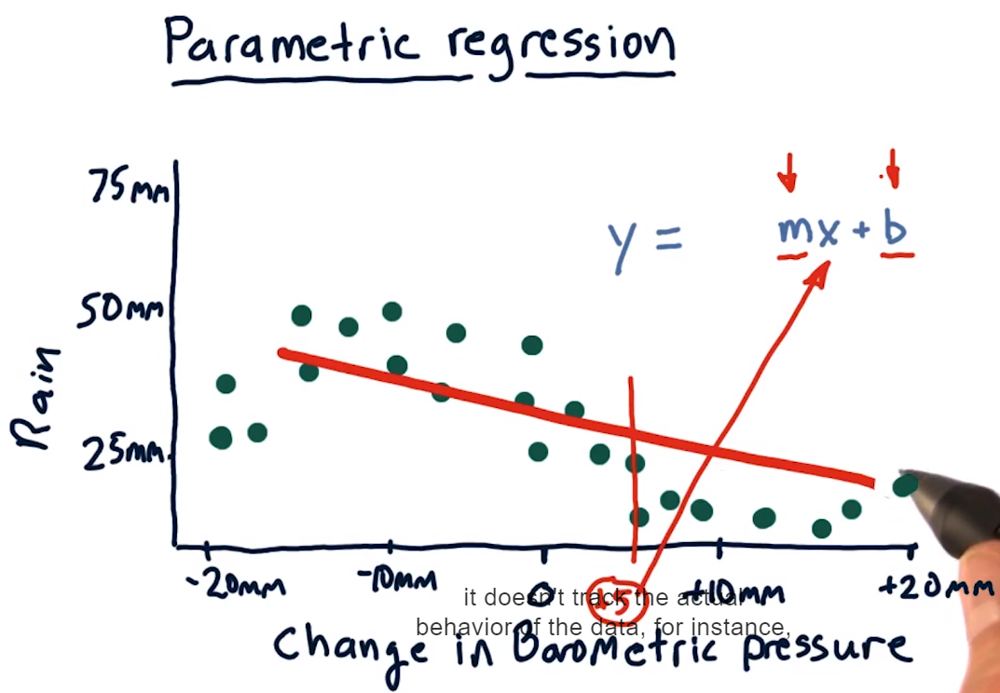
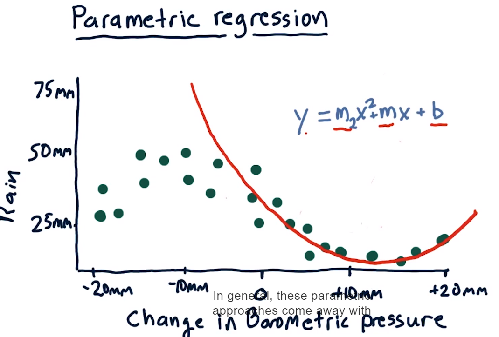
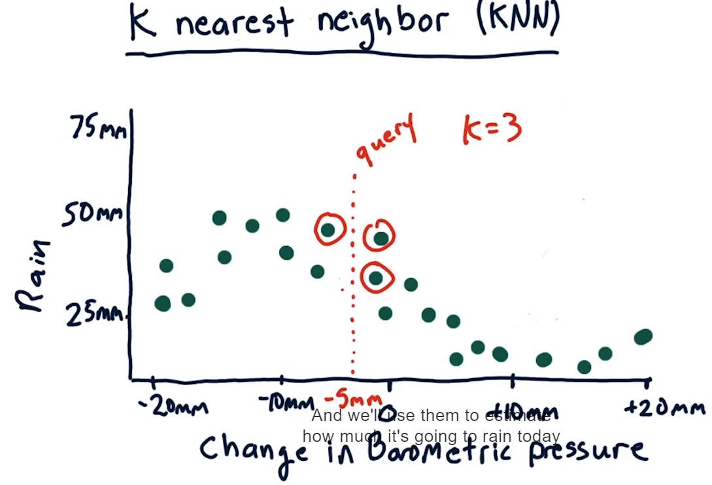
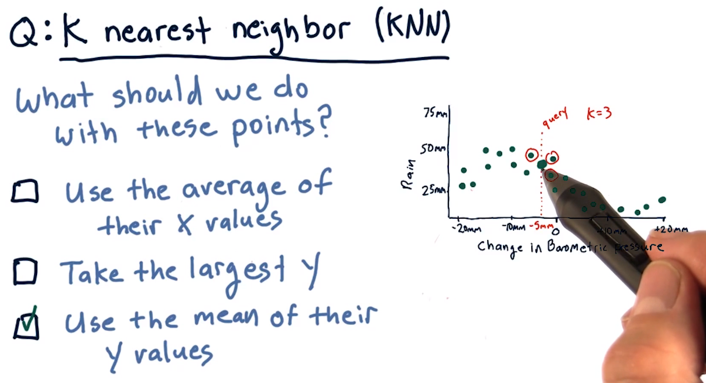
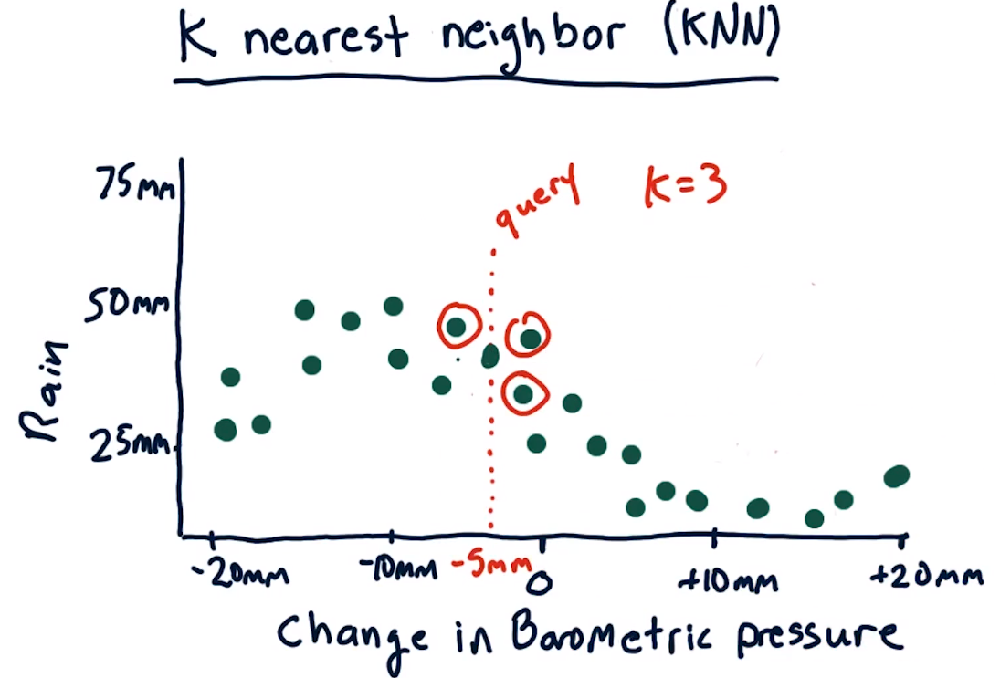
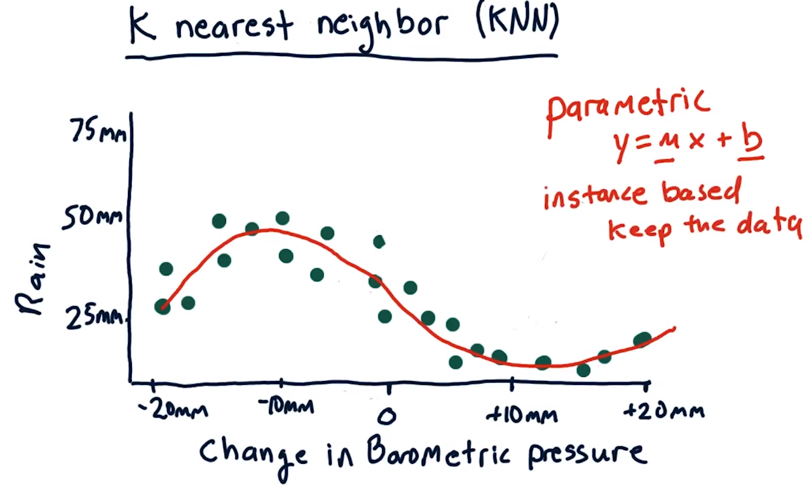
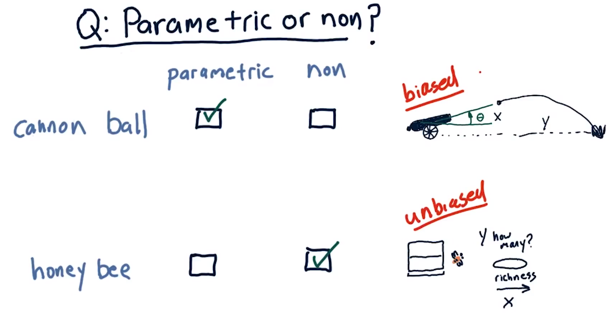
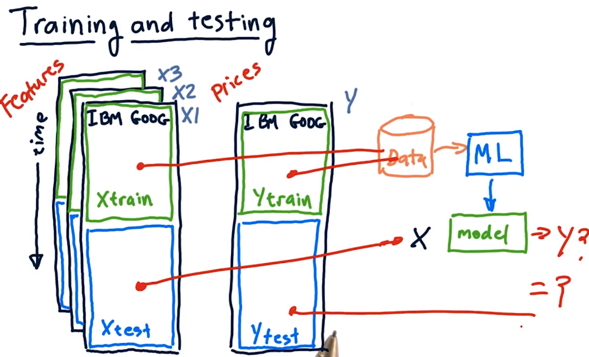
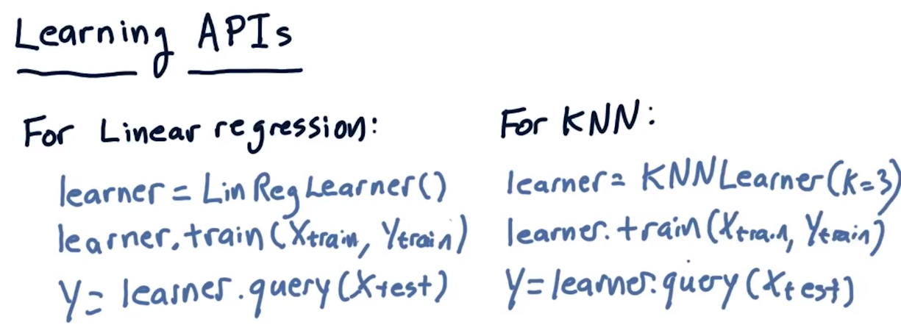
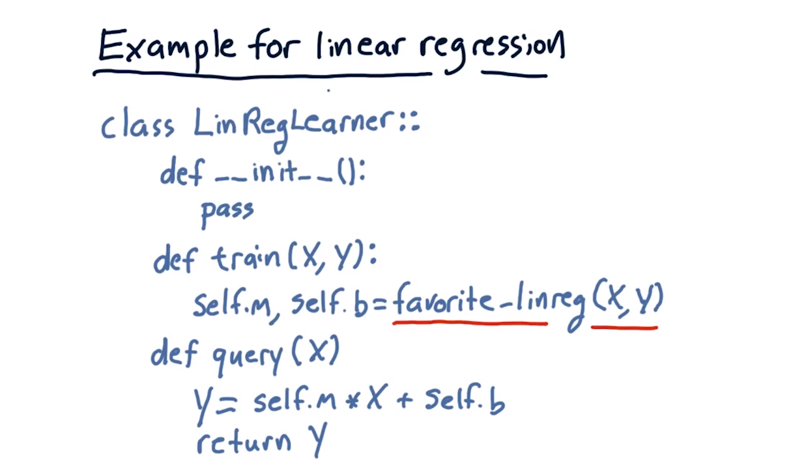

# 03-02 Regression
## Introduction
"This lesson is about supervised regression learning.

I've never much liked the name 'regression', because it doesn't describe the activity very well.

I prefer a name like 'numerical model'.

In any case, we're stuck with regression as the name for using data to build a model that predicts a numerical output based on a set of numerical inputs."
## Parametric regression
**Introduction to Parametric Regression**  
I'm going to start with parametric regression, which is a way of building a model where we represent the model with the number of parameters.

**Simple Example**  
Let's start with a simple example. Suppose we want to build a model that will predict how much it will rain today based on changes in barometric pressure.

**Barometric Pressure Trends**  
So as you may know, if barometric pressure declines, that usually means there's bad weather coming and it's going to rain. And when barometric pressure increases, it typically means that we've got good weather coming.

**Data Representation**  
On this scatter plot, each individual point represents one day. So let's consider a particular day, say here. And what this means is that on this day, the barometric pressure decreased by 10 millimeters and we had 50 millimeters of rain, about 2 inches.

**Goal of Modeling**  
We'd like to create a model based on this data that when we query it at any particular point it'll give us a prediction of how much is going to rain, so we would measure barometric pressure or its change and then estimate how much is going to rain.

**Linear Regression Approach**  
The classic solution to this problem is to fit a line to the data. So let's give that a shot.

**Linear Regression Model**  
As you probably know, this approach is called linear regression. And the model looks like this.

**Parameters in Linear Regression**  
So \( x \) is our barometric pressure change variable here, and \( m \) and \( b \) are the parameters of our model.

**Model Representation**  
Our model now is fully described by these two parameters, and if we want to estimate or query how much it's going to rain at any particular point. We measure the barometric pressure.

**Linear Regression Limitations**  
This model is decent, but it doesn't track the actual behavior of the data, for instance, in this region and in this region, so we can make a more complex model.

**Polynomial Regression Introduction**  
Instead of fitting a line we can fit a polynomial, we can add one more term \( x^2 \) and now we've got to also find this additional parameter \( m_2 \).

**Polynomial Model Representation**  
So when we find our model it's now represented by three parameters \( m \), \( m_2 \), and \( b \).

**Model Complexity**  
In general, these parametric approaches come away with a number of parameters, and the more complex the model, the more parameters.

**Parametric Models Summary**  
All of these models, whether it's linear, with just \( mx + b \), or polynomial, with a cubed or squared term, are parametric models.

**Model Learning**  
In the end, after we learn these models, we have our parameters, in this case, \( m_2 \), \( m \), and \( b \).

**Simplified Model Representation**  
And we throw away the data, and the model's represented just by these three parameters.

## K nearest neighbor
**Data-Centric Approach Introduction**  
There's another approach, it's a data-centric approach or instance-based approach where we keep the data and we use it when we make a query.

**Example Scenario**  
So here's an example, let's suppose our barometric pressure has gone down by 5 millimeters and we want to consult our model to see how much it's going to rain today.

**Query Parameter Definition**  
So our query here is at -5 millimeters. And let's suppose that \( K \) is equal to 3.

**Nearest Neighbor Selection**  
So we will find the 3 nearest historical data points to this query. And those are 1, 2, 3.

**Estimation Process**  
And we'll use them to estimate how much it's going to rain today.

## How to predict
But what should we do with these data points to find that prediction?
**Correct Answer Determination**  
The correct answer is that we should take the mean of their y values.

**Mean Calculation**  
So that'll give us an answer somewhere around here.

**Avoiding X Values Mean**  
We don't want to take the average of their x values because that would be something like 5 millimeters, and in reality you know the correct answer is around 40 millimeters.

**Utilizing All Data Points**  
We don't want to take the largest y, because we want to take advantage of all these votes that we have to get a closer, more correct answer.

## Kernel regression
**Correct Response Method**  
So again, the correct response for this query is to take the mean of the \( K \), where \( K \) is equal to 3, nearest neighbors.

**Mean Calculation**  
Take the mean of their Y-value, and that gives us a value somewhere about like there.

**Model Generation**  
If we were to repeat this process at many, many points along the X-axis, we end up with a model that looks like this.

**Model Characteristics**  
What's nice about it is it fits the data over here where it's curving this way. It fits the data over here where it's curving that way. And interpolates nicely and smoothly between all the data points.

**Data-Centric Methods Overview**  
There are a number of methods like this that keep the data around and when they make a query, they consult the data to find the answer.

**K Nearest Neighbor (KNN) Method**  
The most famous of these methods is K nearest neighbor.

**Other Methods**  
But there are others, such as kernel regression.

**Difference between KNN and Kernel Regression**  
The main way that KNN differs from kernel regression is that in kernel regression we weight the contributions of each of the nearest data points according to how distant they are. Whereas with KNN, each data point that we consider gets essentially an equal weight.

**Modeling Methods Recap**  
We've covered now parametric models, where our goal is to find parameters like \( M \) and \( B \). And we toss the data away, and then just use \( M \) and \( B \) later to make our queries. And here I've shown you non-parametric or instance-based methods where we keep the data and we consult it when we make a query.

## Parametric vs non parametric
**Consideration of Data Sets**  
So I'd like you to consider two data sets, and think about whether it would be best to use a parametric model or a non-parametric model.

**Cannonball Problem**  
Our first problem is a cannon, and we orient the cannon up or down a certain number of degrees, and we want to estimate based on how many degrees up or down it is how far is the cannonball going to go.

**Description of Cannonball Trajectory**  
The cannon's oriented at a certain angle, boom, the cannonball comes out, and it follows some trajectory like this, and [SOUND] splats over here, so this angle theta is our x, and this distance, how far it went, is our y.

**Data Collection for Cannonball Problem**  
And so we take the cannon, we orient it at many different thetas, and we measure how far the cannonball goes. And that's our data.

**Honeybee Problem**  
Here's another problem from animal behavior. Let's suppose we have a beehive, and we want to estimate the behavior of the bees.

**Behavior Estimation**  
In other words, how many of them will be attracted to this food source as richness of the food source increases?

**Description of Honeybee Behavior**  
So in other words, our x is the richness of the food source, and our y is how many.

**Comparison of Problems**  
The reason this is a different sort of problem than, say, that cannonball problem, is it's not clear that as we increase the richness of the food, that necessarily more bees will come.

**Prompt for Analysis**  
Consider these two problems. The cannonball problem, we're trying to build a model for how far will the cannonball go depending on what is x, the angle at which the barrel is aimed. And the honeybee problem, how many honeybees will visit a food source as we change the richness of the food source from, say, poor to rich.

**Parametric vs. Non-Parametric Model Question**  
Do you think this problem is best solved by a parametric model, or non-parametric model for each one? So go ahead and enter your guesses and I'll tell you what I think the answer is.

**Expert's Analysis**  
So in my view, this type of problem is best solved by a parametric learner, and this sort of problem is best solved by a non-parametric learner. And here's why.

**Parametric Model Suitability**  
For this problem, you can start with an equation, you can look it up on the net or whatever. That will express an estimate of how far a cannonball will go given this angle. What's missing are some parameters of that equation that reflect the velocity of the cannonball coming out and so on. But just by taking certain measurements of how far the ball goes at different angles, you can use a parametric learner to find those parameters. The key thing here is that you can start with an estimate of the underlying behavior of the system in terms of a mathematical equation that expresses how it behaves.

**Non-Parametric Model Suitability**  
Now, in the cases of the honey bees, we really don't know, we don't really have a guess of what that underlying mathematical equation might look like. And if you don't have a guess, it's better to use a non-parametric or instance-based model because it can fit any sort of shape. Another way to put that is that this model is biased, in the sense that we have an initial guess of what the form of the equation is. This solution is unbiased because we don't know. We're raised to think biased is a bad thing, but if you go into the problem already knowing the form of the solution, it makes sense to take advantage of that bias, and aim your solution toward that bias.

**Reflection on Pros and Cons**  
Let's reflect on the pros and cons of each approach. For a parametric approach, we don't have to store the original data, so it's very space efficient, but we can't easily update the model as more data is gathered. Usually, we have to do a complete rerun of the learning algorithm to update the model, thus for parametric approaches, training is slow but querying is fast. For non-parametric approaches, or instance-based, we have to store all the data points. So it's hard to apply when we have a huge data set, but new evidence can be added easily since no parameters need to be learned, adding data points doesn't consume additional time, thus training is fast, but querying is potentially slow. Most importantly, these nonparametric approaches avoid having to assume a certain type of model, whether it's linear or quadratic or so on. And therefore, they're suitable to fit complex patterns where we don't really know what the underlying model is like.

## Training and testing
**Data Consideration for Machine Learning**  
Consider now the data that we're going to use. We're going to have features that we've computed, these are things like Bollinger bands and momentum and price change and things like that. We're going to use these features to try and predict prices or price changes. So this is our X data, and if we've got multiple features, we've got multiple dimensions in X. This might be X1, X2, X3, and so on. And this is our Y data, which we're trying to predict.

**Importance of Out-of-Sample Testing**  
In order to evaluate our learning algorithms in a scientific manner, we need to split this data into at least two sections. A training section and a testing section. If we trained over the same data that we tested over, the results would be suspicious because we should obviously be able to do very well if we test over the same data we trained on. This procedure of separating testing and training data from one another is called out of sample testing. This is a very important and essential technique.

**Data Splitting for Training and Testing**  
We'll call the X data that we use for training, Xtrain and the Y data that we use for training, Ytrain. Similarly, the data we'll test on will be split into X and Y sections, Xtest and Ytest. So the general idea here is that we'll take our Xtrain data and our Ytrain data, run that through our machine learning algorithm which might be linear regression or KNN to generate a model. We can then test the accuracy of that model using this data.

**Time Orientation of Data**  
Something that I didn't mention is that in this class, our data is time-oriented. So, as you move downward, we're going forward in time. We typically split the data up according to time. We train our model on older data and test it on newer data. It's generally frowned upon to do the reverse. You might argue, well this data's different than that data. It's still out of sample. But there are certain look-ahead biases that can occur if you were to train on later data and test on earlier data.

## Learning APIs
**Standardized API for Machine Learning Algorithms**  
As part of this class, you're going to have to write some software, particularly for machine learning algorithms. It's useful if we standardize on what the application programmer interface ought to look like for the code you're going to write. So here's what it looks like.

**Linear Regression API**  
For a linear regression learning algorithm, your API ought to implement something that works like this:
- A constructor that creates an instance of one of these learners, which is now learner.
- A method called train that can take our training data and train the model.
- A query function that takes a list of X values that you want to test and returns a list of Y values according to what the model thinks they should be. These Y values, in turn, are the ones that we'll compare to Y test to see how well the algorithm works.

**KNNLearner API**  
Our KNNLearner ought to have the same methods. The only difference is the constructor here has this additional argument, K, which would allow you to set how large you want K to be. So if K is 3, that means you use the 3 nearest neighbors. But it also has a train and a query function, just like linear regression.

## Example for linear regression

**Pseudocode for Linear Regression Learner Implementation**  
Now, I'm going to show you some pseudocode for how you might implement this API for a linear regression learner.

1. **Constructor (init)**  
   - Define our class as LinRegLearner.
   - The constructor is really easy. For the linear regression learner, we actually don't have to do anything when we instantiate an instance of the learner. So we just use pass, which means do nothing.

2. **Training Method (train)**  
   - Takes an x and a y, where x can be multidimensional.
   - Fit a line to the x and y data, trying to find an m and a b (parameters for the linear equation).
   - Use any number of linear regression algorithms available as part of SciPy and NumPy to find the linear equation or the parameters m and b.
   - Stuff the output into m and b.

3. **Query Method (query)**  
   - Passed in x and supposed to predict y given that x.
   - Remember, x can potentially be a list of x's and multidimensional.
   - Multiply x times m and add b to get y.

4. **Summary**  
   - This is literally how short your LinRegLearner can be.

5. **Generalization to KNN API**  
   - The KNN API will look exactly the same.
   - Having the same API allows easy mixing and matching, trying training and querying with different algorithms to see how they compare.
