# 03-03 Assessing a learning algorithm
## Overview.
**Introduction to Supervised Regression Learning**

We've posed the general problem of supervised regression learning and introduced two algorithms that can solve it.

**Algorithms for Supervised Regression Learning**

- **Linear Regression:** Linear regression creates parametrized models.
  
- **K-nearest Neighbors (KNN):** KNN is a non-parametric instance-based method.

**Variety of Algorithms**

There are in fact many algorithms that can solve this problem.

**Pros and Cons**

Each algorithm has its own pros and cons.

**Assessing Algorithms**

In this lesson, we'll look at various methods for assessing those algorithms.

## A closer look at KNN solutions.
**Evaluation of K-nearest Neighbors (KNN)**

As we begin now looking at how to evaluate various machine learning algorithms, let's start back with KNN and look a little more closely at the sorts of solutions it provides.

**Analysis of KNN Behavior**

Let's start with our training data, and remember we've got pairs of X and Y, so each one of these dots represents one training tuple. And I'm just making this data up, of course. Suppose we were going to query this KNN model over in this region. Say right here at this point.

**KNN Query Process**

Well, the nearest three. Let's use K=3 here. The nearest three are going to be these. And remember, we take the mean of their value to get the value at that query point. So if we query from here all the way to about here, our model is going to take the mean y value of those, so the output of our model is going to look something like this. And notice it gives the same value at all these points.

**Model Behavior with Sequential Queries**

Eventually, as we query from left to right, we get to a point where this one gets dropped out, and this one gets added in. And at that point, we'll have a sudden drop about like that in the model. And we continue on like this. We'll have another drop like that. If we query our model now from left to right in very, very tiny increments we'll get the result that looks something like this. Note that indeed there are sort of jump points here.

**Strengths and Weaknesses of KNN**

Some nice things about this are that it's not overfitting the data. In other words, it's not tagging each point. A negative aspect though is at the ends there we have these horizontal lines that are no longer changing or essentially this model is not able to extrapolate like we might if we had a parametric model.
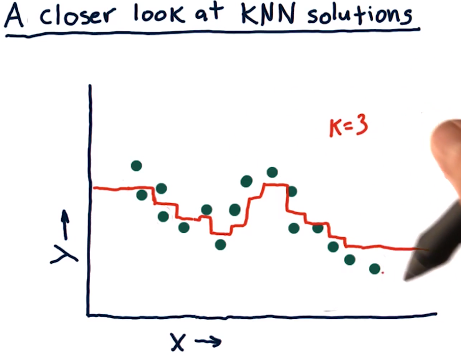
## What happens as K varies.
**Effect of Changing k in KNN Models**

Let's consider now what happens to the model that comes out when we change the value of k. So we've got three k nearest neighbor models here. Each one is using a different value of k, and I want you to match the value of k to the output model here. Okay, so I want you to look at these different charts. Each one of these models shown in red is using a different value of k. So I want you to fill in these little boxes, which chart corresponds to the value of k. 

**Options for k Values**

One of these charts was created with k=1, one was created with k=3, and another was created with k=N, where N is the total number of elements in the dataset.

**Assessment Question**

True or false, as we increase k we are more likely to overfit. I haven't told you yet in too much detail what overfitting is. Let me just give you a quick gist of it so you can answer the question. An overfit model strives really hard to match the dataset exactly. And then when we go on later to use new data or test it with test data, it tends not to do so well. So go for these two questions and I'll come back in a minute and tell you the answer.

**Model Identification and Overfitting Explanation**

**Identification of Models**

Alright, let's start with this one. One of these models was created with k=N, and it's this one. If we use all of the neighbors and all the data points, and take their average, the value of our model will be the same at every single point. Namely the mean of all the Y's of all the data points. So this one is b, as in bravo.

Let's do this one next, K=1. We know that this model is going to tag each point exactly because, when we're at that data point, we'll have exactly that value. So this model steps up and down and tags each individual point exactly. So that's a C, and this one is K=3, which we already looked at, A.

**Assessment of Overfitting**

Okay, this next question, as we increase k we are more likely to overfit, that is false. In K and N, if K is equal to one, will have the most overfit model. And as we increase K, we're less and less likely to overfit as we go forward.

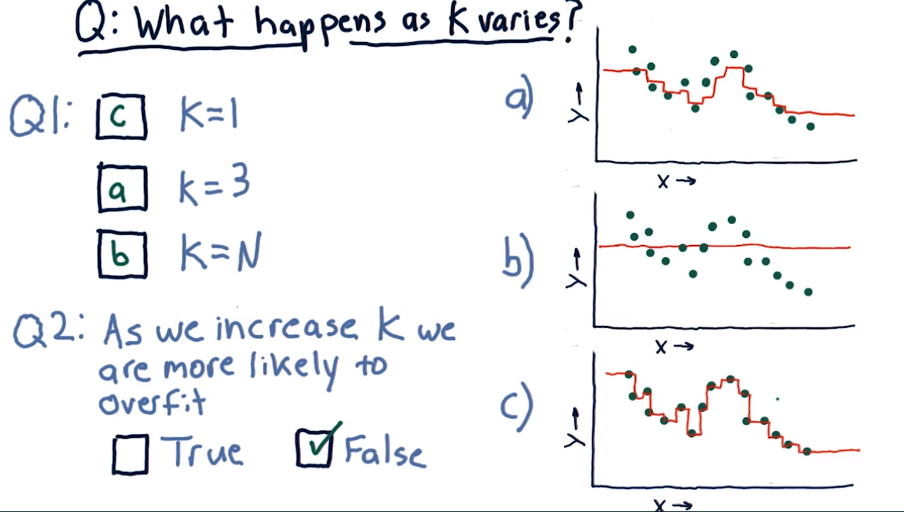
## What happens as D varies.
**Parametric Polynomial Models**

Let's consider now a similar question, but now we're using parametric models, a polynomial model of degree d. Real quick, here's what we mean when we say polynomial of degree d.

**Polynomial Model Representation**

So here's what our polynomial model looks like, it's m1 times x, m2 times x squared, m3 times x cubed plus b. This is a third-order polynomial, or a polynomial of degree d so I want you to consider d=1, d=2, d=3 and I want you to select which model over here goes with that degree.

**Assessment of Overfitting in Polynomial Models**

Then I want you to consider this question. True or false, as we increase d we are more likely to overfit.

**Identification of Polynomial Models**

Okay, let's start with d=1. Well, that's a linear model. That includes just this component. So of course, it must be a line, so it's gotta be this one. That means the answer here is c.

Now we have order two and order three to choose from. Two is a parabola, so it's including this component as well. This one's a parabola, of course. And so the answer to that one is a. And finally, that leaves only b, but let's look at why that is. When we have a cubed component, we can get this additional curl in there. Now as you notice, as we increase from order one to order two to order three, we're gradually getting closer and closer to tagging the actual data.

**Assessment of Overfitting in Polynomial Models**

So we get to this question, as we increase d we are more likely to overfit. That is true. And in fact, it can be shown with a polynomial like this that as the order of the polynomial or d reaches in, the total number of points, we actually can match the data at every point. Now a couple things to note here. One is as we go off the edge here for all these models, we're able to extrapolate in the direction the data seem to be going. And this is capability that parametric models or these polynomial models have that KNN does not.

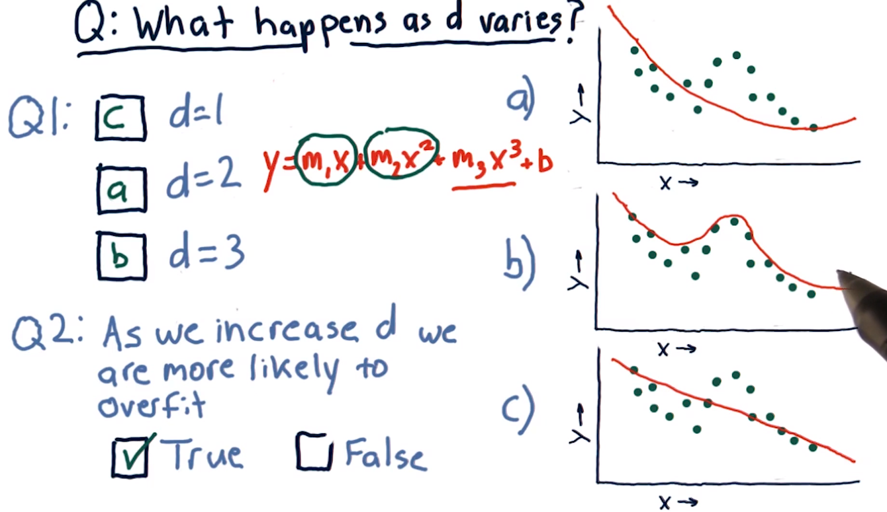

## Metric 1  RMS Error.
**Formal Definition of Error: RMS Error**

I've shown you some graphs that suggest the ways the models can fit the data, more or less closely. But let's have a more formal definition of this matching. It's called error. A standard way to measure error is called RMS error. Let me show you how to calculate this.

**Calculation of RMS Error**

Let's suppose we use this data, which are these green points, to build a model. Let's say it's a linear model like this. We can assess the model at each real data point. For instance, at this data point. And measure the difference between the Y value of the data point, and the model. And this difference is error. Now, we've got an error at every single one of these data points.

**Root Mean Squared Error Formula**

And what we do to measure root mean squared error is to take the error at each one of these points, square it, add them together, take the average, and take the square root of that. So that sounds kind of complicated, but here's what it looks like:

\[ \text{RMSE} = \sqrt{\frac{1}{n}\sum_{i=1}^{n}(Y_{\text{test}} - Y_{\text{predict}})^2} \]

**Interpretation of RMSE**

And what this is an approximation of really is sort of the average error here. But we end up emphasizing larger errors a bit more.

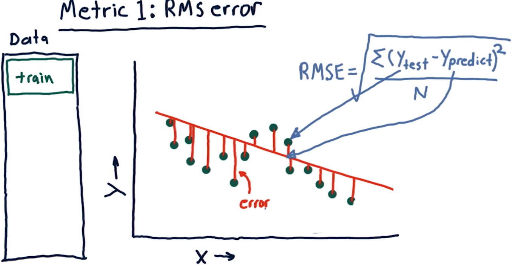

## In Sample vs out of sample.
**Assessment of Out-of-Sample Error**

Now, we just measured the error of this linear model against our original training data. We know, though, from say, k and n, that we can build models that can fit this training data exactly. So we can have arbitrarily small error against our training set. The more important measure is, what is our error out of sample?

**Out-of-Sample Evaluation**

So, what out of sample means is we train on our training set, but we test on a separate testing set of data. And, that's going to be different than our training set. So, to measure out of sample error, we look at the error from our testing set, not our training set. So we look at each one of these test points and measure the error for each one of those. So we look at these blue points instead of the green points, plug them into this equation just like before, and that's our out of sample root mean squared error.

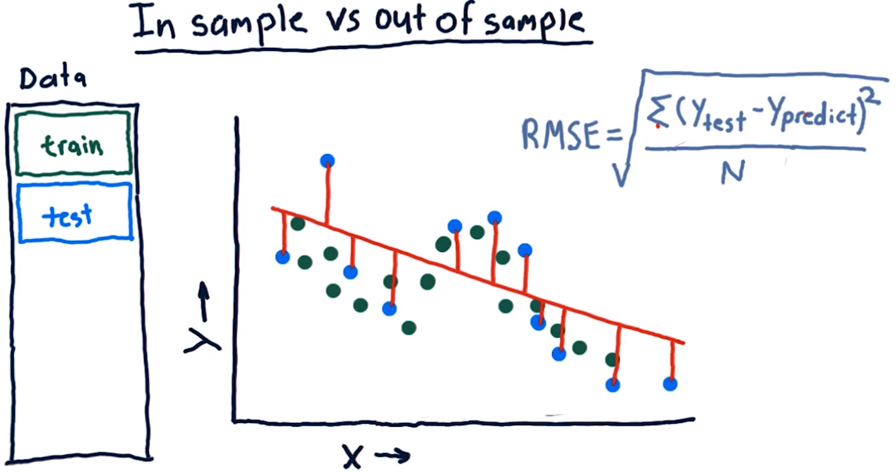

## Which is worse.
**Comparison of In-Sample and Out-of-Sample Errors**

Suppose we're measuring the error of a model that you built. Which sort of error would you expect to be larger? In sample error, in which we measure the accuracy of our model against the set it was trained on? Or out of sample error, where we measure the error of the model against a new test set that it hasn't seen before? Which is worse?

In general, out-of-sample error is expected to be larger than in-sample error. This is because the model is trained to fit the training data as closely as possible, often resulting in overfitting. When the model is evaluated on a new test set that it hasn't seen before, it may not generalize well and thus produce larger errors. Therefore, out-of-sample error is often considered a more reliable measure of the model's performance and generalization ability compared to in-sample error.

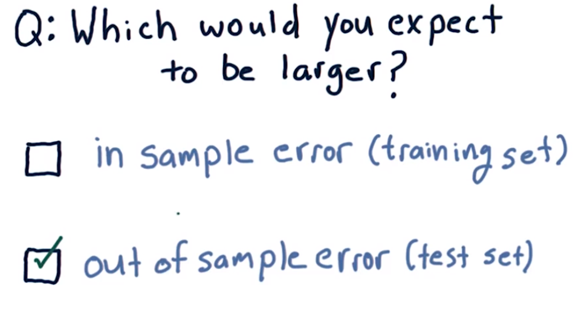
## Cross validation.
**Data Splitting for Evaluation**

Usually when researchers are evaluating a learning algorithm, they split their data into two chunks: the training chunk and a testing chunk. Training usually comprises about 60% of the data, and testing is about 40%. Now if you train and then test on that data, that's one trial and in many cases that's enough; you measured your root mean square error and that's an assessment of your algorithm. You might compare it against another algorithm.

**Challenges with Limited Data**

But one problem researchers sometimes encounter is they don't have enough data to effectively analyze their algorithm. One thing they can do is effectively create more data by slicing it up and running more trials.

**Repeated Trials for Robust Evaluation**

So what we can do is we can slice our data into say five different chunks, and then we can train here on 80% of the data, and test on 20%. That's one trial. Then we can switch things up and train on this 80% of the data and test on that, that's another trial, and so on. We can effectively get five different trials out of this one set of data.
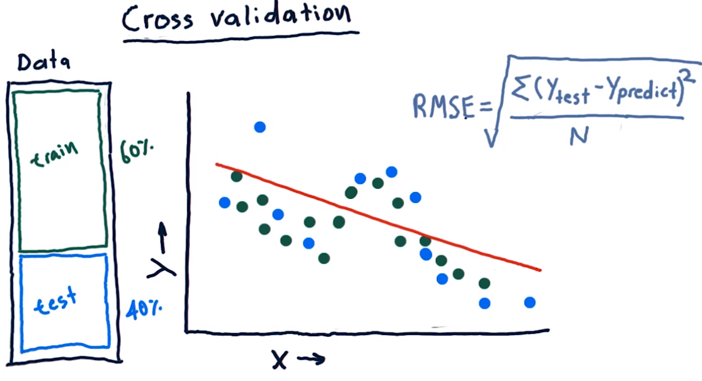
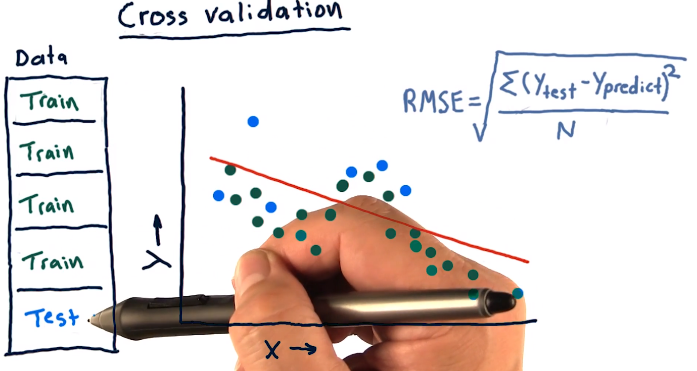
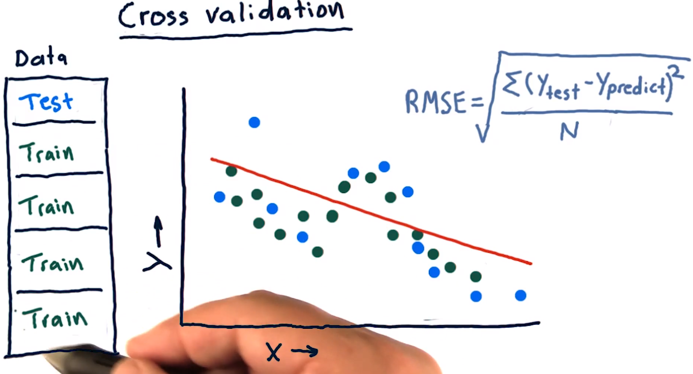
## Roll forward cross validation.
**Challenges with Cross Validation in Financial Data**

Cross validation is a great tool, but the typical usage of it doesn't fit financial data applications well. The reason is that it can permit peeking into the future. So for instance, if our training data is after our test data, that means we're seeing the future ahead of our test. Any sort of peeking like this can lead to unrealistically optimistic results, so with this sort of data we need to avoid it.

**Role Forward Cross Validation**

One way to avoid this problem is with role forward cross validation. That means our training data is always before our testing data. But we can still have multiple trials just by rolling our data forward, like this and this and this, till we run out of data.
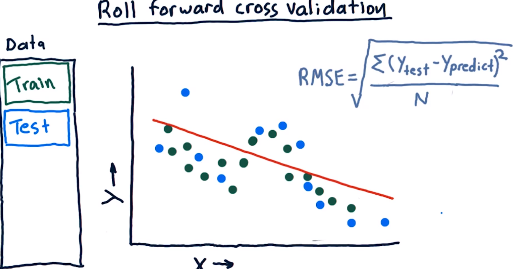
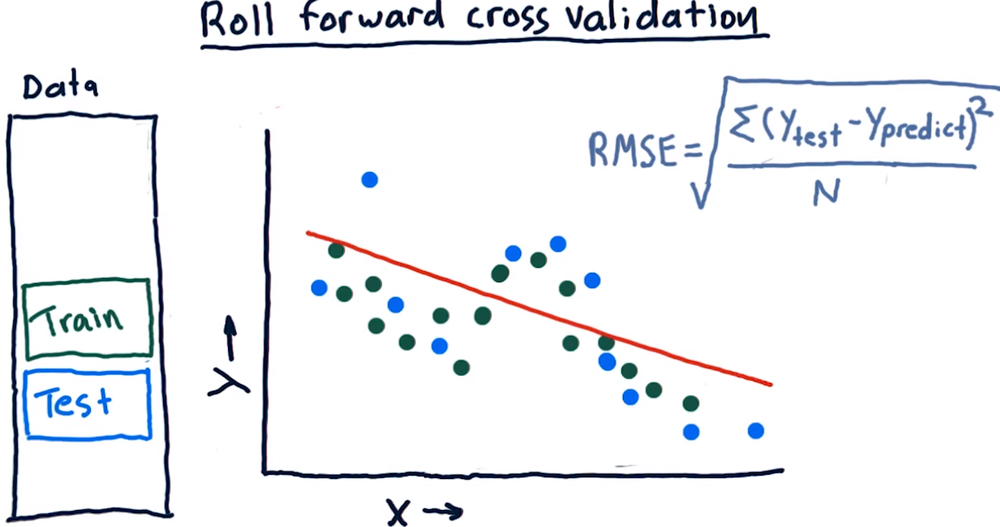
## Metric 2:  correlation.
**Visualizing and Evaluating Regression Accuracy**

Another way to visualize and evaluate the accuracy of a regression algorithm is to look at the relationship between predicted and actual values of our dependent variable Y.

**Plotting Predicted vs Actual Values**

Here's what I mean: query our model, the one that we trained on training data with Xtest, our testing dataset. The output of that query is a new vector of Y values, Ypredict. So based on this Xtest data, our model predicts this Ypredict data. We can now compare what we know to be the correct, or true, data and Ytest with what our prediction was. So this pair would appear somewhere on this chart, say here. The value along the horizontal axis here is what the prediction was, and along the vertical axis was what the ground truth is. We can plot these pairs all the way through our data.

**Interpreting Scatterplot**

Now, if this scatterplot is arranged in approximately a nice line like this, that means we've got a pretty good prediction algorithm. On the other hand, if they're not aligned so well and they look sort of like a shotgun blast, our learner is not so good.

**Quantitative Measurement: Correlation**

We can measure this property quantitatively using something called correlation. You can use the numpy function corrcoef to measure the correlation between Ytest and Ypredict. You'll get an answer somewhere between -1 and +1. Where +1 means they're strongly correlated, -1 means they're inversely correlated, and 0 means there's essentially no correlation at all between them.

**Clarification on Correlation**

One thing to point out here is that correlation isn't the slope of this line. Lots of people think that's what it is. Correlation has to do with how well-aligned the points are with the line that we fit. So if it's a nice oval that fits close to that line, we usually have a high correlation. If it's a big round thing we've got poor correlation.

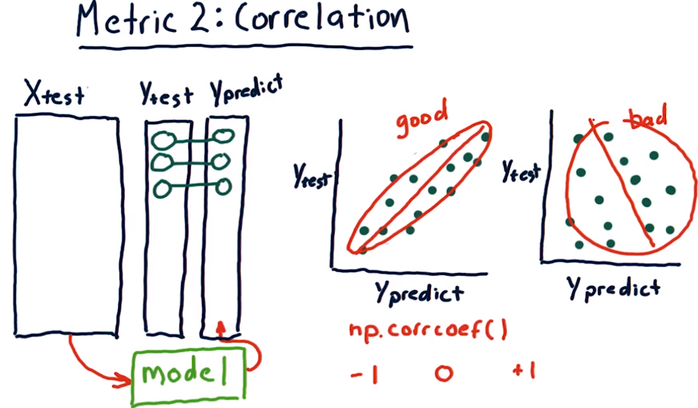

## Correlation and RMS error.
Do you think that as RMS error increases, correlation would decrease, correlation would increase, or we can't really be sure?

So in most cases, in fact almost all cases, as RMS error increases, correlation decreases.

So this would be a reasonably correct answer.

But it is possible to construct examples where as RMS error increases, correlation might increase.

So that also let's you have it correct if you checked we can't be sure either way.
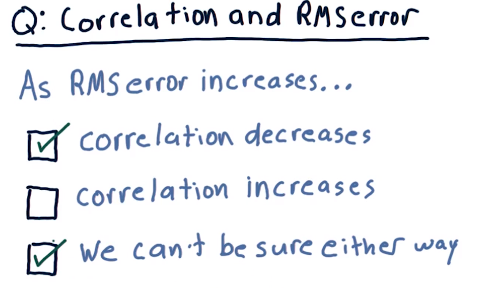

## Overfitting.
**Introduction to Overfitting**

I've mentioned overfitting before, but I haven't yet defined it.

**Prerequisite: Understanding Error**

Before we could define it, and I could give you an example, we needed to have a definition of error.

**Illustrative Example**

Let me now show you what I mean.

**Exploring Polynomial Models**

Let's consider parameterized polynomial models where we can, one at a time, add additional factors, like x, x squared, x cubed, x to the fourth, and so on.

**Graphical Representation**

Let's create a graph where we have along the horizontal access degrees of freedom, or d, the degree of our polynomial. And vertically here, we'll have the error of our model.

**Analysis of Training Set Error**

So let's measure error as we increase d on our training set. When d is smallest, our error is greatest. And as we increase d, our error drops and drops and drops. In other words, we're fitting the data in sample better and better. When finally we get to N, where we have as many parameters in our model as we do have items in our data set, our error gets all the way down to zero. This is in sample error.

**Introduction of Out of Sample Error**

Now, let's add a similar line for out of sample error. Remember that we expect our out of sample error to always be greater than or equal to in sample error. The curve will look something like this. It'll start out at maximum error, about the same as our in sample line, and as we go down, we begin to diverge like this.

**Identifying Overfitting**

Now in this region both our in sample and out of sample errors are still decreasing, but eventually we'll reach a point where our out of sample begins to increase. In fact it may increase strongly. In this area, as we increase degrees of freedom, our in sample error is decreasing, but our out of sample error is increasing. And that's how we define overfitting. This is the region where overfitting is occurring.

**Definition Recap**

So, let me state that again. In sample error is decreasing, out of sample error is increasing. And we have those two together, it's overfitting.

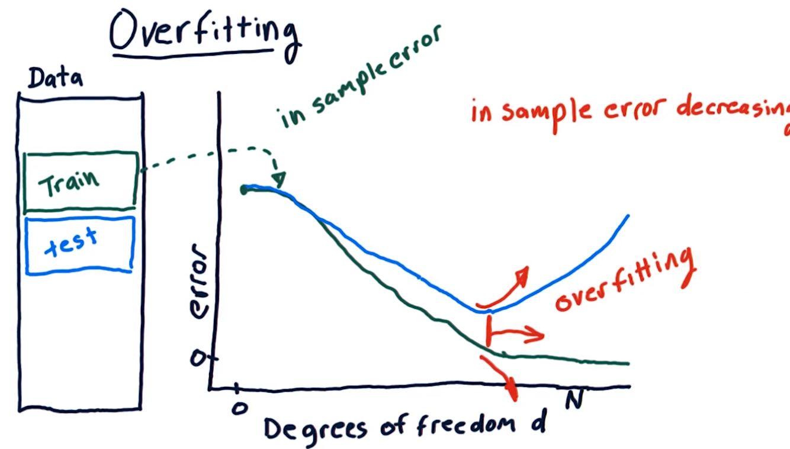
## Overfitting Quiz.
Overfitting representation for KNN?
**Identification of Correct Answer**

So the answer is b.

**Explanation of Tricky Nature**

This is a little bit tricky because the relationship for k and n and error is a little bit different than it is for polynomial degrees of freedom and error.

**Relationship between k and Error**

Remember that as we reduce k down to 1 our in sample error approaches 0. In fact, it becomes a 0 when k is equal to 1. And similarly as we decrease k, our out of sample error decreases. But at some point it begins to increase. 

**Clarification of Incorrect Answer**

This one is wrong because as we increase k, our error increases. So this is not showing that relationship correctly.

**Additional Commentary**

And this is just garbage that I threw in there to see if anybody would bite.

**Localization of Overfitting Region**

Now the region here in which overfitting is occurring is here because remember, as out of sample error increases, and in sample error is decreasing, that's where overfitting occurs.
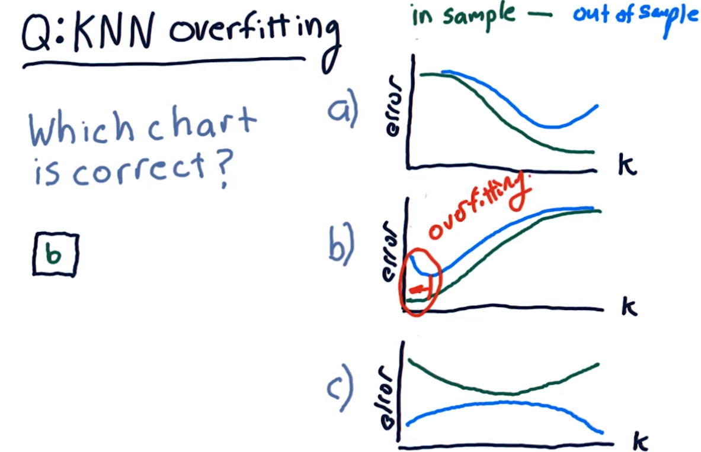
## A Few other considerations.
**Factors to Consider in Evaluating Learning Algorithms**

There are a few other factors worth considering when evaluating a learning algorithm, and I've tallied a few of them here.

**Consideration of Performance Factors**

I want you to think about each one of these and select which you think has better performance in that regard, linear regression or KNN.

**Evaluation of Factors**

So let's step through them:

1. **Memory Requirement**: How much memory do you need in your computer to save the model?
  
2. **Training Time**: How much compute time do you need to train the model?
  
3. **Query Time**: How long does it take to query the model?
  
4. **Scalability with New Data**: And finally, how easy is it to add new data to your model?

**Instructions for Selection**

So, again, I want you to check the box according to which one has better performance with regard to these factors.

**Space Requirement**

So, in terms of space for saving the model, linear regression is a hands down winner. For instance, if we're learning a third order polynomial, we have to only store four numbers. KNN, on the other hand, requires you to keep all the data, so it could be megabytes or gigabytes of data. So, KNN is bad in this regard.

**Compute Time to Train**

Compute time to train. KNN is much better in this case. In fact, it takes zero time to train KNN. You just stuff the model into a data store and you're done. On the other hand, linear regression has to take all that data, compute over it, to find those parameters.

**Compute Time to Query**

Compute time to query. LinReg wins hands down. All you do is you plug your X in, multiply it out and that's the answer. KNN requires quite a bit of time to query because you have to, among other things, usually do a sort to cross all the data.

**Ease of Adding New Data**

Ease to add new data. KNN wins that because all you gotta do is just plop it in there, you don't have to do any re-calculation. With linear regression, you have to add the new data and then recompute the factors.

**Conclusion**

Well, that's all for how to assess learning algorithms. I will see you again soon. Thank you.

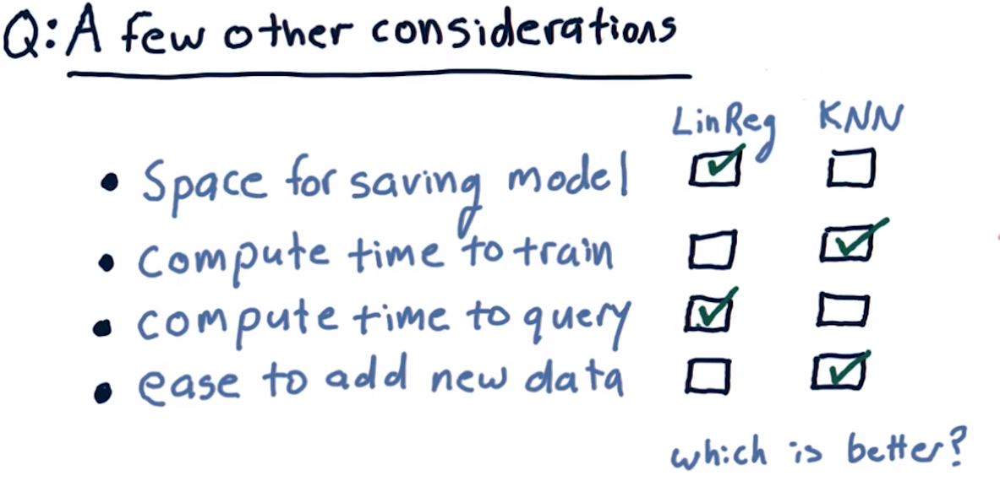