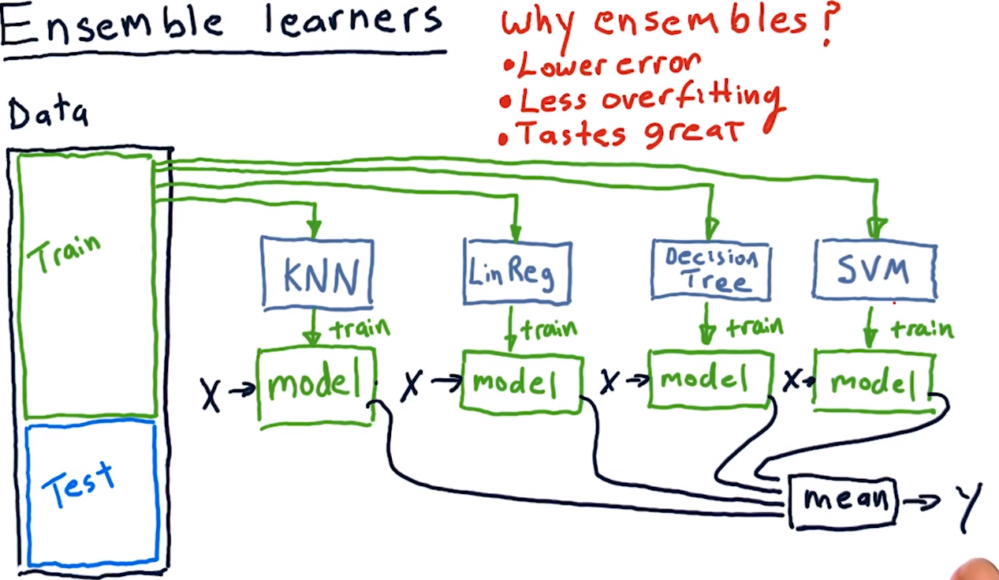
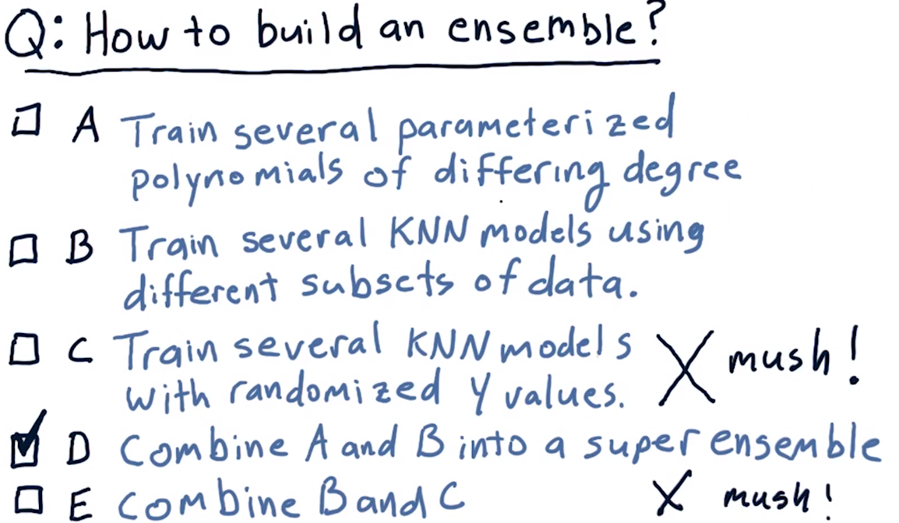
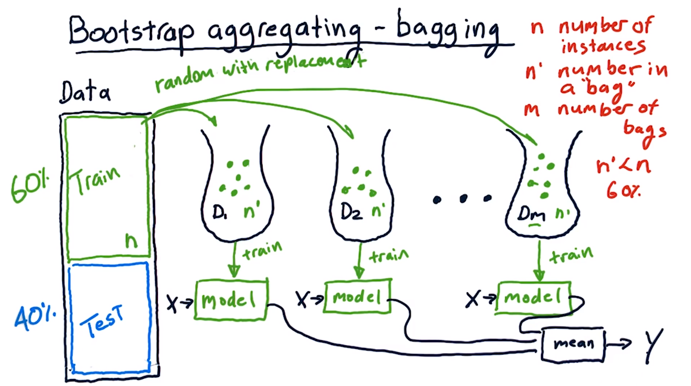
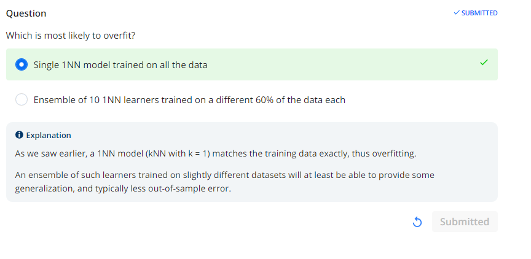
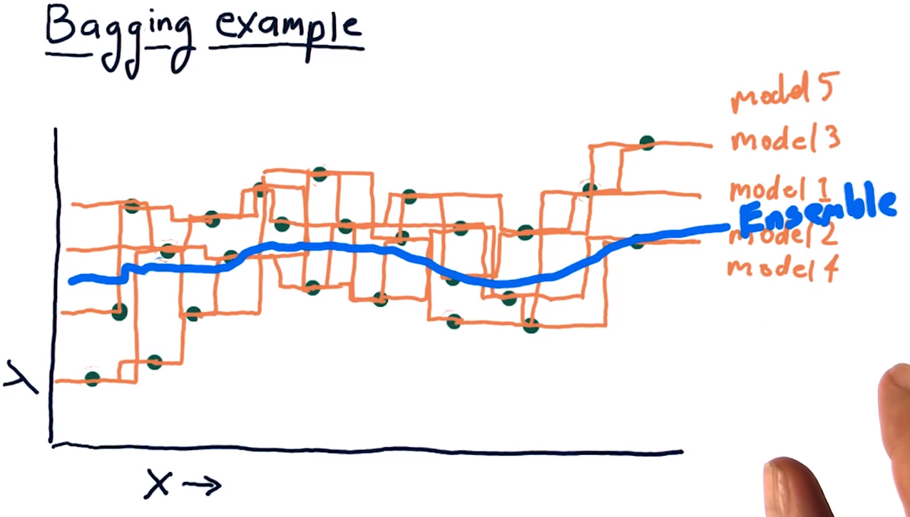
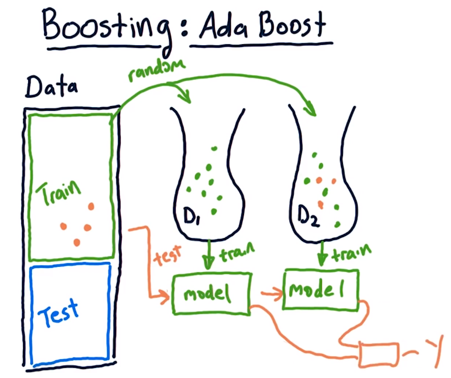
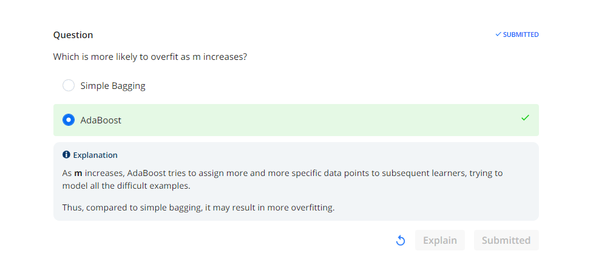
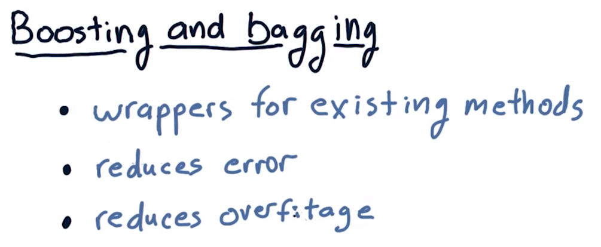

# 03-04 Ensemble learners - bagging and boosting
## Overview
**Background on Ensemble Learning**

In 1988, Michael Kearns and Leslie Valiant posed the following question: Can a set of weak learners be combined to create a single, strong learner? One answer to that question came in 2009.

**Netflix Prize Competition**

Back in 2006, Netflix offered a $1 million prize for a machine learning algorithm that could do 10% better than their own algorithm at predicting which movies their customers would like to see. The prize was not awarded until three years later in 2009.

**Winning Algorithm**

The winning algorithm was not a single algorithm, but a combination of several, or an ensemble. This lesson is about ensemble learners.
## Ensemble learners
**Introduction to Ensemble Learning**

Creating an ensemble of learners is one way to make the learners you've got better. So we're not talking about creating a new algorithm, but instead assembling together several different algorithms or several different models to create an ensemble learner.

**Integration with Existing Models**

One thing I want to emphasize here is that you can take what you learn here about ensemble learners and plug it right into what you're already doing with your KNN and linear regression models.

**Comparison with Single Learner Approach**

Now, what we've been doing so far is that we've had one kind of learning method, say KNN, we plug our data into there and we learn a model. We can query our model with an X and it will give us a Y. So this is not an ensemble learner, this is just a single learner.

**Formation of Ensemble Learners**

And the idea with ensemble learners is that we have several additional learners. So, we might have a linear regression-based model, we might have a decision tree-based model, we might have a support vector machine-based model. You could continue this on with any different number of algorithms. They're all trained using the same data, and so now we have, in this case, four different models.

**Querying Ensemble Learners**

To query this ensemble of learners, we query each model by itself and combine the answers. So if we wanted to query this model with X, we plug X into each model, the same X, and then our Ys come out.

**Combination of Outputs**

So we have a Y output from each of these models, how do we combine them? If we're doing classification where, for instance, we're trying to identify what the thing is, we might have each of these Ys vote on what it is. But if we're doing regression, the typical thing to do here is to take the mean, and that is the result for this ensemble learner.

**Testing Ensemble Learners**

We can then test this overall ensemble learner using the test data that we set aside.

**Advantages of Ensembles**

Why ensembles? Why do we use them, why might they be better? Well, there's a few reasons.

**Lower Error Rates**

First of all, ensembles often have lower error than any individual method by themselves.

**Reduced Overfitting**

Ensemble learners offer less overfitting. The ensemble of learners typically does not overfit as much as any individual learner by itself.

**Explanation of Reduced Bias**

Now why is that? Here's at least an intuitive answer. As each kind of learner that you might use has a sort of bias, it's easiest to talk about that in terms of linear regression in terms of what do I mean by bias. So clearly, with linear regression our bias is that the data is linear. KNN has its own kind of bias, decision trees have their own kind of bias, but when you put them together you tend to reduce the biases because they're fighting against each other in some sort of way.

**Conclusion**

Anyways that's what an ensemble learner is like if we use multiple types of learners.

## How to build an ensemble
**Consideration of Ensemble Building Approaches**

I want you to think about the tools that you have now. You have a KNN learner, and you have a linear regression learner. And also, we've taught you a bit about how to use the linear regression-like tools to build parameterized models. With these tools, how could you go about building an ensemble? Consider each of these approaches, A, B, C, D, and E, and put a checkmark next to the one that you think is the best solution. So some of these are okay, but I want you to pick the best answer.

**Evaluation of Ensemble Building Approaches**

Okay, let's step through these one by one.

A. Train several parameterized polynomials of differing degree.
   - Yes, we could use that to create an ensemble, but that's not the best answer.

B. Train several KNN models using different subsets of data.
   - Yes, that's good too, but it's not yet the best answer.

C. Train several KNN models with randomized Y values.
   - This is, of course, a terrible idea and would give you mush.

D. Combine A and B into a super ensemble.
   - Yes, that is the best answer.

E. Combine B and C.
   - And of course, that is mush as well and we're not going to do it.

Okay, we're actually going to look now at this method of creating an ensemble of learners, training several KNN models using different subsets of data.

## Bootstrap aggregating bagging
**Bagging: Ensemble Building Approach**

There's another way we can build an ensemble of learners. We can build them using the same learning algorithm but train each learner on a different set of the data. This is what's called bootstrap aggregating or bagging. It was invented by Breiman in the late '80s, early '90s.

Here's how bagging works:

1. Create a number of subsets of the data, each represented as a bag of data.
2. Collect these subsets randomly, with replacement, from the original data.
3. Each bag contains a subset of the original data, chosen randomly with replacement.
4. Let's note these things:
   - \( n \) is the number of training instances in our original data.
   - \( n' \) is the number of instances that we put in each bag.
   - \( m \) is the number of bags.
5. We almost always want \( n' \) to be less than \( n \), usually about 60%.
6. Each bag has about 60% as many training instances as our original data, as a rule of thumb.
7. Use each collection of data to train a different model.
8. We now have \( m \) different models, each one trained on a slightly different dataset.
9. Just like when we have an ensemble of different learning algorithms, here we have an ensemble of different models we query in the same way.
10. Query each model with the same \( x \) and collect all of their outputs.
11. Take the \( y \) output of each model, calculate their mean, and that's our \( y \) for the ensemble.
12. Keep in mind we can wrap this in a single API, just like that API you wrapped your [INAUDIBLE] in and your KNN learner in.
    
## Overfitting

## Bagging example
**Random Selection of Data**  
So supposed this is some example data and we are going to create a bunch of one nearest neighbor models. We first have to select, randomly, some of our data, to go into the first bag. So I'm going to circle some of these points, randomly, that represent our first model.  

**Individual Models**  
So we randomly selected some of these points. Now let's show what that model looks like. So this zigzagging orange line here represents what that one nearest neighbor model would look like. And, yes, to me it looks like it's overfitting. But that's just our first model. Then we draw some more data, and we have another model.  

**Ensemble Model**  
Well, let's consider now an ensemble model where we combine the results of these two. And at each point where we query, remember what we do is we take the mean of the two models. So, you can see already, as this blue curve is a bit more smooth.  

**Adding More Models**  
But let's add some more models. So I've drawn over here a couple more one nearest neighbor models. And you can see each one of them individually as sort of overfit. But if we now sample at each individual spot across here and take the average across all of them we get something that's much more smooth.  

**Smoothing Effect**  
So here's what our ensemble looks like. And as you can see, it's much more smooth. Of course, I hand drew it. So you could accuse me of smoothing it by hand. [LAUGH] Anyways, the point here is that you can build an ensemble that is much more smooth than any of the individual learners by themselves.
  
## Boosting
**Boosting Overview**  
Boosting is a fairly simple variation on bagging that strives to improve the learners by focusing on areas where the system is not performing well. One of the most well-known algorithms in this area is called ada boost. And I believe it's ada, not ata because ada stands for adaptive.  

**AdaBoost Mechanism**  
Here's how ada boost works. We build our first bag of data in the usual way. We select randomly from our training data. We then train a model in a usual way. The next thing we do, and this is something different, we take all our training data and use it to test the model in order to discover that some of the points in here, our x's and our y's, are not well predicted.  

**Weighted Selection of Data**  
So there's going to be some points in here for which there is significant error. Now, when we go to build our next bag of data, again, we choose randomly from our original data. But each instance is weighted according to this error. So, these points that had significant error, are more likely to get picked and to go into this bag than any other individual instance.  

**Testing and Iteration**  
So as you see, we ended up with a few of those points in here and a smattering of all the other ones as well. We build a model from this data and then we test it. Now we test our system altogether. In other words, we've got a sort of miniature ensemble here, just two learners. We test them by inputting again this in-sample data. We test on each instance and we combine their outputs. And again we measure error across all this data.  

**Iterative Process**  
Maybe this time these points got modeled better, but there were some other ones up here that weren't as good. And thus we build our next bag and our next model. And we just continue this over, and over and over again up until m or the total number of bags we'll be using.  

**Recap: Bagging vs. Boosting**  
So to recap, bagging, when we build one of these instances, is simply choosing some subset of the data at random with replacement, and we create each bag in the same way. Boosting is an add-on to this idea where in subsequent bags we choose those data instances that had been modeled poorly in the overall system before.  
  
## Overfitation
  
**AdaBoost's Approach**  
The answer is Ada Boost and the reason is that Ada Boost is trying really really hard to match those parts of the data that are off or outliers or whatever, and accordingly it's striving to fit, and subsequently it may be susceptible to overfitting.
## Summary
**Introduction**  
Before we finish this lesson, I wanted to summarize things and tell you how this all fits into machine learning for trading.  

**Bagging and Boosting**  
The first thing to point out here is that bagging and boosting are just methods for taking existing learners and essentially wrapping them in this meta algorithm that converts your existing learner into an ensemble.  

**API Usage**  
And you should use the same API to call your ensemble that you would have earlier been using to call an individual learner. So externally, to whatever part of your program is calling the learner, it doesn't know that underneath there you're doing boosting or bagging.  

**Effect on Performance**  
Your resulting learner is also likely to lower error and reduce overfitting.  

**Summary**  
So to summarize, boosting and bagging are not new algorithms in and of themselves. They're meta algorithms that let you wrap your underlying learning algorithms into something that's better.  

**Conclusion**  
Okay, that's it for this lesson. I will see you again soon. Bye bye.  
 