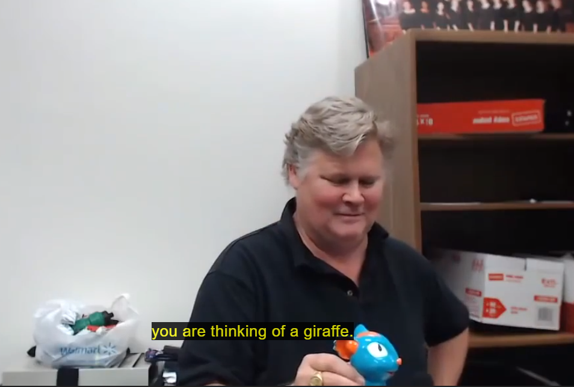

# Decision Trees Part 1

Okay, we're live now. So everybody out on TV land can see us, which means the other 300 people in the class taking it online. So I want everybody here to wave at them. Hold on. Okay, everybody. Hello out there.

**Introduction to Decision Trees**

I'm going to turn on Q &A. And I would appreciate it if someone out there, if they can hear what we're saying, that they post a question saying, yes, I can hear. The first post is, I'm not seeing questions.

**Understanding Decision Trees**

So you're right. You should be able to hear it now. There's a lag of a couple minutes between what I say here and when you see it. Anyways, today, I'm going to start with the first of several. Thanks.

**Lecture: Decision Trees in Practice**

I'm going to start with the first of several lectures on decision trees. There's going to be three. This first one is kind of a demo of decision trees and then some examples of how to use a decision tree if you had.

Once I finish that, so I expect it's not going to take a whole period. I'll try to a lot some time to on campus here talking about the lesson about how to assess learners. But right now I'm going to focus on decision tree learning.

**Interactive Demonstration: The Decision-Making Tool**

Now, decision trees can be used for classification and regression. And as a way to demonstrate decision trees, I have this fantastic piece of technology. Has anybody seen one of these before? OK, you've seen one, really?

Isn't that called a beef feeder? A beef feeder? Yeah, it's a type of gin. It is a gin. Yes, OK. You probably haven't seen this gin. I didn't even know it was related to something real. OK, you may be wondering, what is it?

**Interactive Demonstration: The Animal Guessing Game**

OK, we'll packed into this little piece of plastic. Here. It is. Huh? Candy. What? Candy? Oh, yeah. It looks like it. Well, so I had never seen or heard of this thing until we were shopping at Walmart one day, and my daughter made me buy it.

It's like, OK, all right. Just to get her to leave me alone, I bought it. It's like $20. Anyways, she started playing with it, and I was amazed at what it could do. And you'll see in a minute. But anyways, it has the ability to synthesize speech, which really means it plays recorded messages.

It can understand speech, things like yes and no. And it can reason to some extent. Now, who's heard of the 20 questions, the animal guessing game? Well, here are the rules. I think the traditional American version is one person.

We do this a lot when we're driving cross-country and trying to keep the kids occupied, like long road trip. Anyways, one kid thinks of something. And then the other kids get to ask a question one after the other to try and figure out what it is.

And they have to ask a yes or no question. So as an example, the game that this one plays is it plays essentially the animal guessing game. So you, the user, think of an animal. And then it asks you questions, like is it bigger than a microwave oven?

All the questions are sort of binary questions. It's bigger than a microwave. Well, you'll hear the questions in a second. But through this process, it eventually figures out which animal you're thinking of.

**Interactive Session: Engaging the Audience**

OK, now, to demonstrate this, I need a volunteer from the audience. I have randomly selected three potential animals. And I need a volunteer to select from these random animals. So you, sir, come on down.

OK, all right. I'll raise them up one at a time. And you tell me when to stop. Stop. OK. Let me shuffle them first. Sorry. OK. OK, we'll go again. Stop. OK. I should, to make it more fun, I should have another volunteer.

here, open up the envelope. I'll just. OK, come on up. Yeah, it'll be more exciting. Now, as far as you know, I put the same animal in all three. But I'm going to say. This guy Aaron, like NBC, that are on TV.

Should I talk about TV? Just YouTube. So show it to the, I won't look. Well, you know what I have to look. OK, never mind. Show it to them, too. The reason I have to look is because I'm going to answer the questions.

Make sure the camera there. Oh, well. Well, we don't want this thing to hear because it would be cheating. And don't be saying, trap, trap. OK. OK, now we'll play the game. Thank you. Hey there, buddy.

**Interactive Session: Exploring Decision-Making**

What's the play? Great. I love using it. especially when I'm sure to win. Think of an animal saying okay when you're ready. Super, I'm going to ask you a question. As a yes, no, or I don't know. You can also say it depends.

Does it have hair or fur? Yes. All right. Does this animal mainly eat plants, grass and fruits? Yes. Okay. Does it live mainly in Africa? Yes. Very interesting. Does this animal live in the forest? No.

Aha, I see. What do they call it in the milliner where you call up for food? Does this have horns? Yes. Does this animal have horns or antlers? Yes. That's what I thought. Is this animal very big? Yes.

All right. Is it friendly? Yes. Okay. Does it have spots? Yes. Very interesting. I don't know. If my match powers aren't mistaken, you are thinking of a giraffe. Yay! Am I right? Yes. Wow! Really? Good.

One more round. Okay, I won't subject you to a very... Think of an animal. Okay, we're ready. Oh, we have secrets. Pull up the battery. Anyways, my daughter memorized all of its sayings and so on. So like, now when we play 20 Questions in the Car, she's speaking with that accent.

**Analyzing the Decision-Making Process**

Okay, now. That's... So, to be honest, I'm not certain that inside this thing it uses a decision tree. I think it does, but at least that's... consistent with the sorts of the way it behaves. But I'm going to tell you how we could build this decision tree to solve this problem.

Yeah. Before we move on, if you get some of the questions wrong, how does it stay OK with you? In my experience with this thing, if you get the question wrong, then that session degenerates into, I mean, it continues going on, but it never gives up.

One thing that's interesting about it that is not, well, one of the optional answers is I don't know, or it depends. So in some sense, if it is

 using decision trees, it actually is using decision trees with potentially three outgoing edges.

Yes, maybe, or yes, I don't know, and no. But forget that for now. We're going to focus on binary decision trees. But let me, so let's, I'm going to move the camera over to here. I think I'll have to disconnect this.

Okay, somebody says they can hear us. That's great. We have 18 viewers. That's awesome. OK. I'm going to be switching back and forth from writing on the board to looking at my computer. So just bear with me when I do that.

**Title: Demystifying Decision Trees in Data Analysis**

So, if you think about the decision tree that this thing was using, and you try to figure out what's inside it, well, one thing it's got is a list of factors, right? So, those are quantitative metrics that we can check and ask questions about.

**Understanding Decision Tree Components**

Sometimes they're binary, so like, does it have spots? So, let me list a couple of them. I'll call X1 skin texture. So that's like fur or no fur. X2 might be spots. It asks some, frequently asked questions about size.

The three sorts of questions I've heard it ask, let me say particular answers over here. So the three questions it asks about size are, is it larger than a microwave? Is it larger than a washing machine?

And is it very large or something like that? So essentially we have a microwave, washing machine size, and very large. So you get the idea. So in its system somewhere it has a number of these factors, and then it asks questions regarding them.

**Hypothesizing the Decision-Making Process**

Now my hypothesis is, I'm going to move to the side a little bit here, is that internally it's got a decision tree for evaluating, for asking questions and evaluating these issues. So decision tree works like this.

It's composed of nodes and there's two types of nodes. There's decision nodes and leaves. Okay? One of these nodes is the root node. Inside each one of these decision nodes is essentially a binary question.

**Deciphering Decision Tree Structure**

So let's say it's going to ask a question about factor one. So we would need to create some sort of data structure that remembers, oh, this question is about factor one. And then there's some sort of value that you split on.

So in this case, it's essentially fur. And if the answer is yes, We go down this way, and the answer is no. We go down this way. And we continue now down to another node, each direction. And in our case, we had fur.

So maybe this next one is x2 spots. And yes and no. I'm going to make sort of an abbreviated tree just for the purpose of this discussion, because we're going to have some more detailed trees in a moment.

**Exploring Decision Tree Components**

But let's say, you know, we only studied a few animals, and the ones that have fur and have spots, those are always giraffes. And the ones that have fur and don't have spots, those are say buffalo. And similarly, we might have more branches down this right-hand side, and these last nodes are our leaves.

Now today I'm going to focus on talking about the structure of a decision tree, and how to use one if you have one. But the next lecture is going to be about, suppose we have the data, how do we build a tree from that data?

So like I said, today we're focusing on how to use one if you have one. But anyways, I wanted to identify these key parts of a decision tree. Let me pause for a second to see if anybody's got any questions.

I'll check online too here. No questions. Okay. All right, let me get my notes over here. So let me just formally write down again the... What makes up a decision tree? Okay. So long time ago, does anybody here take a course with Professor Various and ECE?

**Key Elements of Decision Trees**

Anyways, a long, long time ago I took a course on information theory with him and he could write on the board faster than I could write my notes. So he was just like, you're not going to have that problem with me.

But anyways, I couldn't both keep up with him taking notes and understand what he was talking about. So eventually I just quit taking notes and tried to understand him. But anyways, because I take notes so slowly, I suggest, or because I write so slowly, you can take notes.

Okay, so what makes up a decision tree? Okay, a list of factors. And these are our Xs. And again, there might be many of them. There might be X1, X2, X3. Then the answers, actually the correct term for that doesn't occur to me right now, but labels, labels, that's the right term.

So this is our Y. So that can either be a label like giraffe or it can be a label like 2 .3. Could be numerical if we're building a regression tree. Then we have a set of nodes. And each node includes the factor use.

**Decision Tree Construction Process**

And what I'm going to call a split value or split value. So we're looking at a particular value. And then we're going to go one way down the tree if it's less than or equal to that value, and another way down the tree if it's greater than that value.

And also, coming out of the nodes are essentially edges pointing us to the next nodes to the left and the right. Okay. Okay. One of these nodes is designated as the root node. And then finally we have our leaves.

Okay, does everybody get that? Those are all the things you need to define a decision tree. Okay, now I'm going to give you a concrete example of some data we can work with. Actually, for the decision tree assignment that's coming up, we're going to use this data.

**Practical Application of Decision Trees**

There is a website that's dedicated to providing data sets for machine learning testing. And they have a famous suite of many different types of data.

And the one that we're going to use is one concerning wine. I want to go ahead and cite properly credit the people who created this. So I'll do it again when we issue the assignment. But anyway, this is from a paper in 2009.

**Analyzing Real-World Data**

The data set is created by Cordes. Cordelia anyways, they're Portuguese people And it turns out that they did the tests on port wine. So that's the reason for the connection probably I'm guessing like on a grant from the Port wine Federation of Portugal or something Anyways Thank you for your day Okay, let's talk about the day and Or more More properly what they were trying to do so I'm I'm making a little bit of this up, but it's consistent with with whatever it's so far but They were looking for Quantitative sort of automated ways that they could evaluate the quality of wine So what they did is they got a Number of volunteers to taste several different wines.

I'm not sure how many different but probably 10 sort of or more And they asked each person to score each glass of wine on a scale from zero to ten Then they separately measured For each glass of wine 11 I think 10 different quantities things that they could just shove into a Machine that could measure them chemically.

**Extracting Insights from Data**

So here here are some of those factors Fixed acidity Volatile acidity. I'm not sure what the difference between that is a citric acid residual sugar chlorides and so on and then so so these first factors are our X's and then this last one Quality is the why that we're going to use to train our system.

Now, short quiz.

**Identifying Correlation Factors**

Which of these factors do you think is most strongly correlated with the volunteers' perception of quality? I'm deliberately not showing you all the factors. residual sugar. No. But good guess. Somebody else make a guess.

One more guess. Why do you drink wine as opposed to grape juice? Right. Of all these factors, percentage of alcohol is the most strongly correlated with the people's judgment of quality. Now, it's not necessarily that that's causality.

**Understanding Correlation in Data**

There may be other factors that are related to alcohol as well. But just pointing that out. OK, so let's look at this data a little bit more now. In fact, I have another view over here. Each row here represents the value of each of these 11 factors, and then why the judgment of the person.

So each row represents one test. So let's suppose for a moment, I'm going to map this to the S &P 500. Each row might represent the value of factors of each stock on a particular day. And then why might represent the return several days later.

So what that means is for each day, we have 500 individual rows, one for each stock. Coming back to the wine, each row is one person tasting one wine and their assessment over here. Now one thing to keep in mind is many people tasted exactly the same wine.

**Data Representation and Analysis**

So we're going to have a row for each person. So we'll have multiple rows for each particular wine, where the X's will be the same, but the Y's might be different. That makes sense. Now just for fun, I used the Excel's correlation function to for each factor to look at how strongly correlated It was with our Y.

Excuse me. So you can see here, factor 11 has a correlation of 0 .47 with quality. And that's not, you know, if you're an engineer, you might be thinking, OK, I don't want to build a bridge with a 0 .47 correlation that it won't fall down.

**Interpreting Correlation Values**

So that's a typically a weak relationship for many uses. But for machine learning, especially classification and regression and so on, then that's a fairly strong value. Now, note that some of these are negative, like this one, negative 0 .391.

What that means is essentially is that the larger, in general, the larger this number is, the greater the number of times that it will fall down. the lower the quality. It doesn't mean it's not a good factor for evaluating.

**Utilizing Data Insights**

It just means that it's inversely related. Okay, so that's our data. I want, now I'm gonna take a moment to draw a decision tree and then I'm gonna give you some example data rows and I want you all from my excellently drawn decision tree on the board and ask you to figure out what that decision tree says the quality of the wine should be.

Okay, but before I do that, let me back up a little bit. The process for utilizing decision trees is the following. You start with data like this. You use that data through some mysterious process that you'll learn next week to build a decision tree.

Then once you have the decision tree, you can now query it. So you can say, okay, I have a wine with these different factors. What do we think a human will say the quality is? And then we consult that tree and we end up at a leaf and that's what we estimate the quality of the tree.

And by the way, I skipped over it, but presumably the utility for that is they can very quickly and automatically evaluate the quality of a wine without necessarily having to have a human taste it. So they can, essentially they're putting some poor bastard out of work who spends all day tasting wine, but it also provides a more objective measure of the quality of wine.

**Building Decision Trees**

Okay. I'm going to take a moment to draw my decision tree on the board. And in the meantime, we'll have an interlude of elevator music. So I'll be back in just a moment. Seems to be tensed up the board.

**Interpreting the Decision Tree**

What you do is run away from it. so I'm this — Ah Okay, so online you all should be able to see the tree I drew up. If not, complain with a question please. Anyways, I realized for some of you in the back, it may be hard to see unless you have really good eyes, but try to draw it as large as I could.

Anyways, each one of these is a decision node, and if the answer to the question we ask in each one is yes, we go to the left. If it's no, we go to the right. So for instance, this decision node, which is the root, asks, is factor 11 less than or equal to 10.

And if it is, we go down here, and we ask about factor 2, and so on. Anyways, as we ask each of these questions, eventually we reach a leaf node, and boom, that's our answer. Now, a couple things to point out here.

**Factors and Predictions**

We don't necessarily use all factors in a decision tree. Sometimes, some factors are just so predictive. In fact, sometimes for some data, you might have 10 factors but only end up using one of them in your decision tree.

Now you might still have that factor, like for instance we have factor 11 twice in this decision tree. You might have it at multiple levels within the decision tree and it might be repeated, for instance.

Now note if you go down, say, this path, use factor 11, 2, and 8, but you don't use factor 10, for instance. So anyways, I'm going to put up an example piece of data and have you use this tree and factor two, factor eight, factor ten, and factor eleven.

**Querying the Tree**

Right, so we're going to query the tree, right? So, Okay, so these are the values of our four factors that make up this tree. I want everybody to take a moment themselves and try and figure out what is, what does our model think the quality of the wind is?

Okay, raise your hand if you're done. Okay, a little bit longer. How about you in TV land? Who wants me to work through it? Okay, I'm confused. Okay, so you're not finished, but you don't want me to work through it.

Let me ask again, who's worked through it? Okay, where are you stuck? Yes, okay, so you have worked through it. Okay, alright, what's the answer? Yes, so working through it. Our first question is about factor 11.

**Analyzing the Results**

Is it less than or equal to 10? Yes, so that's predictive of a sucky wine, right? Because, well, I know because I looked at the data here, 10 is about the medium, that's the alcohol level is 11, 10 is about the median value of alcohol.

So if it's less than 10, it's probably, we're probably headed towards suckiness. Okay, factor 2, is it less than or equal to point 5? No, so we're down here at this node, factor 8, is it less than or equal to 1?

Yes. Boom, answer is three. Okay? So, that's how we query a tree that we have. Now, I'll look in my example data and tell you what the real answer was. Well, the real answer was three. So, a human who tasted the wine actually also evaluated at a three.

**Implementing Decision Trees: Data Structure and Performance**

Now, I'm going to take a moment to, um, well, no, no. Let's   see what we see here. Okay. Okay. The last topic I want to cover today on decision trees is I want to present to you a data structure that you can use to build and store your decision trees in.

There are lots of different ways to do it. A Java or C++ programmer thinks object oriented and they want to make a node class and each of these nodes an instance and link them all together. That's okay but it ends up especially for large data sets in Python, it ends up being really slow and burns up a lot of memory.

You can do it in Python but what I'm going to suggest to you is a matrix or an array based representation that ends up being really, really fast. Now if you're determined that you have to do it in an object oriented manner, that's okay but please try my way first and then do your object oriented approach because I think once you get into it a little bit you'll discover that my recommendation is pretty easy and fast.

**Understanding the Data Structure**

Okay, so here is the data structure. The data structure is an NB array with two dimensions. I got a right smaller. Okay, so each row in this indie array corresponds to one of our decision nodes or a leaf.

And so let's start with this one. I'll use a different color. So, oh, and by the way, These little blue numbers are labeled to correspond to the rows that I'm going to fill them in over here. I did that as a little cheat to make this part of the lecture easier.

But anyways, in this first row, row zero, the factor that we're going to use is 11. The split value, or the number that we're going to make our comparison on, is 10. And if when we're querying, oh, and by the way, this first row is always the root.

And if we're querying the root and the value of factor 11 is less than or equal to 10, this column tells us which row represents our next decision node. So I've labeled it there. It's one. And if we go to the right, it's eight.

Does everybody get that? Okay, now the rest of the rows are going to be split into essentially two groups. So one set of rows is going to represent the left tree. And some other set of nodes are going to represent the right tree.

So these guys over here will be packed into this part of the array. And these guys will be packed into this part of the array. over here will be over here. That make sense? Okay, let me let me push this out a little bit more.

Okay, now I don't know if I estimated the link here correctly so let me I'll draw it back later. But before I one additional thing I want to tell you the way that we represent leafs in this data structure is we use a special number to represent the factor we use negative one so if the factor if we get to a row and the factors negative one that means it's a leaf.

So Now, how many rows should we have? Who knows the answer? Eleven. Right. And that's because there's eleven nodes over here, right? Okay. I know it was easy, but just checking. Oh, it screwed up. So with the magic,

 how am I going to do that?

Sorry about that. Somehow I ended up losing a row here. Oh, no, we're going to lose. Okay. Anyways, I'm not, it's going to be too tedious to fill all this in, but let me, let me just highlight a few things about it.

So the left, the left branch of this tree is represented by nodes one through seven. And of course the right by eight through nine. So this is here. And this one over here. Now, something to observe is each of these subtrees is itself a tree.

The root node is of the left tree is that first row. And then its left tree is right here. So this part is that, right? And then we have two leaves here, right? So does everybody get the structure, this data structure?

Any questions about the data structure? We're going to blaze into it more on Tuesday. Let me, I should fill in a few of these numbers on the left here, because I want to illustrate something. We fill in just a couple.

Okay, so let's look at this for a second. So coming into the root node, if factor 11 is less than or equal to 10, then we go to node 1, which is the next one. Otherwise, we go to node 8, which is way down here.

So that redirects us to look at the right part of the tree. Similarly, so we went down this left branch. If factor two is less than or equal to 0 .5, we go immediately to the next row. That's our left tree.

Otherwise we go to five, which is down here. Anyways, a couple things to point out. So, the number here is essentially the index to the head of the next tree to look at, or the root of the next tree.

Now when we have a leaf, it doesn't really matter what values we put in here, because we're never going to use them, right? We're at a leaf, we're done, we're terminated. I put negative ones in there just for reference.

But anyways, the way I've shown this data structure here today, these are absolute references into this array, you could, if you wanted to, instead make them relative. Now, why is that? Well, when you're building this tree, it's a recursive process, and like I said, we'll get to that soon.

But it's often convenient when you're building it, when you, we recurse to build the right tree, if the, I'm sorry, when you recurse to build the left tree, if it just pops up and tells you how big is the left tree, then you know immediately that however big the left tree is, that's how far down we go to start the right tree.

You don't have to worry about that too much right now, but as an example, look, we know the right tree, starts at cell eight here, and that's because our left tree has one, two, three, four, let's see, one, two, three, four, five, six, seven elements, right, so we just know immediately to go to that point.

Similarly, here this is an absolute reference to five, but really, if we want to store a relative number there, we could use one, two, three, four, and that would get us there for when you use relative.

Just keep in mind that you might want to use relative numbers for references to those rows instead of absolute. Okay, just a couple more things to cover today, and then I'll take questions. Okay, couple things I wanted to highlight and ask you some questions about.

**Performance Analysis and Conclusion**

First of all, first question. Which learning method of the three that I'm going to list do you think is fastest? Canaries, neighbor, decision trees or linear regression? Way in the back there. No. Well, okay.

I didn't give you enough information. The question that would be reasonable to ask me is, well, do you mean the learning part or the querying part? So let's for now say I'm asking you about the querying part.

Okay, you can go again. No. Okay. Once you have the model, the fastest learning method is linear regression. Because think about it. How do you calculate the prediction? You got three x's or whatever.

It's one parameter times x1, another parameter times x2, another parameter times x3, add them together, boom, you're done. So that's linear regression. For k nearest neighbor, you have to go consult your thousand data elements, calculate the distance from your query to all of the other data elements, and then find the closest three or five or whatever your k is.

So that if you calculate distance to all of them, sort, and then take the mean of the ones that are closest. So k and n at query time is really slow. Okay, I'll give you one more chance. Well, another question.

Let's suppose we have 100 samples and we build a perfect tree. On average, how many binary questions will we have to ask for each query? Let's get somebody else. You, ma 'am. Yes, which base? Alright.

You get an extra bonus prize. Good job. So what does that work out to be? Six or seven? OK. Right. So it turns out that that's pretty fast, right? If no, let's say we go to 1 ,000. What's log base 2 of 1 ,000?

10? 1024 is 2 of 10. 10. So with 1 ,000 elements, we only have to ask 10 questions. And binary questions are really, really fast. Processors are optimized to do that quickly. Also, if you're using a GPU, the topography of decision trees is well suited to GPUs as well, so it can be very, very fast.

Now, decision trees are slow at learning time, because it takes a lot of computational effort to build one of these trees. And that's what we'll talk about Tuesday. I want to raise a couple more points before I let everybody go.

Sometimes we repeat factors in the tree, remember that. Not all factors are guaranteed to be used. And one last question for thought. When I asked you how many questions we'd have to answer for a thousand element tree, you all said log base 10 and 1000.

You're making an assumption. What's the assumption that you're making about the tree? It's a binary tree. That's one. There's another assumption you're making. You have another assumption. It's a complete tree.

There's all the depth in the same tree. Another code word for that is balance. It's a balance tree. A lot of the algorithms involved in building these trees strive to keep them balanced. There'll be something else we talk about.

I'm going to real quick and see if we have any questions online. The only question we have is that if I can move the camera closer to the whiteboard. So it's a way for that. Any questions here about the assignment due Monday?

Yes. So we're expecting to maximize the sharp ratio for a portfolio. And assuming that stocks have the same gain over time, the same cumulative return, your optimization step is going to be minimizing the state of negation of

 your average daily returns.

Let's try assuming that the cumulative return is the same. Okay, let me, I'll try and restate what you're saying. Suppose we have a portfolio of four stocks and no matter what allocation we get to them, the cumulative return will be the same.

But the standard deviation may change. Yes. In that case, yes, we're trying to minimize standard deviation. Now, to do that, if you have two stocks and the limit is with the opposite of each other. Right.

Sorry, you can't do that, because you have to do it at a previous aspect. Right. Why is that mean? Why is that, it's more, why is that something to do? What is this? Having two stocks that are anti -correlated to one another is a wonder of nature.

There's one other thing you want though. You want them on the short term to be anti -correlated, on the longer term for them to be correlated up. That's a thing of beauty. But we'll have to wait for me to tell you why.

Okay, goodbye in TV land. I'll be on Piazza to answer questions. See you all Tuesday.

