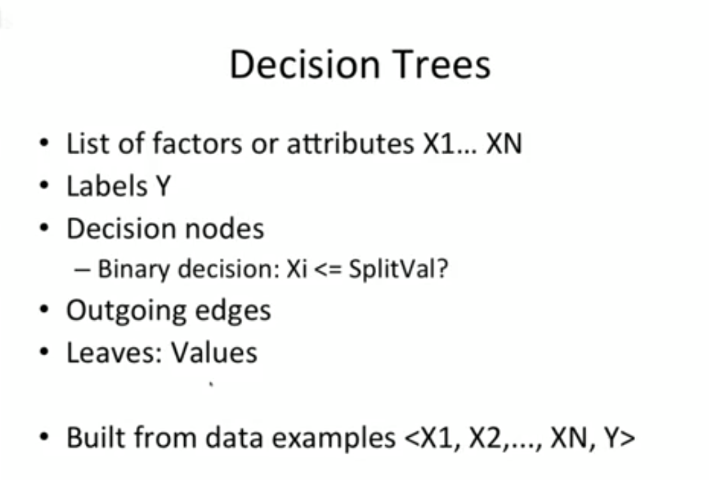

 # Decision Trees Part 2

 **Introduction**
hi everybody welcome sorry for my delay. In getting started I make some of these videos from my basement and I got down here to discover some of my technology was missing because of a certain child of mine. So anyways I had to find that and plug it all in ready to go ok. I will check periodically on Piazza to see if we've got any questions. One thing I would appreciate is if somebody who is currently watching could post a question of Gaza indicating that you can hear me. I'm going to start blazing forward anyways but it would be good to get that feedback so thanks and I'm going to check on Piazza right now okay okay somebody says they can hear thank you. 

**Step Through PowerPoint Slides**
Alright, I'm going to now step through some PowerPoint slides. Okay, let's see what happens when I go fullscreen on this. I can't okay I'm going to change things give me just a moment here okay. Okay, put together a couple PowerPoint slides I'll step you through. So if you remember the last lecture we talked about if you had a decision tree how you might use it so in this lecture we're going to talk about okay how do we build that decision tree in the first place so let's pause for a second and think about what are the things that make up a decision tree and big picture remember here we're trying to build a model that from some factors or features or attributes things we can measure about a system what is going to happen later. And so the factors are the factors or attributes are our X's and we might have many of them we mate might have up to n of these factors now associated with each group of factors are a label Y so our data consists of the values of the factors and the values of the labels think about it like a big matrix where the columns are the X's and then that last Y and the rows are individual samples of data so each row might represent that day for a price of a stock or each row might represent a day of weather. Then using that data we build a decision tree and the decision tree consists of decision nodes each node represents a binary decision. Now we can build decision trees that aren't necessarily binary they might have more than two outgoing edges but for simplicity it actually turns out for efficiency it turns out that building binary trees is the best way to go so we're only going to have two potential outputs of each decision node. There's then the outgoing edges that lead to additional decision nodes and there are two kinds of special nodes there is the root node which I forgot to mention here and also leaves so when you finally reach a leaf at the very end that's the value that you're trying to predict the root is the first node at the very top that you start at when you're trying to make a decision and we build these decision trees from data examples and again we have each row in our data is a set of X's and a y now in a double check that you all are able to see my PowerPoint slide I don't want to get all the way through this and discover that people aren't seeing the slides so I'm going to go take a quick check at Piazza. Okay, people must see the PowerPoint because they're asking if they can have the if they can have it and the answer is yes you'll be able to have it I'll come back a little bit later to answer some of the other questions that are popping up great thank you very much for answering. 

**Example Decision Tree**
Alright, here's an example decision tree. We've identified the root here up at the top so whenever we want to query our model to see what the value what the predicted value is we start here at the root and each decision node asks a binary question is this factor X 11 less than or equal to nine point nine if it is yes we go down this left edge and we come to another question about that same factor X 11 and if it's less than or equal to nine point two five we go to the left if it's not we go down to the right and here we see a new factor that we're asking questions about X 2 if it's less than or equal to six point four eight boom we go down here we arrive at a leaf and the value is six. Now a couple things I want to point out this is an example tree I'm going to actually show you in a few minutes how we built this exact tree and it's using that wine data that I introduced the other day so X 11 for instance is a percentage of alcohol I forgot what X 2 is but thing to note here is the this particular tree was only built using two factors and in some cases the same factor well in all cases the same factor appears multiple times through the tree. So for instance factor 11 appears here and here so if we go down this branch we end up asking two questions about factor 11 forget on this branch again we end up asking two questions about factor 11 so we can repeat factors sometimes not all factors are included in the tree and sometimes some factors appear more than others and it turns

 out that that's actually the key to making good decisions about how to split the data. Okay, so let's keep going with this example. 
 

We can also view it in a different way in a tabular view and this data right here represents the same tree but in a tabular view and this is the way I want you to build your decision tree for the next assignment. I want you to use a numpy array and I want you to consider these four columns. The first column is which factor are we considering for that particular node, the next column is what is the split value, in other words, which value do we decide to make a good on a left branch or a right branch, and then these two other columns tell you where in my matrix here does the next part of the tree begin. So here we're saying the left tree starts in the next row and the right tree starts at the eighth row. Now leaves are special entries and so if we have here in the first column indication that it's a leaf, the next column split Val instead of it representing a value to split on, it represents the value of the leaf and it doesn't really matter what's in the left or right columns here for a leaf because we're not going down further. 

One more thing I want to say, yes, in this example, we have sort of text in this column but numpy arrays can only be numbers, this is just for clarity so you know instead of saying X 11 here you would put the number 11 and instead of putting leaf here you would put some special number that signifies to you that this is a leaf. And again these are dual representations, they represent exactly the same information, the root node is always the very first row in this numpy array and then you can see here where the left and right subtrees are. So that's how we represent a decision tree or at least my recommendation on how you want to represent it for your project. Now those who have sort of an object-oriented bent and want to do things in an object-oriented way you can do that in Python but let me suggest again first do it this way, get it working and if you want to go forward with the object-oriented approach that's fine but get it working like this first.

**Understanding Decision Trees**
So the thing I want to do now is make sure that you all have a solid understanding of the decision tree how it's made up of these decision nodes and these leaves how you start at the root and you work your way down the tree until you reach a leaf and that leaf is the prediction of what's going to happen in the future. So I know that we have a bunch of people on campus and we have a bunch of people watching remotely. So I'm not sure if the way I've set this up is going to work great or not but what I'm going to do is try to be somewhat interactive I'm going to ask you some questions and if you are in the studio audience you can shout out your answers and if you are watching remotely I hope that you can find the chat feature or if somebody could post a question on Piazza. That would be great. 

**Background on Decision Tree Algorithm**

okay here is the algorithm for building a decision tree this is initially proposed by JR Quinlan and there's a link to this paper actually on the project wiki site if you're interested it's actually a very good paper in the synthesis it's well-written it's not filled with jargon it's easy to understand the motivation for how decision trees are built and so on a key thing

**Understanding the Recursive Nature**

so I know that most people in ms are come from a computer science background so they're probably familiar with recursion some of the people taking the course on campus are from other disciplines that actually hadn't been necessarily seen recursion before but this is a recursive algorithm and in other words the algorithm or the function called build tree actually calls itself and an important consideration in any recursive algorithm is you have to be sure it's going to terminate because otherwise it will call itself over and over and over again going to essentially infinite depths and never stop so the very first thing that we do is a couple checks to see if we've met a stopping criteria now as you by the way I want to emphasize that this is not the final totally complete description of how to build a tree this is kind of a outline and you're probably going to find that you need to add a few more details ok but this is this will give you a good start up anyways the first things we check our stopping criteria so when we get called you know when this function build tree gets called with data which is the data we're going to use to build the tree and by the way this is structured as an indie array where each column represents a factor and the very last column represents the label or the Y value so we take that data in and if the number of rows in other words shape of zero that's the number of rows if there's only one row that means we're being given data essentially one sample of data so if we're asked to build a tree at a one sample of data well the answer is it's a leaf and the value of that leaf is the Y value of that data and I'm using the same columns here that we talked about before

**Considerations for Different Backgrounds**

so I know that most people in ms are come from a computer science background so they're probably familiar with recursion some of the people taking the course on campus are from other disciplines that actually hadn't been necessarily seen recursion before but this is a recursive algorithm

**Implementation Details and Stopping Criteria**

and in other words the algorithm or the function called build tree actually calls itself and an important consideration in any recursive algorithm is you have to be sure it's going to terminate because otherwise it will call itself over and over and over again going to essentially infinite depths and never stop so the very first thing that we do is a couple checks to see if we've met a stopping criteria now as you by the way I want to emphasize that this is not the final totally complete description of how to build a tree this is kind of a outline and you're probably going to find that you need to add a few more details ok but this is this will give you a good start up anyways the first things we check our stopping criteria so when we get called you know when this function build tree gets called with data which is the data we're going to use to build the tree and by the way this is structured as an indie array where each column represents a factor and the very last column represents the label or the Y value so we take that data in and if the number of rows in other words shape of zero that's the number of rows if there's only one row that means we're being given data essentially one sample of data so if we're asked to build a tree at a one sample of data well the answer is it's a leaf and the value of that leaf is the Y value of that data and I'm using the same columns here that we talked about before

**Recursive Algorithm and Termination**

this is kind of a outline and you're probably going to find that you need to add a few more details ok but this is this will give you a good start up anyways the first things we check our stopping criteria so when we get called you know when this function build tree gets called with data which is the data we're going to use to build the tree and by the way this is structured as an indie array where each column represents a factor and the very last column represents the label or the Y value so we take that data in and if the number of rows in other words shape of zero that's the number of rows if there's only one row that means we're being given data essentially one sample of data so if we're asked to build a tree at a one sample of data well the answer is it's a leaf and the value of that leaf is the Y value of that data and I'm using the same columns here that we talked about before

**Selection of Features and Splitting Criteria**

now that we know which feature we're going to use we need to determine what particular value are we going to split on and the standard way to do this is to look look at our data look at that column I remember that's the feature we decide to split on and we look across all of our samples and we take the medium that is the median is the value that divides the data in half in other words half the data is going to be less than the median half the data is going to be greater than the median there are special edge cases that you know people probably ask about you know what if what if the same value is repeated ten times in the middle you know so you're going to have a sort of lopsided split of the data yeah that's true no big deal okay so we know our split Val now we need to gather to gather together the data the lip that makes up that we're going to use to build the left side of our tree and gather together the data that we're going to use to build the right side of our tree

**Tree Construction Process**

so each of these you know we'll call build tree in turn so what will happen is we'll recurse down the left side of the tree and we'll go down and calculate this left tree and boomp it'll return and we'll have the value here left tree which is a india ray similarly for the right side we'll have right tree so now we have two sides of our trade left trading the right tree we still need the root and here's how we compose the root so first element here is what's the feature we're going to split on we determined that's I write the next column is what's the value we're going to split on that split fowl it turns out that the mm in our formulation here the Velletri always begins at the next row and one thing I want to mention that I didn't mention when I was talking about our data structure is this left and right these left and right columns it turns out that it's easiest if you think about them as being relative so in other words this is saying that the left tree begins in the next row so wherever we are in this whatever row we're at in the matrix we're saying the left tree starts at the very next row where does the right tree start well we have to make room for our left tree so we check to see how many I know it occurs to me that this should be shape of 0 I need recommend I just fix that right now because that

's kind of a mistake so the shape of 0 is the number of samples so we have to make room for our left tree and then we start the right tree after that so if this is 42 then the right tree starts in the 43rd row

